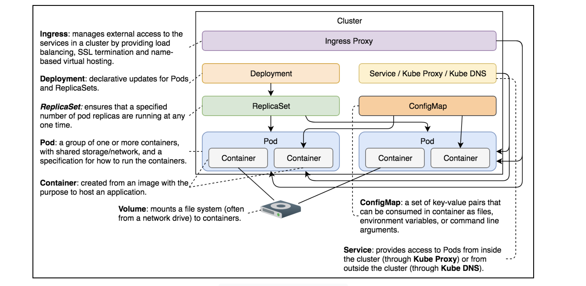

# Getting Started with ConfigMaps

Why ConfigMaps are necessary

## The Need of the Hour#

> `Note`: ConfigMaps allow us to keep configurations separate from application images. Such separation is useful when other alternatives are not a good fit.

- Almost every application can be fine-tuned through configuration. Traditional software deployment methods fostered the use of configuration files. However, we won’t discuss those methods. Instead, we’ll look at advanced, distributed, and immutable deployments through Kubernetes schedulers.

- Although newer technologies may often require new processes and fundamentally different architecture, we can’t just throw away everything we have and start completely fresh. We’ll have to try to balance new principles and legacy needs.
- If we were to start developing a new application today, it would be distributed, scalable, stateless, and fault-tolerant. Those are some of today’s needs. While we might question how many of us know how to design an application with those quality attributes in mind, hardly anyone would argue against having any of them. What is often forgotten is the configuration. Which mechanism should your new application use to configure itself? What about environment variables?

> `Note`: Environment variables fit well into distributed systems. They are portable and easy to define. They are the ideal choice for the configuration mechanism of new applications.

- However, in some cases, the configuration might be too complex for environment variables. In such situations, we might need to fall back to files (hopefully YAML). When those cases are combined with legacy applications, which are almost exclusively using file-based configuration, it is evident that we cannot rely only on environment variables.

- When a configuration is based on files, the best approach we can take is to bake the configuration into a Docker image. This means that we’re taking the fully-immutable approach. Still, that might not be possible when our application needs different configuration options for various clusters (e.g., testing and production).

- We don’t want to convert this into a discussion that ends with “you do not need a different configuration for different environments.” Just assume that you might have an excellent reason for something like that. In such a case, baking configuration files into images will not do the trick. That’s where ConfigMaps come into play.

# ConfigMaps#

- ConfigMaps allow us to “inject” configurations into containers. The source of the configurations can be files, directories, or literal values. The destination can be files or environment variables.
  > `Note`: ConfigMaps take a configuration from a source and mount it into running containers as a volume.
- That’s all the theory you’ll get up front. Instead of a lengthy explanation, we’ll run some examples and comment on the features we experience. We’ll learn by practice instead of learning by memorizing theory.
- For setting a ConfigMap, we’ll use the following command after creating the cluster:

```bash
kubectl config current-context
```

---

# Injecting a Configuration from a Single File

Learn to inject a configuration from a single file using the ConfigMap volume.

## Creating a ConfigMap#

In its purest (and probably the most common) form, a ConfigMap takes a single file. For example, we can create one from the `prometheus-conf.yml` file.

```yml
global:
  scrape_interval: 15s
# This sets the default interval at which Prometheus will scrape (collect) metrics from targets
# In this case, every 15 seconds, Prometheus will try to scrape data from all configured targets.

scrape_configs:
  # List of jobs that Prometheus should scrape.
  - job_name: prometheus # Logical name for this group of targets.
    metrics_path: /prometheus/metrics # Tells Prometheus what URL path to use when scraping.
    # Default is /metrics, but here it's set to /prometheus/metrics
    static_configs:
      # Tells Prometheus the static list of targets to scrape.
      - targets:
          - localhost:9090
# This is the address of the Prometheus server itself (i.e., it is scraping its own internal metrics).
# Port 9090 is the default Prometheus web UI and metrics port.
```

```bash
kubectl create cm my-config \
    --from-file=prometheus-conf.yml
```

`Create the first ConfigMap using prometheus-conf`

The output is as follows:

```bash
configmap/my-config created
```

We create a ConfigMap (cm) called my-config. The data of the map is the content of the prometheus-conf.yml file.

## Looking into the description#

Let’s describe it and see what we get.

```bash
kubectl describe cm my-config
```

The output is as follows:

```bash
Name:         my-config
Namespace:    default
Labels:       <none>
Annotations:  <none>

Data
====
prometheus-conf.yml:
----
global:
  scrape_interval:     15s

scrape_configs:
  - job_name: prometheus
    metrics_path: /prometheus/metrics
    static_configs:
      - targets:
        - localhost:9090


BinaryData
====

Events:  <none>
```

The important part is located below `Data`. We can see the key which, in this case, is the name of the file (`prometheus-conf.yml`). Further down, we can see the contents of the file. If we look at the definition of `prometheus-conf.yml` in the playground at the end of this lesson, we’ll see that it is the same as what we saw from the ConfigMap’s description.

## Mounting the ConfigMap#

- The ConfigMap is useless by itself. ILike all the other volumes, it also needs a mount.

## Pod with mounted ConfigMap#

Let’s look at a Pod specification defined in `alpine.yml`:

```yml
apiVersion: v1
kind: Pod
metadata:
  name: alpine
spec:
  containers:
    - name: alpine
      image: alpine
      command: ["sleep"]
      args: ["100000"]
      volumeMounts:
        - name: config-vol
          mountPath: /etc/config
  volumes:
    - name: config-vol
      configMap:
        name: my-config
```

The essential sections are `volumeMounts` and `volumes`. Since `volumeMounts` are the same no matter the type of volume, there’s nothing special about it. We defined that it should be based on the volume called `config-vol` and mount the `/etc/config path`. The volumes section uses `configMap` as the type. It has a single item name, which coincides with the `name` of the ConfigMap we created earlier.

# Creating the Pod#

Let’s create the Pod and see what happens.

```bash
kubectl create -f alpine.yml
kubectl get pods
```

- The output of the second command is as follows:

```bash
NAME     READY   STATUS    RESTARTS   AGE
alpine   1/1     Running   0          11s
```

Please confirm that the Pod is indeed running before moving on.

## Verification#

Let’s see the content of the `/etc/config` directory inside the Pod’s only container:

```bash
kubectl exec -it alpine -- \
    ls /etc/config
```

The output is as follows:

```bash
prometheus-conf.yml
```

The `/etc/config` now has a single file that coincides with the file we stored in the ConfigMap.

- Let’s add `-l` to the `ls` command that we executed a moment ago:

```bash
kubectl exec -it alpine --  \
  ls -l /etc/config
```

The output is as follows:

```bash
total 0
lrwxrwxrwx    1 root     root            26 Jul 27 21:07 prometheus-conf.yml -> ..data/prometheus-conf.yml
```

- We’ll see that `prometheus-conf.yml` is a link to `..data/prometheus-conf.yml`.

- If we dig deeper, we’ll also see that `..data` is also a link to the directory named from a timestamp and so on. For now, the exact logic behind all the links and the actual files is not very important. From the functional point of view, there is `prometheus-conf.yml`, and our application can do whatever it needs to do with it.
- Let’s confirm that the contents of the file inside the container are indeed the same as the source file that we used to create the ConfigMap.

```bash
kubectl exec -it alpine -- \
    cat /etc/config/prometheus-conf.yml
```

The output is as follows:

```yml
global:
  scrape_interval: 15s

scrape_configs:
  - job_name: prometheus
    metrics_path: /prometheus/metrics
    static_configs:
      - targets:
          - localhost:9090
```

- The output should be the same as the contents of the `prometheus-conf.yml` file.

- We can see one combination of ConfigMap. Let’s see what else we can do with it.

## Deleting the objects#

We’ll remove the objects we’ve created so far and start over.

```bash
kubectl delete -f alpine.yml
```

We are not limited to a single `--from-file` argument. We can specify as many as we need.

## Try it yourself#

For your convenience, a list of all the commands used in the lesson is given below:

```bash
kubectl create cm my-config \
    --from-file=prometheus-conf.yml

kubectl describe cm my-config

kubectl create -f alpine.yml
kubectl get pods

kubectl exec -it alpine -- \
    ls /etc/config

kubectl exec -it alpine --  \
  ls -l /etc/config

kubectl exec -it alpine -- \
    cat /etc/config/prometheus-conf.yml

kubectl delete -f alpine.yml

kubectl delete cm my-config
```

---

---

# Injecting Configurations from Multiple Files

---

Learn how to inject configurations from multiple files and directories.

## Creating a ConfigMap from multiple files#

Let's see what happens when we execute the following commands:

```bash
kubectl create cm my-config \
    --from-file=cm/prometheus-conf.yml \
    --from-file=cm/prometheus.yml
```

```bash
kubectl exec -it alpine -- ls -ltr /etc/config
```

The output is as follows:

```bash
total 0
lrwxrwxrwx    1 root     root            21 Jul 28 07:21 prometheus.yml -> ..data/prometheus.yml
lrwxrwxrwx    1 root     root            26 Jul 28 07:21 prometheus-conf.yml -> ..data/prometheus-conf.yml
```

We can see that both files are present in the container. That leads us to the conclusion that a ConfigMap can contain **multiple files**, and all will be created inside containers that mount it.

## Deleting the objects#

```bash
kubectl delete -f alpine.yml
#Run the following command separately to delete the configmap
kubectl delete cm my-config
```

# Creating a ConfigMap from a directory#

The --from-file argument might lead us to the conclusion that we can specify only a file path as its value. It works with directories as well. We can, for example, add all files from the cm directory to a ConfigMap.

```bash
kubectl create cm my-config \
    --from-file=cm
```

The output is as follows:

```bash
configmap/my-config created
```

We create `my-config` ConfigMap with the directory `cm`. Let’s describe it and see what’s inside:

```bash
kubectl describe cm/my-config
```

The output is as follows:

```bash
Name:         my-config
Namespace:    default
Labels:       <none>
Annotations:  <none>

Data
====
prometheus-conf.yml:
----
global:
  scrape_interval: 15s
# This sets the default interval at which Prometheus will scrape (collect) metrics from targets
# In this case, every 15 seconds, Prometheus will try to scrape data from all configured targets.

scrape_configs:
# List of jobs that Prometheus should scrape.
- job_name: prometheus # Logical name for this group of targets.
  metrics_path: /prometheus/metrics # Tells Prometheus what URL path to use when scraping.
  # Default is /metrics, but here it's set to /prometheus/metrics
  static_configs:
  # Tells Prometheus the static list of targets to scrape.
  - targets:
    - localhost:9090

# This is the address of the Prometheus server itself (i.e., it is scraping its own internal metrics).
# Port 9090 is the default Prometheus web UI and metrics port.


prometheus.yml:
----
apiVersion: networking.k8s.io/v1
kind: Ingress
metadata:
  name: prometheus
  annotations:
    kubernetes.io/ingress.class: "nginx"
    ingress.kubernetes.io/ssl-redirect: "false"
    nginx.ingress.kubernetes.io/ssl-redirect: "false"
spec:
  rules:
  - http:
      paths:
      - path: /prometheus
        pathType: ImplementationSpecific
        backend:
          service:
            name: prometheus
            port:
              number: 9090

---

apiVersion: apps/v1
kind: Deployment
metadata:
  name: prometheus
spec:
  selector:
    matchLabels:
      type: monitor
      service: prometheus
  strategy:
    type: Recreate
  template:
    metadata:
      labels:
        type: monitor
        service: prometheus
    spec:
      containers:
      - name: prometheus
        image: prom/prometheus:v2.0.0
        command:
        - /bin/prometheus
        args:
        - "--config.file=/etc/prometheus/prometheus.yml"
        - "--storage.tsdb.path=/prometheus"
        - "--web.console.libraries=/usr/share"
        - "--web.external-url=http://192.168.99.100/prometheus"
        volumeMounts:
        - mountPath: /etc/prometheus
          name: prom-conf
      volumes:
      - name: prom-conf
        configMap:
          name: prom-conf

---

apiVersion: v1
kind: Service
metadata:
  name: prometheus
spec:
  ports:
  - port: 9090
  selector:
    type: monitor
    service: prometheus

---

apiVersion: v1
kind: ConfigMap
metadata:
  name: prom-conf
data:
  prometheus.yml: |
    global:
      scrape_interval:     15s

    scrape_configs:
      - job_name: prometheus
        metrics_path: /prometheus/metrics
        static_configs:
          - targets:
            - localhost:9090


alpine.yml:
----
apiVersion: v1
kind: Pod
metadata:
  name: alpine
spec:
  containers:
    - name: alpine
      image: alpine
      command: ["sleep"]
      args: ["100000"]
      volumeMounts:
        - name: config-vol
          mountPath: /etc/config
  volumes:
    - name: config-vol
      configMap:
        name: my-config


BinaryData
====

Events:  <none>
```

```bash
kubectl create -f cm/alpine.yml
kubectl exec -it alpine -- ls -ltr /etc/config
```

The output is as follows:

```bash
total 0
lrwxrwxrwx    1 root     root            21 Jul 28 07:32 prometheus.yml -> ..data/prometheus.yml
lrwxrwxrwx    1 root     root            26 Jul 28 07:32 prometheus-conf.yml -> ..data/prometheus-conf.yml
lrwxrwxrwx    1 root     root            17 Jul 28 07:32 alpine.yml -> ..data/alpine.yml
```

- All the files are there, and the time has come to move away from files and directories.
- We can see that all three files from the `cm` directory are now inside the “my-config” ConfigMap.

## Deleting the objects#

Let’s remove the objects first and then discuss the other sources.

```bash
kubectl delete -f alpine.yml
#Run the following command separately to delete the configmap
kubectl delete cm my-config
```

## Try it yourself#

For your convenience, a list of all the commands used in the lesson is given below:

```bash
kubectl create cm my-config \
    --from-file=cm/prometheus-conf.yml \
    --from-file=cm/prometheus.yml

kubectl create -f cm/alpine.yml

#Run the following command separately
kubectl exec -it alpine -- \
    ls /etc/config

kubectl delete -f cm/alpine.yml
#Run the following command separately to delete the configmap
kubectl delete cm my-config

kubectl create cm my-config \
    --from-file=cm

kubectl describe cm my-config

kubectl create -f cm/alpine.yml
#Run the below command separately after the "alpine" container is created
kubectl exec -it alpine -- \
    ls /etc/config

kubectl delete -f cm/alpine.yml
#Run the following command separately to delete the configmap
kubectl delete cm my-config

```

---

---

# Injecting Configurations from Key/Value Literals

---

Learn how to inject configurations from key/value literals.

## Creating ConfigMap using literals#

Hopefully, even when our applications need different configurations to work in distinct clusters, the differences are limited. Often, they should be limited to only a few key/value entries. In such cases, it might be easier to create ConfigMaps using `--from-literal`.

- Let’s look at an example:

```bash
kubectl create cm my-config \
    --from-literal=something=else \
    --from-literal=weather=sunny

kubectl get cm my-config -o yaml > config_map_literal.yml
cat config_map_literal.yml
```

The output is as follows:

```bash
apiVersion: v1
data:
  something: else
  weather: rainy
kind: ConfigMap
metadata:
  creationTimestamp: "2025-07-28T08:18:34Z"
  name: my-config
  namespace: default
  resourceVersion: "89815"
  uid: 2654c4d9-9806-4f8f-9842-b0cd89a7147a
```

We can see that two entries were added, one for each literal.

## Creating a Pod#

Let’s create a Pod with the mounted ConfigMap:

```bash
kubectl create -f alpine.yml
#Wait a few seconds before executing the following command
kubectl exec -it alpine -- \
    ls -ltr /etc/config
```

The output is as follows:

```bash
total 0
lrwxrwxrwx    1 root     root            14 Jul 28 08:38 weather -> ..data/weather
lrwxrwxrwx    1 root     root            16 Jul 28 08:38 something -> ..data/something
```

Both files are there.

## Verification

Finally, let’s confirm that the content of one of the files is correct.

```bash
kubectl exec -it alpine -- \
    cat /etc/config/something
```

The output is as follows:

```bash
else%
```

```bash
kubectl exec -it alpine -- cat /etc/config/weather
```

The output is as follows:

```bash
rainy%
```

> Note: The `--from-literal` argument is useful when we need to set a relatively small set of configuration entries in different clusters. It makes more sense to specify only the things that change than all the configuration options.

- The problem is that most of the existing applications are not designed to read separate configuration entries from different files. On the other hand, if you’re sketching a new application, you might not choose this option either since you’d be able to develop it in a way that reads environment variables. When faced with a choice between ConfigMaps and environment variables, the latter is preferred most of the time. We’re not sure how often you’ll be using the --from-literal argument. Maybe a lot, more likely not at all.

## Deleting the objects#

There’s one more configuration source left to explore, so let’s delete the objects we’re currently running:

```bash
kubectl delete -f alpine.yml
#Run the below command separately to the configMap
kubectl delete cm my-config
```

That is it for injecting configuration from literals.

## Try it yourself#

For your convenience, a list of all the commands used in the lesson is given below:

```bash
kubectl create cm my-config \
    --from-literal=something=else \
    --from-literal=weather=sunny

kubectl get cm my-config -o yaml

kubectl create -f alpine.yml
#Wait a few seconds before executing the following command
kubectl exec -it alpine -- \
    ls /etc/config

kubectl exec -it alpine -- \
    cat /etc/config/something

kubectl delete -f alpine.yml
#Run the below command separately to the configMap
kubectl delete cm my-config
```

---

---

# Injecting Configurations from Environment Files

---

Let’s look at the my-env-file.yml file:

## Looking into the definition

Let’s take a look at the `my-env-file.yml` file.

```bash
something=else
weather=sunny
```

The file has the same key/value pairs as the ones we used in the example with `--from-literal`.

## Creating the ConfigMap#

Let’s see what happens if we create a ConfigMap using that file as the source.

```bash
kubectl create cm my-config \
    --from-env-file=cm/my-env-file.yml

kubectl get cm my-config -o yaml >configmap-from-env-file.yml
cat configmap-from-env-file.yml
```

The output of the latter command is as follows:

```yml
apiVersion: v1
data:
  something: else
  weather: sunny
kind: ConfigMap
metadata:
  creationTimestamp: "2025-07-28T09:59:26Z"
  name: my-config
  namespace: default
  resourceVersion: "100400"
  uid: 2c403c0b-d8b2-407e-816f-e0c548916392
```

- We can see two entries, each corresponding to key/value pairs from the file. The result is the same as when we created a ConfigMap using `--from-literal` arguments. Two different sources produced the same outcome.
- If we’d used the `--from-file argument`, the result would be as follows:

```yml
apiVersion: v1
data:
  my-env-file.yml: |
    something=else
    weather=sunny
kind: ConfigMap
```

> For --from-file, first delete the previous configuration using kubectl delete cm my-config.

- All in all, `--from-file` reads the content of one or more files and stores it using file names as keys. `--from-env-file` assumes that the content of a file is in key/value format and stores each as a separate entry.

## Try it yourself#

For your convenience, a list of all the commands used in the lesson is given below:

```bash
kubectl create cm my-config \
    --from-env-file=my-env-file.yml

kubectl get cm my-config -o yaml
```

---

---

# Converting ConfigMap Output to Environment Variables

Explore the conversion of ConfigMaps to environment variables.

---

## Altering the perpetual process#

- All the examples we’ve seen so far differ only in the source. The destination is always the same. Whether ConfigMap is created from a file, a directory, literal values, or an environment file, it perpetually results in one or more files being injected into a container.
- This time we’ll try something different. We’ll see how we can convert a ConfigMap to environment variables.

## Looking into the first definition#

Let’s look at a sample definition of alpine-env.yml file:

```yml
apiVersion: v1
kind: Pod
metadata:
  name: alpine-env
spec:
  containers:
    - name: alpine
      image: alpine
      command: ["sleep"]
      args: ["100000"]
      env:
        - name: something
          valueFrom:
            configMapKeyRef:
              name: my-config
              key: something
        - name: weather
          valueFrom:
            configMapKeyRef:
              name: my-config
              key: weather
```

> : The major difference when compared with `alpine.yml` is that `volumeMounts` and `volumes` sections are gone. This time we have an `env` section.

- Instead of a `value` field, we have `valueFrom`. Further, we declare that it should get values from a `ConfigMap` (`configMapKeyRef`) named `my-config`. Because that ConfigMap has multiple values, we specify the key as well.

## Creating the Pod#

Let’s create the Pod:

```bash
kubectl create \
    -f alpine-env.yml
#Wait for a few seconds before executing the below command
kubectl exec -it alpine-env -- env
```

We create the Pod and execute the `env` command inside its only container. The output of the latter command(limited to the relevant parts) is as follows:

```bash
kubectl exec -it alpine-env -- env
```

The output is as follows:

```bash
PATH=/usr/local/sbin:/usr/local/bin:/usr/sbin:/usr/bin:/sbin:/bin
HOSTNAME=alpine-env
something=else
weather=sunny
KUBERNETES_PORT_443_TCP_PROTO=tcp
KUBERNETES_PORT_443_TCP_PORT=443
KUBERNETES_PORT_443_TCP_ADDR=10.96.0.1
KUBERNETES_SERVICE_HOST=10.96.0.1
KUBERNETES_SERVICE_PORT=443
KUBERNETES_SERVICE_PORT_HTTPS=443
KUBERNETES_PORT=tcp://10.96.0.1:443
KUBERNETES_PORT_443_TCP=tcp://10.96.0.1:443
TERM=xterm
HOME=/root
```

```bash
kubectl exec -it alpine-env -- env | grep something
```

The output is as follows:

```bash
something=else
```

```bash
kubectl exec -it alpine-env -- env | grep weather
```

The output is as follows:

```bash
weather=sunny
```

```bash
...
weather=sunny
something=else
...
```

There’s another, often more useful way to specify environment variables from a ConfigMap. Before we try it, we’ll remove the currently running Pod.

```bash
kubectl delete \
    -f alpine-env.yml
```

## Looking into the second Definition#

Let’s take a look at yet another definition `alpine-env-all.yml`.

```yml
apiVersion: v1
kind: Pod
metadata:
  name: alpine-env
spec:
  containers:
    - name: alpine
      image: alpine
      command: ["sleep"]
      args: ["100000"]
      envFrom:
        - configMapRef:
            name: my-config
```

> `Note`: The difference is only in the way environment variables are defined.

- This time the syntax is much shorter. We have `envFrom` instead of the `env` section. It can be either `configMapRef` or `secretRef`. Since we did not yet explore Secrets, we’ll stick with the former. Inside `configMapRef`, there is a `name` reference to the `my-config` ConfigMap.

## Creating the Pod#

Let’s see it in action:

```bash
kubectl create \
    -f alpine-env-all.yml
#Wait for a few seconds before executing the below command
kubectl exec -it alpine-env -- env
```

We create the Pod and retrieve all the environment variables from its only container. The output of the latter command (limited to the relevant parts) is as follows:

```bash
PATH=/usr/local/sbin:/usr/local/bin:/usr/sbin:/usr/bin:/sbin:/bin
HOSTNAME=alpine-env
something=else
weather=sunny
KUBERNETES_PORT=tcp://10.96.0.1:443
KUBERNETES_PORT_443_TCP=tcp://10.96.0.1:443
KUBERNETES_PORT_443_TCP_PROTO=tcp
KUBERNETES_PORT_443_TCP_PORT=443
KUBERNETES_PORT_443_TCP_ADDR=10.96.0.1
KUBERNETES_SERVICE_HOST=10.96.0.1
KUBERNETES_SERVICE_PORT=443
KUBERNETES_SERVICE_PORT_HTTPS=443
TERM=xterm
HOME=/root
```

> `Note`: The result is the same as before. The difference is only in the way we define environment variables.

- With `env.valueFrom.configMapKeyRef` syntax, we need to specify each ConfigMap `key` separately. That gives us control over the scope and the relation with the names of container variables.
- The `envFrom.configMapRef` converts all ConfigMap’s data into environment variables. That is often a better and simpler option if we don’t need to use different names between ConfigMap and environment variable keys. The syntax is short, and we don’t need to worry whether we forgot to include one of the ConfigMap’s keys.

## Try it yourself#

For your convenience, a list of all the commands used in the lesson is given below:

```bash
kubectl create -f alpine-env.yml
#Wait for a few seconds before executing the below command
kubectl exec -it alpine-env -- env

kubectl delete \
    -f alpine-env.yml

kubectl create \
    -f alpine-env-all.yml
#Wait for a few seconds before executing the below command
kubectl exec -it alpine-env -- env
```

---

---

# Defining ConfigMaps as YAML

Explore defining ConfigMaps as YAML files.

---

- All ConfigMaps we created so far were done through `kubectl create cm` commands. Everything in Kubernetes can be defined as YAML, and that includes ConfigMaps as well.

## Looking into the YAML#

Even though we have not yet specified ConfigMaps as YAML, we have seen the format quite a few times throughout this chapter. Since we cannot be sure whether we can create a ConfigMap YAML file from memory, let’s make things easy for ourselves and use `kubectl` to output our existing `my-config` ConfigMap in YAML format.

```bash
kubectl get cm my-config -o yaml
```

The output is as follows:

```yml
apiVersion: v1
data:
  something: else
  weather: sunny
kind: ConfigMap
metadata:
  creationTimestamp: "2025-07-28T09:59:26Z"
  name: my-config
  namespace: default
  resourceVersion: "100400"
  uid: 2c403c0b-d8b2-407e-816f-e0c548916392
```

- Just as with any other Kubernetes object, ConfigMap has `apiVersion`, `kind`, and `metadata`. The `data` is where the maps are defined. Each must have a `key` and a `value`. In this example, there’s the `weather` key with the `sunny` value.

## Deploying Prometheus#

Let’s try to translate that knowledge into the objects we’ll need to deploy Prometheus.

## Looking into the definition#

The definition of prometheus.yml limited to the relevant parts is as follows:

```yml
apiVersion: apps/v1
kind: Deployment
metadata:
  name: prometheus
spec:
  ...
  template:
    ...
    spec:
      containers:
        ...
        volumeMounts:
        - mountPath: /etc/prometheus
          name: prom-conf
      volumes:
      - name: prom-conf
        configMap:
          name: prom-conf
...
apiVersion: v1
kind: ConfigMap
metadata:
  name: prom-conf
data:
  prometheus.yml: |
    global:
      scrape_interval:     15s

    scrape_configs:
      - job_name: prometheus
        metrics_path: /prometheus/metrics
        static_configs:
          - targets:
            - localhost:9090
```

- **Line 12–14**: The Deployment object defines the `volumeMounts` that references the `prom-conf` volume, which is a `configMap`. We’ve seen similar examples before, so we won’t go into much detail here.
- **Line 25**: The `ConfigMap` object’s `data` section has only one key (`prometheus.yml`). Once this `ConfigMap` is mounted as a volume, the name of the file will be the same as the key (`prometheus.yml`).
- The value has a bit of “special” syntax. Unlike the previous example, where the value was a single word written directly after the colon, the structure of the value is now a bit more complex. To be more precise, it contains multiple lines.
- When working with a large value, we can start with the pipe sign (|). Kubernetes will interpret the value as “everything that follows, as long as it is indented.” Also notice that all the lines of the value are at least two spaces to the right of the beginning of the key (`prometheus.yml`). If we’d like to insert an additional key, all we need to do is to add it on the same level (indentation) as the other `prometheus.yml`.

## Creating the application#

Let’s create the application and confirm that everything works as expected:

```bash
kubectl get cm my-config -o yaml

kubectl create -f prometheus.yml

kubectl rollout status deploy prometheus

# please wait for deployments to successfully roll out before running the
# following command:
kubectl port-forward service/prometheus 3000:9090 --address 0.0.0.0
#click the link beside run button
```

## Destroying everything#

For now, we’ll destroy the cluster we used in this chapter:

```bash
k3d cluster delete mycluster --all
#Or
kind delete cluster --name mycluster
```

## Try it yourself#

For your convenience, a list of all the commands used in the lesson is given below:

```bash
kubectl get cm my-config -o yaml

kubectl create -f prometheus.yml

kubectl rollout status deploy prometheus

# please wait for deployments to successfully roll out before running the
# following command:
kubectl port-forward service/prometheus 3000:9090 --address 0.0.0.0
#click the link beside run button

k3d cluster delete mycluster --all
```

---

---

# The Best Way to Configure an Application

In our experience, ConfigMaps are overused.

---

- If we have a configuration that is the same across multiple clusters, or if we have only one cluster, all we need to do is include it in our Dockerfile and forget it ever existed. When there are no variations of a configuration, there’s no need to have a configuration file, at least not outside an immutable image.
- Unfortunately, that is not always the case. To be more precise, it’s almost never the case. We tend to make things more complicated than they should be. This, among other things, often means an endless list of configuration options hardly anyone ever uses. Still, some things usually do change from one cluster to another, and we might need to look into alternatives to configurations baked into images.

## Finding out the best way#

- The best way to design new applications is to use a combination of configuration files and environment variables. Make sure that the default values in a configuration file are sensible and applicable in most use-cases. Bake it into the image. When running a container, declare only the environment variables that represent the differences of a specific cluster. This way, our configuration will be portable and simple at the same time.
- What if our application is not new and does not support configuration through environment variables? We should refactor it so that it does. It shouldn’t be hard to add the ability to read a few environment variables. Keep in mind that we don’t need all the settings, but only those that differ from one cluster to another. It would be hard to imagine that such a trivial request would be complex or time-consuming. If it is, we might have more significant issues to fix before even thinking about putting our application into a container.

## When to use ConfigMaps#

- Still, configuration files will not disappear. No matter which strategy we choose, each image should have a copy of them with sensible default values. Maybe we can put in extra effort and change the application so that configuration entries are loaded from two locations. This way, we can load the default values from one file and the differences from the other file. That would, at least, reduce the need to have to specify more than the minimum required for each cluster. In such a case, ConfigMap’s `--from-literal` and `--from-env-file` sources are an excellent choice.
- When everything else fails, the --from-file source can be useful. Just make sure that ConfigMap is not defined in the same file as the objects that mount it. If it is, it would mean that they could be used only inside one cluster. Otherwise, we’d be deploying the same configuration, and we should go back to the initial idea of having it baked into the image together with the application.
- Do not let this pessimism discourage you from using ConfigMaps. They are very useful, and you should adopt them. Our intention was to make you think of alternatives, not to tell you never to use ConfigMaps.

---

---

# Comparison with Docker Swarm

Compare Kubernetes ConfigMaps with Docker Swarm Configs.

---

## Similarities#

- The mechanisms behind Kubernetes ConfigMaps and Docker Swarm Configs are almost the same, at least from a functional perspective.
  - Both allow us to store some literal texts in the scheduler’s internal data store and enable us to add them to containers.
  - The syntax is equally simple and straightforward in both cases. Still, there are a few differences.
    

## Differences#

### Docker#

Docker is good at preventing people from performing silly operations, such as attempting to delete a configuration. It cannot be deleted if there are Docker services that reference the configuration. We are allowed to remove the configuration source only after all the services that reference it are removed. Kubernetes, on the other hand, will let us delete a ConfigMap object without even a hint about the consequences.

### Kubernetes#

Kubernetes ConfigMaps, on the other hand, provide a wider variety of options. While a Docker Swarm configuration can be created only from a file or `stdin`, the Kubernetes equivalent can be generated from files, directories, literal values, and files with environment variables. Each of those sources can be used multiple times. We can even combine them. Further on, Kubernetes ConfigMaps can be converted not only to files, but also to environment variables. Flexibility and extra functionalities are available both at the source and the destination end points.

### Conclusion#

> `Note`: Docker Swarm has a better user experience than Kubernetes. Kubernetes provides more choices. Neither has a significant difference that would warrant a win, so we’re proclaiming it a tie.

---

---

# Quiz Yourself on ConfigMaps

Test your understanding of ConfigMaps with the help of this quiz.

---

## 1. What is the main purpose of using ConfigMaps?

> Ans: To keep configurations separate from application images

## 2. (True or False) Environment variables are easy to define, but they are not portable.

> Ans: False

## 3. (Fill in the blank.) A ConfigMap takes a configuration from a source and mounts it into running containers as a **\_\_\_\_**.

> Ans: volume

## 4. While sketching new applications, what should be preferred for configuration purposes?

> Ans: Environment variables

## 5. ConfigMaps can be created from which of the following sources?

> Ans: Files or directories, Literal values, Environment files

## 6. Which command is used to create ConfigMaps?

> Ans: `kubectl create cm`

## 7. (True or False) We should make sure that ConfigMap is not defined in the same file as the objects that mount it.

> Ans: True

---

---

# What's Next?

Review what we’ve learned so far and what we’ll learn next.

---

## Summary#

In this chapter, we explored ConfigMaps and learned to inject configurations from various sort of sources including single files, multiple files, literals, and environment files. We also discussed the ways of configuring your applications.


> Note: If you’d like to know more about ConfigMaps, please explore the [`ConfigMap v1 core API documentation`](https://kubernetes.io/docs/reference/generated/kubernetes-api/v1.24/#configmap-v1-core).
