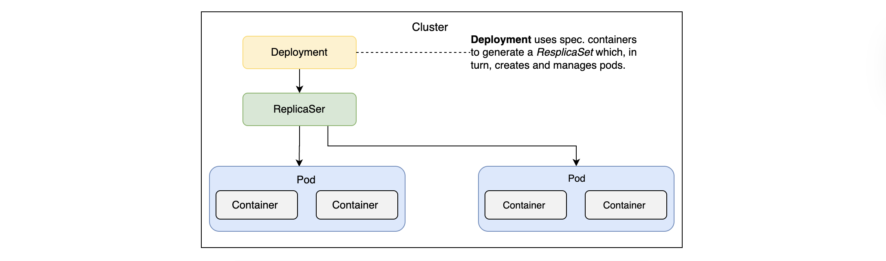
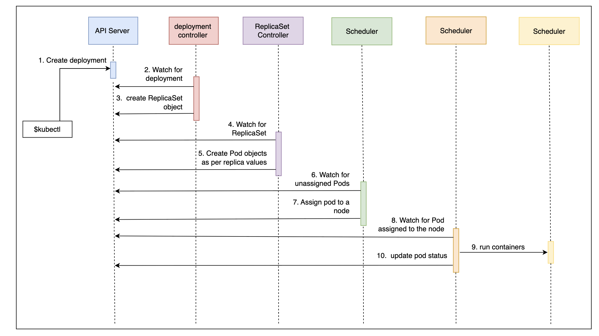
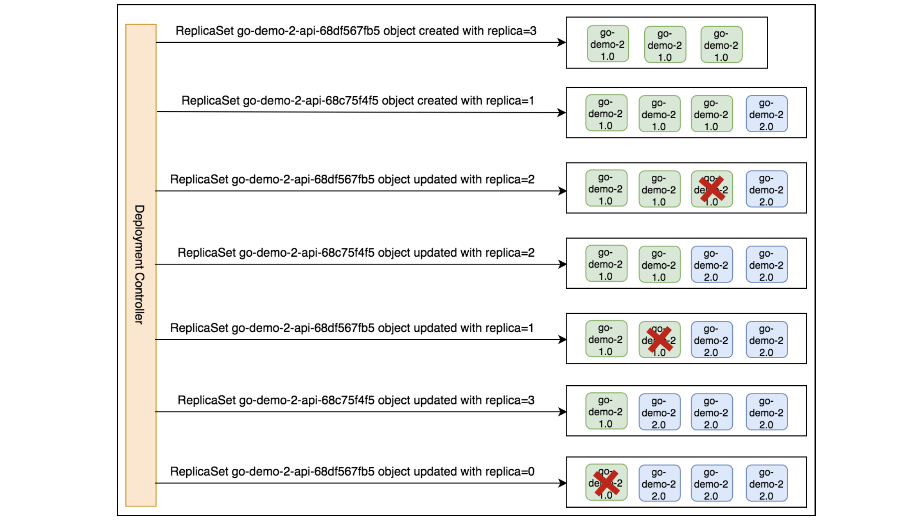
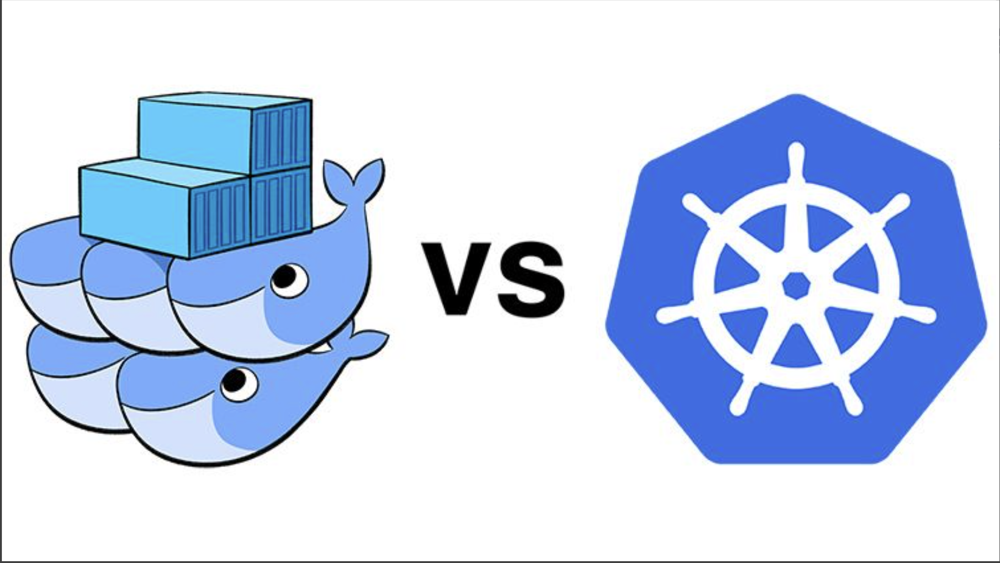
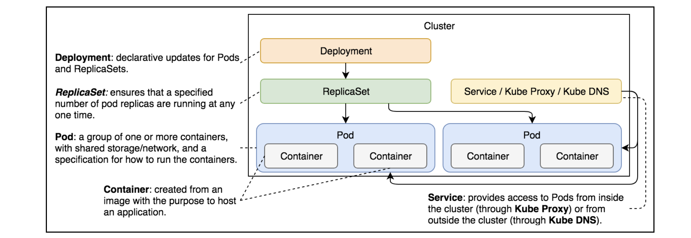

# Getting Started with Deploying Releases

# Deploying releases#

- In today’s competitive environment, we have to release features to production as soon as they are developed and tested. The need for frequent releases fortifies the need for zero-downtime Deployments.
- We learned how to deploy our applications packaged as Pods, scale them through ReplicaSets, and enable communication through Services. However, all that is useless if we cannot update those applications with new releases. That is where Kubernetes Deployments are useful.
- The desired state of our applications is changing all the time. The most common reasons for new states are new releases. The process is relatively simple. We make a change and commit it to a code repository. We build and test it. Once we’re confident that it works as expected, we deploy it to a cluster.
- It does not matter whether the Deployment is to a development, test, staging, or production environment. We need to deploy a new release to a cluster, even when it is a single-node Kubernetes running on a laptop. No matter how many environments we have, the process should always be the same or, at least, as similar as possible.

## Why zero downtime?#

- The Deployment must produce no downtime. It does not matter whether it is performed on a testing or a production cluster. Interrupting consumers is disruptive and leads to a loss of money and confidence in a product.
- Gone are the days when users did not care if an application sometimes did not work. There are so many competitors out there that a single bad experience might lead users to another solution. With today’s scale, a 0.1% rate of failed requests is considered disastrous.
- While we might never be able to reach 100% availability, we should certainly not cause downtime ourselves and must minimize other factors that could cause downtime.

# Kubernetes Deployments#

- Kubernetes Deployments provide us with the tools that can help us avoid such failures by allowing us to update our applications without downtime.

## Deploying New Releases

Learn about Kubernetes Deployment, and create a Deployment.

- Just as we are not supposed to create Pods directly but use other controllers like ReplicaSet, we are not supposed to create ReplicaSets either. Kubernetes Deployments will create them for us. If you’re wondering why that is,you’ll have to wait a little while longer to find out.
- First, we’ll create a few Deployments. Once we’re familiar with the process and the outcomes, it’ll become obvious why they are better at managing ReplicaSets than we are.

## Looking into the definition#

Let’s look at a Deployment specification for the database ReplicaSet we’ve been using so far:

```yaml
apiVersion: apps/v1
kind: Deployment
metadata:
  namespace: deployment-lab
  name: go-demo-2-db
spec:
  selector:
    matchLabels:
      type: db
      service: go-demo-2
  template:
    metadata:
      labels:
        type: db
        service: go-demo-2
        vendor: MongoLabs
    spec:
      containers:
        - name: db
          image: mongo:3.3
          ports:
            - containerPort: 27017
```

Deployment specification of go-demo-2-db

- If you compare this Deployment with the ReplicaSet we created in the previous chapter, you’ll probably have a hard time finding a difference. Apart from the `kind` field, they are the same.
- Since, in this case, both the Deployment and the ReplicaSet are the same, you might be wondering what the advantage of using one over the other is.
  > Note: We will regularly add `--record` to the `kubectl create` commands. This allows us to track each change to our resources such as Deployments.

## Creating the Deployment#

Let’s create the Deployment and explore what it offers:

```bash
kubectl create \
    -f go-demo-2-db.yml \

kubectl get -f go-demo-2-db.yml
```

The output of the latter command is as follows:

```bash
NAME           READY   UP-TO-DATE   AVAILABLE   AGE
go-demo-2-db   1/1     1            1           20s
```

The output of the second command

### Describing the Deployment#

```bash
kubectl -n deployment-lab describe deploy/go-demo-2-db
```

The output (limited to the last few lines) is as follows:

```bash
...
Events:
  Type    Reason             Age   From                   Message
  ----    ------             ----  ----                   -------
  Normal  ScalingReplicaSet  76s   deployment-controller  Scaled up replica set go-demo-2-db-5f8c77fb6b from 0 to 1
...
```

- From the “Events” section, we can observe that the Deployment creates a ReplicaSet. Or, to be more precise, we can say that it scales it. That is interesting.
- It shows that Deployments control ReplicaSets. The Deployment creates the ReplicaSet which, in turn, creates Pods.
- Let’s confirm that by retrieving the list of all the objects:

```bash
kubectl -n deployment-lab get all
```

The output is as follows:

```bash
...
NAME                                READY   STATUS    RESTARTS   AGE
pod/go-demo-2-db-5f8c77fb6b-2zg2c   1/1     Running   0          10m

NAME                           READY   UP-TO-DATE   AVAILABLE   AGE
deployment.apps/go-demo-2-db   1/1     1            1           10m

NAME                                      DESIRED   CURRENT   READY   AGE
replicaset.apps/go-demo-2-db-5f8c77fb6b   1         1         1       10m
...
# The output of the above Command
```

- All three objects were created. You might be wondering why we created the Deployment at all. You might think that we’d have the same result if we created a ReplicaSet directly. You’d be right.
- So far, from the functional point of view, there is no difference between a ReplicaSet created directly or using a Deployment.

  > `Note`: The real advantage of Deployments becomes evident if we try to change some of their aspects. For example, we might choose to upgrade MongoDB to version 3.4.

- The following figure summarizes the cascading effect of Deployments, resulting in the creation of Pods, Containers, and ReplicaSets.
  
  Deployments and their cascading effect that creates a ReplicaSet and Pods

---

# Try it yourself#

```bash
kubectl create -f go-demo-2-db.yml

kubectl get -f go-demo-2-db.yml

kubectl describe -f go-demo-2-db.yml

kubectl get all
```

---

# Sequential Breakdown of the Process

Understand the sequential breakdown of the Kubernetes Deployment process.

## The sequence#

Before we move onto Deployment updates, we’ll go through our usual step of seeing the process through a sequence diagram. We won’t repeat the explanation of the events that happened after the ReplicaSet object was created because those steps have already been explained in the previous chapters.

- 1. The Kubernetes client (`kubectl`) sends a request to the API server requesting the creation of a Deployment defined in the `go-demo-2-db.yml` file.
- 2. The Deployment controller is watching the API server for new events, and it detects that there is a new Deployment object.
- 3. The Deployment controller creates a new ReplicaSet object.
     
     The sequence of events followed by the request to create a Deployment

The above illustration is self-explanatory with the sequence of the processes linked to the Deployment process.

---

# Updating Deployments

Learn to update the Kubernetes Deployments.

## Updating the `db` image#

Let’s see what happens when we `set` a new image to the `db` Pod.

```bash
kubectl -n deployment-lab set image -f go-demo-2-db.yaml db=mongo:3.4 --record
```

It’ll take a while until the new image is pulled.

## Describing the deployment#

```bash
kubectl -n deployment-lab describe deploy/go-demo-2-db

#or
kubectl describe -f go-demo-2-db.yml
```

The last few lines of the output are as follows:

```bash
...
Events:
  Type    Reason             Age   From                   Message
  ----    ------             ----  ----                   -------
  Normal  ScalingReplicaSet  31m   deployment-controller  Scaled up replica set go-demo-2-db-5f8c77fb6b from 0 to 1
  Normal  ScalingReplicaSet  28s   deployment-controller  Scaled up replica set go-demo-2-db-77f7694fff from 0 to 1
  Normal  ScalingReplicaSet  8s    deployment-controller  Scaled down replica set go-demo-2-db-5f8c77fb6b from 1 to 0
...
# Output of above command
```

- We can see that it creates a new ReplicaSet and scales the old ReplicaSet to 0. If, in your case, the last line did not appear, you’ll need to wait until the new version of the `mongo` image is pulled.
- Instead of operating directly on the level of Pods, the Deployment creates a new ReplicaSet which subsequently produces Pods based on the new image. Once they become fully operational, the Deployment scales the old ReplicaSet to `0`.
- Since we’re running a ReplicaSet with only one replica, it might not be clear why it used that strategy. When we create a Deployment for the API, things will become more evident.

## Looking into the cluster#

To be on the safe side, we might want to retrieve all the objects from the cluster.

```bash
kubectl -n deployment-lab get all
```

Retrieve all the objects from cluster

The output is as follows:

```bash
...
NAME                                READY   STATUS    RESTARTS   AGE
pod/go-demo-2-db-77f7694fff-fbqrl   1/1     Running   0          7m1s

NAME                           READY   UP-TO-DATE   AVAILABLE   AGE
deployment.apps/go-demo-2-db   1/1     1            1           37m

NAME                                      DESIRED   CURRENT   READY   AGE
replicaset.apps/go-demo-2-db-5f8c77fb6b   0         0         0       37m
replicaset.apps/go-demo-2-db-77f7694fff   1         1         1       7m1s
...
# Output of above command
```

- As you can see, both ReplicaSets are there. However, one is inactive (scaled to `0`).
- If we destroy the Deployment and create it again, we’ll notice that the hash in the Pod name and ReplicaSet name remain consistent. This value is generated by hashing the `PodTemplate` of the ReplicaSet. As long as the `PodTemplate` is the same, the hash value will be the same as well. That way, a Deployment can know whether anything related to the Pods has changed and, if it does, will create a new ReplicaSet.

---

# Exploring ways to update Deployments#

## Updating Deployments using the `kubectl edit` command#

- The `kubectl set image` command is not the only way to update a Deployment. We could also have used `kubectl edit` as well.
- The command would be as follows:

```bash
kubectl edit -f go-demo-2-db.yml
```

> `Note`: Please do not execute it. If you do, you’ll need to type `:q` followed by the ”Enter” key to exit.

- The above `edit` command is not a good way to update the definition. It is impractical and undocumented. The `kubectl set image` command is more useful if we want to integrate Deployment updates with one of the CI/CD tools.

## Updating the YAML file#

- Another alternative would be to update the YAML file and execute the kubectl apply command. While that is a good idea for applications that do not update frequently, it does not fit well with those that change weekly, daily, or even hourly.
- MongoDB is one of those databases that might get updated with a new release only a couple of times a year so having an always up-to-date YAML file in your source code repository is an excellent practice.

# Finishing off by adding a Service#

- We’ve used `kubectl set image` just as a way to introduce you to what’s coming next when we explore frequent Deployments without downtime.
- A simple update of Pod images is far from what Deployments offer. To see its real power, we should deploy the API. Since it can be scaled to multiple Pods, it’ll provide us with a much better playground.
- Before we move on, let’s finish with the database by adding a Service and, therefore, enabling internal cluster communication to it.

```bash
vim go-demo-db-svc.yaml
```

```yaml
apiVersion: v1
kind: Service
metadata:
  namespace: deployment-lab
  name: go-demo-2-db
spec:
  ports:
    - port: 27017
  selector:
    type: db
    service: go-demo-2
```

```bash
kubectl create -f go-demo-2-db.yaml
# Deployment of go-demo-2-svc
# service/go-demo-2-db created
```

```bash
kubectl -n deployment-lab get all
```

The output is a follow:

```bash
...
NAME                                READY   STATUS    RESTARTS   AGE
pod/go-demo-2-db-77f7694fff-rglq4   1/1     Running   0          8m13s

NAME                   TYPE        CLUSTER-IP      EXTERNAL-IP   PORT(S)     AGE
service/go-demo-2-db   ClusterIP   10.96.146.142   <none>        27017/TCP   8s

NAME                           READY   UP-TO-DATE   AVAILABLE   AGE
deployment.apps/go-demo-2-db   1/1     1            1           55m

NAME                                      DESIRED   CURRENT   READY   AGE
replicaset.apps/go-demo-2-db-5f8c77fb6b   0         0         0       55m
replicaset.apps/go-demo-2-db-77f7694fff   1         1         1       24m
replicaset.apps/go-demo-2-db-7f6c955959   0         0         0       10m
...
```

---

# Try it yourself#

For your convenience, a list of all the commands used in this lesson is as follows:

```bash
kubectl set image -f go-demo-2-db.yml db=mongo:3.4

kubectl describe -f go-demo-2-db.yml

kubectl get all

kubectl create -f go-demo-2-db-svc.yml
```

---

# Defining a Zero-Downtime Deployment

Learn the definition of a zero-downtime Deployment.

- Updating a single-replica MongoDB cannot demonstrate true power behind Deployments. We need a scalable Service. It’s not that MongoDB cannot be scaled (it can), but it’s not as straightforward as an application that was designed to be scalable. We’ll jump to the second application in the stack and create a Deployment of the ReplicaSet that will create Pods based on the `go-demo-2` image.
  > `Note`: Zero-downtime Deployment is a prerequisite for higher frequency releases.

## Looking into the definition#

Let’s take a look at the Deployment definition of the API go-demo-api.

```bash
vim go-demo-2-api.yaml
```

```yaml
apiVersion: apps/v1
kind: Deployment
metadata:
  namespace: deployment-lab
  name: go-demo-2-api
spec:
  replicas: 3
  selector:
    matchLabels:
      type: api
      service: go-demo-2
  minReadySeconds: 1
  progressDeadlineSeconds: 60
  revisionHistoryLimit: 5
  strategy:
    type: RollingUpdate
    rollingUpdate:
      maxSurge: 1
      maxUnavailable: 1
  template:
    metadata:
      labels:
        type: api
        service: go-demo-2
        language: go
    spec:
      containers:
        - name: api
          image: vfarcic/go-demo-2
          env:
            - name: DB
              value: go-demo-2-db
          readinessProbe:
            httpGet:
              path: /demo/hello
              port: 8080
            periodSeconds: 1
          livenessProbe:
            httpGet:
              path: /demo/hello
              port: 8080
```

Definition of go-demo-api

We’ll skip explaining apiVersion, kind, and metadata, since they always follow the same pattern.

- `Lines 5–7`: The `spec` section has a few fields we haven’t seen before and some we are familiar with. The `replicas` and the `selector` are the same as the ones we used in the ReplicaSet from the previous chapter.
- `Line 11`: The `minReadySeconds` defines the minimum number of seconds before Kubernetes starts considering the Pods healthy. We set the value of this field to `1` second. The default value is `0`, meaning that the Pods will be considered available as soon as they are ready and, when specified, `livenessProbe` returns `OK`. If in doubt, omit this field and let its value stay `0`… We have defined it mostly for demonstration purposes.
- `Line 13`: The next field is `revisionHistoryLimit`. It defines the number of old ReplicaSets we can roll back. Like most fields, it is set to the default value `10`. We change it to `5` and, as a result, we’ll be able to roll back to any of the previous five ReplicaSets.
- `Line 14`: The `strategy` can be either the `RollingUpdate` or the `Recreate` type. The latter will terminate all the existing Pods before an update. `Recreate` resembles the processes we used in the past when the typical strategy for deploying a new release was first to stop the existing one and then put a new one in its place. This approach inevitably leads to downtime. The only case when this strategy is useful is when applications are not designed for two releases to coexist. Unfortunately, that’s still more common than it should be. If you’re in doubt about whether your application is like that, ask yourself the following question. Would there be an adverse effect if two different versions of an application are running in parallel? If that’s the case, a `Recreate` strategy might be a good choice. Reminder: We cannot accomplish zero-downtime Deployments.

---

# Deployment strategies#

Let’s look into the details of the `Recreate` and `RollingUpdate` strategies.

## The `Recreate` strategy#

- The `Recreate` strategy is much better suited to our single-replica database. We should have set up the native database replication (not the same as the Kubernetes ReplicaSet object), but that is out of the scope of this chapter.
- If we’re running the database as a single replica, we must have mounted a network drive volume. That allows us to avoid data loss when updating it or in case of a failure. Since most databases (MongoDB included) cannot have multiple instances writing to the same data files, terminating the old release before creating a new one is a good strategy when replication is absent. We’ll apply it later on in the course.

## The `RollingUpdate` strategy#

- The `RollingUpdate` strategy is the default type for a good reason. It allows us to deploy new releases without downtime. It creates a new ReplicaSet with zero replicas and, depending on other parameters, increases the replicas of the new one and decreases those from the old one. The process is finished when the replicas of the new ReplicaSet entirely replace those from the old one.
- When `RollingUpdate` is the strategy of choice, it can be fine-tuned with the `maxSurge` and `maxUnavailable` fields. The former defines the maximum number of Pods that can exceed the desired number (set using `replicas`). It can be set to an absolute number (e.g., `2`) or a percentage (e.g., `35%`). The total number of Pods will never exceed the desired number (set using `replicas`) and the `maxSurge` combined. The default value is `25%`.
- The `maxUnavailable` field defines the maximum number of Pods that are not operational. If, for example, the number of replicas is set to `15` and this field is set to `4`, the minimum number of Pods that would run at any given moment would be `11`. Just as the `maxSurge` field, this one also defaults to `25%`. If this field is not specified, there will always be at least `75%` of the desired Pods.
- In most cases, the default values of the Deployment specific fields are a good option. We changed the default settings only as a way to demonstrate better all the options we can use. We’ll remove them from most of the Deployment definitions that follow.

## The template#

- The `template` is the same `PodTemplate` we used before. A best practice is to be explicit with image tags like we did when we set `mongo:3.3`. However, that might not always be the best strategy with the images we’re building. Given we use the right practices, we can rely on `latest` tags being stable. Even if we discover they’re not, we can remedy that quickly by creating a new `latest` tag. However, we cannot expect the same from third-party images. They must always be tagged to a specific version.
- Note: Never deploy third-party images based on `latest` tags. By being explicit with the release, we have more control on what’s running in production, as well as the next upgrade should be.
- We won’t always use `latest` for our Services, only for the initial Deployments. Assuming that we are doing our best to maintain the `latest` tag stable and production-ready, it is useful when setting up the cluster for the first time. After that, each new release will be with a specific tag. Our automated continuous Deployment pipeline will do that for us in one of the next chapters.

---

# Creating a Zero-Downtime Deployment

Learn how to create a zero-downtime Deployment using the file defined in the previous lesson.

## Creating the deployment#

Before we explore rolling updates, we should create the Deployment and, with it, the first release of our application.

```bash
kubectl create -f go-demo-2-api.yml --record

kubectl get -f go-demo-2-api.yml
```

We create the Deployment and retrieve the object from the Kubernetes API server.

The output of the latter command is as follows:

```bash
...
NAME            READY   UP-TO-DATE   AVAILABLE   AGE
go-demo-2-api   3/3     3            3           37s
...
# The output of the above command
```

List all object in deployment-lab namespace

```bash
kubectl get all -n deployment-lab
```

The output is as follow:

```bash
...
NAME                                 READY   STATUS    RESTARTS   AGE
pod/go-demo-2-api-6695f75946-pzkr6   1/1     Running   0          48s
pod/go-demo-2-api-6695f75946-wzs9q   1/1     Running   0          48s
pod/go-demo-2-api-6695f75946-z4jt4   1/1     Running   0          48s
pod/go-demo-2-db-77f7694fff-rglq4    1/1     Running   0          39m

NAME                   TYPE        CLUSTER-IP      EXTERNAL-IP   PORT(S)     AGE
service/go-demo-2-db   ClusterIP   10.96.146.142   <none>        27017/TCP   31m

NAME                            READY   UP-TO-DATE   AVAILABLE   AGE
deployment.apps/go-demo-2-api   3/3     3            3           48s
deployment.apps/go-demo-2-db    1/1     1            1           86m

NAME                                       DESIRED   CURRENT   READY   AGE
replicaset.apps/go-demo-2-api-6695f75946   3         3         3       48s
replicaset.apps/go-demo-2-db-5f8c77fb6b    0         0         0       86m
replicaset.apps/go-demo-2-db-77f7694fff    1         1         1       55m
replicaset.apps/go-demo-2-db-7f6c955959    0         0         0       41m
...
```

- Please make sure that the number of available Pods is 3. Wait for a few moments if that’s not the case. Once all the Pods are up and running, we’ll have a Deployment that will create a new ReplicaSet which will subsequently create three Pods based on the latest release of the `vfarcic/go-demo-2` image.
- Let’s see what happens when we set a new image:

```bash
kubectl set image -f go-demo-2-api.yml api=vfarcic/go-demo-2:2.0 --record
```

Create a new ReplicaSet based on the new image

- There are a few ways we can observe what is happening during the update. One of those is through the `kubectl rollout status` command:

```bash
kubectl rollout status -w -f go-demo-2-api.yml
```

Get details of rollout status

The Output is as follows:

```bash
...
deployment "go-demo-2-api" successfully rolled out
...
```

From the last entry, we can see that the rollout of the new Deployment was successful. Depending on the time that passed between setting the new image and displaying the rollout status, you might see other entries marking the progress. However, the events from the `kubectl describe` command represent a better picture of the process that was executed.

```bash
kubectl describe -f go-demo-2-api.yml
```

The Output is as follows:

```bash
...
Name:                   go-demo-2-api
Namespace:              deployment-lab
CreationTimestamp:      Mon, 21 Jul 2025 11:58:15 +0530
Labels:                 <none>
Annotations:            deployment.kubernetes.io/revision: 2
                        kubernetes.io/change-cause: kubectl set image api=vfarcic/go-demo-2:2.0 --filename=go-demo-2-api.yml --record=true
Selector:               service=go-demo-2,type=api
Replicas:               3 desired | 3 updated | 3 total | 3 available | 0 unavailable
StrategyType:           RollingUpdate
MinReadySeconds:        1
RollingUpdateStrategy:  1 max unavailable, 1 max surge
Pod Template:
  Labels:  language=go
           service=go-demo-2
           type=api
  Containers:
   api:
    Image:      vfarcic/go-demo-2:2.0
    Port:       <none>
    Host Port:  <none>
    Liveness:   http-get http://:8080/demo/hello delay=0s timeout=1s period=10s #success=1 #failure=3
    Readiness:  http-get http://:8080/demo/hello delay=0s timeout=1s period=1s #success=1 #failure=3
    Environment:
      DB:          go-demo-2-db
    Mounts:        <none>
  Volumes:         <none>
  Node-Selectors:  <none>
  Tolerations:     <none>
Conditions:
  Type           Status  Reason
  ----           ------  ------
  Available      True    MinimumReplicasAvailable
  Progressing    True    NewReplicaSetAvailable
OldReplicaSets:  go-demo-2-api-6695f75946 (0/0 replicas created)
NewReplicaSet:   go-demo-2-api-6f66b645fb (3/3 replicas created)
Events:
  Type    Reason             Age    From                   Message
  ----    ------             ----   ----                   -------
  Normal  ScalingReplicaSet  9m20s  deployment-controller  Scaled up replica set go-demo-2-api-6695f75946 from 0 to 3
  Normal  ScalingReplicaSet  2m32s  deployment-controller  Scaled up replica set go-demo-2-api-6f66b645fb from 0 to 1
  Normal  ScalingReplicaSet  2m32s  deployment-controller  Scaled down replica set go-demo-2-api-6695f75946 from 3 to 2
  Normal  ScalingReplicaSet  2m32s  deployment-controller  Scaled up replica set go-demo-2-api-6f66b645fb from 1 to 2
  Normal  ScalingReplicaSet  2m15s  deployment-controller  Scaled down replica set go-demo-2-api-6695f75946 from 2 to 1
  Normal  ScalingReplicaSet  2m15s  deployment-controller  Scaled up replica set go-demo-2-api-6f66b645fb from 2 to 3
  Normal  ScalingReplicaSet  2m13s  deployment-controller  Scaled down replica set go-demo-2-api-6695f75946 from 1 to 0
...
```

The last lines of the output are as follows:

```bash
...
Replicas:               3 desired | 3 updated | 3 total | 3 available | 0 unavailable
...
Events:
  Type    Reason             Age    From                   Message
  ----    ------             ----   ----                   -------
  Normal  ScalingReplicaSet  9m20s  deployment-controller  Scaled up replica set go-demo-2-api-6695f75946 from 0 to 3
  Normal  ScalingReplicaSet  2m32s  deployment-controller  Scaled up replica set go-demo-2-api-6f66b645fb from 0 to 1
  Normal  ScalingReplicaSet  2m32s  deployment-controller  Scaled down replica set go-demo-2-api-6695f75946 from 3 to 2
  Normal  ScalingReplicaSet  2m32s  deployment-controller  Scaled up replica set go-demo-2-api-6f66b645fb from 1 to 2
  Normal  ScalingReplicaSet  2m15s  deployment-controller  Scaled down replica set go-demo-2-api-6695f75946 from 2 to 1
  Normal  ScalingReplicaSet  2m15s  deployment-controller  Scaled up replica set go-demo-2-api-6f66b645fb from 2 to 3
  Normal  ScalingReplicaSet  2m13s  deployment-controller  Scaled down replica set go-demo-2-api-6695f75946 from 1 to 0
```

- We can see that the number of desired replicas is 3. The same number is updated and all are available.
- At the bottom of the output are events associated with the Deployment. The process started by increasing the number of replicas of the new ReplicaSet (`go-demo-2-api-6f66b645fb`) to `1`. Next, it decreased the number of replicas of the old ReplicaSet (`go-demo-2-api-6695f75946`) to `2`. The same process of increasing replicas of the new `ReplicaSet`, and decreasing replicas of the old `ReplicaSet` continued until the new one got the desired number (`3`), and the old one dropped to `zero`.
- There was no downtime throughout the process. Users would receive a response from the application no matter whether they sent it before, during, or after the update. The only important thing is that, during the update, a response might have come from the old or the new release. During the update process, both releases were running in parallel.
- Let’s take a look at the rollout history:

```bash
kubectl rollout history -n deployment-lab deployment go-demo-2-api
```

The output is as follows:

```bash
deployment.apps/go-demo-2-api
REVISION  CHANGE-CAUSE
1         kubectl create --filename=go-demo-2-api.yml --record=true
2         kubectl set image api=vfarcic/go-demo-2:2.0 --filename=go-demo-2-api.yml --record=true
```

We can see that, so far, there are two revisions of the software. The change cause shows which command created each of those revisions.

- How about ReplicaSets?

```bash
kubectl get rs -n deployement-lab
```

The output is as follows:

```bash
NAME                       DESIRED   CURRENT   READY   AGE
go-demo-2-api-6695f75946   0         0         0       18m
go-demo-2-api-6f66b645fb   3         3         3       11m
```

The output of get ReplicaSet

We can see that the Deployment did not modify the ReplicaSet, but created a new one. At the end of the process, the old one was scaled to zero replicas.

The above diagram illustrates the workflow of the Deployment controller rolling update.

---

# Try it yourself#

For your convenience, a list of all the commands used in this lesson is given below:

```bash
kubectl create -f go-demo-2-api.yml --record

kubectl get -f go-demo-2-api.yml

kubectl set image -f go-demo-2-api.yml api=vfarcic/go-demo-2:2.0 --record

kubectl rollout status -w -f go-demo-2-api.yml

kubectl describe -f go-demo-2-api.yml

kubectl rollout history -f go-demo-2-api.yml

kubectl get rs
```

---

# Rolling Back or Rolling Forward?

Explore different scenarios to decide whether to roll back the Deployment or roll forward.

## Understanding the scenarios#

- At this point, we are, more or less, capable of deploying new releases to production as soon as they are ready. However, there will be problems. Something unexpected will happen. A bug will sneak in and put our production cluster at risk. What should we do in such a case? The answer to that question largely depends on the size of the changes and the frequency of Deployments.
- If we use a continuous Deployment process, we deploy new releases to production fairly often. Instead of waiting until features accumulate, we deploy small chunks. In such cases, fixing a problem might be just as fast as `rolling back`.

After all, how much time would it take us to fix a problem caused by only a few hours of work (maybe a day) that was discovered minutes after you committed? Probably not much. The problem was introduced by a very recent change that is still in the engineer’s head. Fixing it should not take long, and we should be able to deploy a new release soon.

- We might not have frequent releases, or the number of changes included are more than a couple of hundreds of lines of code. In such a case, rolling forward might not be as fast as it should be. Still, rolling back might not even be possible.
- We might not be able to revert the Deployment if the database schema change and make it incompatible with the previous versions of the back-end that uses it. The moment the first transaction enters, we might lose the option to roll back, at least not without losing the data generated since the new release.
  > `Note`: Rolling back a release that introduced database changes is often not possible. Even when it is, rolling forward is usually a better option when we’re practicing continuous Deployment with high-frequency releases limited to a small scope of changes.
- Rolling back should be considered a last resort. Still, in some cases, that is a better option. In others, it might be the only option. Luckily, rolling back is reasonably straightforward with Kubernetes.

## Rolling back with Kubernetes#

Let’s suppose we just discovered that the latest release of the `vfarcic/go-demo-2` image is faulty and that we should roll back to the previous release. Before going to the command, let’s first create the cluster and deploy `go-demo-api`.

```bash
kubectl rollout undo -f go-demo-2-api.yml
# deployment.apps/go-demo-2-api rolled back
kubectl describe -f go-demo-2-api.yml
```

Undo rollout go-demo-2-api

The output of the latter command (limited to the last lines) is as follows:

```bash
Conditions:
  Type           Status  Reason
  ----           ------  ------
  Available      True    MinimumReplicasAvailable
  Progressing    True    NewReplicaSetAvailable
OldReplicaSets:  go-demo-2-api-6f66b645fb (0/0 replicas created)
NewReplicaSet:   go-demo-2-api-6695f75946 (3/3 replicas created)
Events:
  Type    Reason             Age   From                   Message
  ----    ------             ----  ----                   -------
  Normal  ScalingReplicaSet  40m   deployment-controller  Scaled up replica set go-demo-2-api-6695f75946 from 0 to 3
  Normal  ScalingReplicaSet  33m   deployment-controller  Scaled up replica set go-demo-2-api-6f66b645fb from 0 to 1
  Normal  ScalingReplicaSet  33m   deployment-controller  Scaled down replica set go-demo-2-api-6695f75946 from 3 to 2
  Normal  ScalingReplicaSet  33m   deployment-controller  Scaled up replica set go-demo-2-api-6f66b645fb from 1 to 2
  Normal  ScalingReplicaSet  33m   deployment-controller  Scaled down replica set go-demo-2-api-6695f75946 from 2 to 1
  Normal  ScalingReplicaSet  33m   deployment-controller  Scaled up replica set go-demo-2-api-6f66b645fb from 2 to 3
  Normal  ScalingReplicaSet  33m   deployment-controller  Scaled down replica set go-demo-2-api-6695f75946 from 1 to 0
  Normal  ScalingReplicaSet  14s   deployment-controller  Scaled up replica set go-demo-2-api-6695f75946 from 0 to 1
  Normal  ScalingReplicaSet  14s   deployment-controller  Scaled down replica set go-demo-2-api-6f66b645fb from 3 to 2
  Normal  ScalingReplicaSet  14s   deployment-controller  Scaled up replica set go-demo-2-api-6695f75946 from 1 to 2
  Normal  ScalingReplicaSet  9s    deployment-controller  Scaled down replica set go-demo-2-api-6f66b645fb from 2 to 0
  Normal  ScalingReplicaSet  9s    deployment-controller  Scaled up replica set go-demo-2-api-6695f75946 from 2 to 3
  # Details of go-demo-api after rollout undo

```

- We can see from the events section that the Deployment initiated rollback and, from there on, the process we experienced before was reversed. It started increasing the replicas of the older ReplicaSet and decreasing those from the latest one. Once the process is finished, the older ReplicaSet became active with all the replicas, and the newer one was scaled down to zero.

## Getting the rollout history#

Knowing only the current state of the latest Deployment is often insufficient, and we might need a list of past rollouts as well. We can get it with the `kubectl rollout history` command:

```bash
kubectl rollout history -f go-demo-2-api.yml
```

The output is as follows:

```bash
deployment.apps/go-demo-2-api
REVISION  CHANGE-CAUSE
2         kubectl set image api=vfarcic/go-demo-2:2.0 --filename=go-demo-2-api.yml --record=true
3         kubectl create --filename=go-demo-2-api.yml --record=true
```

- If we look at the third revision, we’ll notice that the change cause is the same command we used to create the Deployment the first time. Before we executed `kubectl rollout undo`, we had two revisions; `1` and `2`. The undo command checked the second-to-last revision (`1`).
- Since new Deployments do not destroy ReplicaSets but scale them to `0`, all it has to do to undo the last change is to scale it back to the desired number of replicas and, at the same time, scale the current one to zero.

---

## Try it yourself

The code used in this lesson is given below:

```bash
kubectl rollout undo -f go-demo-2-api.yml

kubectl describe -f go-demo-2-api.yml

kubectl rollout history -f go-demo-2-api.yml
```

---

# Playing Around with the Deployment

Explore deploying a few new releases and play around with the Deployment to explore multiple options.

## Deploying new releases#

Let’s deploy a few new releases. That will provide us with a broader playground to explore a few additional things we can do with Deployments. Before going into the details, let’s make the necessary Deployment, e.g., go-demo-2-api.

```bash
kubectl set image -f go-demo-2-api.yml api=vfarcic/go-demo-2:3.0 --record

kubectl rollout status -f go-demo-2-api.yml
```

We update the image to `vfarcic/go-demo-2:3.0` and retrieve the rollout status. The last line of the output of the latter command is as follows:

```bash
deployment "go-demo-2-api" successfully rolled out
# The output of the above command
```

The Deployment is successfully updated and, as a result, it creates a new ReplicaSet and scales it up to the desired number of replicas. The previously active ReplicaSet is scaled to 0. As a result, we’re running tag 3.0 of the `vfarcic/go-demo-2` image.

- We’ll repeat the process with the tag 4.0.

```bash
kubectl set image -f go-demo-2-api.yml api=vfarcic/go-demo-2:4.0 --record

kubectl rollout status -f go-demo-2-api.yml
```

The Output is as follows:

```bash
deployment.apps/go-demo-2-api image updated
Waiting for deployment spec update to be observed...
Waiting for deployment "go-demo-2-api" rollout to finish: 1 out of 3 new replicas have been updated...
Waiting for deployment "go-demo-2-api" rollout to finish: 1 out of 3 new replicas have been updated...
Waiting for deployment "go-demo-2-api" rollout to finish: 2 out of 3 new replicas have been updated...
Waiting for deployment "go-demo-2-api" rollout to finish: 2 out of 3 new replicas have been updated...
Waiting for deployment "go-demo-2-api" rollout to finish: 2 out of 3 new replicas have been updated...
Waiting for deployment "go-demo-2-api" rollout to finish: 2 out of 3 new replicas have been updated...
Waiting for deployment "go-demo-2-api" rollout to finish: 2 out of 3 new replicas have been updated...
Waiting for deployment "go-demo-2-api" rollout to finish: 2 of 3 updated replicas are available...
Waiting for deployment "go-demo-2-api" rollout to finish: 2 of 3 updated replicas are available...
deployment "go-demo-2-api" successfully rolled out
```

The output of the last line of `rollout status` confirms that the rollout was successful.

## Checking the rollout history#

Now that we’ve deployed a few releases, we can check the current `rollout history`.

```bash
kubectl rollout history -f go-demo-2-api.yml
```

The output is as follows:

```bash
deployment.apps/go-demo-2-api
REVISION  CHANGE-CAUSE
2         kubectl set image api=vfarcic/go-demo-2:2.0 --filename=go-demo-2-api.yml --record=true
3         kubectl create --filename=go-demo-2-api.yml --record=true
4         kubectl set image api=vfarcic/go-demo-2:3.0 --filename=go-demo-2-api.yml --record=true
5         kubectl set image api=vfarcic/go-demo-2:4.0 --filename=go-demo-2-api.yml --record=true
# The output of rollout history of go-demo-2-api
```

- We can clearly see the commands that produced the changes. Through these commands, we can see how our application progressed all the way until the current release based on the image `vfarcic/go-demo-2:4.0`.
- Observe how we can rollback to the previous release through the `kubectl rollout undo` command. In most cases, this is the appropriate action when we’re faced with problems and don’t have the ability to roll forward by creating a new release with the fix. However, sometimes even that is not enough, and we have to go back further than the previous release.

## Undoing the rollout#

Let’s say that we discover that not only the current release is faulty but also that a few earlier releases have bugs as well. Following the same narrative, we’ll suppose that the last correct release is based on the image `vfarcic/go-demo-2:2.0`. We can remedy that by executing the command that follows.

> `Note`: Please do not run this command.

```bash
kubectl set image -f go-demo-2-api.yml api=vfarcic/go-demo-2:2.0 --record
# Update Image go-demo-2-api
```

- While the above command would certainly fix the problem, there is an easier way to accomplish the same result. We can `undo` the `rollout` by moving to the last revision that worked correctly. Assuming that we want to revert to the image `vfarcic/go-demo-2:2.0`, reviewing the change-causes listed in the history will tell us that we should roll back to revision `2`. This can be accomplished through the `--to-revision` argument. The command is as follows:

```bash
kubectl rollout undo -f go-demo-2-api.yml --to-revision=2

kubectl rollout history -f go-demo-2-api.yml
```

The output is as follows:

```bash
deployment.apps/go-demo-2-api rolled back
deployment.apps/go-demo-2-api
REVISION  CHANGE-CAUSE
3         kubectl create --filename=go-demo-2-api.yml --record=true
4         kubectl set image api=vfarcic/go-demo-2:3.0 --filename=go-demo-2-api.yml --record=true
5         kubectl set image api=vfarcic/go-demo-2:4.0 --filename=go-demo-2-api.yml --record=true
6         kubectl set image api=vfarcic/go-demo-2:2.0 --filename=go-demo-2-api.yml --record=true
# Rollout history
```

- Through the new revision 6, we can see that the currently active Deployment is based on the image “vfarcic/go-demo-2:2.0”.
- We have successfully moved back to a specific point in time. The problem is solved and if this was the real application running in a production cluster, our users would continue interacting with the version of our software that actually works.

## Try it yourself#

A list of all the commands used in this lesson is given below.

```bash
kubectl set image -f go-demo-2-api.yml api=vfarcic/go-demo-2:3.0 --record

kubectl rollout status -f go-demo-2-api.yml

kubectl set image -f go-demo-2-api.yml api=vfarcic/go-demo-2:4.0 --record

kubectl rollout status -f go-demo-2-api.yml

kubectl rollout history -f go-demo-2-api.yml

kubectl rollout undo -f go-demo-2-api.yml --to-revision=2

kubectl rollout history -f go-demo-2-api.yml
```

---

# Rolling Back Failed Deployments

Learn how to roll back failed Deployments.

## Why should we roll back?#

Discovering a critical bug is probably the most common reason for a rollback. Still, there are others. For example, we might be in a situation where Pods cannot be created. An easy to reproduce case would be an attempt to deploy an image with a tag that does not exist. Let’s update the definition of our image and deploy it again:

- Let's update the definition of our Image and deploy it again.

```bash
kubectl set image -f go-demo-2-api.yml api=vfarcic/go-demo-2:does-not-exist --record
```

The output is as follows:

```bash
deployment.apps/go-demo-2-api image updated
```

After seeing such a message, you might be under the impression that everything is working properly. However, that output only indicates that the definition of the image used in the Deployment was successfully updated. That does not mean that the Pods behind the ReplicaSet are indeed running. For one, we can assure you that the `vfarcic/go-demo-2:does-not-exist` image does not exist.

> `Note`: Please make sure that at least 60 seconds have passed since you executed the `kubectl set image` command. If you’re wondering why we are waiting, the answer is in the `progressDeadlineSeconds` field set in the go-demo-2-api Deployment definition. That’s how much the Deployment has to wait before it deduces that it cannot progress due to a failure to run a Pod.

## Verification#

Let’s take a look at the ReplicaSets.

```bash
kubectl get rs -l type=api -n deployment-lab
```

The output is as follows:

```bash
NAME                       DESIRED   CURRENT   READY   AGE
go-demo-2-api-57787df874   0         0         0       84m
go-demo-2-api-5ccc6cf8b5   0         0         0       87m
go-demo-2-api-5cdbb7879f   2         2         0       3m40s
go-demo-2-api-6695f75946   0         0         0       140m
go-demo-2-api-6f66b645fb   2         2         2       133m
```

- By now, under different circumstances, all the Pods from the new ReplicaSet (go-demo-2-api-5cdbb7879f) should be set to `3`, and the Pods of the previous one (go-demo-2-api-6f66b645fb) should have been scaled down to 0. However, the Deployment notices that there is a problem and stops the update process.
- We should be able to get more detailed information with the kubectl rollout status command.

```bash
kubectl rollout status -w -f go-demo-2-api.yml
```

The output is as follows:

```bash
error: deployment "go-demo-2-api" exceeded its progress deadline
```

- The Deployment realizes that it shouldn’t proceed. The new Pods are not running, and the limit is reached. There’s no point to keep trying.

- If we expect that the Deployment would roll back after it failed, then we’ll be wrong. It will do no such thing, at least not without additional add-ons. That does not mean that we sit in front of the terminal, wait for timeouts, and check the `rollout status` before deciding whether to keep the new update or roll back. We should deploy new releases as part of our automated CDP pipeline. Fortunately, the `status` command returns `1` if the deployment fails then we can use that information to decide what to do next. For those of us who don’t use Linux a lot, any exit code different than 0 is considered an error. Let’s confirm that by checking the exit code of the last command.

```bash
echo $?
```

The output is indeed 1, thus confirming that the rollout failed.

We’ll explore the automated CDP pipeline soon. For now, just remember that we can find out whether Deployment updates were successful or not.

## Undo rollout#

Now that we’ve discovered that our last rollout failed, we should undo it. Although we learned how to do that earlier as well, let’s do it again here…

```bash
kubectl rollout undo -f go-demo-2-api.yml
kubectl rollout status -w -f go-demo-2-api.yml
```

The output of the last command confirmed that `deployment "go-demo-2-api" successfully rolled out`.

- Now that we’ve learned how to rollback no matter whether the problem is a critical bug or inability to run the new release, we can take a short pause from learning new stuff and merge all the definitions we’ve explored so far into a single YAML file. But before we do that, we’ll remove the objects we created.

```bash
kubectl delete -f go-demo-2-db.yml

kubectl delete -f go-demo-2-db-svc.yml

kubectl delete -f go-demo-2-api.yml
```

## Try it yourself#

For your convenience, a list of all the commands used in this section is given below:

```bash
kubectl set image -f go-demo-2-api.yml api=vfarcic/go-demo-2:does-not-exist --record

kubectl get rs -l type=api

kubectl rollout status -f go-demo-2-api.yml

echo $?

kubectl rollout undo -f go-demo-2-api.yml

kubectl rollout status -f go-demo-2-api.yml

kubectl delete -f go-demo-2-db.yml

kubectl delete -f go-demo-2-db-svc.yml

kubectl delete -f go-demo-2-api.yml
```

---

# Merging Everything into the Same YAML Definition

Merge all the definitions we’ve explored until now into a single YAML file and then create objects using that file.

## Looking into the merged file#

Consider this lesson as a connective tissue. We’ll merge the definitions we used in this chapter into a single YAML file. We’ve already discussed a similar example before, so there’s no need for lengthy explanations.

- Let’s look at the definition of go-demo-2.yml:

```yaml
apiVersion: apps/v1
kind: Deployment
metadata:
  namespace: deployment-lab
  name: go-demo-2-db
  labels:
    type: db
    service: go-demo-2
    vendor: MongoLabs
spec:
  selector:
    matchLabels:
      type: db
      service: go-demo-2
  strategy:
    type: Recreate
  template:
    metadata:
      labels:
        type: db
        service: go-demo-2
        vendor: MongoLabs
    spec:
      containers:
        - name: db
          image: mongo:3.3

---
apiVersion: v1
kind: Service
metadata:
  namespace: deployment-lab
  name: go-demo-2-db
spec:
  ports:
    - port: 27017
  selector:
    type: db
    service: go-demo-2

---
apiVersion: apps/v1beta2
kind: Deployment
metadata:
  namespace: deployment-lab
  name: go-demo-2-api
  labels:
    type: api
    service: go-demo-2
    language: go
spec:
  replicas: 3
  selector:
    matchLabels:
      type: api
      service: go-demo-2
  template:
    metadata:
      labels:
        type: api
        service: go-demo-2
        language: go
    spec:
      containers:
        - name: api
          image: vfarcic/go-demo-2
          env:
            - name: DB
              value: go-demo-2-db
          readinessProbe:
            httpGet:
              path: /demo/hello
              port: 8080
            periodSeconds: 1
          livenessProbe:
            httpGet:
              path: /demo/hello
              port: 8080

---
apiVersion: v1
kind: Service
metadata:
  namespace: deployment-lab
  name: go-demo-2-api
spec:
  type: NodePort
  ports:
    - port: 8080
  selector:
    type: api
    service: go-demo-2
```

## Differences with previous definitions#

If you start searching for differences with the previous definitions, you will find a few.

- The `minReadySeconds`, `progressDeadlineSeconds`, `revisionHistoryLimit`, and `strategy` fields are removed from the `go-demo-2-api` Deployment.
- We use them mostly as a way to demonstrate their usage. However, because Kubernetes has sensible defaults, we have omitted them from this definition.
- You’ll also notice that there are two Services even though we created only one in this chapter. We did not need the go-demo-2-api Service in our examples since we didn’t need to access the API. But, for the sake of completeness, it is included in this definition.
- Finally, the `strategy` for deploying the database is set to `recreate`. As explained earlier, it is more suited for a single-replica database, even though we did not mount a volume that would preserve the data.

## Creating objects with the merged file#

Let’s create the objects defined in `dgo-demo-2.yml`. Remember, with using `--save-config`, we ensure that we can edit the configuration later. The alternative would be to use `kubectl apply` instead.

```bash
kubectl create -f go-demo-2.yml --record --save-config

kubectl get -f go-demo-2.yml
```

The output of the latter command is as follows:

```bash
NAME                           READY   UP-TO-DATE   AVAILABLE   AGE
deployment.apps/go-demo-2-db   0/1     1            0           0s

NAME                   TYPE        CLUSTER-IP     EXTERNAL-IP   PORT(S)     AGE
service/go-demo-2-db   ClusterIP   10.96.195.64   <none>        27017/TCP   0s

NAME                            READY   UP-TO-DATE   AVAILABLE   AGE
deployment.apps/go-demo-2-api   0/3     3            0           0s

NAME                    TYPE       CLUSTER-IP     EXTERNAL-IP   PORT(S)          AGE
service/go-demo-2-api   NodePort   10.96.64.124   <none>        8080:31022/TCP   0s

# Wait for another few second and run  kubectl get -f go-demo-2.yaml
# The output is as follows:
NAME                           READY   UP-TO-DATE   AVAILABLE   AGE
deployment.apps/go-demo-2-db   1/1     1            1           58s

NAME                   TYPE        CLUSTER-IP     EXTERNAL-IP   PORT(S)     AGE
service/go-demo-2-db   ClusterIP   10.96.195.64   <none>        27017/TCP   58s

NAME                            READY   UP-TO-DATE   AVAILABLE   AGE
deployment.apps/go-demo-2-api   3/3     3            3           58s

NAME                    TYPE       CLUSTER-IP     EXTERNAL-IP   PORT(S)          AGE
service/go-demo-2-api   NodePort   10.96.64.124   <none>        8080:31022/TCP   58s
```

All four objects (two Deployments and two Services) are created successfully.

---

## Try it yourself#

For your convenience, a list of all the commands used in this lesson is given below:

```bash
kubectl create -f go-demo-2.yml --record --save-config

kubectl get -f go-demo-2.yml
```

---

# Updating Multiple Deployments

Learn how to update multiple Deployments at a time.

## The use of selector labels#

Even though most of the time we send requests to specific objects, almost everything is happening using selector labels. Previously, when we updated the Deployments, they looked for matching selectors to choose which ReplicaSets to create and scale. They, in turn, created or terminated Pods using the matching selectors.

> `Note`: Almost everything in Kubernetes is operated using label selectors. It’s just that sometimes this phenomenon is obscured from us.

We do not have to update an object only by specifying its name or the YAML file where its definition resides. We can also use labels to decide which object should be updated. That opens some interesting possibilities since the selectors might match multiple objects.

## Defining the Deployment#

Let’s suppose that we’re running several Deployments with Mongo databases and that the time has come to update them to a newer release. Before we explore how we can do that, let’s create another Deployment so that we have at least two with the database Pods

- Let’s first take a look at the definition of `different-app-db`.

```bash
apiVersion: apps/v1
kind: Deployment
metadata:
  namespace: deployment-lab
  name: different-app-db
  labels:
    type: db
    service: different-app
    vendor: MongoLabs
spec:
  selector:
    matchLabels:
      type: db
      service: different-app
  template:
    metadata:
      labels:
        type: db
        service: different-app
        vendor: MongoLabs
    spec:
      containers:
      - name: db
        image: mongo:3.3
        ports:
        - containerPort: 27017
```

When compared with the `go-demo-2-db` Deployment, the only difference is in the `service` label. Both have the `type` set to `db`.

## Creating the Deployment#

Let’s create the Deployment:

```bash
kubectl create -f diccerent-app-db.yaml
```

The output is as follows:

```bash
deployment.apps/different-app-db created
```

- Now that we have two Deployments with the `mongo:3.3` Pods, we can try to update them both at the same time.
- The trick is to find a label (or a set of labels) that uniquely identifies all the Deployments we want to update.
- Let’s look at the list of Deployments with their labels.

```bash
kubectl -n deployment-lab get deploy --show-labels
```

The output is as follows:

```bash
NAME               READY   UP-TO-DATE   AVAILABLE   AGE     LABELS
different-app-db   1/1     1            1           2m21s   service=different-app,type=db,vendor=MongoLabs
go-demo-2-api      3/3     3            3           11m     language=go,service=go-demo-2,type=api
go-demo-2-db       1/1     1            1           11m     service=go-demo-2,type=db,vendor=MongoLabs
```

- We want to update `mongo` Pods created using `different-app-db` and `go-demo-2-db` Deployments. Both are uniquely identified with the labels `type=db` and `vendor=MongoLabs`. Let’s test that below:

```bash
kubectl -n deployment-lab get deploy -l type=db,vendor=MongoLabs
```

The output is as follows:

```bash
NAME               READY   UP-TO-DATE   AVAILABLE   AGE
different-app-db   1/1     1            1           4m49s
go-demo-2-db       1/1     1            1           14m
```

## Updating the Deployments#

We can see that filtering with those two labels worked. We retrieve only the Deployments we want to update, so let’s proceed and roll out the new release.

```bash
kubectl -n deployment-lab set image deployments -l type=db,vendor=MongoLabs db=mongo:3.4 --record
```

The output is as follows:

```bash
deployment.apps/different-app-db image updated
deployment.apps/go-demo-2-db image updated
```

Finally, before we move into the next subject, we should validate that the image indeed changed to `mongo:3.4`.

```bash
kubectl describe -f go-demo-2.yml
```

The output is as follows:

```bash
...
Containers:
   db:
    Image:         mongo:3.4
...
```

As we can see, the update was indeed successful, at least with that Deployment. Feel free to describe the Deployment defined in different-app-db.yml. Notice that its image is also updated to the newer version.

```bash
kubectl describe -f different-app-db.yml
```

The output is as follows:

```bash
...
Containers:
   db:
    Image:         mongo:3.4
...
OldReplicaSets:  different-app-db-769c46cd7f (0/0 replicas created)
NewReplicaSet:   different-app-db-7b976bbd4b (1/1 replicas created)
Events:
  Type    Reason             Age    From                   Message
  ----    ------             ----   ----                   -------
  Normal  ScalingReplicaSet  12m    deployment-controller  Scaled up replica set different-app-db-769c46cd7f from 0 to 1
  Normal  ScalingReplicaSet  4m48s  deployment-controller  Scaled up replica set different-app-db-7b976bbd4b from 0 to 1
  Normal  ScalingReplicaSet  4m21s  deployment-controller  Scaled down replica set different-app-db-769c46cd7f from 1 to 0
```

## Try it yourself#

For your convenience, a list of all the commands used in the lesson is given below:

```bash
kubectl create -f different-app-db.yml

kubectl get deployments --show-labels

kubectl get deployments -l type=db,vendor=MongoLabs

kubectl set image deployments -l type=db,vendor=MongoLabs db=mongo:3.4 --record

kubectl describe -f go-demo-2.yml
```

---

# Scaling Deployments

Learn to scale Deployments using a YAML file and understand automated scaling briefly.

## Scaling using YAML files#

- There are quite a few different ways we can scale Deployments. Everything we’ll do in this section is not unique to Deployments and can be applied to any controller (like ReplicaSet).
- If we decide that the number of replicas changes with relatively low frequency or that Deployments are performed manually, the best way to scale is to write a new YAML file or, even better, modify the existing one. Assuming that we store YAML files in a code repository, by updating existing files we have a documented and reproducible definition of the objects running inside a cluster.
- We already performed scaling when we applied the definition from the `go-demo-2-scaled.yml` file. We’ll do something similar here, but with Deployments.
- Looking into the file#

```yml
apiVersion: apps/v1
kind: Deployment
metadata:
  name: go-demo-2-db
spec:
  selector:
    matchLabels:
      type: db
      service: go-demo-2
  strategy:
    type: Recreate
  template:
    metadata:
      labels:
        type: db
        service: go-demo-2
        vendor: MongoLabs
    spec:
      containers:
        - name: db
          image: mongo:3.3
          ports:
            - containerPort: 27017

---
apiVersion: v1
kind: Service
metadata:
  name: go-demo-2-db
spec:
  ports:
    - port: 27017
  selector:
    type: db
    service: go-demo-2

---
apiVersion: apps/v1
kind: Deployment
metadata:
  name: go-demo-2-api
spec:
  replicas: 5
  selector:
    matchLabels:
      type: api
      service: go-demo-2
  template:
    metadata:
      labels:
        type: api
        service: go-demo-2
        language: go
    spec:
      containers:
        - name: api
          image: vfarcic/go-demo-2
          env:
            - name: DB
              value: go-demo-2-db
          readinessProbe:
            httpGet:
              path: /demo/hello
              port: 8080
            periodSeconds: 1
          livenessProbe:
            httpGet:
              path: /demo/hello
              port: 8080

---
apiVersion: v1
kind: Service
metadata:
  name: go-demo-2-api
spec:
  type: NodePort
  ports:
    - port: 8080
  selector:
    type: api
    service: go-demo-2
```

it is almost identical to `go-demo-2.yml`. The only difference is the number of replicas=5 of the `go-demo-2-api` Deployment.

```yaml
---
apiVersion: apps/v1
kind: Deployment
metadata:
  name: go-demo-2-api
spec:
  replicas: 5
```

## Applying the definition#

At the moment, we’re running three replicas. Once we apply the new definition, it should increase to five.

```bash
kubectl -n deployment-lab get rs
```

The output is as follows:

```bash
NAME                          DESIRED   CURRENT   READY   AGE
different-app-db-769c46cd7f   0         0         0       29m
different-app-db-7b976bbd4b   1         1         1       22m
go-demo-2-api-6695f75946      3         3         3       38m
go-demo-2-db-767dbdd68b       0         0         0       38m
go-demo-2-db-84f4cd6977       1         1         1       22m
```

Apply the new definition `go-demo-2-scaled.yml`

```bash
kubectl apply -f go-demo-2-scaled.yml
```

The output is as follows:

```bash
deployment.apps/go-demo-2-db configured
service/go-demo-2-db unchanged
deployment.apps/go-demo-2-api configured
service/go-demo-2-api unchanged
```

Please note that, even though the file is different, the names of the resources are the same so `kubectl apply` did not create new objects. Instead, it updated those that changed. In particular, it changed the number of replicas of the `go-demo-2-api` Deployment.

## Verification#

Let’s confirm if there are five replicas of the Pods controlled through the Deployment:

```bash
kubectl get -f go-demo-2-scaled.yml
```

The output is as follows:

```bash
NAME                           READY   UP-TO-DATE   AVAILABLE   AGE
deployment.apps/go-demo-2-db   1/1     1            1           45m

NAME                   TYPE        CLUSTER-IP     EXTERNAL-IP   PORT(S)     AGE
service/go-demo-2-db   ClusterIP   10.96.195.64   <none>        27017/TCP   45m

NAME                            READY   UP-TO-DATE   AVAILABLE   AGE
deployment.apps/go-demo-2-api   5/5     5            5           45m

NAME                    TYPE       CLUSTER-IP     EXTERNAL-IP   PORT(S)          AGE
service/go-demo-2-api   NodePort   10.96.64.124   <none>        8080:31022/TCP   45m
```

The result should come as no surprise. After all, we executed the same process before when we explored ReplicaSets.

## Automated scaling#

- While scaling Deployments using YAML files (or other controllers) is an excellent way to keep documentation accurate, it rarely fits the dynamic nature of the clusters. We should aim for a system that will scale (and de-scale) Services automatically.
- When scaling is frequent and, hopefully, automated, we cannot expect to update YAML definitions and push them to Git. That would be too inefficient and would probably cause quite a few unwanted executions of delivery pipelines if they are triggered through repository WebHooks. After all, do we really want to push updated YAML files multiple times a day?
  > `Note`: The number of replicas should not be part of the design. It is a fluctuating number that changes continuously (or at least often), depending on the traffic, memory and CPU utilization, and so on.
- Depending on release frequency, the same can be said for `image`. If we practice continuous delivery or deployment, we might be releasing once a week, once a day, or even more often. In such cases, new images would be deployed often, and there is no strong argument for the need to change YAML files every time we make a new release. That is especially true if we deploy through an automated process (as we should).
- We’ll explore automation later on. For now, we’ll limit ourselves to a command similar to `kubectl set image`. We’ll use it to change the `image` used by Pods with each release.

## Scaling the Deployment#

Similarly, we’ll use `kubectl scale` to change the number of replicas. Consider this an introduction to automation.

```bash
kubectl scale -n deployment-lab deployment go-demo-2-api --replicas 8 --record
```

The output is as follows:

```bash
deployment.apps/go-demo-2-api scaled
```

We scale the number of replicas associated with the Deployment `go-demo-2-api`. Please note how we did not use `-f` to reference a file this time. Because we have two Deployments specified in the same YAML, that would result in the scaling of both. Since we want to limit it to a particular Deployment, we have used its name instead.

## Verification#

Let’s confirm if the scaling worked as expected:

```bash
kubectl get -f go-demo-2.yml
```

The output is as follows:

```bash
NAME                           READY   UP-TO-DATE   AVAILABLE   AGE
deployment.apps/go-demo-2-db   1/1     1            1           52m

NAME                   TYPE        CLUSTER-IP     EXTERNAL-IP   PORT(S)     AGE
service/go-demo-2-db   ClusterIP   10.96.195.64   <none>        27017/TCP   52m

NAME                            READY   UP-TO-DATE   AVAILABLE   AGE
deployment.apps/go-demo-2-api   8/8     8            8           52m

NAME                    TYPE       CLUSTER-IP     EXTERNAL-IP   PORT(S)          AGE
service/go-demo-2-api   NodePort   10.96.64.124   <none>        8080:31022/TCP   52m
```

As we mentioned earlier, we’ll dedicate a lot of time to automation so we don’t have to scale our applications manually. However, it is useful to know that the `kubectl scale` command exists. For now, we already know how to scale Deployments (and other controllers).

## Destroying everything#

Before we move on, let’s destroy the cluster we’re running and give our machines a break.

```bash
k3d cluster delete mycluster --all
```

Delete cluster

## Try it yourself#

For your convenience, a list of all the commands used in the lesson is given below:

```bash
#wait a few seconds before executing the first command
kubectl apply -f go-demo-2-scaled.yml

kubectl get -f go-demo-2-scaled.yml

kubectl scale deployment go-demo-2-api --replicas 8 --record

kubectl get -f go-demo-2.yml

k3d cluster delete mycluster --all
```

---

# Comparison with Docker Swarm

Compare Kubernetes Deployments with Docker Swarm stacks.

## Kubernetes Deployments compared to Docker Swarm stacks#

- If you have already used Docker Swarm, the logic behind Kubernetes Deployments should be familiar. Both serve the same purpose and can be used to deploy new applications or update those that are already running inside a cluster. In both cases, we can easily deploy new releases without any downtime (when application architecture permits that).
  

## Comparing definitions#

Let’s look at the way we define objects in both Kubernetes and Docker Swarm.

### Kubernetes#

An example of a Kubernetes Deployment and Service definition is as follows:

```yaml
apiVersion: apps/v1
kind: Deployment
metadata:
  name: go-demo-2-db
spec:
  selector:
    matchLabels:
      type: db
      service: go-demo-2
  strategy:
    type: Recreate
  template:
    metadata:
      labels:
        type: db
        service: go-demo-2
        vendor: MongoLabs
    spec:
      containers:
        - name: db
          image: mongo:3.3
          ports:
            - containerPort: 27017

---
apiVersion: v1
kind: Service
metadata:
  name: go-demo-2-db
spec:
  ports:
    - port: 27017
  selector:
    type: db
    service: go-demo-2

---
apiVersion: apps/v1beta2
kind: Deployment
metadata:
  name: go-demo-2-api
spec:
  replicas: 3
  selector:
    matchLabels:
      type: api
      service: go-demo-2
  template:
    metadata:
      labels:
        type: api
        service: go-demo-2
        language: go
    spec:
      containers:
        - name: api
          image: vfarcic/go-demo-2
          env:
            - name: DB
              value: go-demo-2-db
          readinessProbe:
            httpGet:
              path: /demo/hello
              port: 8080
            periodSeconds: 1
          livenessProbe:
            httpGet:
              path: /demo/hello
              port: 8080

---
apiVersion: v1
kind: Service
metadata:
  name: go-demo-2-api
spec:
  type: NodePort
  ports:
    - port: 8080
  selector:
    type: api
    service: go-demo-2
# Kubernetes Deployment and Service definition
```

### Docker Swarm#

An equivalent Docker Swarm stack definition is as follows:

```yaml
version: "3"
services:
  api:
    image: vfarcic/go-demo-2
    environment:
      - DB=db
    ports:
      - 8080
    deploy:
      replicas: 3
  db:
    image: mongo:3.3
# Docker Swarm stack definition
```

Both definitions provide, more or less, the same functionality.

- It is evident that a Kubernetes Deployment requires a much longer definition with more complex syntax. It is worth noting that Swarm’s equivalent to `readinessProbe` and `livenessProbe` is not present in the stack because it is defined as a `HEALTHCHECK` inside the Dockerfile. Still, even if we remove them, a Kubernetes Deployment remains longer and more complicated.
  > `Note`: When comparing only the differences in the ways to define objects, Docker Swarm is a clear winner.

## Comparing functionality#

Let’s see what we can conclude about the differences in Kubernetes’ and Docker Swarm’s functionality:

### Creating objects#

Creating objects is reasonably straightforward. Both `kubectl create` and `docker stack deploy` will deploy new releases without any downtime. In case of Kubernetes, new containers or Pods will be created and, in parallel, the old ones will be terminated. So far, both solutions are similar.

### Deployment status#

- One of the main differences is what happens in case of a failure. A Kubernetes Deployment will not perform any corrective action in case of a failure. It will stop the update, leaving a combination of new and old Pods running in parallel. On the other hand, Docker Swarm can be configured to roll back automatically. That might seem like another win for Docker Swarm.
- However, Kubernetes has something Swarm doesn’t. We can use the `kubectl rollout status` command to determine whether the update was a success or failure.In case the update is a failure, we can also `undo` the `rollout`. Even though we need a few commands to accomplish the same result, that might fare better when updates are automated. Knowing whether an update succeeded or failed allows us to not only execute a subsequent rollback action, but also notify someone that there is a problem.
  > `Note`: Both approaches have their pros and cons. Docker Swarm’s automated rollback is better suited in some cases, and Kubernetes update status works better in others. The methods are different and there is no clear winner, so we’ll proclaim it a `tie`.

### Rolling back#

- Kubernetes Deployments can record history. We can use the `kubectl rollout history` command to inspect past rollouts. When updates are working as expected, `history` is not very useful. But, when things go wrong, it might provide additional insight. That can be combined with the ability to roll back to a specific revision, not necessarily just the previous one. However, most of the time, we roll back to the previous version. The ability to go back further in time is not very useful. Even when such a need arises, both products can do that.
- The difference is that Kubernetes Deployments allow us to go to a specific revision (e.g., if we’re on revision five, we can roll back to revision two). With Docker Swarm, we’d have to issue a new update (e.g., update the image to the tag 2.0). Since containers are immutable, the result is the same, so the difference is only in the syntax behind a rollback.
  > `Note`: The ability to rollback to a specific version or a tag exists in both products. We can argue which syntax is more straightforward or more useful. The differences are minor and we’ll proclaim that there is no winner for that functionality. It’s another `tie`.

## Updating multiple Deployments#

- Since almost everything in Kubernetes is based on label selectors, it has a feature that Docker Swarm doesn’t. We can update multiple Deployments at the same time. We can, for example, issue an update (`kubetl set image`) that uses filters to find all Mongo databases and upgrade them to a newer release. It is a feature that would require a few lines of bash scripting with Docker Swarm.
- However, while the ability to update all Deployments that match specific labels might sound like a useful feature, it often isn’t. More often than not, such actions can produce undesirable effects. If, for example, we have five backend applications that use Mongo databases (one for each), we’d probably want to upgrade them in a more controlled fashion. Teams behind those services would probably want to test each of those upgrades. We probably wouldn’t wait until all are finished but upgrade a single database when the team in charge of it feels confident.
  > `Note`: There are cases when updating multiple objects is useful, so we must give this one to Kubernetes. It is a minor win, but it still counts.

## Conclusion

Don’t make a decision based on the differences between Kubernetes Deployments and Docker Swarm stacks.Definition syntax is where Swarm has a clear win, while on the functional front, Kubernetes has a tiny edge over Swarm.

- In any case, Kubernetes has much more to offer, and any conclusion based on such a limited comparison scope is bound to be incomplete. We have only scratched the surface so far. Stay tuned for more.

---

# Quiz Yourself on Deployments

# 1. (Fill in the blank.) Kubernetes Deployments provide us the tools to deploy our application with **\_\_\_\_**.

> Ans: zero downtime

# 2. Which resource can Kubernetes Deployments create and manage better than us?

> Ans: ReplicaSets

# 3. Which command(s) can be used to update a Deployment?

> Ans: kubectl set image and kubectl edit

# 4. (Fill in the blank.) When we use the Recreate type strategy, it will **\_\_\_\_**.

> Ans: terminate all the existing Pods before an update

# 5. (True or False) We can observe what is happening during the update by using the kubectl rollout status command.

> Ans: True

# 6. What is the better option for a release that introduces database changes?

> Ans: Rolling forward

# 7. (Fill in the blank.) The kubectl scale command can be used to scale **\_\_\_\_**.

> Ans: Deployments

---

# What's Next?

Review what we’ve learned so far in this chapter and what we’ll learn next.

## Summary#

- Everything we learned led us to Deployments. Pods must not be created directly, but through ReplicaSets which, similarly, must not be created directly, but through Deployments. They are the objects that allow us not only to create the ReplicaSets and Pods, but that can also be updated without producing any downtime (when applications are designed accordingly).
- We combine Deployments with Services so that Pods can communicate with each other and be accessed from outside a cluster. All in all, we have everything we need to release our Services to production. That is not to say that we understand all the crucial aspects of Kubernetes. We’re not even close to that point. However, we do have almost everything we need to run some types of applications in production. What we’re missing now is just networking.
  > `Note`: If you’d like to know more about Deployments, please explore [`Deployment v1 apps`](https://kubernetes.io/docs/reference/generated/kubernetes-api/v1.24/#deployment-v1-apps) API documentation.
  > 
  > The components explored so far

The above illustration shows and defines the Kubernetes components we have explored so far.
