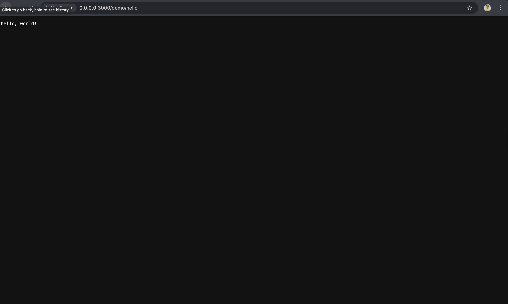
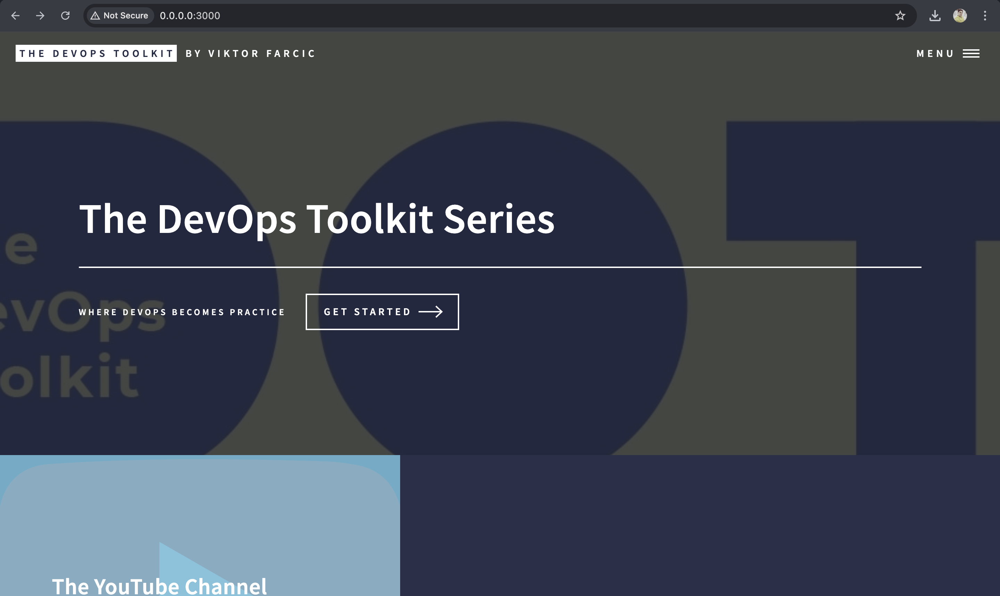
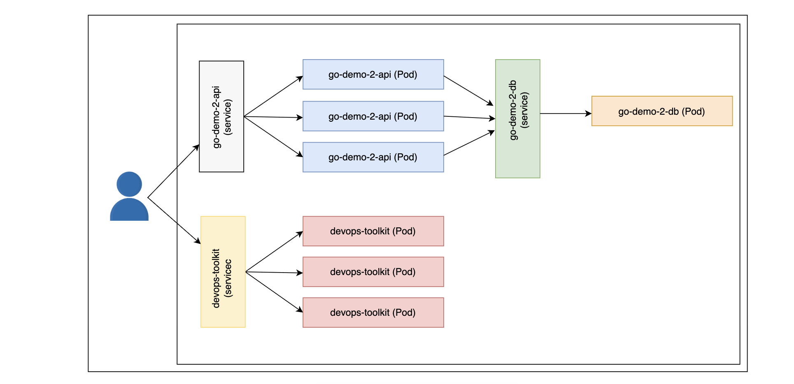
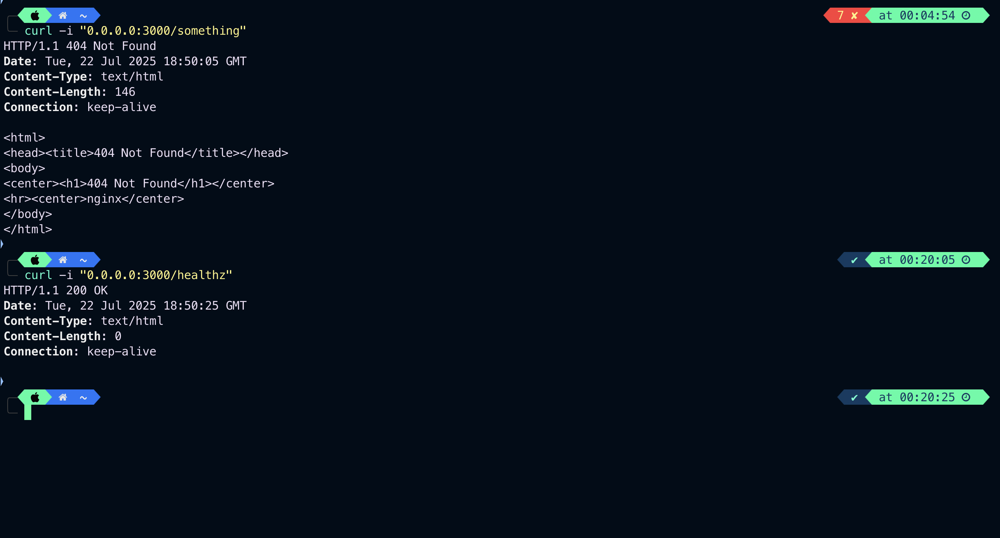
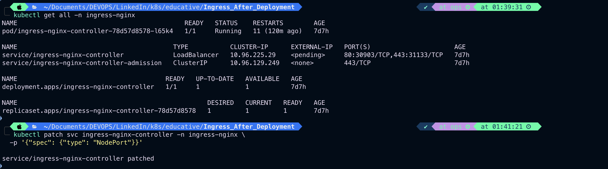
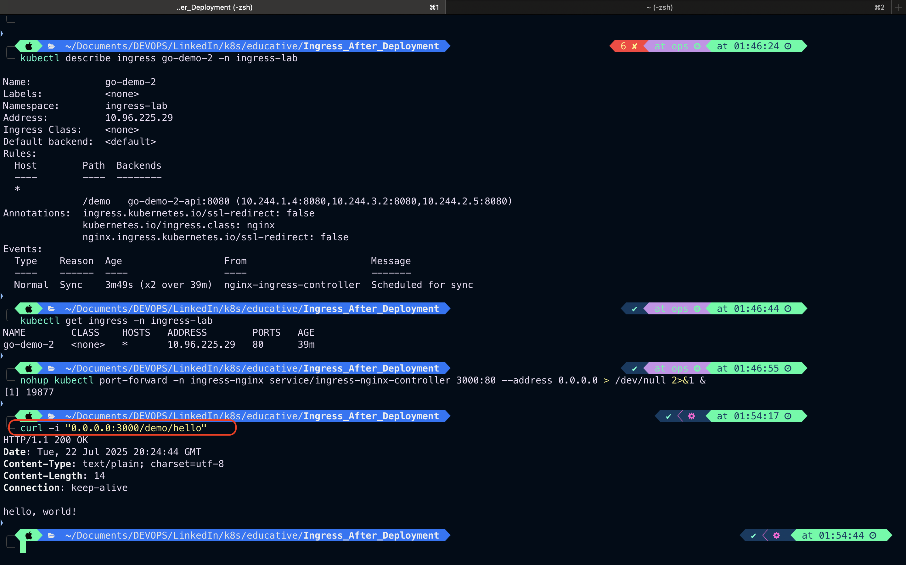
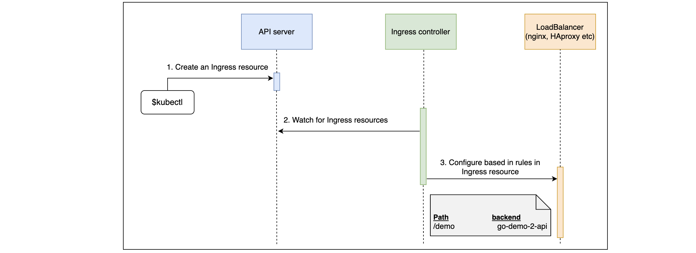
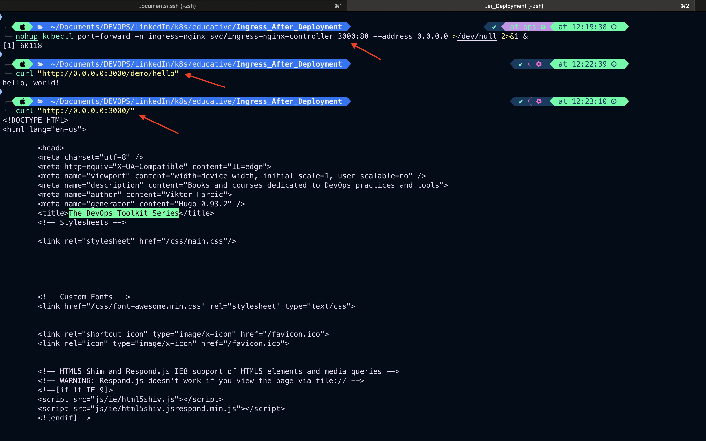
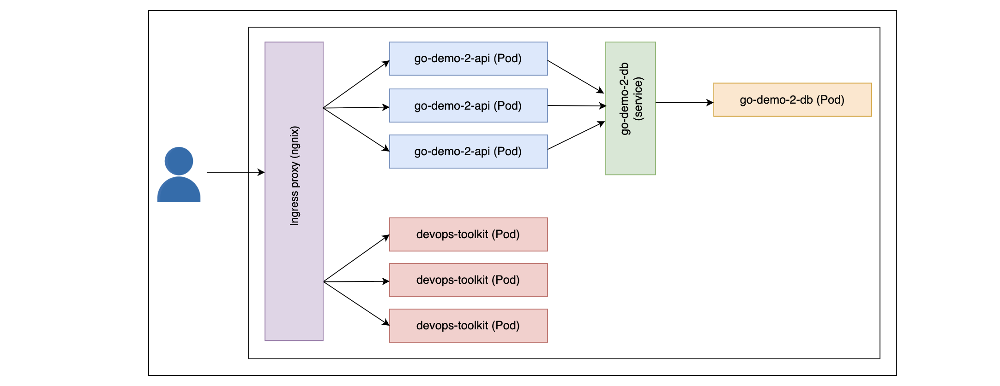
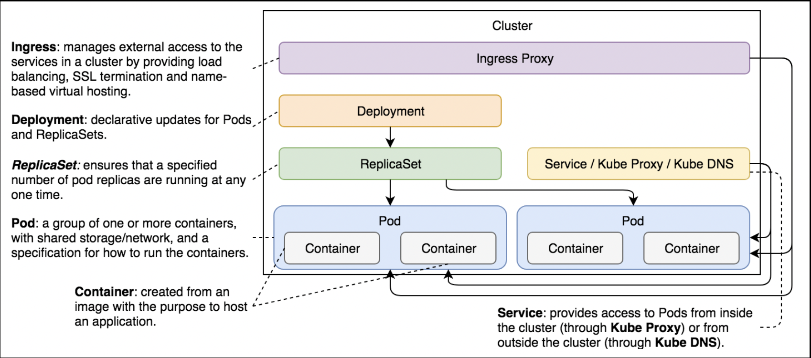

# Getting Started with Ingress

Learn what Ingress is and why it should be used.

## Why usse Ingress objects?#

- Applications that are not accessible to users are useless. Kubernetes Services provide accessibility with a usability cost. Each application can be reached through a different port. We cannot expect users to know the port of each service in our cluster.
  > `Note`: Ingress objects manage external access to the applications running inside a Kubernetes cluster.
- While it might seem that we have already accomplished that through Kubernetes Services, they do not make the applications truly accessible. We still need forwarding rules based on paths and domains, SSL termination, and a number of other features.
- In a more traditional setup, we’d probably use an external proxy and a load balancer. Ingress provides an API that allows us to accomplish these things. It also has a few other features we expect from a dynamic cluster.

# Services and External Access

Learn why Services are not the best fit for enabling external access to the applications.

## Only Services won’t suffice#

- We cannot explore solutions before we know what the problems are. Therefore, we’ll recreate a few objects using the knowledge we’ve already gained. This will let us see whether Kubernetes Services satisfy all the needs that the users of our applications might have. To be more clear, we’ll explore which features we’re missing when making our applications accessible to users.
- We’ve already discussed that it is not recommended to publish fixed ports through Services. This method is likely to result in conflicts or, at the very least, create the additional burden of carefully keeping track of which port belongs to which Service. We already discarded that option before and we won’t change it now.

```bash
vim go-demo-2-deploy.yml
```

```yaml
apiVersion: v1
kind: Namespace
metadata:
  name: ingress-lab
---
apiVersion: apps/v1
kind: Deployment
metadata:
  namespace: ingress-lab
  name: go-demo-2-db
spec:
  selector:
    matchLabels:
      type: db
      service: go-demo-2
  strategy:
    type: Recreate
  template:
    metadata:
      labels:
        type: db
        service: go-demo-2
        vendor: MongoLabs
    spec:
      containers:
        - name: db
          image: mongo:3.3
---
apiVersion: v1
kind: Service
metadata:
  namespace: ingress-lab
  name: go-demo-2-db
spec:
  ports:
    - port: 27017
  selector:
    type: db
    service: go-demo-2
---
apiVersion: apps/v1
kind: Deployment
metadata:
  namespace: ingress-lab
  name: go-demo-2-api
spec:
  replicas: 3
  selector:
    matchLabels:
      type: api
      service: go-demo-2
  template:
    metadata:
      labels:
        type: api
        service: go-demo-2
        language: go
    spec:
      containers:
        - name: api
          image: vfarcic/go-demo-2
          env:
            - name: DB
              value: go-demo-2-db
          readinessProbe:
            httpGet:
              path: /demo/hello
              port: 8080
            periodSeconds: 1
          livenessProbe:
            httpGet:
              path: /demo/hello
              port: 8080
---
apiVersion: v1
kind: Service
metadata:
  namespace: ingress-lab
  name: go-demo-2-api
spec:
  type: NodePort
  ports:
    - port: 8080
  selector:
    type: api
    service: go-demo-2
```

```bash
kubectl create -f go-demo-2-deploy.yml
```

The output is as follows:

```bash
namespace/ingress-lab created
deployment.apps/go-demo-2-db created
service/go-demo-2-db created
deployment.apps/go-demo-2-api created
service/go-demo-2-api created

# The output of the above command
```

```bash
kubectl get -f go-demo-deploy.yml
```

The output of the get command is as follows:

```bash
NAME                    STATUS   AGE
namespace/ingress-lab   Active   14s

NAME                           READY   UP-TO-DATE   AVAILABLE   AGE
deployment.apps/go-demo-2-db   1/1     1            1           14s

NAME                   TYPE        CLUSTER-IP     EXTERNAL-IP   PORT(S)     AGE
service/go-demo-2-db   ClusterIP   10.96.185.54   <none>        27017/TCP   14s

NAME                            READY   UP-TO-DATE   AVAILABLE   AGE
deployment.apps/go-demo-2-api   3/3     3            3           14s

NAME                    TYPE       CLUSTER-IP     EXTERNAL-IP   PORT(S)          AGE
service/go-demo-2-api   NodePort   10.96.31.249   <none>        8080:30844/TCP   14s

# The output of the above command
```

As we can see, these are the same Services and Deployments we previously created.

Before we move on, we should wait until all the Pods are up and running.

```bash
kubectl -n ingress-lab get pods -o wide
```

The output is as follows:

```bash
go-demo-2-api-6695f75946-hg844   1/1     Running   0          3m59s   10.244.3.17   ops-cluster-worker    <none>           <none>
go-demo-2-api-6695f75946-v5j48   1/1     Running   0          3m59s   10.244.1.17   ops-cluster-worker2   <none>           <none>
go-demo-2-api-6695f75946-xbj4s   1/1     Running   0          3m59s   10.244.2.27   ops-cluster-worker3   <none>           <none>
go-demo-2-db-767dbdd68b-wj8hx    1/1     Running   0          3m59s   10.244.2.26   ops-cluster-worker3   <none>           <none>
```

If, in your case, some of the Pods are not yet running, please wait a few moments and re-execute the kubectl get pods command. We’ll continue once they’re ready.

## Access through Services#

One obvious way to access the applications is through Services. Since the Service `go-demo-2-api` in `go-demo-2-deploy.yml` is listening on port `8080` while the platform is listening on port `3000`, we bind the port while calling the Service. We use that information to send a request.

```bash
kubectl port-forward service/go-demo-2-api 3000:8080 --address 0.0.0.0
#Now open a new terminal and run the following command
curl -i "0.0.0.0:3000/demo/hello"
#close the new terminal after running and observing the output of curl
```

The output of the port-forward command is as follows:

```bash
Forwarding from 0.0.0.0:3000 -> 8080
Handling connection for 3000
Handling connection for 3000
Handling connection for 3000
Handling connection for 3000
Handling connection for 3000
Handling connection for 3000
Handling connection for 3000
Handling connection for 3000
```

The output of the `curl` command is as follows:

```bash
HTTP/1.1 200 OK
Date: Mon, 21 Jul 2025 11:23:19 GMT
Content-Length: 14
Content-Type: text/plain; charset=utf-8

hello, world!
```

The output in the browser


- The application responds with the status code `200` and confirms that the Service indeed forwards the requests.
- While publishing a random or even a hard-coded port of a single application might not be so bad, if we apply the same principle to more applications, the user experience would be horrible. To make the point a bit clearer, we’ll deploy another application.

```bash
vim devops-toolkit-dep.yml
```

```yaml
apiVersion: apps/v1
kind: Deployment
metadata:
  namespace: ingress-lab
  name: devops-toolkit
spec:
  replicas: 3
  selector:
    matchLabels:
      type: frontend
      service: devops-toolkit
  template:
    metadata:
      labels:
        type: frontend
        service: devops-toolkit
    spec:
      containers:
        - name: frontend
          image: vfarcic/devops-toolkit-series

---
apiVersion: v1
kind: Service
metadata:
  namespace: ingress-lab
  name: devops-toolkit
spec:
  type: NodePort
  ports:
    - port: 80
  selector:
    type: frontend
    service: devops-toolkit
```

```bash
kubectl create -f devops-toolkit-dep.yml --record --save-config
```

The output is as follows:

```bash
Flag --record has been deprecated, --record will be removed in the future
deployment.apps/devops-toolkit created
service/devops-toolkit created
```

```bash
kubectl get -f devops-toolkit-dep.yml
```

The output is as follows:

```bash
NAME                             READY   UP-TO-DATE   AVAILABLE   AGE
deployment.apps/devops-toolkit   3/3     3            3           12s

NAME                     TYPE       CLUSTER-IP      EXTERNAL-IP   PORT(S)        AGE
service/devops-toolkit   NodePort   10.96.235.150   <none>        80:31267/TCP   12s
```

- This application follows a similar logic to the first. From the latter command, we can see that it contains a Deployment and a Service. The details are of no importance since the YAML definition is very similar to those we used before. What matters is that now we have two applications running inside the cluster.

## Understanding the process#

Let’s check whether the new application is indeed reachable:

```bash
kubectl -n ingress-lab port-forwad service/devops-toolkit 3000:80 --address 0.0.0.0
#Now open a new terminal and run the following command
curl -i "0.0.0.0:3000"
#close the new terminal after running and observing the output of curl
```



We retrieve the port of the new Service and open the application in a browser. If you get a page not found error, you might want to wait a bit longer until the containers are pulled and try again.

- A user sends a request to one of the nodes of the cluster. That request is received by a Service and load balanced to one of the associated Pods. It’s a bit more complicated than that, with iptables, kube DNS, kube proxy, and a few other things involved in the process. We explored them in more detail in the “Using Services To Enable Communication Between Pods” chapter. There’s probably no need to go through them all again. For the sake of brevity, the simplified diagram should do.
  
  Applications access through Services
- We cannot expect our users to know specific ports behind each of those applications. Even with only two, that would not be very user-friendly. If that number rises to tens or even hundreds of applications, our business will be very short-lived.
- What we need is a way to make all services accessible through standard HTTP (`80`) or HTTPS (`443`) ports. Kubernetes Services alone cannot get us there. We need more.

## The solution#

- We need to grant access to our Services on predefined paths and domains. Our `go-demo-2` Service could be distinguished from others through the base path `/demo`. Similarly, the Books application could be made reachable through the `devopstoolkitseries.com` domain. If we can accomplish that, we can access them with the commands given below:

```bash
curl -i "0.0.0.0:80/demo/hello"
```

- The request received the `default backend - 404 response`. There is no process listening on port 80, so this outcome is not a surprise. We could have changed one of the Services to publish the fixed port 80 instead assigning a random one. Still, that would provide access only to one of the two applications.
- We often want to associate each application with a different domain or sub-domain. Outside the examples we’re running, the books application is accessible through the **devopstoolkitseries.com** domain. Since access to the domain is not feasible, we’ll simulate it by adding the domain to the `Host` header.
- The command that should verify whether the application running inside our cluster is accessible through the `devopstoolkitseries.com` domain is as follows.

```bash
curl -i \
    -H "Host: devopstoolkitseries.com" \
    "http://0.0.0.0:80"
```

As expected, the request is still refused.

## SSL certificates#

- Lastly, we should be able to make some (if not all) applications at least partly secure by enabling HTTPS access. This means that we should have a place to store our SSL certificates. We could put them inside our applications, but that would only increase the operational complexity. Instead, we should aim towards SSL offloading somewhere between clients and the applications. Luckily for us, Kubernetes has a solution for all these.

## Try it yourself#

A list of all the commands used in the lesson is given below.

```bash
kubectl create -f go-demo-2-deploy.yml

kubectl get -f go-demo-2-deploy.yml

kubectl get pods

kubectl port-forward service/go-demo-2-api 3000:8080 --address 0.0.0.0
#Now open a new terminal and run the following command
curl -i "0.0.0.0:3000/demo/hello"
#close the new terminal after running and observing the output of curl

kubectl create -f devops-toolkit-dep.yml --record --save-config

kubectl get -f devops-toolkit-dep.yml

kubectl port-forward service/devops-toolkit 3000:80 --address 0.0.0.0
#Now open a new terminal and run the following commands

curl -i "0.0.0.0:3000"

curl -i "0.0.0.0:80/demo/hello"

curl -i \
    -H "Host: devopstoolkitseries.com" \
    "http://0.0.0.0:80"
```

---

# Enabling Ingress Controllers

Learn how to enable the Ingress controller and play around with it.

## Why are Ingress controllers required?#

- We need a mechanism that will accept requests on predefined ports (e.g., 80 and 443) and forward them to Kubernetes Services. It should be able to distinguish requests based on paths and domains and be able to perform SSL offloading.
- Kubernetes itself does not have a ready-to-go solution for this. Unlike other types of controllers that are typically part of the `kube-controller-manager` binary, Ingress controllers need to be installed separately. Instead of a controller, `kube-controller-manager` offers an Ingress resource that other third-party solutions can utilize to provide requests forwarding and SSL features. In other words, Kubernetes only provides an API, and we need to set up a controller that will use it.
- Fortunately, the community already built a myriad of Ingress controllers. We won’t evaluate all of the available options since that would require a lot of space and mostly depend on our needs and hosting vendor.

## Enabling ingress on k3d

Enable Ingress on k3d using the following command:

```bash
kubectl apply -f https://raw.githubusercontent.com/kubernetes/ingress-nginx/controller-v1.3.0/deploy/static/provider/cloud/deploy.yaml

# Command for enabling Ingress on k3d
```

The output is as follows:

```bash
namespace/ingress-nginx created
serviceaccount/ingress-nginx created
serviceaccount/ingress-nginx-admission created
role.rbac.authorization.k8s.io/ingress-nginx created
role.rbac.authorization.k8s.io/ingress-nginx-admission created
clusterrole.rbac.authorization.k8s.io/ingress-nginx created
clusterrole.rbac.authorization.k8s.io/ingress-nginx-admission created
rolebinding.rbac.authorization.k8s.io/ingress-nginx created
rolebinding.rbac.authorization.k8s.io/ingress-nginx-admission created
clusterrolebinding.rbac.authorization.k8s.io/ingress-nginx created
clusterrolebinding.rbac.authorization.k8s.io/ingress-nginx-admission created
configmap/ingress-nginx-controller created
service/ingress-nginx-controller created
service/ingress-nginx-controller-admission created
deployment.apps/ingress-nginx-controller created
job.batch/ingress-nginx-admission-create created
job.batch/ingress-nginx-admission-patch created
ingressclass.networking.k8s.io/nginx created
validatingwebhookconfiguration.admissionregistration.k8s.io/ingress-nginx-admission created
```

Wait for the ingress controller to run using the following command:

```bash
kubectl get pods --namespace=ingress-nginx
```

The output is as follows:

```bash
NAME                                        READY   STATUS    RESTARTS         AGE
ingress-nginx-controller-78d57d8578-l65k4   1/1     Running   11 (7m42s ago)   7d5h
```

> `Note`: In the remaining lessons of this chapter, the code playgrounds are preconfigured with the Ingress controller. However, it is suggested that you verify if the ingress controller is running before using the Service.

## Playing around with the controller#

Now that the Ingress addon is enabled, we’ll check whether it is running inside our cluster:

```bash
kubectl get pods -n ingress-nginx | grep ingress
```

- We can ignore the -n argument for now because we haven’t explored namespaces yet. For now, just note that the output of the command should show that the nginx-ingress-controller-... Pod is running.
- If the output is empty, we might need to wait for a few moments until the containers are pulled and re-execute the `kubectl get all --namespace ingress-nginx` command.

```bash
kubectl get all --namespace ingress-nginx
```

The output is as follows:

```bash
NAME                                            READY   STATUS    RESTARTS       AGE
pod/ingress-nginx-controller-78d57d8578-l65k4   1/1     Running   11 (11m ago)   7d5h

NAME                                         TYPE           CLUSTER-IP      EXTERNAL-IP   PORT(S)                      AGE
service/ingress-nginx-controller             LoadBalancer   10.96.225.29    <pending>     80:30903/TCP,443:31133/TCP   7d5h
service/ingress-nginx-controller-admission   ClusterIP      10.96.129.249   <none>        443/TCP                      7d5h

NAME                                       READY   UP-TO-DATE   AVAILABLE   AGE
deployment.apps/ingress-nginx-controller   1/1     1            1           7d5h

NAME                                                  DESIRED   CURRENT   READY   AGE
replicaset.apps/ingress-nginx-controller-78d57d8578   1         1         1       7d5h
```

> `Note`: The ingress image is based on the[` NGINX Ingress controller`](https://github.com/kubernetes/ingress-nginx/blob/master/README.md). It is one of the only two controllers that are currently supported and maintained by the Kubernetes community. The other one is [`GLBC`](https://github.com/kubernetes/ingress-gce/blob/master/README.md) which comes with the [`Google Compute Engine (GCE)`](https://cloud.google.com/compute/) Kubernetes hosted solution.

- By default, the Ingress controller is configured with only two endpoints.
- If we’d like to check controller’s health, we can send a request to `/healthz`.

```bash
nohup kubectl port-forward -n ingress-nginx service/ingress-nginx-controller 3000:80 --address 0.0.0.0 > /dev/null 2>&1 &
# ✅ What This Command Does Altogether:
# Starts port-forwarding in the background, mapping your localhost:3000 to the Ingress controller's port 80, and makes it accessible from anywhere in the network — all while suppressing output and surviving terminal disconnection.


# Please wait for a few seconds before running the next command
curl -i "0.0.0.0:3000/healthz"
```

The output of second command is as follows:

```bash
HTTP/1.1 200 OK
Server: nginx/1.15.9
Date: Mon, 10 Jun 2019 12:02:11 GMT
Content-Type: text/html
Content-Length: 0
Connection: keep-alive
```

It responds with the status code `200 OK`, indicating that it is healthy and ready to serve requests. There’s not much more to it, so we’ll move to the second endpoint.

```bash
ifconfig | grep inet

kubectl port-forward -n ingress-nginx svc/ingress-nginx-controller 3000:80 --address 0.0.0.0

```

The output of the first command is as follows:

```bash
inet 127.0.0.1 netmask 0xff000000
	inet6 ::1 prefixlen 128
	inet6 fe80::1%lo0 prefixlen 64 scopeid 0x1
	inet6 fe80::bc:ce30:76fd:c382%en0 prefixlen 64 secured scopeid 0xb
	inet6 2409:40f2:1c:a7b2:1c3c:7d04:2b9a:654 prefixlen 64 autoconf secured
	inet6 2409:40f2:1c:a7b2:6dcf:a430:38b1:1a13 prefixlen 64 autoconf temporary
	inet 192.0.0.2 netmask 0xffffffff broadcast 192.0.0.2
	inet6 2409:40f2:1c:a7b2:1836:461c:7597:fc6d prefixlen 64 clat46
	inet6 fe80::f469:c5ff:febc:85e2%awdl0 prefixlen 64 scopeid 0xd
	inet6 fe80::f469:c5ff:febc:85e2%llw0 prefixlen 64 scopeid 0xe
	inet6 fe80::4ce5:c6a5:6c53:3947%utun0 prefixlen 64 scopeid 0xf
	inet6 fe80::cfcc:9091:7da7:9dbd%utun1 prefixlen 64 scopeid 0x10
	inet6 fe80::ac5c:5735:edaf:763f%utun2 prefixlen 64 scopeid 0x11
	inet6 fe80::ce81:b1c:bd2c:69e%utun3 prefixlen 64 scopeid 0x12
```

The output of latter command is as follows:

```bash
kubectl port-forward -n ingress-nginx svc/ingress-nginx-controller 3000:80 --address 0.0.0.0

Forwarding from 0.0.0.0:3000 -> 80
Handling connection for 3000
Handling connection for 3000
Handling connection for 3000
Handling connection for 3000
Handling connection for 3000
Handling connection for 3000

```


- The Ingress controller has a default catch-all endpoint that is used when a request does not match any of the other criteria. Since we haven’t created any Ingress resource, this endpoint should provide the same response to all requests except `/healthz`.
  
  Opening URL through Ingress Service

> We get a response indicating that the requested resource could not be found.

## Try it yourself#

For your convenience, a list of all the commands used in the lesson is given below:

```bash

kubectl apply -f https://raw.githubusercontent.com/kubernetes/ingress-nginx/controller-v1.3.0/deploy/static/provider/cloud/deploy.yaml

kubectl get pods --namespace=ingress-nginx

kubectl get pods -n ingress-nginx \
    | grep ingress

nohup kubectl port-forward -n ingress-nginx service/ingress-nginx-controller 3000:80 --address 0.0.0.0 > /dev/null 2>&1 &

# Please wait for a few seconds before running the next commands
curl -i "0.0.0.0:3000/healthz"

curl -i "0.0.0.0:3000/something"
```

---

# Creating Ingress Resources Based on Paths

Understand the definition of an Ingress resource and then create the objects based on this definition.

## Defining an Ingress resource#

We’ll try to make our `go-demo-2-api` Service available through port `80`. We’ll do that by defining an Ingress resource with the rule to forward all requests with the path starting with /demo to the Service `go-demo-2-api`.

## Looking into the definition#

Let’s look at the Ingress’ YAML definition `go-demo-2-ingress.yml`:

```yaml
apiVersion: networking.k8s.io/v1
kind: Ingress
metadata:
  name: go-demo-2
  annotations:
    kubernetes.io/ingress.class: "nginx"
    ingress.kubernetes.io/ssl-redirect: "false"
    nginx.ingress.kubernetes.io/ssl-redirect: "false"
spec:
  rules:
    - http:
        paths:
          - path: /demo
            pathType: ImplementationSpecific
            backend:
              service:
                name: go-demo-2-api
                port:
                  number: 8080
```

- `Line 5`: This time, `metadata` contains a field we haven’t used before. The `annotations` section allows us to provide additional information to the Ingress controller. As you’ll see soon, the Ingress API specification is concise(**meaning it includes only the essential fields required for all Ingress controllers, keeping it simple and minimal.**) and limited. That is done on purpose. The specification API defines only the fields that are mandatory for all Ingress controllers. All the additional information an Ingress controller needs is specified through `annotations`. That way, the community behind the controllers can progress at great speed while still providing basic general compatibility and standards.
  > `Note`: The list of general annotations and the controllers that support them can be found on the [`Ingress Annotations`](https://github.com/kubernetes/ingress-nginx/blob/master/docs/user-guide/nginx-configuration/annotations.md) page. For those specific to the [`NGINX Ingress controller`](https://github.com/kubernetes/ingress-nginx/blob/master/README.md), please visit the [`NGINX Annotations`](https://github.com/kubernetes/ingress-nginx/blob/master/docs/user-guide/nginx-configuration/annotations.md) page, and for those specific to GCE Ingress, visit the [`ingress-gce`](https://github.com/kubernetes/ingress-gce) page.
- Line 8: We specify the `nginx.ingress.kubernetes.io/ssl-redirect: "false"` annotation which tells the controller that we do not want to redirect all HTTP requests to HTTPS. We’re forced to do so since we do not have SSL certificates for the exercises that follow.

Now that we have understood `metadata` and `annotations`, we can move to the `ingress` specification.

- `Line 9–19`: We specify a set of rules in the `spec` section. They are used to configure `Ingress` resources. For now, our rule is based on `http` with a single `path` and a `backend`. All the requests with the `path` starting with `/demo` will be forwarded to the service `go-demo-2-api` on port `8080`.

## Creating the resource#

Now that we’ve had a short tour of some of the Ingress configuration options, we can proceed and create the resource.

```bash
kubectl create -f go-demo-2-ingress.yml

kubectl get -f go-demo-2-ingress.yml
```

The output of first command is as follows:

```bash
ingress.networking.k8s.io/go-demo-2 created
```

The output of second command is as follows:

```bash
NAME        CLASS   HOSTS   ADDRESS   PORTS   AGE
go-demo-2   nginx   *                 80      2m45s
```

> Note: If you are using kind cluster then use k8s-ingress-troubleshooting.md to fix the issue as I have done here , Convert LoadBalancer to NodePort using `kubectl patch svc ingress-nginx-controller -n ingress-nginx -p '{"spec": {"type": "NodePort"}}'`
> then will get the expected output
> 

```bash
NAME        CLASS    HOSTS   ADDRESS        PORTS   AGE
go-demo-2   <none>   *       10.96.225.29   80      39m
```

We can see that the Ingress resource was created. Don’t panic if the address is blank for some time. It might take a while for it to obtain it.
Let’s see whether requests sent to the base path `/demo` work:

```bash
nohup kubectl port-forward -n ingress-nginx service/ingress-nginx-controller 3000:80 --address 0.0.0.0 > /dev/null 2>&1 &

curl -i "http://0.0.0.0:3000/demo/hello"
```

The output of second command is as follows:

```bash
HTTP/1.1 200 OK
Date: Tue, 22 Jul 2025 20:24:44 GMT
Content-Type: text/plain; charset=utf-8
Content-Length: 14
Connection: keep-alive

hello, world!
```



- The status code `200 OK` is a clear indication that this time the application is accessible through port 80. If that’s not enough assurance, we can observe the hello, world! response as well.
- The `go-demo-2` Service we’re currently using is no longer properly configured for our Ingress setup. Using `type: NodePort`, it is configured to export port `8080` to all of the nodes. Since we’re expecting users to access the application through the Ingress controller on port `80`, there’s probably no need to allow external access through port `8080` as well.
- We should switch to the `ClusterIP` type. This will allow direct access to the Service only within the cluster, therefore limiting all external communication through Ingress.

## Deleting the objects#

We cannot just update the Service with a new definition. Once a Service port is exposed, it cannot be un-exposed. We’ll delete the `go-demo-2` objects we created and start over. Besides the need to change the Service type, this will give us an opportunity to unify everything in a single YAML file.

```bash
kubectl delete -f go-demo-2-ingress.yml

kubectl delete -f go-demo-2-deploy.yml
```

# Creating first resource using unified YAML#

```bash
vim go-demo-2.yml
```

```yaml
apiVersion: networking.k8s.io/v1
kind: Ingress
metadata:
  namespace: ingress-lab
  name: go-demo-2
  annotations:
    kubernetes.io/ingress.class: "nginx"
    ingress.kubernetes.io/ssl-redirect: "false"
    nginx.ingress.kubernetes.io/ssl-redirect: "false"
spec:
  rules:
    - http:
        paths:
          - path: /demo
            pathType: ImplementationSpecific
            backend:
              service:
                name: go-demo-2-api
                port:
                  number: 8080

---
apiVersion: apps/v1
kind: Deployment
metadata:
  namespace: ingress-lab
  name: go-demo-2-db
spec:
  selector:
    matchLabels:
      type: db
      service: go-demo-2
  strategy:
    type: Recreate
  template:
    metadata:
      labels:
        type: db
        service: go-demo-2
        vendor: MongoLabs
    spec:
      containers:
        - name: db
          image: mongo:3.3

---
apiVersion: v1
kind: Service
metadata:
  namespace: ingress-lab
  name: go-demo-2-db
spec:
  ports:
    - port: 27017
  selector:
    type: db
    service: go-demo-2

---
apiVersion: apps/v1
kind: Deployment
metadata:
  namespace: ingress-lab
  name: go-demo-2-api
spec:
  replicas: 3
  selector:
    matchLabels:
      type: api
      service: go-demo-2
  template:
    metadata:
      labels:
        type: api
        service: go-demo-2
        language: go
    spec:
      containers:
        - name: api
          image: vfarcic/go-demo-2
          env:
            - name: DB
              value: go-demo-2-db
          readinessProbe:
            httpGet:
              path: /demo/hello
              port: 8080
            periodSeconds: 1
          livenessProbe:
            httpGet:
              path: /demo/hello
              port: 8080

---
apiVersion: v1
kind: Service
metadata:
  namespace: ingress-lab
  name: go-demo-2-api
spec:
  ports:
    - port: 8080
  selector:
    type: api
    service: go-demo-2
```

Since we’ve removed the objects related to `go-demo-2`, we can look at the unified definition `go-demo-2.yml`. We won’t go into details about the new definition because it does not have any significant changes. It combines `go-demo-2-ingress.yml` and `go-demo-2-deploy.yml` into a single file and removes `type: NodePort` from the `go-demo-2 Service`.

```bash
kubectl create -f go-demo-2.yml \
    --record --save-config

nohup kubectl port-forward -n ingress-nginx service/ingress-nginx-controller 3000:80 --address 0.0.0.0 > /dev/null 2>&1 &
curl -i "http://0.0.0.0:3000/demo/hello"
```

- We create the objects from the unified definition and send a request to validate that everything works as expected. The response should be `200 OK`, indicating that everything (still) works as expected.

- Please note that Kubernetes needs a few seconds until all objects are running as expected. If you’re too fast, you might receive the response `404 Not Found` or `503` instead of `200 OK`. If that was the case, all you have to do is send the curl request again.

# Try it yourself#

For your convenience, a list of all the commands used in the lesson is given below:

```bash
kubectl create -f go-demo-2-ingress.yml

kubectl get -f go-demo-2-ingress.yml

nohup kubectl port-forward -n ingress-nginx service/ingress-nginx-controller 3000:80 --address 0.0.0.0 > /dev/null 2>&1 &

curl -i "http://0.0.0.0:3000/demo/hello"

kubectl delete -f go-demo-2-ingress.yml

kubectl delete -f go-demo-2-deploy.yml

kubectl create -f go-demo-2.yml \
    --record --save-config

nohup kubectl port-forward -n ingress-nginx service/ingress-nginx-controller 3000:80 --address 0.0.0.0 > /dev/null 2>&1 &

curl -i "http://0.0.0.0:3000/demo/hello"
```

---

# Sequential Breakdown of the Process

Understand the sequential breakdown of the Ingress resource creation process and create the second Ingress resource.

## Let’s see what happens when we create an Ingress resource.

1. The Kubernetes client (`kubectl`) sends a request to the API server requesting the creation of the Ingress resource defined in the `go-demo-2.yml` file.
2. The `ingress controller` is watching the API server for new events. It detects a new Ingress resource.
3. The Ingress controller configures the load balancer. In this case, it is nginx that modifies `nginx.conf` with the values of all `go-demo-2-api` endpoints.
   
   The sequence of events followed by a request to create an Ingress resource

- Now that one of the applications is accessible through Ingress, we should apply the same principles to the other application.

## Creating a second ingress resource#

Let’s understand the definition first and then create our second resource using `devops-toolkit.yml`.

### Looking into the definition#

Let’s look at the full definition of all the objects behind the devops-toolkit application.

The `devops-toolkit` Ingress resource is very similar to `go-demo-2`.

> `Note`: The only significant difference is that the path is set to `/`.
> The resource will server all requests. It would be a much better solution if we’d change it to a unique base path (e.g., `/devops-toolkit`) since that would provide a unique identifier.

However, this application does not have an option to define a base path, so an attempt to do so in Ingress would result in a failure to retrieve resources. We’d need to write `rewrite` rules instead. We could, for example, create a rule that rewrites path base `/devops-toolkit` to `/`.

- For example, if someone sends a request to `/devops-toolkit/something`, Ingress would rewrite it to `/something` before sending it to the destination Service. While such an action is often useful, we’ll ignore it for now. For now, `/` as the base `path` should do.
- Apart from adding Ingress to the mix, the definition removes `type: NodePort` from the Service. This is the same type of action we did previously with the `go-demo-2` service. We do not need external access to the Service.

### Deleting and recreating the objects#

Let’s create the objects defined in the `devops-toolkit.yml` file.

```yaml
apiVersion: networking.k8s.io/v1
kind: Ingress
metadata:
  namespace: ingress-lab
  name: devops-toolkit
  annotations:
    kubernetes.io/ingress.class: "nginx"
    ingress.kubernetes.io/ssl-redirect: "false"
    nginx.ingress.kubernetes.io/ssl-redirect: "false"
spec:
  rules:
    - http:
        paths:
          - path: /
            pathType: ImplementationSpecific
            backend:
              service:
                name: devops-toolkit
                port:
                  number: 80
---
apiVersion: apps/v1
kind: Deployment
metadata:
  namespace: ingress-lab
  name: devops-toolkit
spec:
  replicas: 3
  selector:
    matchLabels:
      type: frontend
      service: devops-toolkit
  template:
    metadata:
      labels:
        type: frontend
        service: devops-toolkit
    spec:
      containers:
        - name: frontend
          image: vfarcic/devops-toolkit-series
---
apiVersion: v1
kind: Service
metadata:
  namespace: ingress-lab
  name: devops-toolkit
spec:
  ports:
    - port: 80
  selector:
    type: frontend
    service: devops-toolkit
```

```bash
kubectl create -f devops-toolkit.yml --record --save-config
```

Let’s look at the Ingresses running inside the cluster.

```bash
kubectl get ing -n ingress-lab
```

The output is as follows:

```bash
NAME             CLASS    HOSTS   ADDRESS        PORTS   AGE
devops-toolkit   <none>   *       10.96.225.29   80      82s
go-demo-2        <none>   *       10.96.225.29   80      9h
```

We can see that now we have multiple Ingress resources. The Ingress controller (in this case NGINX) configured itself, taking both of those resources into account.

> `Note`: We can define multiple Ingress resources that will configure a single Ingress controller.
> Let’s confirm that both applications are accessible through HTTP (port `80`).

```bash
nohup kubectl port-forward -n ingress-nginx svc/ingress-nginx-controller 3000:80 --address 0.0.0.0 >/dev/null 2>&1 &
#Now click on the link beside the run button
#Next run the following command

curl "http://0.0.0.0:3000/demo/hello"

curl "http://0.0.0.0:3000/"
```


We’re able to view the application, whereas the `curl` command returns the already familiar `hello, world!` message.

> `Note`: Ingress is a (kind of) Service that runs on all nodes of a cluster. A user can send requests to any Service. As long as they match one of the rules, they will be forwarded to the appropriate Service.



> Applications accessed through Ingress controller

Even though we can send requests to both applications using the same port (`80`), that’s often a suboptimal solution. Our users would probably be happier if they could access those applications through different domains.

# Try it yourself#

```bash
kubectl create -f devops-toolkit.yml --record --save-config

kubectl get ing

nohup kubectl port-forward -n ingress-nginx service/ingress-nginx-controller 3000:80 --address 0.0.0.0  > /dev/null 2>&1 &

curl "http://0.0.0.0:3000/demo/hello"
```

---

# Creating Ingress Resources Based on Domains

Learn to create Ingress resources based on domains.

## Refactoring the definition#

We’ll try to refactor our `devops-toolkit` Ingress definition so that the controller forwards requests coming from the `devopstoolkitseries.com` domain. The change should be minimal, so we’ll get down to it right away.

When compared with the previous definition, the only difference is in the additional entry `host: devopstoolkitseries.com`. Since that will be the only application accessible through that domain, we also removed the `path: /` entry.

```bash
vim devops-toolkit-dom.yml
```

```yaml
apiVersion: networking.k8s.io/v1
kind: Ingress
metadata:
  namespace: ingress-lab
  name: devops-toolkit
  annotations:
    kubernetes.io/ingress.class: "nginx"
    ingress.kubernetes.io/ssl-redirect: "false"
    nginx.ingress.kubernetes.io/ssl-redirect: "false"
spec:
  rules:
    - host: devopstoolkitseries.com
      http:
        paths:
          - path: /
            pathType: ImplementationSpecific
            backend:
              service:
                name: devops-toolkit
                port:
                  number: 80

---
apiVersion: apps/v1
kind: Deployment
metadata:
  namespace: ingress-lab
  name: devops-toolkit
spec:
  replicas: 3
  selector:
    matchLabels:
      type: frontend
      service: devops-toolkit
  template:
    metadata:
      labels:
        type: frontend
        service: devops-toolkit
    spec:
      containers:
        - name: frontend
          image: vfarcic/devops-toolkit-series

---
apiVersion: v1
kind: Service
metadata:
  namespace: ingress-lab
  name: devops-toolkit
spec:
  ports:
    - port: 80
  selector:
    type: frontend
    service: devops-toolkit
```

## Applying the new definition#

Let’s `apply` the new definition `devops-toolkit-dom.yml`:

```bash
kubectl apply -f devops-toolkit-dom.yml --record

kubectl get ing -n ingress-lab
```

The output of second command is as follows:

```bash
NAME             CLASS    HOSTS                     ADDRESS        PORTS   AGE
devops-toolkit   <none>   devopstoolkitseries.com   10.96.225.29   80      30m
go-demo-2        <none>   *                         10.96.225.29   80      10h
```

What would happen if we send a similar domain-less request to the application? We’re sure you already know the answer, but we’ll check it out anyways.

```bash
nohup kubectl port-forward -n ingress-nginx service/ingress-nginx-controller 3000:80 --address 0.0.0.0 > /dev/null 2>&1 &
curl -i "http://0.0.0.0:3000"
```

The output is as follows:

```html
<html>
  <head>
    <title>404 Not Found</title>
  </head>
  <body>
    <center><h1>404 Not Found</h1></center>
    <hr />
    <center>nginx</center>
  </body>
</html>
```

- There is no Ingress resource defined to listen to `/`. The updated Ingress will forward requests only if they come from d`evopstoolkitseries.com`.
- Since it’s not feasible to give you access to the DNS registry of `devopstoolkitseries.com`, you cannot configure it with the IP of your cluster. Therefore, we won’t be able to test it by sending a request to `devopstoolkitseries.com`.

- What we can do is to “fake” it by adding that domain to the request header.

```bash
curl -I -H "Host: devopstoolkitseries.com" "http://0.0.0.0:3000"
```

The output is as follows:

```bash
HTTP/1.1 200 OK
Date: Wed, 23 Jul 2025 07:35:52 GMT
Content-Type: text/html
Content-Length: 4616
Connection: keep-alive
Last-Modified: Thu, 02 Mar 2023 11:50:48 GMT
ETag: "64008d98-1208"
Accept-Ranges: bytes
```

- Now that Ingress has received a request that looks like it’s coming from the domain `devopstoolkitseries.com`, it is forwarded to the `devops-toolkit` Service. This, in turn, load balances it to one of the `devops-toolkit` Pods. As a result, we get the response `200 OK`.
- Just to be on the safe side, we’ll verify whether go-demo-2 Ingress still works.

```bash
curl -H "Host: acme.com" "http://0.0.0.0:3000/demo/hello"
#Calling API with Host="acme.com"

```

We get the famous `hello, world!` response, thus confirming that both Ingress resources are operational. Even though we “faked” the last request as if it were coming from `acme.com`, it still worked. Since the `go-demo-2` Ingress does not have any `host` defined, it accepts any request with the path starting with `/demo`.

# Try it yourself#

For your convenience, a list of all the commands used in the lesson is given below:

```bash
kubectl apply \
  -f devops-toolkit-dom.yml \
  --record

nohup kubectl port-forward -n ingress-nginx service/ingress-nginx-controller 3000:80 --address 0.0.0.0 > /dev/null 2>&1 &

curl -i "http://0.0.0.0:3000"

curl -I -H "Host: devopstoolkitseries.com" "http://0.0.0.0:3000"

curl -H "Host: acme.com" "http://0.0.0.0:3000/demo/hello"
```

---

# Try it yourself#

For your convenience, a list of all the commands used in the lesson is given below:

```bash
kubectl apply \
  -f devops-toolkit-dom.yml \
  --record

nohup kubectl port-forward -n ingress-nginx service/ingress-nginx-controller 3000:80 --address 0.0.0.0 > /dev/null 2>&1 &

curl -i "http://0.0.0.0:3000"

curl -I -H "Host: devopstoolkitseries.com" "http://0.0.0.0:3000"

curl -H "Host: acme.com" "http://0.0.0.0:3000/demo/hello"
```

# Creating an Ingress Resource with the Default Backend

Learn to define and create an Ingress resource with a default backend.

## Non-matching requests#

- In some cases, we might want to define a default backend. We might want to forward requests that do not match any of the Ingress rules.
- Let’s see the following example:

```bash
nohup kubectl port-forward -n ingress-nginx svc/ingress-nginx-controller 3000:80 --address 0.0.0.0 >/dev/null 2>&1 &

curl -I -H "Host: acme.com" "http://0.0.0.0:3000"
# Call the application from an unidentified domain
```

- So far, we have two sets of Ingress rules in our cluster. One accepts all requests with the base path `/demo`. The other forwards all requests coming from the `devopstoolkitseries.com` domain. The request we just sent does not match either of those rules, so the response is once again `404 Not Found`.

## Default backend Ingress resource#

Let’s define and create a default backend resource.

### Looking into the definition#

- Let’s suppose that it would be a good idea to forward all requests with the wrong domain to the `devops-toolkit` application. Of course, by “wrong domain,” we mean one of the domains we own and not one of those that are already included in Ingress rules.
- Let’s look at the definition of `default-backend.yml`:

```yaml
apiVersion: networking.k8s.io/v1
kind: Ingress
metadata:
  name: default
  annotations:
    kubernetes.io/ingress.class: "nginx"
    ingress.kubernetes.io/ssl-redirect: "false"
    nginx.ingress.kubernetes.io/ssl-redirect: "false"
spec:
  rules:
    - http:
        paths:
          - path: /
            pathType: ImplementationSpecific
            backend:
              service:
                name: devops-toolkit
                port:
                  number: 80
```

Definition of default-backend

- There’s no Deployment, nor is there a Service. This time, we’re creating only an Ingress resource.
- he `spec` has no rules but only a single `backend`.
  > `Note`: When an Ingress `spec` is without rules, it is considered a default backend. It will forward all requests that do not match paths and/or domains set as rules in the other Ingress resources.
- We can use the default backend as a substitute for the default `404` pages or for any other occasion that is not covered by other rules.
- You’ll notice that the `serviceName` is `devops-toolkit`. This example would have been much better if we created a separate application for this purpose but it does not matter for this example. All we want, at the moment, is to see something other than a `404 Not Found` response.

### Creating the resource#

```bash
kubectl create -f  default-backend.yml
```

- We create the Ingress resource with the default backend, and now we can test whether it truly works:

```bash
nohup kubectl port-forwad -n ingress-nginx svc/ingress-nginx-controller 3000:80 --address 0.0.0.0 >/dev/null 2>&1 &

curl -I -H "Host: acme.com" "http://0.0.0.0:3000"
```

The output of latter command is as follows:

```bash
HTTP/1.1 200 OK
Date: Wed, 23 Jul 2025 19:35:07 GMT
Content-Type: text/html
Content-Length: 4616
Connection: keep-alive
Last-Modified: Thu, 02 Mar 2023 11:50:48 GMT
ETag: "64008d98-1208"
Accept-Ranges: bytes
```

---

# Try it yourself#

For your convenience, a list of all the commands used in the lesson is given below:

```bash
nohup kubectl port-forward -n ingress-nginx service/ingress-nginx-controller 3000:80 --address 0.0.0.0 > /dev/null 2>&1 &

kubectl create \
    -f default-backend.yml

nohup kubectl port-forward -n ingress-nginx service/ingress-nginx-controller 3000:80 --address 0.0.0.0 > /dev/null 2>&1 &

curl -I -H "Host: acme.com" \
    "http://0.0.0.0:3000"

k3d cluster delete mycluster --all
```

# Quiz Yourself on Ingress

## Technical Quiz

### 1. Which resources manage external access to the applications running inside a Kubernetes cluster?

> Ans: Ingress

### 2. (True or False) Like other types of Controllers, Ingress controller is also a part of the kube-controller-manager binary.

> Ans. False

### 3. When is the Ingress Controller’s default catch-all endpoint used?

> Ans: When a request does not match any of the other criteria

### 4. In which section do we specify rules to configure Ingress resources?

> Ans: `spec`

### 5. (True or False) When an Ingress spec is without rules, it is considered a default backend.

> Ans: True

---

# What's Next?

Review what we’ve learned so far and what we will learn next.

## Summary#

- In this chapter, we explored some of the essential functions of Ingress resources and controllers. To be more concrete, we examined almost all those functions that are defined in the Ingress API.
- One notable feature we did not explore is TLS configuration. Without it, our services cannot serve HTTPS requests. To enable it, we’d need to configure Ingress to offload SSL certificates.
- There are two reasons we did not explore TLS. For one, we do not have a valid SSL certificate. On top of that, we did not yet study Kubernetes Secrets. We suggest that you explore SSL setup yourself once you decide which Ingress controller to use. Secrets, on the other hand, will be explained soon.
- We’ll explore other Ingress controllers once we move our cluster to “real” servers that we’ll create with one of the hosting vendors. Until then, you might benefit from reading the[` NGINX Ingress controller`](https://github.com/kubernetes/ingress-nginx/blob/master/README.md) documentation in more detail. Specifically, we suggest that you pay close attention to its [`annotations`](https://github.com/kubernetes/ingress-nginx/blob/master/docs/user-guide/nginx-configuration/annotations.md).
  
  The above illustration shows and defines the Kubernetes components we have explored so far.
  > `Note`: If you want like to know more about Ingress, please explore the [`Ingress v1beta1 extensions`](https://kubernetes.io/docs/reference/generated/kubernetes-api/v1.24/#ingress-v1beta1-extensions) API documentation.
