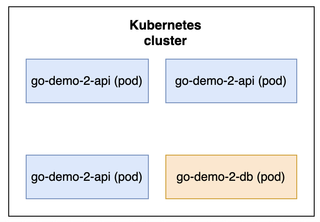
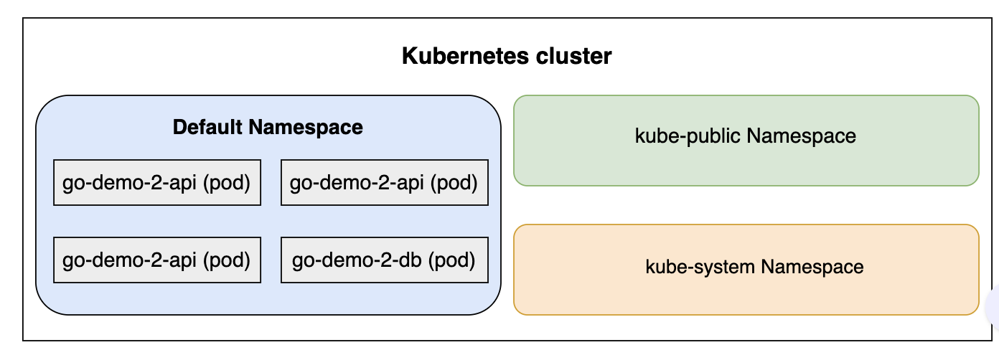
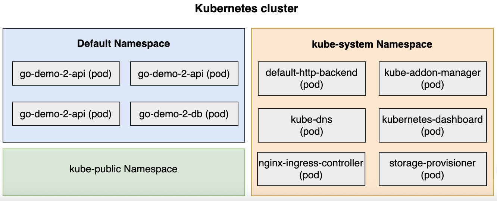
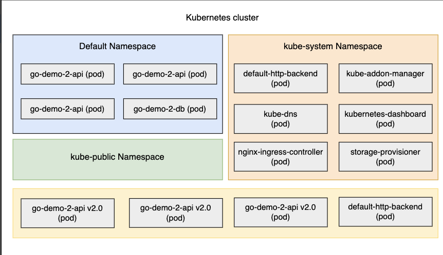

# Getting Started with Cluster Division

- Applications and corresponding objects often need to be separated from each other to avoid conflicts and other undesired effects. So far, all examples we have seen create one cluster. However, there are situations in which multiple clusters should be created. Some benefits of creating multiple clusters are as follows:
  - We might need to separate objects created by different teams. For example, we can give each team a separate cluster so that they can experiment without affecting others.
  - We might want to create different clusters that will be used for various purposes. For example, we have a production and a testing cluster.
  - There are many other problems that we could solve by creating different clusters. Most of them are based on the fear that some objects will produce adverse effects on others.
  - We might be afraid that a team will accidentally replace a production release of an application with an untested beta.
  - We might be concerned that performance tests will slow down the whole cluster. Fear is one of the main reasons why we tend to be defensive and conservative. In some cases, it is founded on past experiences. In others, it might be produced by insufficient knowledge of the tools we’re using. More often than not, it is a combination of the two.

## The problem with multiple clusters#

- The problem with having many Kubernetes clusters is that each cluster has an operational and resource overhead. Managing one cluster is often far from trivial. Having a few is even more complicated. Having many can become a nightmare and requires quite a significant investment in hours dedicated to operations and maintenance.
- If that overhead is not enough, we must also be aware that each cluster needs resources dedicated to Kubernetes. The more clusters we have, the more resources (CPU, memory, IO) are spent. While that can be said for big clusters, the fact remains that the resource overhead of having many smaller clusters is higher than having a single big one.

## Namespaces#

- We are not trying to discourage you from having multiple Kubernetes clusters. In many cases, it’s a useful strategy. However, there is also the possibility of using Kubernetes namespaces instead. In this chapter, we’ll explore ways to split a cluster into different segments as an alternative to having multiple clusters.

---

---

# Deploying the First Release

Learn how to deploy our first release to get started with namespaces.

---

## Looking into the definition#

We’ll start by deploying the `go-demo-2` application and use it to explore namespaces. The file is shown below:

```yml
apiVersion: networking.k8s.io/v1
kind: Ingress
metadata:
  name: go-demo-2
  annotations:
    kubernetes.io/ingress.class: "nginx"
    ingress.kubernetes.io/ssl-redirect: "false"
    nginx.ingress.kubernetes.io/ssl-redirect: "false"
spec:
  rules:
    - host: go-demo-2.com
      http:
        paths:
          - path: /demo
            pathType: ImplementationSpecific
            backend:
              service:
                name: go-demo-2-api
                port:
                  number: 8080

---
apiVersion: apps/v1
kind: Deployment
metadata:
  name: go-demo-2-db
spec:
  selector:
    matchLabels:
      type: db
      service: go-demo-2
  strategy:
    type: Recreate
  template:
    metadata:
      labels:
        type: db
        service: go-demo-2
        vendor: MongoLabs
    spec:
      containers:
        - name: db
          image: mongo:3.3

---
apiVersion: v1
kind: Service
metadata:
  name: go-demo-2-db
spec:
  ports:
    - port: 27017
  selector:
    type: db
    service: go-demo-2

---
apiVersion: apps/v1
kind: Deployment
metadata:
  name: go-demo-2-api
spec:
  replicas: 3
  selector:
    matchLabels:
      type: api
      service: go-demo-2
  template:
    metadata:
      labels:
        type: api
        service: go-demo-2
        language: go
    spec:
      containers:
        - name: api
          image: vfarcic/go-demo-2
          env:
            - name: DB
              value: go-demo-2-db
          readinessProbe:
            httpGet:
              path: /demo/hello
              port: 8080
            periodSeconds: 1
          livenessProbe:
            httpGet:
              path: /demo/hello
              port: 8080

---
apiVersion: v1
kind: Service
metadata:
  name: go-demo-2-api
spec:
  ports:
    - port: 8080
  selector:
    type: api
    service: go-demo-2
```

- The definition is the same as the one we used before, so we’ll skip the explanation of the YAML file. Instead, we’ll jump right away into the deployment.

```yml
kubectl apply -f go-demo-2.yml
```

The output is as follows:

```bash
Warning: annotation "kubernetes.io/ingress.class" is deprecated, please use 'spec.ingressClassName' instead
deployment.apps/go-demo-2-db created
service/go-demo-2-db created
deployment.apps/go-demo-2-api created
service/go-demo-2-api created
Error from server (InternalError): error when creating "go-demo-2.yml": Internal error occurred: failed calling webhook "validate.nginx.ingress.kubernetes.io": failed to call webhook: Post "https://ingress-nginx-controller-admission.ingress-nginx.svc:443/networking/v1/ingresses?timeout=10s": context deadline exceeded
```

### 🧨 Root Cause:

This error happens when the Ingress Admission Webhook (used for validating ingress objects) fails to respond in time or is unreachable.

- In your cluster, the webhook is hosted at:

```arduino
https://ingress-nginx-controller-admission.ingress-nginx.svc:443
```

So the kubectl apply hangs and fails due to a timeout while trying to validate the Ingress.

### ✅ Solution:

Here are three reliable ways to fix it:

#### ✅ Option 1: Ensure DNS Can Resolve the Webhook Service

Check if the ingress-nginx-controller-admission service exists:

```bash
kubectl get svc -n ingress-nginx
```

The output is as follows:

```bash
NAME                                 TYPE        CLUSTER-IP      EXTERNAL-IP   PORT(S)                      AGE
ingress-nginx-controller             NodePort    10.96.248.95    <none>        80:30287/TCP,443:32351/TCP   2d17h
ingress-nginx-controller-admission   ClusterIP   10.96.238.106   <none>        443/TCP                      2d17h
```

#### ✅ Option 2: Temporarily Disable the Webhook (for Dev/Testing)

You can bypass the webhook if you’re just testing by disabling the validating webhook:

```bash
kubectl delete -A ValidatingWebhookConfiguration ingress-nginx-admission

```

Then Retry:

```bash
kubectl apply -f go-demo-2.yml
```

> ⚠️ Only do this in a development environment. In production, you should not disable validation.

## Altering the definition#

- Unlike previous cases, we’ll deploy a specific tag of the application. If this would be a Docker Swarm stack, we’d define the tag of the vfarcic/go-demo-2 image as an environment variable with the default value set to latest.
- Unfortunately, Kubernetes does not have that option. Since we don’t believe that it is a good idea to create a different version of the YAML file for each release, we’ll use `sed` to modify the definition before passing it to `kubectl`.
- Using sed to alter Kubernetes definitions is not a good solution. We should use a templating solution like [`Helm`](https://helm.sh/). However, because we’re focusing purely on Kubernetes,
  Helm and other third-party products are out of the scope of this course. We’ll have to do with a workaround in the form of `sed` commands.

```bash
IMG=vfarcic/go-demo-2

TAG=1.0

cat go-demo-2.yml \
    | sed -e \
    "s@image: $IMG@image: $IMG:$TAG@g" \
    | kubectl create -f -
```

- We declare the environment variables `IMG` and `TAG`.
- We `cat` the YAML file and pipe the output to `sed`. It replaces `image: vfarcic/go-demo-2` with `image: vfarcic/go-demo-2:1.0`.
- The modified definition is piped to `kubectl`.
  > `Note`: When the `-f` argument is followed with a dash (`-`), `kubectl` uses standard input (`stdin`) instead of a `file`. In our case, that input is the YAML definition altered by adding the specific tag (`1.0`) to the `vfarcic/go-demo-2` image.

## Verification#

Let’s confirm that the deployment is rolled out successfully:

```bash
kubectl rollout status \
    deploy go-demo-2-api
```

- We’ll check whether the application is deployed correctly by sending an HTTP request. Since the Ingress resource we just created has the `host` set to `go-demo-2.com`, we’ll have to “fake” it by adding the `Host: go-demo-2.com` header to the request.

```bash
nohup kubectl port-forward service/go-demo-2-api 3000:8080 --address 0.0.0.0 > /dev/null 2>&1 &
#wait a few second before running the following command
curl -H "Host: go-demo-2.com"     "http://0.0.0.0:3000/demo/hello"
```

The output is as follows:

```bash
hello, release 1.0!
```

The reason we jumped through so many hoops to deploy a specific release will be revealed soon. For now, we’ll assume that we’re running the first release in production.

## Try it yourself#

For your convenience, a list of all the commands used in the lesson is given below:

```bash
#update image and create go-demo-2.yml
IMG=vfarcic/go-demo-2

TAG=1.0

cat go-demo-2.yml \
    | sed -e \
    "s@image: $IMG@image: $IMG:$TAG@g" \
    | kubectl create -f -

# Rollout status of go-demo-2.yml
kubectl rollout status \
    deploy go-demo-2-api

# Building connection and calling application
nohup kubectl port-forward service/go-demo-2-api 3000:8080 --address 0.0.0.0 > /dev/null 2>&1 &

# Please wait fpr a few second before running the following command:
curl -H "Host: go-demo-2.com"  "http://0.0.0.0:3000/demo/hello"
```

---

# Exploring Virtual Clusters

Explore the details of running system-level objects and learn about virtual clusters.

## Seeking system-level objects#

Almost all system services are running as Kubernetes objects. Kube DNS is used for deployments. Dashboard, Storage Controller, and nginx Ingress are a few of system Pods currently running in our k3d cluster.

Still, we haven’t seen them yet. Although we executed `kubectl get all` quite a few times, there was no trace of any of those objects. How can that be? Will we see them now if we list all the objects?

```bash
kubectl get all
```

The output shows only the objects that we created. There are go-demo-2 Deployments, ReplicaSets, Services, and Pods. The only system object we can observe is the kubernetes Service.

Judging from the current information, if we limit our observations to Pods, our cluster can be described through the following illustration:


- All in all, our cluster runs a mixture of system-level objects and the objects we created, but only the latter are visible. You might be compelled to execute `kubectl get --help`, hoping that there is an argument that will allow us to retrieve the information about system level objects.
- We might think that these objects are hidden from us by default. That’s not the case. They are not hidden. They just don’t exist in the namespace we’re looking at.

## Virtual clusters#

- Kubernetes uses namespaces to create virtual clusters. When we created the cluster, we got three namespaces. In a way, each namespace is a cluster within the cluster. They provide a scope for names.
- So far, our experience tells us that we cannot have two objects of the same type with the same name. For example, there cannot be two deployments named go-demo-2-api. However, that rule applies only within a namespace.
  > Note: Inside a cluster, we can have many of the same object types with the same name as long as they belong to different namespaces.

## The default namespace#

So far, we had the impression that we are operating on the level of a k3d Kubernetes cluster. That is a wrong assumption. All this time, we were inside one namespace of all the possible namespaces in the cluster. To be more concrete, all the commands we’ve so far executed created objects in the default Namespace.

### Namespaces are so much more than scopes for object names. Let’s see what they do for us:

- They allow us to split a cluster among different groups of users.
- Each namespace can have different permissions and resources quotas.
- There are quite a few other things we can do if we combine namespaces with other Kubernetes Services and concepts.

However, we’ll ignore permissions, quotas, policies, and other things we did not yet explore. For now, we’ll focus on Namespaces alone.
We’ll start by exploring the predefined namespaces first.

## Exploring the Existing Namespaces

Explore and discuss the existing namespaces briefly.
Now that we know that our cluster has multiple namespaces, let’s explore them a bit.

### Getting the existing namespaces#

We can list all the namespaces through the` kubectl get namespaces` command. As with most other Kubernetes objects and resources, we can also use the shortcut `ns` instead of the full name.

```bash
kubectl get ns
```

The output is as follows:

```bash
kubectl get ns
NAME                 STATUS   AGE
default              Active   25d
ingress-nginx        Active   25d
kube-node-lease      Active   25d
kube-public          Active   25d
kube-system          Active   25d
local-path-storage   Active   25d
```

We can see that three namespaces were set up automatically when we created the cluster.

## The default namespace#

The `default` namespace is the one we’ve used throughout so far. If we do not specify otherwise, all the `kubectl` commands will operate against the objects in the `default` namespace. That’s where our `go-demo-2` application is running. Although we were not aware of its existence, we now know that’s where the objects we created are placed.


```bash
kubectl --namespace kube-public get all

```

`Output:`

> No resources found in kube-public namespace.

- The output states `No resourcesfound`. That’s disappointing, isn’t it? Kubernetes does not use the `kube-public` namespace for its system-level objects. All the objects we created are in the `default` Namespace.
- The `kube-public` namespace is readable by all users from all namespaces.

> Note: The primary reason for the existence of `kube-public` is to provide a space where we can create objects that should be visible throughout the whole cluster.

- A good example is ConfigMaps. When we create one in, let’s say, the default namespace, it is accessible only by the other objects in the same namespace. Other objects that exist somewhere else wouldn’t know of other namespaces… If we’d like such a ConfigMap to be visible to all objects no matter where they are, we need to put it into the `kube-public` namespace instead. We won’t use this namespace much (if at all).

## The kube-system namespace#

The `kube-system` namespace is critical. Almost all the objects and resources Kubernetes needs run inside the `kube-system` namespace.

- We can check that by executing the following command:

```bash
kubectl --namespace kube-system get all
```

We retrieve all the objects and resources running inside the kube-system namespace. The output is as follows:

```bash
kubectl --namespace kube-system get all
NAME                                                  READY   STATUS        RESTARTS       AGE
pod/coredns-674b8bbfcf-4ww8c                          1/1     Running       1 (2d5h ago)   22d
pod/coredns-674b8bbfcf-m78l7                          1/1     Running       1 (2d5h ago)   22d
pod/coredns-674b8bbfcf-pfv6t                          1/1     Terminating   0              25d
pod/coredns-674b8bbfcf-rjv9m                          1/1     Terminating   0              25d
pod/etcd-mycluster-control-plane                      1/1     Running       0              25d
pod/kindnet-7wmjf                                     1/1     Running       2 (2d5h ago)   25d
pod/kindnet-kbdgz                                     1/1     Running       0              25d
pod/kindnet-wslwk                                     1/1     Running       2 (2d5h ago)   25d
pod/kube-apiserver-mycluster-control-plane            1/1     Running       0              25d
pod/kube-controller-manager-mycluster-control-plane   1/1     Running       0              25d
pod/kube-proxy-fnvvt                                  1/1     Running       2 (2d5h ago)   25d
pod/kube-proxy-rfw8s                                  1/1     Running       2 (2d5h ago)   25d
pod/kube-proxy-strxc                                  1/1     Running       0              25d
pod/kube-scheduler-mycluster-control-plane            1/1     Running       0              25d

NAME               TYPE        CLUSTER-IP   EXTERNAL-IP   PORT(S)                  AGE
service/kube-dns   ClusterIP   10.96.0.10   <none>        53/UDP,53/TCP,9153/TCP   25d

NAME                        DESIRED   CURRENT   READY   UP-TO-DATE   AVAILABLE   NODE SELECTOR            AGE
daemonset.apps/kindnet      3         3         2       3            2           kubernetes.io/os=linux   25d
daemonset.apps/kube-proxy   3         3         2       3            2           kubernetes.io/os=linux   25d

NAME                      READY   UP-TO-DATE   AVAILABLE   AGE
deployment.apps/coredns   2/2     2            2           25d

NAME                                 DESIRED   CURRENT   READY   AGE
replicaset.apps/coredns-674b8bbfcf   2         2         2
```

- As we can see, quite a few things are running inside the kube-system namespace.



---

# Creating a New Namespace

Learn how to create a new namespace and switch the kubectl context to it.

## Understanding the scenario#

- Currently, we’re running the release 1.0 of the `go-demo-2` application. We can consider it the production release. Now, let’s say that the team in charge of the application makes new release. They run unit tests and build the binary. They produce a new Docker image and tag it as `vfarcic/go-demo-2:2.0`.
- What they didn’t do is run functional, performance, and other types of tests that require a running application. The new release is still not ready to be deployed to production, so we cannot yet execute a rolling update and replace the production release with the new one. We need to finish running the tests, and for that we need the new release running in parallel with the old one.

## Exploring our options#

- We could, for example, create a new cluster that would be used only for testing purposes. While that is indeed a good option in some situations, in others it might be a waste of resources. Moreover, we’d face the same challenge in the testing cluster. There might be multiple new releases that need to be deployed and tested in parallel.
- Another option could be to create a new cluster for each release to be tested. That would create the necessary separation and maintain the freedom we strive for. However, that would be very slow. Creating a cluster takes time. Although it might not look like much, wasting ten minutes (if not more) only on that is a lot of valuable time. Even if you disagree and think that ten minutes is not that much, such an approach would be too expensive.
- Every cluster has a resource overhead that needs to be paid. While the overall size of a cluster affects the resource overhead, the number of clusters affects it even more. It’s more expensive to have many smaller clusters than a big one. On top of all that, there is the operational cost. While it is often not proportional to the number of clusters, it still increases.
- Having a separate cluster for all our testing needs is not a bad idea. We shouldn’t discard it, just as we should consider creating (and destroying) a new cluster for each new release. However, before we start creating new Kubernetes clusters, let’s explore how we might accomplish the same goals with a single cluster and namespaces.

## Creating a namespace#

First things first. We need to create a new namespace before we can use it:

```bash
kubectl create ns testing
kubectl get ns
```

The output of the latter command is as follows.

```bash
NAME                 STATUS   AGE
default              Active   25d
ingress-nginx        Active   25d
kube-node-lease      Active   25d
kube-public          Active   25d
kube-system          Active   25d
local-path-storage   Active   25d
testing              Active   25s
```

We create a new context called `testing`. It is the same as the `mycluster` context, except that it uses the `testing` namespace.

```bash
kubectl config set-context testing \
    --namespace testing \
    --cluster kind-mycluster \
    --user kind-mycluster
```

- We created a new context called `testing`. It is the same as the `mycluster` context, except that it uses the `testing` Namespace.

```bash
kubectl config view
```

The output:

```bash
kubectl config view
apiVersion: v1
clusters:
- cluster:
    certificate-authority-data: DATA+OMITTED
    server: https://127.0.0.1:49559
  name: kind-mycluster
- cluster:
    certificate-authority-data: DATA+OMITTED
    server: https://127.0.0.1:50581
  name: kind-ops-cluster
- cluster:
    certificate-authority: /Users/rajeevsingh/.minikube/ca.crt
    extensions:
    - extension:
        last-update: Sun, 22 Dec 2024 14:11:11 IST
        provider: minikube.sigs.k8s.io
        version: v1.34.0
      name: cluster_info
    server: https://127.0.0.1:51241
  name: minikube
contexts:
- context:
    cluster: kind-dev-cluster
    user: kind-dev-cluster
  name: dev
- context:
    cluster: kind-mycluster
    user: kind-mycluster
  name: kind-mycluster
- context:
    cluster: minikube
    extensions:
    - extension:
        last-update: Sun, 22 Dec 2024 14:11:11 IST
        provider: minikube.sigs.k8s.io
        version: v1.34.0
      name: context_info
    namespace: default
    user: minikube
  name: minikube
- context:
    cluster: kind-ops-cluster
    user: kind-ops-cluster
  name: ops
- context:
    cluster: kind-mycluster
    namespace: testing
    user: kind-mycluster
  name: testing
current-context: kind-mycluster
kind: Config
preferences: {}
users:
- name: kind-mycluster
  user:
    client-certificate-data: DATA+OMITTED
    client-key-data: DATA+OMITTED
- name: kind-ops-cluster
  user:
    client-certificate-data: DATA+OMITTED
    client-key-data: DATA+OMITTED
- name: minikube
  user:
    client-certificate: /Users/rajeevsingh/.minikube/profiles/minikube/client.crt
    client-key: /Users/rajeevsingh/.minikube/profiles/minikube/client.key
- name: rajeev
  user:
    client-certificate-data: DATA+OMITTED
    client-key-data: DATA+OMITTED
```

## Context switching

```bash
kubectl config current-context

# Output
kind-mycluster
```

```bash
kubectl config use-context testing
```

```bash
kubectl config current-context

# Output
testing
```

We switch to the `testing` context that uses the namespace of the same name. From now on, all the `kubectl` commands will be executed within the context of the `testing` namespace. Until we change the context again or use the `--namespace` argument, we’ll be operating in the `testing` namespace.

### Verification

To be on the safe side, let’s confirm that nothing is running in the newly created namespace.

```bash
kubectl get all
```

The output shows` No resourcesfound`.

- If we repeat the same command with the addition of the `--namespace=default` argument, we’ll see that the `go-demo-2` objects we created earlier are still running.

```bash
kubectl --namespace default get all
```

The output is as follows:

```bash
NAME                                 READY   STATUS    RESTARTS        AGE
pod/go-demo-2-api-6695f75946-6zbc8   1/1     Running   5 (2d6h ago)    22d
pod/go-demo-2-api-6695f75946-drz2s   1/1     Running   5 (2d6h ago)    22d
pod/go-demo-2-api-6695f75946-s8jqt   1/1     Running   10 (2d6h ago)   22d
pod/go-demo-2-db-767dbdd68b-bvzwq    1/1     Running   1 (2d6h ago)    22d

NAME                    TYPE        CLUSTER-IP     EXTERNAL-IP   PORT(S)     AGE
service/go-demo-2-api   ClusterIP   10.96.57.235   <none>        8080/TCP    22d
service/go-demo-2-db    ClusterIP   10.96.130.87   <none>        27017/TCP   22d
service/kubernetes      ClusterIP   10.96.0.1      <none>        443/TCP     25d

NAME                            READY   UP-TO-DATE   AVAILABLE   AGE
deployment.apps/go-demo-2-api   3/3     3            3           22d
deployment.apps/go-demo-2-db    1/1     1            1           22d

NAME                                       DESIRED   CURRENT   READY   AGE
replicaset.apps/go-demo-2-api-6695f75946   3         3         3       22d
replicaset.apps/go-demo-2-db-767dbdd68b    1         1         1       22d

```

---

# Deploying to a New Namespace

Learn to deploy a release to our newly created namespace.

## Altering the deployment definition#

As we explained in the Creating a new Namespace lesson, the main objective of the deployment is to provide a means to test the release. It should remain hidden from our users.

- The users should be oblivious to the existence of the new Deployment and continue using the release the 1.0 until we are confident that the 2.0 release works as expected.

```go
IMG=vfarcic/go-demo-2

TAG=2.0

DOM=go-demo-2.com

cat go-demo-2.yml \
    | sed -e \
    "s@image: $IMG@image: $IMG:$TAG@g" \
    | sed -e \
    "s@host: $DOM@host: $TAG\.$DOM@g" \
    | kubectl create -f -

```

Updated definition of go-demo-2

- Just like we did earlier, we use `sed` to alter the image definition. This time, we’re deploying the tag 2.0.

Apart from changing the image tag, we also modify the host. This time, the Ingress resource will be configured with the host `2.0.go-demo-2.com`. That will allow us to test the new release using that domain while our users continue seeing the production release 1.0 through the domain `go-demo-2.com`.

## Verification#

Let’s confirm that the rollout is finished:

```bash
kubectl rollout status \
    deploy go-demo-2-api
```

- As we can see, we roll out the `go-demo-2-api` Deployment, along with some other resources. This means we have two sets of the same objects with the same name. One is running in the `default` namespace, while the other (release 2.0) is running in the `testing` namespace.
  
- Before we celebrate the successful deployment of the new release without affecting production, we should verify that both are indeed working as expected.
- If we send a request to go-demo-2.com, we should receive a response from the 1.0 release running in the default namespace.

```bash
nohup kubectl port-forward -n ingress-nginx service/ingress-nginx-controller 3000:80 --address 0.0.0.0  > /dev/null 2>&1 &
curl -H "Host: go-demo-2.com"     "http://0.0.0.0:3000/demo/hello"
```

The output is as follows:

> hello, release 1.0!

- On the other hand, if we send a request to `2.0.go-demo-2.com`, we should get a response from the 2.0 release running in the `testing` namespace.

```bash
curl -H "Host: 2.0.go-demo-2.com"     "http://0.0.0.0:3000/demo/hello"
```

The output is as follows:

> hello, release 2.0!

## Concluding remarks#

- The result we accomplished through different namespaces is very similar to what we’d expect by using separate clusters. The main difference is that we did not need to complicate things by creating a new cluster. We saved time and resources by using a new namespace instead.
  If this were a real world situation, we’d run functional and other types of tests using the newly deployed release.

## Try it yourself#

For your convenience, a list of all the commands used in the lesson is given below:

```bash
IMG=vfarcic/go-demo-2

TAG=2.0

DOM=go-demo-2.com

cat go-demo-2.yml \
    | sed -e \
    "s@image: $IMG@image: $IMG:$TAG@g" \
    | sed -e \
    "s@host: $DOM@host: $TAG\.$DOM@g" \
    | kubectl create -f -

kubectl rollout status \
    deploy go-demo-2-api

nohup kubectl port-forward -n ingress-nginx service/ingress-nginx-controller 3000:80 --address 0.0.0.0  > /dev/null 2>&1 &

curl -H "Host: go-demo-2.com" "http://0.0.0.0:3000/demo/hello"

curl -H "Host: 2.0.go-demo-2.com" "http://0.0.0.0:3000/demo/hello"
```

---

# Communicating between Namespaces

Learn to establish communication between namespaces.

## Creating a Pod

We’ll create an alpine-based Pod that we can use to demonstrate communication between namespaces.

Run the following commands in the widget:

```bash
kubectl config use-context k3d-mycluster

kubectl run test \
    --image=alpine \
    sleep 10000
```

- We switch to the `mycluster` context (`default` namespace) and create a Pod with a container based on the `alpine` image. We let it `sleep` for a long time. Otherwise, the container would be without a process and stop almost immediately.
- Before we proceed, we should confirm if the Pod is running:

```bash
kubectl get pods test
```

The output is as follows:

```bash
NAME   READY   STATUS    RESTARTS   AGE
test   1/1     Running   0          81s
```

Please wait a few moments if the Pod is not yet ready.

## Establishing the communication#

Before we proceed, we’ll install `curl` inside the container in the `test` Pod.

```bash
kubectl exec -it test \
    -- apk add -U curl

# Install curl inside Test
```

The output is as follows:

```bash
fetch https://dl-cdn.alpinelinux.org/alpine/v3.22/main/aarch64/APKINDEX.tar.gz
fetch https://dl-cdn.alpinelinux.org/alpine/v3.22/community/aarch64/APKINDEX.tar.gz
(1/9) Installing brotli-libs (1.1.0-r2)
(2/9) Installing c-ares (1.34.5-r0)
(3/9) Installing libunistring (1.3-r0)
(4/9) Installing libidn2 (2.3.7-r0)
(5/9) Installing nghttp2-libs (1.65.0-r0)
(6/9) Installing libpsl (0.21.5-r3)
(7/9) Installing zstd-libs (1.5.7-r0)
(8/9) Installing libcurl (8.14.1-r1)
(9/9) Installing curl (8.14.1-r1)
Executing busybox-1.37.0-r18.trigger
OK: 13 MiB in 25 packages
```

We have already explored communication between objects in the same namespace. Since the test Pod is running in the `default` namespace, we can reach the `go-demo-2-api` Service by using the Service name as a DNS name.

```bash
kubectl exec -it test -- curl \
    "http://go-demo-2-api:8080/demo/hello"
```

The output is as follows:

```bash
hello, release 1.0!
```

- We got the response from the release 1.0 because that’s the one running in the same Namespace. Does that mean that we cannot reach Services from other Namespaces?
- When we create a Service, it creates a few DNS entries. One of them corresponds to the name of the Service.
- So, the `go-demo-2-api` Service created a DNS based on that name. Actually, the full DNS entry is `go-demo-2-api.svc.cluster.local`. Both resolve to the same Service `go-demo-2-api`, which, in this case, runs in the `default` namespace.
- The format of the third DNS entry is `<service-name>.<namespace-name>.svc.cluster.local`. In our case, it is `go-demo-2-api.default.svc.cluster.local`. If we prefer a shorter version, we could use `go-demo-2-api.default`.
- In most cases, there is no good reason to use the `<service-name>.<namespace-name>` format when communicating with Services within the same namespace.
  > Note: The primary objective behind the existence of the DNSes with the namespace name is when we want to reach Services running in a different namespace.
- If we want to reach `go-demo-2-api` running in the `testing` namespace from the `test` Pod in the `default` namespace, we should use the `go-demo-2-api.testing.svc.cluster.local` DNS or, even better, the shorter version `go-demo-2-api.testing`.

```bash
kubectl exec -it test -- curl \
    "http://go-demo-2-api.testing:8080/demo/hello"
# Call go-demo-2-api in the testing namespace

```

This time, the output is different:

```bash
hello, release 2.0!
```

Kube DNS uses the DNS suffix `testing` to deduce that we want to reach the Service located in that namespace. As a result, we get the response from release 2.0 of the `go-demo-2` application.

## Try it yourself

For your convenience, a list of all the commands used in the lesson is given below:

```bash
kubectl config use-context k3d-mycluster

kubectl run test \
    --image=alpine \
    sleep 10000

kubectl get pod test

kubectl exec -it test \
    -- apk add -U curl

kubectl exec -it test -- curl \
    "http://go-demo-2-api:8080/demo/hello"

kubectl exec -it test -- curl \
    "http://go-demo-2-api.testing:8080/demo/hello"
```

---

# Deleting a Namespace and All Its Objects

Learn how to delete the namespace and everything associated with it.

## Cascaded deletion#

Another handy feature of the namespaces is their cascading effect. For example, if we delete the `testing` namespace, all the objects and the resources running inside it will be removed as well.

```bash
kubectl delete ns testing
kubectl -n testing get all
```

The output is as follows:

```bash
kubectl -n testing get all
namespace "testing" deleted
No resources found in testing namespace.
```

> Note: If the output shows more objects, you were too fast. Kubernetes did not have time to remove them. Wait a few moments and check again.

## When is deleting namespaces useful?

The ability to remove a namespace and all the objects and the resources it hosts is especially useful when we want to create temporary objects. A good example would be continuous deployment processes (CDP). We can create a namespace to build, package, test, and do all the other tasks that our pipeline requires. Once we’re finished, we can simply remove the namespace. Otherwise, we would need to keep track of all the objects we created and make sure that they are removed before we terminate the CDP pipeline.

## Verification

Now that the namespace hosting our release 2.0 is gone, we might want to double-check that the production release (1.0) is still running.

```bash
kubectl get all
```

The output should show the `go-demo-2` Deployments, ReplicaSets, Pods, and Services because we’re still using the `default` context.

- To be on the safe side, we’ll check that a request coming from the `go-demo-2.com` domain still returns a response from release 1.0.

```bash
nohup kubectl port-forward service/go-demo-2-api 3000:8080 --address 0.0.0.0 > /dev/null 2>&1 &

# please wait for a few second before running the following command:
curl -H "Host: go-demo-2.com" "http://0.0.0.0:3000/demo/hello"
```

## Command for CDP#

If this were a continuous deployment pipeline, the only thing left would be to execute rolling updates that would change the image of the production release to `vfarcic/go-demo-2:2.0`. The command could is as follows:

```bash
kubectl set image \
    deployment/go-demo-2-api \
    api=vfarcic/go-demo-2:2.0 \
    --record
```

## Destroying everything#

```bash
kind delete cluster --name mycluster
# Delete cluster
```

## Try it yourself

For your convenience, a list of all the commands used in the lesson is given below:

```bash
kubectl delete ns testing

kubectl -n testing get all

kubectl get all

nohup kubectl port-forward service/go-demo-2-api 3000:8080 --address 0.0.0.0 > /dev/null 2>&1 &

# Please wait fpr a few second before running the following command:
curl -H "Host: go-demo-2.com" "http://0.0.0.0:3000/demo/hello"

kubectl set image \
    deployment/go-demo-2-api \
    api=vfarcic/go-demo-2:2.0 \
    --record

k3d cluster delete mycluster --all

kind delete cluster --name mycluster

```
