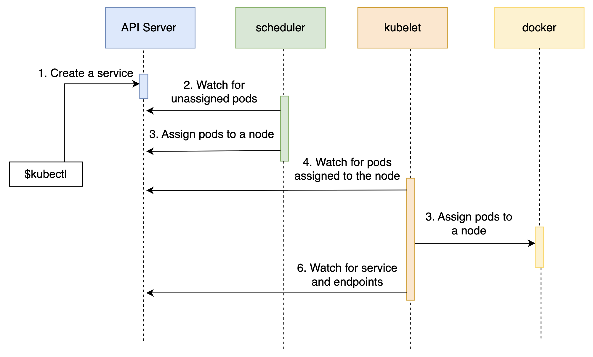
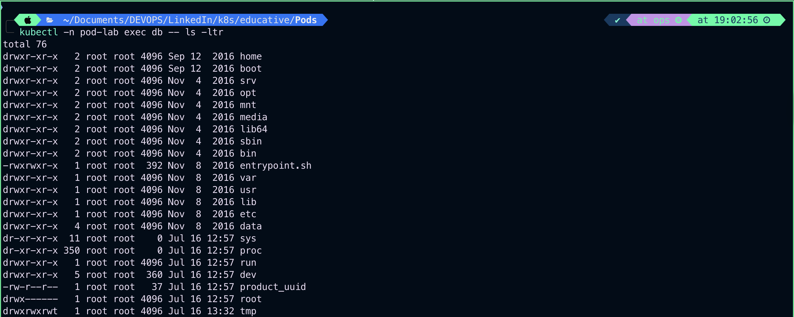

# Components and Stages Involved in Pod Scheduling

## Step-by-step Pod scheduling#

- Three major components are involved in the process:

  - `1. API server#`: The API server is the central component of a Kubernetes cluster, and it runs on the primary node.

  All other components interact with the API server and keep watch for changes. Most of the coordination in Kubernetes consists of a component writing to the API Server resource that another component is watching. The second component will then react to changes almost immediately.

  - `2. Scheduler#`: The scheduler is also running on the primary node. Its job is to watch for unassigned Pods and assign them to a node with available resources (CPU and memory) matching Pod requirements.
  - `3. Kubelet#`: Kubelet runs on each node. Its primary function is to make sure that assigned Pods are running on the node. It watches for any new Pod assignments for the node. If a Pod is assigned to the node that Kubelet is running on, it will pull the Pod definition and use it to create containers through Docker or any other supported container engine.

## Sequential breakdown of events

The sequence of events with the kubectl create -f db.yml command is as follows:

1. The Kubernetes client (kubectl) sends a request to the API server, requesting creation of a Pod defined in the db.yml file.
2. Since the scheduler is watching the API server for new events, it detects that there is an unassigned Pod.
3. The scheduler decides which node to assign the Pod to and sends that information to the API server.
4. Kubelet also checks the API server. It detects that the Pod was assigned to the node it is running on.
5. Kubelet sends a request to Docker requesting the creation of the containers that form the Pod. In our case, the Pod defines a single container based on the mongo image.
6. Finally, Kubelet sends a request to the API server, notifying it that the Pod is created successfully.



## Executing a new process#

```bash
kubectl -n pod-lab exec db -- ps aux
```

## 

```bash
kubectl -n pod-lab exec db -- ls -ltr
```



- We told Kubernetes that we’d like to execute a process inside the first container of the Pod db. Since our Pod defines only one container, this container and the first container are one and the same. The --container`(or`-c`) argument can be set to specify which container should be used. This is particularly useful when we’re running multiple containers in a Pod.
- Apart from using Pods as the reference, `kubectl exec` is almost the same as the `docker container exec` command. The significant difference is that `kubectl` allows us to execute a process in a container running in any node inside a cluster, while `docker container exec` is limited to containers running on a specific node.
- Instead of executing a new short-lived process inside a running container, we can enter into it. For example, we can make the execution interactive with `-i` (`stdin`) and `-t `(`terminal`) arguments and run shell inside a container.

```bash
kubectl exec -it <container-name> -- sh
```

```bash
kubectl -n pod-lab exec -it db -- sh
```


# Getting logs#

The command that outputs logs of the only container in the db Pod is as follows:

```bash
kubectl logs db
```

```bash
2025-07-16T12:57:53.868+0000 I CONTROL  [initandlisten] MongoDB starting : pid=1 port=27017 dbpath=/data/db 64-bit host=db
2025-07-16T12:57:53.870+0000 I CONTROL  [initandlisten] db version v3.3.15
2025-07-16T12:57:53.871+0000 I CONTROL  [initandlisten] git version: 520f5571d039b57cf9c319b49654909828971073
2025-07-16T12:57:53.871+0000 I CONTROL  [initandlisten] OpenSSL version: OpenSSL 1.0.1t  3 May 2016
2025-07-16T12:57:53.871+0000 I CONTROL  [initandlisten] allocator: tcmalloc
2025-07-16T12:57:53.871+0000 I CONTROL  [initandlisten] modules: none
2025-07-16T12:57:53.871+0000 I CONTROL  [initandlisten] build environment:
2025-07-16T12:57:53.871+0000 I CONTROL  [initandlisten]     distmod: debian81
2025-07-16T12:57:53.871+0000 I CONTROL  [initandlisten]     distarch: x86_64
2025-07-16T12:57:53.871+0000 I CONTROL  [initandlisten]     target_arch: x86_64
2025-07-16T12:57:53.871+0000 I CONTROL  [initandlisten] options: { net: { http: { RESTInterfaceEnabled: true, enabled: true } } }
2025-07-16T12:57:53.876+0000 I STORAGE  [initandlisten]
2025-07-16T12:57:53.876+0000 I STORAGE  [initandlisten] ** WARNING: Using the XFS filesystem is strongly recommended with the WiredTiger storage engine
2025-07-16T12:57:53.876+0000 I STORAGE  [initandlisten] See http://dochub.mongodb.org/core/prodnotes-filesystem
2025-07-16T12:57:53.877+0000 I STORAGE  [initandlisten] wiredtiger_open config: create,cache_size=1447M,session_max=20000,eviction=(threads_max=4),config_base=false,statistics=(fast),log=(enabled=true,archive=true,path=journal,compressor=snappy),file_manager=(close_idle_time=100000),checkpoint=(wait=60,log_size=2GB),statistics_log=(wait=0),
2025-07-16T12:57:53.954+0000 I CONTROL  [initandlisten]
2025-07-16T12:57:53.954+0000 I CONTROL  [initandlisten] ** NOTE: This is a development version (3.3.15) of MongoDB.
2025-07-16T12:57:53.954+0000 I CONTROL  [initandlisten] **       Not recommended for production.
2025-07-16T12:57:53.954+0000 I CONTROL  [initandlisten]
2025-07-16T12:57:53.954+0000 I CONTROL  [initandlisten] ** WARNING: Access control is not enabled for the database.
2025-07-16T12:57:53.954+0000 I CONTROL  [initandlisten] **          Read and write access to data and configuration is unrestricted.
2025-07-16T12:57:53.954+0000 I CONTROL  [initandlisten] ** WARNING: You are running this process as the root user, which is not recommended.
2025-07-16T12:57:53.954+0000 I CONTROL  [initandlisten]
2025-07-16T12:57:53.955+0000 I CONTROL  [initandlisten]
2025-07-16T12:57:53.956+0000 I CONTROL  [initandlisten] ** WARNING: /sys/kernel/mm/transparent_hugepage/enabled is 'always'.
2025-07-16T12:57:53.956+0000 I CONTROL  [initandlisten] **        We suggest setting it to 'never'
2025-07-16T12:57:53.956+0000 I CONTROL  [initandlisten]
2025-07-16T12:57:53.974+0000 I NETWORK  [websvr] admin web console waiting for connections on port 28017
2025-07-16T12:57:54.000+0000 I FTDC     [initandlisten] Initializing full-time diagnostic data capture with directory '/data/db/diagnostic.data'
2025-07-16T12:57:54.011+0000 I INDEX    [initandlisten] build index on: admin.system.version properties: { v: 2, key: { version: 1 }, name: "incompatible_with_version_32", ns: "admin.system.version" }
2025-07-16T12:57:54.011+0000 I INDEX    [initandlisten] 	 building index using bulk method
2025-07-16T12:57:54.021+0000 I INDEX    [initandlisten] build index done.  scanned 0 total records. 0 secs
2025-07-16T12:57:54.026+0000 I NETWORK  [thread1] waiting for connections on port 27017
2025-07-16T13:47:04.352+0000 I NETWORK  [thread1] connection accepted from 127.0.0.1:38168 #1 (1 connection now open)
2025-07-16T13:47:04.369+0000 I NETWORK  [conn1] received client metadata from 127.0.0.1:38168 conn1: { application: { name: "MongoDB Shell" }, driver: { name: "MongoDB Internal Client", version: "3.3.15" }, os: { type: "Linux", name: "PRETTY_NAME="Debian GNU/Linux 8 (jessie)"", architecture: "x86_64", version: "Kernel 6.10.14-linuxkit" } }
2025-07-16T13:47:04.456+0000 I -        [conn1] end connection 127.0.0.1:38168 (1 connection now open)
```

- With the -f (or --follow), we can follow the logs in real-time. Just as with the exec subcommand, if a Pod defines multiple containers, we can specify which one to use with the -c argument.

```bash
kubectl logs -f -c <container-name>
```

# Deleting the Pod#

Finally, we can delete a Pod if we don’t need it anymore:

```bash
kubectl delete -f db.yml

kubectl get pods
```

We remove the Pods defined in db.yml and retrieve the list of all the Pods in the cluster. The output of the latter command is as follows:

```bash
NAME READY STATUS      RESTARTS AGE
db   0/1   Terminating 1        3h
```

The number of ready containers dropped to 0, and the status of the “db” Pod is “Terminating”.

- When we send the instruction to delete a Pod, Kubernetes tries to terminate it gracefully.

  - The first thing it does is to send the `TERM` (terminate) signal to all the main processes inside the containers that form the Pod.

- From there on, Kubernetes gives each container a period of `thirty seconds` so that the processes in those containers can shut down properly.
- Once the grace period expires, the KILL signal is sent to terminate all the main processes forcefully and, with them, all the containers. The default grace period can be changed through the `gracePeriodSeconds` value in the YAML definition or `--grace-period` argument of the kubectl delete command.
- If we repeat the get pods command thirty seconds after we issued the delete instruction, the Pod should be removed from the system.

---

# Commands Userd till now

```bash
kubectl describe -f db.yml

kubectl exec db -- ps aux

kubectl exec -it db -- sh

echo 'db.stats()' | mongo localhost:27017/test

exit

kubectl logs db

kubectl exec db --  pkill mongod

kubectl get pods

kubectl delete -f db.yml

kubectl get pods
```

---

# Running Multiple Containers in a Single Pod

## Anatomy of a Pod#

- Pods are designed to run multiple cooperative processes that should act as a cohesive unit. Those processes are wrapped in containers.

- All the containers that form a Pod are running on the same machine. A Pod cannot be split across multiple nodes.

- All the processes (containers) inside a Pod share the same set of resources, and they can communicate with each other through localhost. One of those shared resources is storage.

- A volume (think of it as a directory with shareable data) defined in a Pod can be accessed by all the containers, therefore allowing them all to share the same data.

```bash
apiVersion: v1
kind: Pod
metadata:
  name: multi-container
  labels:
    app: go-demo
spec:
  containers:
    - name: db
      image: mongo:3.3
      ports:
        - containerPort: 27017
    - name: api-1
      image: vfarcic/go-demo-2
      env:
        - name: DB
          value: localhost
      ports:
        - containerPort: 8080
    - name: api-2
      image: vfarcic/go-demo-2
      env:
        - name: DB
          value: localhost
      ports:
        - containerPort: 8081

```

# Formatting the output

- Let’s say that we want to retrieve the names of the containers in a Pod. The first thing we’d have to do is get familiar with the Kubernetes API. We can do that by going through the [`Pod v1 core documentation`](https://kubernetes.io/docs/reference/generated/kubernetes-api/v1.24/#pod-v1-core). While reading the documentation will become mandatory sooner or later, we’ll use a simpler route and inspect the output from Kubernetes:

```bash
kubectl get -f multi_container_pod.yaml -o json
```

- The `get` command that filters the output and retrieves only the names of the containers is as follows:

```bash
kubectl get -f go-demo-2.yml \
    -o jsonpath="{.spec.containers[*].name}"
```

```bash
kubectl -n pod-lab get -f multi_container_pod.yaml -o jsonpath="{.spec.containers[*].name}"
```

`Output`:

```bash
kubectl -n pod-lab get -f multi_container_pod.yaml -o jsonpath="{.spec.containers[*].name}"
db api-1 api-2%
```

---

```bash
kubectl -n pod-lab get -f multi_container_pod.yaml -o jsonpath="{.spec.containers[*].image}"
```

`Output`:

```bash
kubectl -n pod-lab get -f multi_container_pod.yaml -o jsonpath="{.spec.containers[*].image}"
mongo:3.3 vfarcic/go-demo-2%
```

# Executing command inside the Pod

```bash
kubectl -n pod-lab exec -it -c api-1 multi-container -- ps
E0716 20:03:32.073382   66605 websocket.go:297] Unknown stream id 1, discarding message
                                                                                       PID   USER     TIME   COMMAND
    1 root       0:00 go-demo
   16 root       0:00 ps
```

```bash
kubectl -n pod-lab exec -it -c db multi-container -- ps
E0716 20:04:59.404846   66828 websocket.go:297] Unknown stream id 1, discarding message
                                                                                           PID TTY          TIME CMD
     36 pts/0    00:00:00 ps
```

---

# Command Used till now

```bash
kubectl create -f go-demo-2.yml

kubectl get -f go-demo-2.yml

kubectl get -f go-demo-2.yml -o json

kubectl get -f go-demo-2.yml -o jsonpath="{.spec.containers[*].name}"

kubectl exec -it -c db go-demo-2 -- ps aux

kubectl logs go-demo-2 -c db

kubectl delete -f go-demo-2.yml

```

## Multi-container pods#

There are scenarios when having multiple containers in a Pod is a good idea. However, they are very specific and, in most cases, are based on one container that acts as the main service and the rest that serve as side-cars.

Multi-container Pods are frequently used for:

- Continuous integration (CI)
- Continuous Delivery (CD)
- Continuous Deployment processes (CDP)

# Monitoring Health

```bash
vim go-demo-2.yaml
```

```bash
apiVersion: v1
kind: Pod
metadata:
  name: multi-container
  labels:
    app: go-demo
spec:
  containers:
    - name: db
      image: mongo:3.3
      ports:
        - containerPort: 27017
    - name: api-1
      image: vfarcic/go-demo-2
      env:
        - name: DB
          value: localhost
      ports:
        - containerPort: 8080
    - name: api-2
      image: vfarcic/go-demo-2
      env:
        - name: DB
          value: localhost
      ports:
        - containerPort: 8081

```

The above Docker image is designed to fail on the first sign of trouble. In cases like that, there is no need for any health checks. When things go wrong, the following things happen:

- The main process stops.
- The container hosting the main process stops as well.
- Kubernetes restarts the failed container.
  However, not all services are designed to fail fast. Even those services that are designed to fail might still benefit from additional health checks. For example, a back-end API can be up and running but, serves requests much slower than expected due to a memory leak. Such a situation might benefit from a health check that would verify whether the service responds within, for example, two seconds.

## Kubernetes probes#

To monitor health, we can exploit Kubernetes **liveness and readiness probes**.

### Liveness probe#

`livenessProbe` can be used to confirm whether a container should be running. If the probe fails, Kubernetes will terminate the container and apply a restart policy which defaults to `Always`.

```bash
vim go-demo-2-health.yaml
```

```bash
apiVersion: v1
kind: Pod
metadata:
  name: go-demo-2
  labels:
    type: stack
spec:
  containers:
  - name: db
    image: mongo:3.3
  - name: api
    image: vfarcic/go-demo-2
    env:
    - name: DB
      value: localhost
    livenessProbe:
      httpGet:
        path: /this/path/does/not/exist
        port: 8080
      initialDelaySeconds: 5
      timeoutSeconds: 2 # Defaults to 1
      periodSeconds: 5 # Defaults to 10
      failureThreshold: 1 # Defaults to 3
```

- `Lines 8–12`: Don’t get confused by seeing two containers in this Pod. These two should be defined in separate Pods. However, since that would require knowledge we are yet to obtain, and go-demo-2 doesn’t work without a database, we’ll have to stick with the example that specifies two containers. It won’t take long until we break it into pieces.

- `Lines 16–19`: The additional definition is inside the `livenessProbe`. We define that the action should be httpGet followed by the path and the port of the service. Since `/this/path/does/not/`exist is true to itself, the probe will fail. Therefore it shows us what happens when a container is unhealthy. The host is not specified since it defaults to the Pod IP.

- `Lines 20–23`: We declare that the first execution of the probe should be delayed by five seconds (`initialDelaySeconds`). The requests should timeout after two seconds (`timeoutSeconds`). We also declare that the process should be repeated every five seconds (`periodSeconds`), and (`failureThreshold`) define how many attempts it must try before giving up.

## Liveness probe in action#

Let's look at the probe in action:

```bash
kubectl create -f go-demo-2-health.yml
```

We create the Pod with the probe. Now we must wait until the probe fails a few times. A minute is more than enough. Once we’re done waiting, we can describe the Pod.

```bash
kubectl describe -f go-demo-2-health.yml
```

The bottom of the output contains events. They are as follows:

```bash
Events:
  Type     Reason     Age                From               Message
  ----     ------     ----               ----               -------
  Normal   Scheduled  70s                default-scheduler  Successfully assigned default/go-demo-2 to k3d-mycluster-server-0
  Normal   Pulling    69s                kubelet            Pulling image "mongo:3.3"
  Normal   Pulled     41s                kubelet            Successfully pulled image "mongo:3.3" in 28.738663826s
  Normal   Created    39s                kubelet            Created container db
  Normal   Started    39s                kubelet            Started container db
  Normal   Pulled     36s                kubelet            Successfully pulled image "vfarcic/go-demo-2" in 2.975792483s
  Normal   Pulled     29s                kubelet            Successfully pulled image "vfarcic/go-demo-2" in 387.506265ms
  Normal   Started    19s (x3 over 36s)  kubelet            Started container api
  Normal   Pulled     19s                kubelet            Successfully pulled image "vfarcic/go-demo-2" in 375.450308ms
  Warning  Unhealthy  10s (x3 over 30s)  kubelet            Liveness probe failed: HTTP probe failed with statuscode: 404
  Normal   Killing    10s (x3 over 30s)  kubelet            Container api failed liveness probe, will be restarted
  Normal   Pulling    10s (x4 over 39s)  kubelet            Pulling image "vfarcic/go-demo-2"
  Normal   Pulled     9s                 kubelet            Successfully pulled image "vfarcic/go-demo-2" in 375.064683ms
  Normal   Created    9s (x4 over 36s)   kubelet            Created container api
```

We can see that once the container started, the probe was executed and it failed. As a result, the container was terminated only to be created again. In the output above, we can see that the process was repeated three times (“x3 over …”).

- Please visit [`Probe v1 core`](https://kubernetes.io/docs/reference/generated/kubernetes-api/v1.24/#pod-v1-core) if you’d like to learn all the available options.

# Technical Quiz

1. What is the smallest unit running inside a Kubernetes cluster?
   > Ans: Pod
2. What is the better approach to run Pods?
   > Ans: Declarative
3. Which file types do we normally use to create Pods in a declarative way?
   > Ans: yml
4. When multiple containers are running inside a Pod, which argument can we use to specify a container?
   > Ans: `-c` or `--container`
5. Which Kubernetes component makes sure that all the assigned Pods are running?
   > Ans: kubelet
6. (Fill in the blank.) The frequent use case(s) for multi-container Pods is:**\_\_\_**.
   > Ans: continuous integration (`CI`), continuous delivery (`CD`), continuous deployment processes (`CDP`)
7. What are Kubernetes probes used for?
   > Ans: Monitoring the health of the services

---


