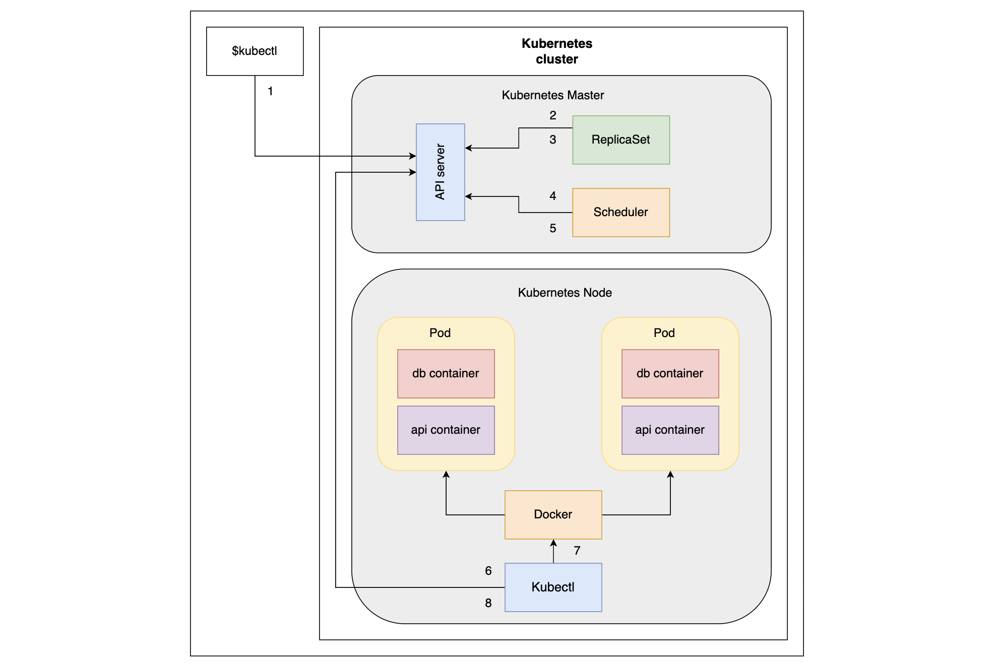

# Understanding ReplicaSets#

> Note: Most applications should be scalable fault tolerant. While Pods do not provide those features, ReplicaSets do.

- Previously, we learned that Pods are the smallest unit in Kubernetes. We also learned that Pods are not fault tolerant. If a Pod is created without a controller and subsequently destroyed, Kubernetes does nothing to remedy the problem.
- The first Controller we’ll explore is called `ReplicaSet`. Its primary function is to ensure that a specified number of replicas of a Pod match the Pod’s actual state (almost) all the time. This means that `ReplicaSets` make Pods scalable.
- We can think of ReplicaSets as a self-healing mechanism. As long as elementary conditions are met (e.g., enough memory and CPU), Pods associated with a ReplicaSet are guaranteed to run. They provide fault tolerance and high availability.
- If you’re familiar with Replication-Controllers, it is worth mentioning that the ReplicaSet is the next-generation ReplicationController. The only significant difference is that ReplicaSet has extended support for selectors. Everything else is the same. ReplicationController is considered deprecated, so we’ll focus only on ReplicaSet.
  > Note: `ReplicaSet`’s primary function is to ensure that the specified number of replicas of service are (almost) always running.

```bash
vim ReplicaSet.yaml
```

```bash
apiVersion: v1
kind: Namespace
metadata:
  name: replicaset
  labels:
    environment: test
---
apiVersion: apps/v1
kind: ReplicaSet
metadata:
  namespace: replicaset
  name: rs-example
spec:
  replicas: 2
  selector:
    matchLabels:
      type: backend
      db: mongoLabs

  template:
    metadata:
      labels:
        type: backend
        db: mongoLabs
        service: go-demo-2
        language: go
    spec:
      containers:
      - name: db
        image: mongo:3.3
      - name: api
        image: vfarcic/go-demo-2
        env:
        - name: DB
          value: localhost
        livenessProbe:
          httpGet:
            path: /demo/hello
            port: 8080

```

- Line 1: We specify that the apiVersion is apps/v1.

- `Lines 2–3`: The `kind` is `ReplicaSet` and `metadata` has the `name` key set to `rs-example`. We could have extended `ReplicaSet` metadata with `labels`. However, we’ve skipped that part since the labels only provide extra information. They do not affect the behavior of the ReplicaSet.
- Since we’ve already explored the above three fields, we won’t dwell on them a lot. However, we should note that there is a fourth section called spec and it is mandatory. Let’s look at it in more detail in the line-by-line explanation below:
- `Line 5–6`: The first field we define in the spec section is replicas. It sets the desired number of replicas of the Pod. In this case, the ReplicaSet ensures that two Pods should run concurrently. If we do not specify the value of the replicas, it defaults to 1.
- `Line 7`: The next `spec` section is the `selector`. We use it to select which Pods should be included in the ReplicaSet. It does not distinguish between the Pods created by a ReplicaSet or some other process. In other words, `ReplicaSets` and `Pods` are decoupled. If `Pods` that match the `selector` exist, `ReplicaSet` does nothing. If they don’t match, it creates as many Pods to match the value of the replicas field. Not only does the ReplicaSet create the Pods that are missing, it also monitors the cluster and ensures that the desired number of replicas is (almost) always running. In case there are already more running Pods with the matching selector, some will be terminated to match the number set in replicas.
- `Lines 8–10`: We use spec.selector.matchLabels to specify a few labels. They must match the labels defined in spec.template. In our case, ReplicaSet will look for Pods with `type`: db
  `vendor`: mongoLabs. If Pods with those `labels` do not already exist, it’ll create them using the `spec.template` section.
- `Lines 11–17`: The last section of the `spec` field is the `template`. It is the only required field in the `spec` and has the same schema as a Pod specification. At a minimum, the labels of the `spec.template.metadata.labels` section must match those specified in the `spec.selector.matchLabels`.
  We can set additional labels that will serve informational purposes only. ReplicaSet will make sure that the number of replicas matches the number of Pods with the same labels. In our case, we set `type` and `db` to the same values and add two additional ones (`service` and `language`). It might sound confusing that the `spec.template.spec.containers` field is mandatory, so let’s clear it out. `ReplicaSet` will look for Pods with matching labels created by other means. If we have already created a Pod with labels `type: backend` and `db: mongolabs` this ReplicaSet would find them and would not create a Pod defined in `spec.template`. The main purpose of that field is to ensure that the desired number of `replicas` is running. If they are created by other means, `ReplicaSet` will do nothing. Otherwise, it’ll create them using the information in `spec.template`.
- `Lines 18–23`: Finally, the spec.template.spec section contains the same containers definition

# Creating the ReplicaSet#

Let’s create the ReplicaSet and experience its advantages:

```bash
kubectl create -f ReplicaSets.yaml
namespace/replicaset created
replicaset.apps/rs-example created
```

```bash
kubectl get rs -n replicaset
NAME         DESIRED   CURRENT   READY   AGE
rs-example   2         2         1       15s
```

```bash
kubectl get pods -o wide -n replicaset
NAME               READY   STATUS              RESTARTS   AGE   IP            NODE                  NOMINATED NODE   READINESS GATES
rs-example-m2s58   0/2     ContainerCreating   0          32s   <none>        ops-cluster-worker    <none>           <none>
rs-example-t2dqm   2/2     Running             0          32s   10.244.2.10   ops-cluster-worker3   <none>           <none>

```

```bash
kubectl get pods -o wide -n replicaset
NAME               READY   STATUS    RESTARTS   AGE     IP            NODE                  NOMINATED NODE   READINESS GATES
rs-example-m2s58   2/2     Running   0          2m33s   10.244.0.2    ops-cluster-worker    <none>           <none>
rs-example-t2dqm   2/2     Running   0          2m33s   10.244.2.10   ops-cluster-worker3   <none>           <none>
```

## Instead of retrieving all the replicas in the cluster, we can retrieve those specified in the ReplicaSets.yml file.

```bash
kubectl get -f ReplicaSets.yaml
NAME                   STATUS   AGE
namespace/replicaset   Active   4m

NAME                         DESIRED   CURRENT   READY   AGE
replicaset.apps/rs-example   2         2         2       4m
```

The output should be the same because, in both cases, there is only one ReplicaSet running inside the cluster.
All the other `kubectl get` arguments we explored in the previous chapter also apply to ReplicaSets or, to be more precise, to all Kubernetes objects. The same is true for the kubectl `describe` command.

```bash
kubectl describe -f ReplicaSets.yaml
Name:         replicaset
Labels:       environment=test
              kubernetes.io/metadata.name=replicaset
Annotations:  <none>
Status:       Active

No resource quota.

No LimitRange resource.


Name:         rs-example
Namespace:    replicaset
Selector:     db=mongoLabs,type=backend
Labels:       <none>
Annotations:  <none>
Replicas:     2 current / 2 desired
Pods Status:  2 Running / 0 Waiting / 0 Succeeded / 0 Failed
Pod Template:
  Labels:  db=mongoLabs
           language=go
           service=go-demo-2
           type=backend
  Containers:
   db:
    Image:        mongo:3.3
    Port:         <none>
    Host Port:    <none>
    Environment:  <none>
    Mounts:       <none>
   api:
    Image:      vfarcic/go-demo-2
    Port:       <none>
    Host Port:  <none>
    Liveness:   http-get http://:8080/demo/hello delay=0s timeout=1s period=10s #success=1 #failure=3
    Environment:
      DB:          localhost
    Mounts:        <none>
  Volumes:         <none>
  Node-Selectors:  <none>
  Tolerations:     <none>
Events:
  Type    Reason            Age    From                   Message
  ----    ------            ----   ----                   -------
  Normal  SuccessfulCreate  5m56s  replicaset-controller  Created pod: rs-example-t2dqm
  Normal  SuccessfulCreate  5m56s  replicaset-controller  Created pod: rs-example-m2s58

```

Finally, if you are not yet convinced that the ReplicaSet created the missing Pods, we can list all those running in the cluster and confirm it.

```bash
kubectl get pods --show-labels -n replicaset
NAME               READY   STATUS    RESTARTS   AGE     LABELS
rs-example-m2s58   2/2     Running   0          9m13s   db=mongoLabs,language=go,service=go-demo-2,type=backend
rs-example-t2dqm   2/2     Running   0          9m13s   db=mongoLabs,language=go,service=go-demo-2,type=backend
```

To be on the safe side, we used the `--show-labels` argument to verify that the Pods in the cluster match those created by the ReplicaSet.


# Commands used till now

```bash
kubectl create -f ReplicaSets.yml

kubectl get rs -n replicaset

kubectl get -f ReplicaSets.yml -n replicaset

kubectl describe -f ReplicaSets.yml -n replicaset

kubectl get pods --show-labels -n replicaset
```

# Sequential Breakdown of the Process

## Step by step process#

The sequence of events that occur with the kubectl create -f ReplicaSets.yml command is as follows:

### 1. The Kubernetes client (kubectl) sends a request to the API server requesting the creation of a ReplicaSet defined in the ReplicaSets.yml file.

### 2. The controller is watching the API server for new events, and it detects that there is a new ReplicaSet object.

### 3. The controller creates two new Pod definitions because we have configured the replica value as 2 in ReplicaSets.yml file.

### 4. Because the scheduler is also watching the API server for new events, it detects that there are two unassigned Pods.

### 5. The scheduler decides which node to assign the Pod to and sends that information to the API server.

### 6. The kubelet is also watching the API server. It detects that the two Pods are assigned to the node it is running on.

### 7. The kubelet sends requests to Docker requesting the creation of the containers that form the Pod. In our case, the Pod defines two containers based on the mongo and the api image. So in total, four containers are created.

### Finally, the kubelet sends a request to the API server notifying it that the Pods are created successfully.


The sequence of events followed by the request to create a ReplicaSet

The sequence we described is useful when we want to understand everything that happened in the cluster from the moment we requested the creation of a new ReplicaSet. However, it might be too confusing, so we’ll try to explain the same process through a diagram that more closely represents the cluster.

The events followed by request to create a ReplicaSet

# Deleting ReplicaSets#

As you might have guessed, both the ReplicaSet and everything it created (the Pods) would disappear with the kubectl delete -f ReplicaSets.yaml command.

```bash
kubectl delete -f ReplicaSets.yaml
```

### We can, for example, remove the ReplicaSet we created while leaving the two Pods intact.

```bash
kubectl delete -f ReplicaSets.yaml --cascade=orphan
```

However, since ReplicaSets and Pods are loosely coupled objects with matching labels, we can remove one without deleting the other.


### ✅ Step-by-Step: Force Delete the replicaset Namespace

🔧 Step 1: Save the namespace definition

```bash
kubectl get namespace replicaset -o json > replicaset-ns.json
```

`✏️ Step 2: Edit the JSON file`

```bash
vim replicaset-ns.json

```

`Find the "finalizers" section (under .spec) like this`:

```bash
"spec": {
  "finalizers": [
    "kubernetes"
  ]
}
```

`Replace it with`:

```bash
"spec": {
  "finalizers": []
}
```

Then save and exit.
🚨 Step 3: Force the deletion via Kubernetes API

```bash
kubectl replace --raw "/api/v1/namespaces/replicaset/finalize" -f replicaset-ns.json

```

### ✅ This will immediately remove the namespace, even if it has dangling resources or finalizers.

### 🔁 Step 4: Confirm deletion

```bash
kubectl get ns

```

```bash
kubectl replace --raw "/api/v1/namespaces/replicaset/finalize" -f replicaset-ns-1.json
```

```bash
{"kind":"Namespace","apiVersion":"v1","metadata":{"name":"replicaset","uid":"c31e9f6e-6484-4203-be7e-db415c6a815a","resourceVersion":"739892","creationTimestamp":"2025-07-17T06:24:03Z","deletionTimestamp":"2025-07-17T06:28:28Z","labels":{"environment":"test","kubernetes.io/metadata.name":"replicaset"},"annotations":{"kubectl.kubernetes.io/last-applied-configuration":"{\"apiVersion\":\"v1\",\"kind\":\"Namespace\",\"metadata\":{\"annotations\":{},\"labels\":{\"environment\":\"test\"},\"name\":\"replicaset\"}}\n"},"managedFields":[{"manager":"kubectl-client-side-apply","operation":"Update","apiVersion":"v1","time":"2025-07-17T06:24:03Z","fieldsType":"FieldsV1","fieldsV1":{"f:metadata":{"f:annotations":{".":{},"f:kubectl.kubernetes.io/last-applied-configuration":{}},"f:labels":{".":{},"f:environment":{},"f:kubernetes.io/metadata.name":{}}}}},{"manager":"kube-controller-manager","operation":"Update","apiVersion":"v1","time":"2025-07-17T06:28:34Z","fieldsType":"FieldsV1","fieldsV1":{"f:status":{"f:conditions":{".":{},"k:{\"type\":\"NamespaceContentRemaining\"}":{".":{},"f:lastTransitionTime":{},"f:message":{},"f:reason":{},"f:status":{},"f:type":{}},"k:{\"type\":\"NamespaceDeletionContentFailure\"}":{".":{},"f:lastTransitionTime":{},"f:message":{},"f:reason":{},"f:status":{},"f:type":{}},"k:{\"type\":\"NamespaceDeletionDiscoveryFailure\"}":{".":{},"f:lastTransitionTime":{},"f:message":{},"f:reason":{},"f:status":{},"f:type":{}},"k:{\"type\":\"NamespaceDeletionGroupVersionParsingFailure\"}":{".":{},"f:lastTransitionTime":{},"f:message":{},"f:reason":{},"f:status":{},"f:type":{}},"k:{\"type\":\"NamespaceFinalizersRemaining\"}":{".":{},"f:lastTransitionTime":{},"f:message":{},"f:reason":{},"f:status":{},"f:type":{}}}}},"subresource":"status"}]},"spec":{},"status":{"phase":"Terminating","conditions":[{"type":"NamespaceDeletionDiscoveryFailure","status":"True","lastTransitionTime":"2025-07-17T06:28:33Z","reason":"DiscoveryFailed","message":"Discovery failed for some groups, 1 failing: unable to retrieve the complete list of server APIs: metrics.k8s.io/v1beta1: stale GroupVersion discovery: metrics.k8s.io/v1beta1"},{"type":"NamespaceDeletionGroupVersionParsingFailure","status":"False","lastTransitionTime":"2025-07-17T06:28:33Z","reason":"ParsedGroupVersions","message":"All legacy kube types successfully parsed"},{"type":"NamespaceDeletionContentFailure","status":"False","lastTransitionTime":"2025-07-17T06:28:34Z","reason":"ContentDeleted","message":"All content successfully deleted, may be waiting on finalization"},{"type":"NamespaceContentRemaining","status":"False","lastTransitionTime":"2025-07-17T06:28:33Z","reason":"ContentRemoved","message":"All content successfully removed"},{"type":"NamespaceFinalizersRemaining","status":"False","lastTransitionTime":"2025-07-17T06:28:33Z","reason":"ContentHasNoFinalizers","message":"All content-preserving finalizers finished"}]}}
```

- We use the --cascade=orphan argument to prevent Kubernetes from removing all the downstream objects. As a result, we get the confirmation "ReplicaSets.yaml" deleted.
- The two Pods created by the ReplicaSet are indeed still running in the cluster even though we removed the ReplicaSet.
- The Pods that are currently running in the cluster do not have any relation with the ReplicaSet we created earlier. We deleted the ReplicaSet, and the Pods are still there.
- Knowing that the ReplicaSet uses labels to decide whether the desired number of Pods is already running in the cluster should lead us to the conclusion that if we create the same ReplicaSet again, it should reuse the two Pods that are running in the cluster. Let’s confirm this.

## Reusing the same Pods#

In addition to the k`ubectl create` command we executed previously, we’ll also add the `--save-config` argument. It’ll save the configuration of the ReplicaSet and, allow us to perform a few additional operations later on. We’ll get to them shortly. For now, the important thing is that we create the same ReplicaSet we had before.

```bash
kubectl create -f ReplicaSet.yaml \
    --save-config
```

Create ReplicaSets.yaml ReplicaSet while saving configurations

# Self-healing in action#

We have already discussed that ReplicsSets have the self-healing property. Let’s test this property by making a few changes to our system.

### Destroying a Pod#

Let’s see what happens when a Pod is destroyed:

```bash
POD_NAME=$(kubectl get pods -o name \
   | tail -1)
kubectl delete $POD_NAME
```

We retrieved all the Pods and used -o name to retrieve only their names. The result was piped to tail -1 so that only one of the names is output. The result is stored in the environment variable POD_NAME. The latter command used that variable to remove the Pod as a simulation of a failure.

```bash
POD_NAME=$(kubectl -n replicaset get pods -o name \
   | tail -1)
kubectl delete $POD_NAME -n replicaset
pod "rs-example-xgm4q" deleted
```

```bash
 kubectl get pods -n replicaset
NAME               READY   STATUS              RESTARTS   AGE
rs-example-4rjnm   0/2     ContainerCreating   0          4s
rs-example-5kwqk   2/2     Running             0          11m
rs-example-m62d2   2/2     Running             0          2m25s
rs-example-qjg4g   2/2     Running             0          2m25s
```

We can see that the Pod we deleted is `Terminating`. However, since we have a ReplicaSet with `replicas` set to 4, as soon as it discovers that the number of Pods has dropped to 3, it creates a new one. We have just witnessed self-healing in action.

> Note: We get the final output after the system goes through several stages, so your output might differ from the above.

- As long as there are enough available resources in the cluster, ReplicaSets will ensure that the specified number of Pod replicas are (almost) always up and running.

# Removing a label#

Let’s see what happens if we remove one of the Pod labels that ReplicaSet uses in its selector:

```bash
POD_NAME=$(kubectl -n replicaset get pods -o name \
    | tail -1)
kubectl -n replicaset label $POD_NAME db-
kubectl -n replicaset describe $POD_NAME
```

`Output`:

```bash
pod/rs-example-t887d unlabeled
Name:             rs-example-t887d
Namespace:        replicaset
Priority:         0
Service Account:  default
Node:             ops-cluster-worker3/172.19.0.7
Start Time:       Thu, 17 Jul 2025 15:01:44 +0530
Labels:           language=go
                  service=go-demo-2
                  type=backend
Annotations:      <none>
Status:           Running
IP:               10.244.2.15
IPs:
  IP:  10.244.2.15
Containers:
  db:
    Container ID:   containerd://957e048ab4eb7f9138425aebee61e85e8df02b4074b8b40e294d670be4bd8973
    Image:          mongo:3.3
    Image ID:       docker.io/library/mongo@sha256:08a90c3d7c40aca81f234f0b2aaeed0254054b1c6705087b10da1c1901d07b5d
    Port:           <none>
    Host Port:      <none>
    State:          Running
      Started:      Thu, 17 Jul 2025 15:01:44 +0530
    Ready:          True
    Restart Count:  0
    Environment:    <none>
    Mounts:
      /var/run/secrets/kubernetes.io/serviceaccount from kube-api-access-wdvw2 (ro)
  api:
    Container ID:   containerd://5ed7172921da7a1c3f34c62dd346e259ab914b6288bc6f89e2a10669f23c7477
    Image:          vfarcic/go-demo-2
    Image ID:       docker.io/vfarcic/go-demo-2@sha256:4af87aa5e69f4f18aa2204abb054845d525d9512f464811d58d6766f5a6ab1a3
    Port:           <none>
    Host Port:      <none>
    State:          Running
      Started:      Thu, 17 Jul 2025 15:01:48 +0530
    Ready:          True
    Restart Count:  0
    Liveness:       http-get http://:8080/demo/hello delay=0s timeout=1s period=10s #success=1 #failure=3
    Environment:
      DB:  localhost
    Mounts:
      /var/run/secrets/kubernetes.io/serviceaccount from kube-api-access-wdvw2 (ro)
Conditions:
  Type                        Status
  PodReadyToStartContainers   True
  Initialized                 True
  Ready                       True
  ContainersReady             True
  PodScheduled                True
Volumes:
  kube-api-access-wdvw2:
    Type:                    Projected (a volume that contains injected data from multiple sources)
    TokenExpirationSeconds:  3607
    ConfigMapName:           kube-root-ca.crt
    Optional:                false
    DownwardAPI:             true
QoS Class:                   BestEffort
Node-Selectors:              <none>
Tolerations:                 node.kubernetes.io/not-ready:NoExecute op=Exists for 300s
                             node.kubernetes.io/unreachable:NoExecute op=Exists for 300s
Events:
  Type    Reason     Age   From               Message
  ----    ------     ----  ----               -------
  Normal  Scheduled  15s   default-scheduler  Successfully assigned replicaset/rs-example-t887d to ops-cluster-worker3
  Normal  Pulled     15s   kubelet            Container image "mongo:3.3" already present on machine
  Normal  Created    15s   kubelet            Created container: db
  Normal  Started    15s   kubelet            Started container db
  Normal  Pulling    15s   kubelet            Pulling image "vfarcic/go-demo-2"
  Normal  Pulled     11s   kubelet            Successfully pulled image "vfarcic/go-demo-2" in 3.538s (3.538s including waiting). Image size: 9656107 bytes.
  Normal  Created    11s   kubelet            Created container: api
  Normal  Started    11s   kubelet            Started container api
```

---

# Used Command till now

```bash
kubectl delete -f go-demo-2.yml --cascade=orphan

kubectl get rs

kubectl get pods

kubectl create -f go-demo-2.yml --save-config

kubectl get pods

kubectl apply -f go-demo-2-scaled.yml

kubectl get pods

POD_NAME=$(kubectl get pods -o name  | tail -1) |  kubectl delete $POD_NAME

kubectl get pods

POD_NAME=$(kubectl get pods -o name \
    | tail -1)

kubectl label $POD_NAME service-

kubectl describe $POD_NAME

kubectl get pods --show-labels

kubectl label $POD_NAME service=go-demo-2

kubectl get pods --show-labels

k3d cluster delete mycluster --all

```

# Technical Quiz

## 1. (True or False) ReplicaSets are used to scale Pods.

> Ans: True

## 2. (Fill in the blank) When compared with the replication Controllers, ReplicaSets have an extended support for \***\*\_\*\***?

> Ans: selectors

## 3. Which field is mandatory when defining a Kubernetes object?

> Ans: apiVersion , kind, metadata

## 4. Which argument is used to prevent Kubernetes from removing the downstream objects?

> Ans: --cascade=false
> `Example`:

```bash
kubectl -n replicaset delete rs/rs-example  --cascade=false
warning: --cascade=false is deprecated (boolean value) and can be replaced with --cascade=orphan.
replicaset.apps "rs-example" deleted
```

```bash
kubectl get rs -n replicaset
No resources found in replicaset namespace.
```

```bash
kubectl get pods -n replicaset
NAME               READY   STATUS    RESTARTS   AGE
rs-example-4rjnm   2/2     Running   0          20m
rs-example-5kwqk   2/2     Running   0          32m
rs-example-js7lc   2/2     Running   0          15m
rs-example-m62d2   2/2     Running   0          22m
rs-example-plxwg   2/2     Running   0          19m
rs-example-t887d   2/2     Running   0          15m
```


## 5. What is the key property of ReplicaSets?

> Ans: Self-healing

## 6. (Fill in the blank) ReplicaSets make sure that\***\*\_\_\_\_\*\***.

> Ans: the desired number of Pods are running

# Summary#

- The good news is that ReplicaSets are relatively straightforward. They provide a guarantee that the specified number of replicas of a Pod will be running in the system as long as there are available resources. That’s their primary and, arguably, only purpose.

- The bad news is that ReplicaSets are rarely used independently. We will almost never create a ReplicaSet directly just as we do not create Pods. Instead, we tend to create ReplicaSets through Deployments. In other words, we use ReplicaSets to create and control Pods, and Deployments to create ReplicaSets (and a few other things). We’ll get to Deployments soon.
  > `Note`: If you’d like to know more about ReplicaSets, please explore the ReplicaSet v1 apps API documentation.
  > 
