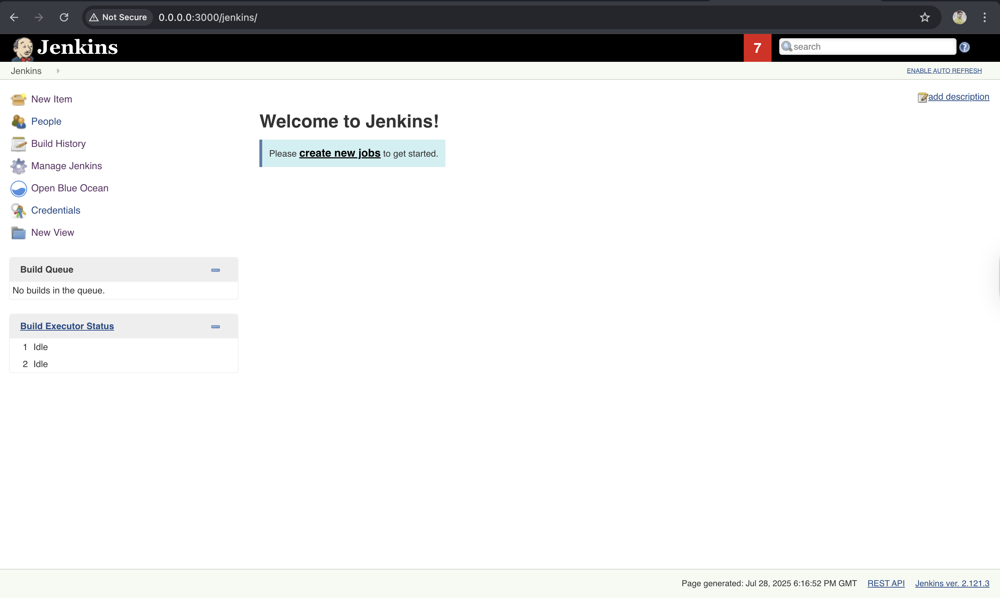
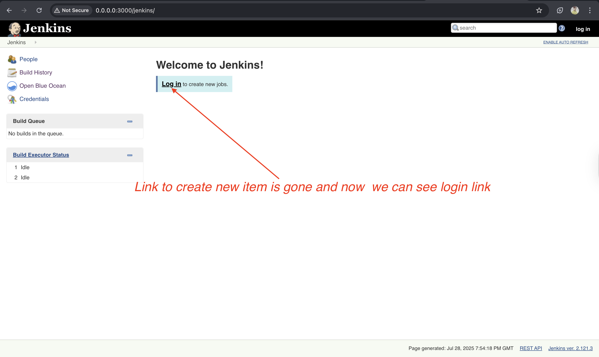
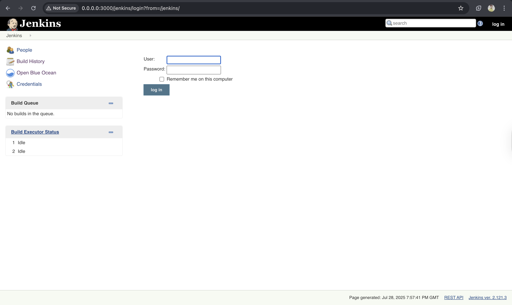
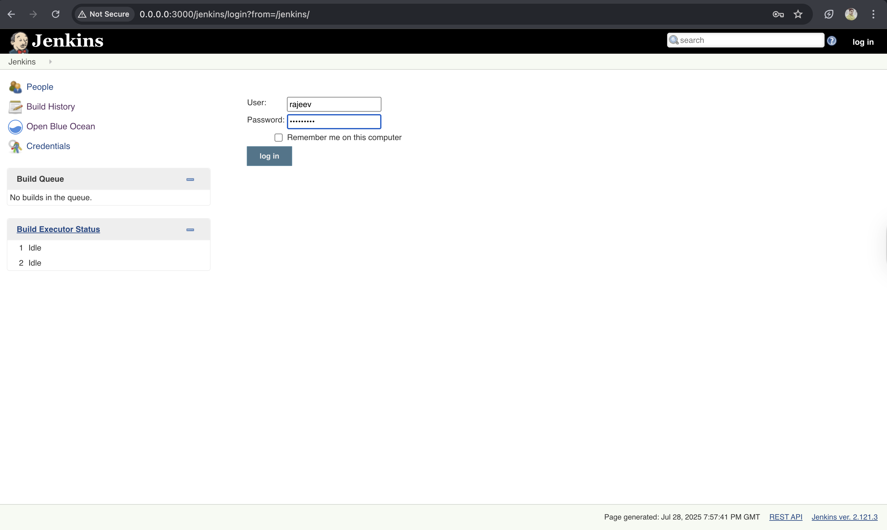
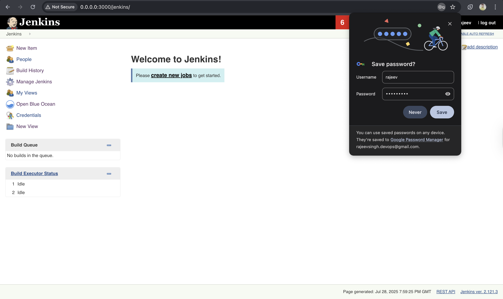
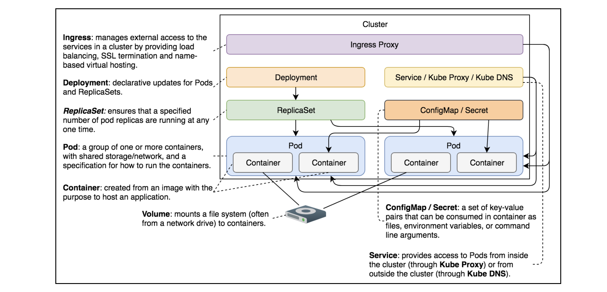

# Getting Started with Secrets

Learn about Kubernetes Secrets.

# Understanding Secrets#

> `Note`: We cannot treat all information equally. Sensitive data needs to be handled with additional care. Kubernetes provides an additional level of protection through Secrets.

- A **Secret** is a relatively small amount of sensitive data. Some of the typical candidates for Secrets would be passwords, tokens, and SSH keys.
- Kubernetes Secrets are very similar to ConfigMaps. If you compare the differences in the syntax, you’ll notice that there are only a few (if any). Conceptually, ConfigMaps and Secrets are, more or less, the same. If you are familiar with ConfigMaps, you should have no trouble applying that knowledge to Secrets.
  > `Note`: We have already used Secrets without even knowing. Every Pod we created so far had a Secret mounted automatically by the system.

We’ll start by exploring auto-generated Secrets and proceed to produce some ourselves.

---

---

# Exploring Built-In Secrets

We’ll create the same Jenkins objects that we defined earlier.

---

## Creating Jenkins objects#

We’ll create the same Jenkins objects we defined earlier.

```bash
vim jenkins-unprotected.yml
```

```yml
apiVersion: networking.k8s.io/v1
kind: Ingress
metadata:
  name: jenkins
  annotations:
    kubernetes.io/ingress.class: "nginx"
    ingress.kubernetes.io/ssl-redirect: "false"
    nginx.ingress.kubernetes.io/ssl-redirect: "false"
spec:
  rules:
    - http:
        paths:
          - path: /jenkins
            pathType: ImplementationSpecific
            backend:
              service:
                name: jenkins
                port:
                  number: 8080

---
apiVersion: apps/v1
kind: Deployment
metadata:
  name: jenkins
spec:
  selector:
    matchLabels:
      type: master
      service: jenkins
  strategy:
    type: Recreate
  template:
    metadata:
      labels:
        type: master
        service: jenkins
    spec:
      containers:
        - name: jenkins
          image: vfarcic/jenkins
          env:
            - name: JENKINS_OPTS
              value: --prefix=/jenkins
          volumeMounts:
            - mountPath: /var/jenkins_home
              name: jenkins-home
      volumes:
        - emptyDir: {}
          name: jenkins-home

---
apiVersion: v1
kind: Service
metadata:
  name: jenkins
spec:
  ports:
    - port: 8080
  selector:
    type: master
    service: jenkins
```

```bash
kubectl create \
    -f jenkins-unprotected.yml \
    --record --save-config

kubectl rollout status deploy jenkins
```

The output is as follows:

```bash
Warning: annotation "kubernetes.io/ingress.class" is deprecated, please use 'spec.ingressClassName' instead
ingress.networking.k8s.io/jenkins created
deployment.apps/jenkins created
service/jenkins created

deployment "jenkins" successfully rolled out
```

- We create Ingress, Deployment, and Service objects. We also execute the `kubectl rollout status` command that will tell us when the deployment is finished, which may take some time.
- The `jenkins-unprotected.yml` definition does not use any new feature, so we won’t waste time going through the YAML file. Instead, we’ll open Jenkins UI in a browser.

```bash
kubectl port-forward service/jenkins 3000:8080 --address 0.0.0.0
#Open the link beside the run button in the playground below
```



- Upon closer inspection, you’ll notice that there is no login button. Jenkins is currently unprotected. The image does allow the option to define an initial administrative username and password.
- If the files `/etc/secrets/jenkins-user` and `/etc/secrets/jenkins-pass` are present, the `init` script will read them and use the content inside those files to define the `username` and the `password`.
- Since we’re already familiar with ConfigMaps, we could use them to generate those files. However, since the user and the password should be better protected than other configuration entries, we’ll switch to Secrets.
- If you’re interested in details, please explore the [`jenkins/Dockerfile`](https://github.com/vfarcic/docker-flow-stacks/blob/master/jenkins/Dockerfile) section from the [`vfarcic/docker-flow-stack`](https://github.com/vfarcic/docker-flow-stacks) repository. The important part is that it expects `/etc/secrets/jenkins-user` and `/etc/secrets/jenkins-pass` files. If we can provide them in a relatively secure manner, our Jenkins will be (more) secure by default.

# The Built-in Secrets#

We’ll start by checking whether we already have some Secrets in the cluster:

```bash
kubectl get secrets

# OR
kubectl get secrets -A
```

I have not got any output, let's explore it:

### 🧠 Why the Secret is not visible via kubectl get secrets?

- Starting from Kubernetes v1.24, ServiceAccount token Secrets are not automatically created as separate Secret objects unless explicitly needed.
- Instead, the token is projected directly into the pod using the new `ProjectedServiceAccountToken` mechanism.
  > 🔒 So while the token exists inside the pod, it is not stored as a standalone Secret in the cluster (unless requested by a controller or manually created).

---

## 🔍 To verify built-in secrets inside the Jenkins pod:

### 1. 1. Find the Jenkins pod name:

```bash
kubectl get pods
```

### 2. Exec into the pod and check the default token path

```bash
kubectl exec -it pod/jenkins-74dd77dd66-x9l8m -- /bin/sh
```

Then inside the pod:

```bash
ls /var/run/secrets/kubernetes.io/serviceaccount/
```

The output is as follows:

```bash
ca.crt	namespace  token
```

```bash
kubectl exec -it pod/jenkins-74dd77dd66-x9l8m -- cat /var/run/secrets/kubernetes.io/serviceaccount/token
```

The output is as follows:

```bash
eyJhbGciOiJSUzI1NiIsImtpZCI6Il91MjdTSTJtMm9ZSXpkcGFnUDVrZUpWRlcyQU9RZDY2T2xSNkdlVUdlQ0UifQ.eyJhdWQiOlsiaHR0cHM6Ly9rdWJlcm5ldGVzLmRlZmF1bHQuc3ZjLmNsdXN0ZXIubG9jYWwiXSwiZXhwIjoxNzg1MjYyMzk0LCJpYXQiOjE3NTM3MjYzOTQsImlzcyI6Imh0dHBzOi8va3ViZXJuZXRlcy5kZWZhdWx0LnN2Yy5jbHVzdGVyLmxvY2FsIiwianRpIjoiZDc1YzJlMjUtNDc1Yi00MzRhLTlhMTEtNjQ4MGNhMDBjNDY0Iiwia3ViZXJuZXRlcy5pbyI6eyJuYW1lc3BhY2UiOiJkZWZhdWx0Iiwibm9kZSI6eyJuYW1lIjoibXljbHVzdGVyLXdvcmtlcjIiLCJ1aWQiOiIyOGI2NTE3OS00ZjJhLTRjYTQtYjE5Ni0wZjcxNDhlZDFiYTcifSwicG9kIjp7Im5hbWUiOiJqZW5raW5zLTc0ZGQ3N2RkNjYteDlsOG0iLCJ1aWQiOiI2YWY5NmQwMi1jMDJmLTRjOGUtOTU2YS1mMGVhYTk5NTIwMWEifSwic2VydmljZWFjY291bnQiOnsibmFtZSI6ImRlZmF1bHQiLCJ1aWQiOiJiNzBlY2IyZC02NDgwLTQ1ODItOWRmNy04MTQ3MjQ5MzI0MzYifSwid2FybmFmdGVyIjoxNzUzNzMwMDAxfSwibmJmIjoxNzUzNzI2Mzk0LCJzdWIiOiJzeXN0ZW06c2VydmljZWFjY291bnQ6ZGVmYXVsdDpkZWZhdWx0In0.JPqQNhlwly075LN7Niaw1Fp86hHnRctEJf2o4guhqvMRdSF_4bPAJwOLRi5UujbFuFSqfW84K9EpIB5uaZyl49_yOR8_Zdh3jU-oNZ1D_5w5Ch6Xnde7T0zyYkqQEHklL-LHr4UPWgJFI7PSgr1HnDHMG5iiaBZ_e-LKOWJhXlyuR_2K--VIfl_znnuVZTrTZhTTk3t0RcAo0EstE9jfpXICU8MvceTeOYps6thfcBxkw-lHDh2SsnifjJFwivmeT_xi4kahrTXRXkz6kK45Io7qsUgIb6hyK3tSGL-G2C-jspWMY2Ox4ecnx4fXFVbkwtkWInF4MxRUB5IotSdw%
```

Similarly check the namespace and CA cert:

```bash
kubectl exec -it jenkins-74dd77dd66-x9l8m -- cat /var/run/secrets/kubernetes.io/serviceaccount/namespace
kubectl exec -it jenkins-74dd77dd66-x9l8m -- cat /var/run/secrets/kubernetes.io/serviceaccount/ca.crt

```

This confirms that the **ServiceAccount token** is mounted.

## 🔐 To check which Secret Kubernetes created for this token:

Every pod is associated with a ServiceAccount (default is default).

### 3. Find the Secret used by the default ServiceAccount:

```bash
kubectl get serviceaccount default -o yaml
```

### 4. Check the Secret details:

```bbash
kubectl get secret default-token-xxxxx -o yaml
```

---

Moreover, Kubernetes automatically modifies the Pods to use this Secret. Unless we tweak Service Accounts, every Pod we create will have this Secret. Let’s confirm if that is indeed true:

```bash
kubectl describe pods
```

The output is as follows:

```bash
Name:             jenkins-74dd77dd66-x9l8m
Namespace:        default
Priority:         0
Service Account:  default
Node:             mycluster-worker2/172.19.0.4
Start Time:       Mon, 28 Jul 2025 23:43:13 +0530
Labels:           pod-template-hash=74dd77dd66
                  service=jenkins
                  type=master
Annotations:      <none>
Status:           Running
IP:               10.244.2.13
IPs:
  IP:           10.244.2.13
Controlled By:  ReplicaSet/jenkins-74dd77dd66
Containers:
  jenkins:
    Container ID:   containerd://2cdb366bc29402ebc8e19904952195e99c52a17d5d866b49d6914c56cb9d9503
    Image:          vfarcic/jenkins
    Image ID:       docker.io/vfarcic/jenkins@sha256:164b1beb4f25b8cb265bd170fa1c1badc79b3a61a652222e6a3c4ecc3a2af3af
    Port:           <none>
    Host Port:      <none>
    State:          Running
      Started:      Mon, 28 Jul 2025 23:43:17 +0530
    Ready:          True
    Restart Count:  0
    Environment:
      JENKINS_OPTS:  --prefix=/jenkins
    Mounts:
      /var/jenkins_home from jenkins-home (rw)
      /var/run/secrets/kubernetes.io/serviceaccount from kube-api-access-9qfj6 (ro)
Conditions:
  Type                        Status
  PodReadyToStartContainers   True
  Initialized                 True
  Ready                       True
  ContainersReady             True
  PodScheduled                True
Volumes:
  jenkins-home:
    Type:       EmptyDir (a temporary directory that shares a pod's lifetime)
    Medium:
    SizeLimit:  <unset>
  kube-api-access-9qfj6:
    Type:                    Projected (a volume that contains injected data from multiple sources)
    TokenExpirationSeconds:  3607
    ConfigMapName:           kube-root-ca.crt
    Optional:                false
    DownwardAPI:             true
QoS Class:                   BestEffort
Node-Selectors:              <none>
Tolerations:                 node.kubernetes.io/not-ready:NoExecute op=Exists for 300s
                             node.kubernetes.io/unreachable:NoExecute op=Exists for 300s
Events:
  Type    Reason     Age   From               Message
  ----    ------     ----  ----               -------
  Normal  Scheduled  35m   default-scheduler  Successfully assigned default/jenkins-74dd77dd66-x9l8m to mycluster-worker2
  Normal  Pulling    35m   kubelet            Pulling image "vfarcic/jenkins"
  Normal  Pulled     35m   kubelet            Successfully pulled image "vfarcic/jenkins" in 2.71s (2.71s including waiting). Image size: 337292688 bytes.
  Normal  Created    35m   kubelet            Created container: jenkins
  Normal  Started    35m   kubelet            Started container jenkins
```

We can see that two volumes are mounted. The first one (`/var/jenkins_home`) was defined by us. It’s the same mount volume we used in the previous chapter, and it is meant to preserve Jenkins’ state by mounting its home directory.

- The second mount is the more interesting one. We can see that it references the auto-generated Secret `kube-api-access-9qfj6 (ro)` and mounts it as `/var/run/secrets/kubernetes.io/serviceaccount`. Let’s look at that directory below:
- By auto-mounting that Secret, we get three files. They are required if we’d like to access the API server from within the containers. The `ca.crt` is the certificate, the `namespace` contains the namespace the Pod is running in, and the last one is the `token` we need to establish communication with the API.

```bash
kubectl exec -it pod/jenkins-74dd77dd66-x9l8m -- ls /var/run/secrets/kubernetes.io/serviceaccount/
```

The output is as follows:

```bash
ca.crt	namespace  token
```

- We won’t go into examples that prove those files can be used to access the API server securely. Just remember that if you ever need to do that, Kubernetes has you covered through that auto-generated Secret.
- Let’s get back to the task at hand. We want to make Jenkins more secure by providing it with an initial username and password.

### Try it yourself#

For your convenience, a list of all the commands used in the lesson is given below:

```bash
kubectl create \
    -f jenkins-unprotected.yml \
    --record --save-config

kubectl rollout status deploy jenkins

kubectl port-forward service/jenkins 3000:8080 --address 0.0.0.0
#Open the link beside the run button in the playground below

kubectl get secrets

kubectl describe pods

POD_NAME=$(kubectl get pods \
    -l service=jenkins,type=master \
    -o jsonpath="{.items[*].metadata.name}")

kubectl exec -it $POD_NAME -- ls \
    /var/run/secrets/kubernetes.io/serviceaccount
```

---

---

# Creating Generic Secrets

Learn to create and explore generic Secrets.

---

## Creating Secrets#

The commands to create Secrets are almost the same as those we used to create ConfigMaps. For example, we can generate Secrets based on literal values.

```bash
kubectl create secret  \
  generic my-creds \
  --from-literal=username=rajeev
  --from-literal=password=incognito
```

The output is as follows:

```bash
secret/my-cred created
```

> `Note`: The major difference is that we specified the type of the Secret as `generic`.

- It could also be `docker-registry` or `tls`. We won’t explore those two. However, please note that the former can be used to provide `kubelet` with the credentials it needs to pull images from private registries. The latter is used for storing certificates.
- Here, we’ll focus on the `generic` type of Secrets that use the same syntax as ConfigMaps.
- Just as with ConfigMaps, generic Secrets can use `--from-env-file`, `--from-file`, and `--from-literal` as sources. They can be mounted as files or transformed into environment variables. Since creating Secrets is similar to creating ConfigMaps, we won’t go into all the permutations we can do.
- For now, we’ve created a Secret called `my-creds`, which holds two literal values.

## Working with Secrets#

Let’s look at the Secrets we now have in the cluster:

```bash
kubectl get secrets
```

The output is as follows:

```bash
NAME      TYPE     DATA   AGE
my-cred   Opaque   2      10s
```

We can see that the newly created Secret is available and has two pieces of data.

## JSON representation#

Let’s see the json representation of the Secret and try to find out how to retrieve it.

```bash
kubectl get secret/my-cred -o json
```

The output is as follows:

```json
{
  "apiVersion": "v1",
  "data": {
    "password": "aW5jb2duaXRv",
    "username": "cmFqZWV2"
  },
  "kind": "Secret",
  "metadata": {
    "creationTimestamp": "2025-07-28T19:08:55Z",
    "name": "my-cred",
    "namespace": "default",
    "resourceVersion": "132265",
    "uid": "d33c4738-c1f7-421a-bee7-94bac0cf72c9"
  },
  "type": "Opaque"
}
```

We can see that the “data” field contains the “password” and the “username”. They coincide with the literal values we specified in the command that created the Secret.

## Decoding the values#

We can see that the values are encoded. If we’d like to see the original values we stored as Secrets, we’ll need to decode them.

```bash
kubectl get secret my-creds \
    -o jsonpath="{.data.username}" \
    | base64 --decode
```

The output is as follows:

```bash
rajeev%
```

- We use `jsonpath` to filter the output so that only the `username` data is retrieved. Since the value is encoded, we pipe the output to the `base64` command that decodes it for us. The result is rajeev.
- Similarly, the command that will retrieve and decode the second Secret data is as follows:

```bash
kubectl get secret/my-cred -o jsonpath="{.data.password}" | base64 --decode
```

The output is as follows:

```bash
incognito%
```

## Try it yourself#

For your convenience, a list of all the commands used in the lesson is given below:

```bash
kubectl create secret \
    generic my-creds \
    --from-literal=username=jdoe \
    --from-literal=password=incognito

kubectl get secrets

kubectl get secret my-creds -o json

kubectl get secret my-creds \
    -o jsonpath="{.data.username}" \
    | base64 --decode

kubectl get secret my-creds \
    -o jsonpath="{.data.password}" \
    | base64 --decode
```

---

---

# Mounting Generic Secrets

Learn to mount generic Secrets to secure the deployed Jenkins.

---

## Looking into the definition#

Let’s see how we can mount the Secret we created. For this, let’s see an updated definition of jenkins.yml. The definition (limited to the relevant parts) is as follows:

```yml
apiVersion: apps/v1
kind: Deployment
metadata:
  name: jenkins
spec:
  ...
  template:
    ...
    spec:
      containers:
      - name: jenkins
        image: vfarcic/jenkins
        env:
        - name: JENKINS_OPTS
          value: --prefix=/jenkins
        volumeMounts:
        - name: jenkins-home
          mountPath: /var/jenkins_home
        - name: jenkins-creds
          mountPath: /etc/secrets
      volumes:
      - name: jenkins-home
        emptyDir: {}
      - name: jenkins-creds
        secret:
          secretName: my-cred
          defaultMode: 0444
          items:
          - key: username
            path: jenkins-user
          - key: password
            path: jenkins-pass
...
```

- **Lines 19–20**: We add `jenkins-creds` which mounts the `/etc/secrets` directory.
- **Lines 24–26**: The `jenkins-creds` volume references the Secret named `my-creds`.
- **Line 27**: Since we want the process inside the container to only read the Secret, we set the `defaultMode` to `0444`. That will give read permissions to everyone. Typically, we’d set it to `0400`, therefore giving the read permissions only to the root user. However, since the Jenkins image uses the `jenkins` user, we give read permissions to everyone instead of only to the `root` user.
- `Lines 29–32`: Finally, since the image expects files named `jenkins-user` and `jenkins-pass`, we make explicit paths. Otherwise, Kubernetes would create the files `username` and `password`.

## Applying the definition#

```bash
kubectl apply -f jenkins.yml

kubectl rollout status deploy jenkins
```

The output is as follows:

```bash
ingress.networking.k8s.io/jenkins unchanged
deployment.apps/jenkins configured
service/jenkins unchanged

# Latter command output
deployment "jenkins" successfully rolled out
```

## Verification#

Now we can check whether the correct files are indeed stored in the `/etc/secrets` directory.

```bash
POD_NAME=$(kubectl get pods \
     -l service=jenkins,type=master \
     -o jsonpath="{.items[*].metadata.name}")
```

```bash
echo $POD_NAME

kubectl exect -it $POD_NAME \
    ls /etc/secrets
```

The output is as follows:

```bash
# 2nd Command output
jenkins-f67b8f7b7-54268

# 3rd command output
jenkins-pass  jenkins-user
```

The files we need are indeed injected. To be on the safe side, let’s also check the content of one of them.

```bash
kubectl exec -it $POD_NAME \
    -- cat /etc/secrets/jenkins-user

kubectl exec -it $POD_NAME \
    -- cat /etc/secrets/jenkins-pass
```

The output is as follows:

```bash
rajeev%
incognito%
```

## Finally, let’s confirm if the application is indeed secured:

```bash
kubectl port-forward service/jenkins 3000:8080 --address 0.0.0.0
#Click the link beside the run button
```

This time, you’ll see that the link to create new jobs is gone.





Please use rajeev and incognito if you’d like to login to your newly deployed and (more) secured Jenkins.

## Destroying everything#

For now, we’ll destroy the cluster we used here.

```bash
k3d cluster delete mycluster --all

# OR
kind delete cluster --name mucluster
```

## Try it yourself#

For your convenience, a list of all the commands used in the lesson is given below:

```bash
kubectl apply -f jenkins.yml

kubectl rollout status deploy jenkins

POD_NAME=$(kubectl get pods \
    -l service=jenkins,type=master \
    -o jsonpath="{.items[*].metadata.name}")

kubectl exec -it $POD_NAME \
    -- ls /etc/secrets

kubectl exec -it $POD_NAME \
    -- cat /etc/secrets/jenkins-user

kubectl port-forward service/jenkins 3000:8080 --address 0.0.0.0

k3d cluster delete mycluster --all
```

---

---

# Secrets Compared to ConfigMaps

Compare Kubernetes Secrets and ConfigMaps.

---

## Similarities#

- So far, Kubernetes Secrets do not seem to differ from ConfigMaps. From a functional perspective, they are the same.
  - Both allow us to inject some content. Both can use files, literal values, and files with environment variables as data sources.
  - Both can output data into containers as files or as environment variables.
  - Even the syntax for using Secrets is almost the same as the one used for ConfigMaps.

## Differences#

> `Note`: The only significant difference between ConfigMaps and Secrets is that the latter creates files in tmpfs (temporary file storage).

- Secrets are constructed as in-memory files and so leave no trace on the host’s file system. That alone is not enough to call Secrets secure, but it is a step in the right direction. We’d need to combine Secrets with “Authorization Policies” to make the passwords, keys, tokens, and other types of data secure that should not be accessible publicly. Even then, we might want to turn our attention toward third-party Secret managers like [`HashiCorp Vault`](https://www.vaultproject.io/).

## Conclusion#

Secrets are almost the same as ConfigMaps. The main difference is that the secret files are created in `tmpfs`(temporary file storage). Kubernetes Secrets alone do not make your system secure. They are only one step towards a secure system.

---

---

# How to Secure Secrets

Explore the insecurities associated with using Secrets and discuss the actions we can perform to secure the environment.

---

## Insecure configurations#

- Almost everything Kubernetes needs is stored in [`etcd`](https://github.com/coreos/etcd). This includes Secrets. The problem is that they are stored as plain text. Anyone with access to etcd has access to Kubernetes Secrets. We can limit access to etcd, but that’s not the end of our troubles.
- etcd stores data to disk as plain text. Restricting the access to etcd still leaves the Secrets vulnerable to anyone who has access to the file system. That, in a way, diminishes the advantage of storing Secrets in containers in tmpfs. There aren’t manybenefits of having them in tmpfs used by containers if those same Secrets are stored on disk by etcd.
- etcd stores data to disk as plain text. Restricting the access to etcd still leaves the Secrets vulnerable to anyone who has access to the file system. That, in a way, diminishes the advantage of storing Secrets in containers in tmpfs. There aren’t manybenefits of having them in tmpfs used by containers if those same Secrets are stored on disk by etcd.
- Even after securing access to etcd and making sure that unauthorized users do not have access to the file system partition used by etcd, we are still at risk. When multiple replicas of etcd are running, data is synchronized between them. By default, etcd communication between replicas is not secure. Anyone sniffing that communication could get a hold of our Secrets.
- Kubernetes Secrets are a step in the right direction. It is, without a doubt, better to use Secrets than to expose confidential information as environment variables or other less secure methods. Still, Secrets can give us a false sense of security.

## The way to secure Secrets#

We need to take additional precautions to protect ourselves. This includes, but is not limited to, the following actions:

- Secure the communication between etcd instances with SSL/TLS.
- Limit access to etcd and wipe the disk or partitions that were used by it.
- Do not define Secrets in YAML files stored in a repository. Create Secrets through ad-hoc kubectl create secret commands. If possible, delete commands history afterward.
- Make sure that the applications using Secrets do not accidentally output them to logs or transmit them to other applications.
- Create policies that allow only trusted users to retrieve Secrets. However, you should be aware that even with proper policies in place, any user with permissions to run a Pod could mount a Secret and read it.
- We did not yet explored etcd configuration, nor did we learn how to set up authorization policies. For now, just remember that Secrets are not as secure as we might think, at least not the ones provided by the Kubernetes community. We do, however, encourage you to use them as long as you’re aware of their shortcomings.

---

---

# Comparison with Docker Swarm

Comparison between Kubernetes Secrets and the Docker Swarm equivalent.

---

## Similarities#

- Secrets are very similar to Kubernetes ConfigMaps and Docker Swarm configs. Everything we said for configurations applies to Secrets, with a few additional features.
- Both Kubernetes and Docker Swarm store Secrets in `tmpfs` (temporary file storage) inside containers. From that aspect, they are equally secure.
  

## Differences#

> Note: The significant difference is in the way Secrets are stored internally.

- Kubernetes stores Secrets in etcd. By default, they are exposed, and we need to take extra precautions to protect them.
- On the other hand, Docker Swarm Secrets are more secure by default. They are synchronized between managers using SSL/TLS, and they are encrypted at rest. We prefer the “secure by default” approach behind Docker Swarm Secrets.
- In Kubernetes, we need to take extra steps to reach a similar level of security as with Docker Swarm.
- On the other hand, Kubernetes integration with third-party solutions for secrets is much better. For example, plugging in [`HashiCorp Vault`](https://www.vaultproject.io/) into a Kubernetes workflow is much smoother than if we’d try to integrate it with Docker Swarm. Using Vault is a better solution than what Kubernetes and Swarm offer.

## Conclusion#

- Although Kubernetes can be made more secure with Vault and similar products, we’ll evaluate and compare it with Docker Swarm on the basis of their out-of-the-box capabilities.
- If we exclude third-party solutions, Docker Swarm has a clear advantage over Kubernetes. Its secrets are more secure by default. Even after tweaking Kubernetes (especially etcd), Docker Swarm is still more secure.
- That does not mean that Secret management with both products does not have a lot to be desired. Both have their shortcomings.
  > `That` does not mean that Secret management with both products does not have a lot to be desired. Both have their shortcomings.

---

---

# Quick Quiz!

Test your understanding of Kubernetes Secrets.

---

## 1. (Fill in the blank.) A Secret is a relatively small amount of **\_\_\_\_**.

> ANS: Sensitive data

## 2. (True or False) A Secret is automatically mounted by the system in every Pod we create.

> ANS: True

## 3. What is the major difference between defining a Secret and a ConfigMap?

> ANS: The type of the Secret should be specified. Which is `generic`

## 4. What is the only significant difference between ConfigMaps and Secrets?

> ANS: Secrets create files in a tmpfs(temporary file storage).

## 5. (True or False) Kubernetes Secrets provide ultimate security to your system.

> ANS: False

## 6. The best approach to create secrets is through?

> ANS: kubectl create secret command

## 7. (Fill in the blank.) Secrets are stored in etcd as **\_\_\_\_**.

> ANS: Secrets are stored in etcd as base64-encoded strings. So ans will be `plain text`
> 🔒 Note: Base64 encoding is not encryption — it's just encoding. For true security, you should enable encryption at rest in Kubernetes.

---

---

# What's Next?

Test your understanding of Kubernetes Secrets.

---

## Summary

- In this chapter, we started off with understanding Secrets, created and mounted generic Secrets, and compared Secrets with ConfigMaps. Finally, we went through the shortcomings associated with using Secrets and proposed a solution to overcome these.
  
  The above illustration shows and defines the Kubernetes components we have explored so far.
  > Note: If you’d like to know more about Secrets, please explore the [`Secret v1 core API documentation`](https://kubernetes.io/docs/reference/generated/kubernetes-api/v1.10/#secret-v1-core).
