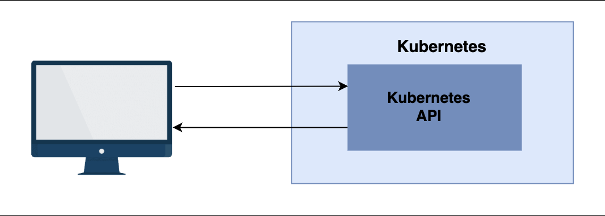
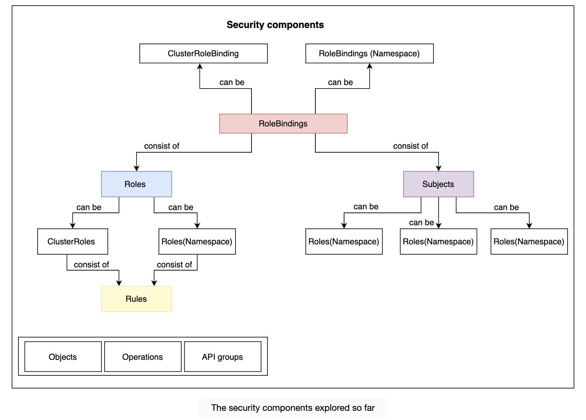
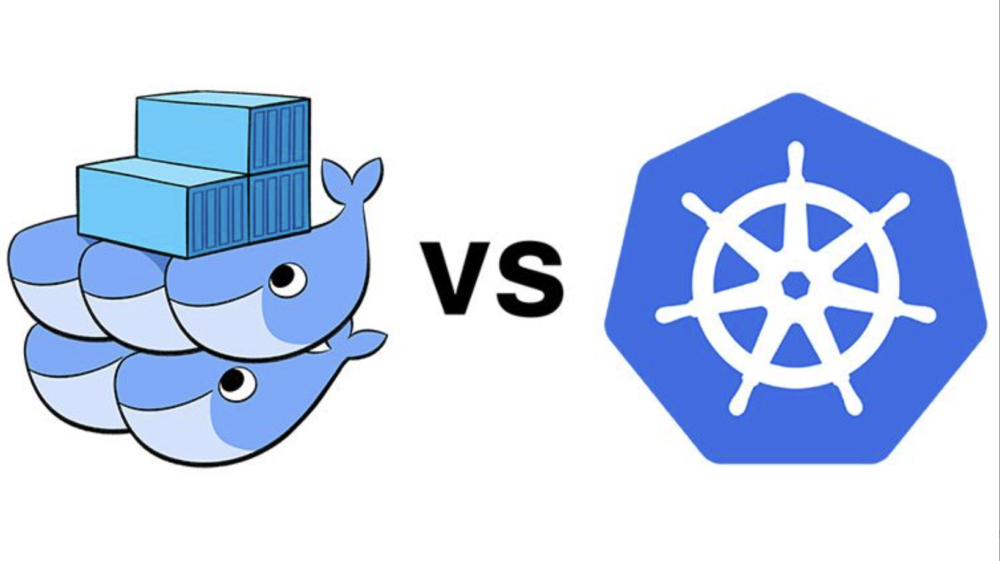

# Getting Started with Security

Learn about security and related concerns.

---

## Understanding the scenario

- Security implementation is a game between a team with a total lock-down strategy and a team that plans to win by providing complete freedom to everyone. You can think of it as a battle between anarchists and totalitarians. The only way the game can be won is if both blend into something new. The only viable strategy is freedom without sacrificing security (too much).
- Right now, our cluster is as secure as it can get. There is only one user. No one else can operate it. The others cannot even list the Pods in the cluster.

---

## Exploring the options#

- The moment we create a “real” cluster where the whole company will collaborate (in some form or another), we’ll need to define (and apply) an authentication and authorization strategy.
- If your business is small and there are only a few people who will ever operate the cluster, giving everyone the same cluster-wide administrative set of permissions is a simple and legitimate solution. More often than not, this will not be the case.
- Your company probably has people with different levels of trust. Even if that’s not the case, different people will require different levels of access. Some will be allowed to do anything they want, while others will not have any type of access. Most will be able to do something in between. We might choose to give everyone a separate namespace and forbid them from accessing others. Some might be able to operate a production namespace, while others might have an interest only in the one assigned for development and testing.
- We can apply an infinite number of permutations. Still, one thing is certain. We will need to create an authentication and authorization mechanism. We’ll most likely need to create permissions that are sometimes applied cluster-wide and, in other cases, limited to namespaces.
- Those and many other policies can be created by employing Kubernetes authorization and authentication.

---

## Accessing the Kubernetes API

Explore the Kubernetes API and the process to access it.

## The API#

- Every interaction with Kubernetes goes through its API and needs to be authorized. This communication can be initiated through a user or a Service account. All Kubernetes objects currently running inside our cluster interact with the API through Service accounts. We won’t go into further details about those. Instead, we’ll concentrate on the authorization of human users.
  

## Checking out the port#

Checking out the port#
Typically, the Kubernetes API is served on a secured port. Our kind cluster is no exception. We can check the port from the `kubectl config`.

- Before proceeding further, let's create a cluster.

```yml
# kind-config.yaml
kind: Cluster
apiVersion: kind.x-k8s.io/v1alpha4
name: mycluster
nodes:
  # Control-plane node
  - role: control-plane
    extraPortMappings:
      - containerPort: 80
        hostPort: 80
        protocol: TCP
      - containerPort: 443
        hostPort: 443
        protocol: TCP
    extraMounts:
      - hostPath: /var/run/docker.sock
        containerPath: /var/run/docker.sock
      - hostPath: /Users/rajeevsingh/Documents/DEVOPS/LinkedIn/k8s/educative/Volumes_After_Ingress/prometheus-conf.yml
        containerPath: /files/prometheus-conf.yml

  # Worker node 1
  - role: worker

  # Worker node 2
  - role: worker
```

- Now let's check the port on which our cluster is running using the configuration.

```bash
kubectl config view \
-o jsonpath='{.clusters[?(@.name=="kind-mycluster")].cluster.server}'
# Find the port of our cluster
```

We use `jsonpath` to output the `cluster.server` entry located in the cluster with the name `kind-mycluster`.

The output is as follows:

```bash
https://127.0.0.1:63421%
# The output of the above command
```

- We can see that `kubectl` accesses the Kubernetes API on port `63421` (this value can be different on your system). Since the access is secured, it requires certificates that are stored as the `certificate-authority` entry.

- Because we are working with kind, the certificates are set up by kind itself in the `/etc/kubernetes/pki` directory. While creating the cluster, we’ll create a volume to map the directory of kind on our local directory, namely `/Users/rajeevsingh/Documents/DEVOPS/certs`. We can check the contents of this directory by listing the `ls /Users/rajeevsingh/Documents/DEVOPS/certs` directory:

```yaml
# kind-config.yaml
kind: Cluster
apiVersion: kind.x-k8s.io/v1alpha4
name: mycluster
nodes:
  - role: control-plane
    extraPortMappings:
      - containerPort: 80
        hostPort: 80
        protocol: TCP
      - containerPort: 443
        hostPort: 443
        protocol: TCP
    extraMounts:
      - hostPath: /var/run/docker.sock
        containerPath: /var/run/docker.sock
      - hostPath: /Users/rajeevsingh/Documents/DEVOPS/LinkedIn/k8s/educative/Volumes_After_Ingress/prometheus-conf.yml
        containerPath: /files/prometheus-conf.yml
      - hostPath: /Users/rajeevsingh/Documents/DEVOPS/certs
        containerPath: /etc/kubernetes/pki # Map certs to local /Users/rajeevsingh/Documents/DEVOPS/certs

  - role: worker
  - role: worker
```

```bash
ls /Users/rajeevsingh/Documents/DEVOPS/certs
```

The output is as follows:

```bash
apiserver-etcd-client.crt    etcd
apiserver-etcd-client.key    front-proxy-ca.crt
apiserver-kubelet-client.crt front-proxy-ca.key
apiserver-kubelet-client.key front-proxy-client.crt
apiserver.crt                front-proxy-client.key
apiserver.key                sa.key
ca.crt                       sa.pub
ca.key
```

## The real world scenario#

- If this was a “real” cluster, we’d also need to enable access for other users. We could send them the certificate we already have, but that would be very insecure and lead to many potential problems. Soon, we’ll explore how to enable other users to access the cluster securely. For now, we’ll focus on the exploration of the process Kubernetes uses to authorize requests to its API.

# Understanding the process

Each request to the API goes through the following three stages:

- **Authentication**
- **Authorization**
- **Passing the admission control**

## Authentication#

Kubernetes uses client certificates, bearer tokens, an authenticating proxy, or **HTTP** basic authentication to authenticate API requests through authentication plugins. In the authentication process, the **username** is retrieved from the **HTTP** request. If the request cannot be authenticated, the operation is aborted with the status code `401`.

## Authorization#

Once the user is authenticated, the authorization validates whether it is allowed to execute the specified action. The authorization can be performed through ABAC, RBAC, or Webhook modes.

## Passing the admission control#

- Finally, once a request is authorized, it passes through admission controllers. They intercept requests to the API before the objects are persisted and can modify them. They are advanced topics that we won’t cover in this chapter.
- Authentication is pretty standard, and there’s not much to say about it. On the other hand, admission controllers are too advanced to be covered just yet.

### Try it yourself#

```bash
kubectl config view \
    -o jsonpath='{.clusters[?(@.name=="k3d-mycluster")].cluster.server}'

ls usercode/certs
```

---

# Authorizing Requests and Creating a Cluster

Learn about various authorization methods and choose one for our use.

## Authorization methods#

- Just like almost everything else in Kubernetes, authorization is modular. We can choose to use `Node`, `ABAC`, `Webhook`, or `RBAC` authorization.
  - `Node`: Node authorization grants permissions to kubeletes based on the Pods they are schedule to run.
  - `ABAC`: Attribute based access control(ABAC) is based on attributes combined with policies and is considered depricated in favor of RBAC.
  - `Webhooks`: Webhooks are used for equivalent notifications through `HTTP POST` request.
  - `RBAC`: Role-Based Access Control (RBAC) grants (or denies) access to resources based on the roles of a individual user or groups.

## Role-based access control (RBAC)#

Among the other authorization methods, `RBAC` is the right choice for the user-based authorization. Since we are focusing on the exploring of the means to authorize humans, `RBAC` will be our primary focus.

- RBAC can be used in following ways:

  - We can use it to secure the cluster by allowing access only to authorized users.
  - We can define roles that would grant different levels of access to users and groups. Some could have permissions that would allow them to do almost anything, while others could be limited only to basic non destructive operations. There can be many other roles in between.
  - We can combine RBAC with NameSpaces and allow users to oprate within specific segment of a cluster.
  - There are many other combinations we could apply depending on particular use cases.
    We’ll explore the details through a few examples. As you might already suspect, we’ll start with a new kind cluster.

    > `Note`: To check if RBAC is enabled on kind, run `kubectl api-versions`. If it is enabled, you should see .rbac.authorization.k8s.io/v1.

```bash
kubectl api-versions
```

The output is as follows:

```bash
admissionregistration.k8s.io/v1
apiextensions.k8s.io/v1
apiregistration.k8s.io/v1
apps/v1
authentication.k8s.io/v1
authorization.k8s.io/v1
autoscaling/v1
autoscaling/v2
batch/v1
certificates.k8s.io/v1
coordination.k8s.io/v1
discovery.k8s.io/v1
events.k8s.io/v1
flowcontrol.apiserver.k8s.io/v1
networking.k8s.io/v1
node.k8s.io/v1
policy/v1
rbac.authorization.k8s.io/v1
scheduling.k8s.io/v1
storage.k8s.io/v1
v1
```

- It might come in handy to have a few objects in the cluster so we will deploy the `go-demo-2` application. We will use it to test different permutations of the authorization strategies.

```yml
apiVersion: networking.k8s.io/v1
kind: Ingress
metadata:
  name: go-demo-2
  annotations:
    kubernetes.io/ingress.class: "nginx"
    ingress.kubernetes.io/ssl-redirect: "false"
    nginx.ingress.kubernetes.io/ssl-redirect: "false"
spec:
  rules:
    - host: go-demo-2.com
      http:
        paths:
          - path: /demo
            pathType: ImplementationSpecific
            backend:
              service:
                name: go-demo-2-api
                port:
                  number: 8080

---
apiVersion: apps/v1
kind: Deployment
metadata:
  name: go-demo-2-db
spec:
  selector:
    matchLabels:
      type: db
      service: go-demo-2
  strategy:
    type: Recreate
  template:
    metadata:
      labels:
        type: db
        service: go-demo-2
        vendor: MongoLabs
    spec:
      containers:
        - name: db
          image: mongo:3.3

---
apiVersion: v1
kind: Service
metadata:
  name: go-demo-2-db
spec:
  ports:
    - port: 27017
  selector:
    type: db
    service: go-demo-2

---
apiVersion: apps/v1
kind: Deployment
metadata:
  name: go-demo-2-api
spec:
  replicas: 3
  selector:
    matchLabels:
      type: api
      service: go-demo-2
  template:
    metadata:
      labels:
        type: api
        service: go-demo-2
        language: go
    spec:
      containers:
        - name: api
          image: vfarcic/go-demo-2
          env:
            - name: DB
              value: go-demo-2-db
          readinessProbe:
            httpGet:
              path: /demo/hello
              port: 8080
            periodSeconds: 1
          livenessProbe:
            httpGet:
              path: /demo/hello
              port: 8080

---
apiVersion: v1
kind: Service
metadata:
  name: go-demo-2-api
spec:
  ports:
    - port: 8080
  selector:
    type: api
    service: go-demo-2
```

```bash
kubectl create \
    -f go-demo-2.yml \
    --record --save-config
```

---

# Creating Users to Access the Cluster

Learn how to create a user based on fiictious character named "Bittu" who want to access our cluster.

## Understanding the scenario

- Let's suppose Kubernetes is getting popular in our company. People are become curious and would like to try it out.
- Since you are a Kubernetes guru, it came as no surprise that you receive a call from Bittu. They want to use Kubernetes, but they do not have time to setup their own cluster. Since they know that you already have a cluster up and running, they'd appreciate if you would let them use yours.
- Since you have no intension of giving Bittu your certificates, you decided to let them authenticate with their user account.

## Installing openSSL#

You will have to create certificates for them, so the first step you’ll need to do is to verify that OpenSSL is installed.

```bash
openssl version
```

The output is as follows:

```bash
OpenSSL 3.5.1 1 Jul 2025 (Library: OpenSSL 3.5.1 1 Jul 2025)
```

- It shouldn't matter which version of OpenSSL is installed. We output the version only to verify that the software is working.
- If the output is something like `Command not found: OpenSSL`, you will have to [install the binaries](https://wiki.openssl.org/index.php/Binaries)

# Creating a User

The first thing we will do is to create a private key for Bittu. We will assume that Bittu Kumar username is bkumar.

```bash
mkdir keys \
openssl genrsa \
  -out keys/bkumar.key 2048
```

- We create the directory `keys` and generate a private key `bkumar.key`
- Next we will use private key to generate a certificate.

```bash
openssl req -new \
> -key keys/bkumar.key \
> -out keys/bkumar.csr \
# csr: Certificate Signning Request
> -subj "/CN=bkumar/O=devs"
```

🛠 Command Breakdown

1. `openssl req`

- use the req(request) command in openssl.
- It's used to create and process **Certificate signing request**(CSR).

2. `new`

- Tells openssl to generate new **CSR**.
- CSR = request for a certificate, usually sent to a Certificate Authority (CA).

3. `-key keys/bkumar.key`

- Specifies the private key (`bkumar.key`) that will be used to sign the CSR.
- This private key must already exist.
- The public key corresponding to this private key will be included in the CSR.

4. `-out keys/bkumar.csr`

- The CSR file that will be generated.
- This file (**bkumar.csr**) contains the public key and identifying info (subject).

5. `-subj "/CN=bkumar/O=devs"`

- Defines the subject DN (Distinguished Name) in the CSR, without prompting interactively.
- CN=bkumar → Common Name, typically the domain (for servers) or username (for clients).
- O=devs → Organization name.

#### 📌 In production:

- For SSL/TLS certs → CN should be a domain name (e.g., CN=example.com).
- For client certs → CN can be a person/username.
- O represents the organization unit (like a team or company).

## Creating the final certificate#

- We created the certificate bkumar.csr with a specific subject that will help us identify Bittu. CN is the username, and O represents the organization they belong to. Bittu is a developer, so devs should do that.
- For the final certificate, we’ll need the cluster’s certificate authority (CA). It will be responsible for approving the request and for generating the necessary certificate Bittu will use to access the cluster.
- Since we have used kind, the authority is already produced for us as part of the cluster creation. It should be in the `/etc/kubernetes/pki/
` directory as per the volume binding.
- Let’s confirm if it’s there:

```bash
docker ps --format '{{.Names}}'
```

The output is as follows:

```bash
mycluster-control-plane
mycluster-worker2
mycluster-worker
ops-cluster-control-plane
ops-cluster-worker3
ops-cluster-worker
ops-cluster-worker2
```

```bash
docker exec -it mycluster-control-plane ls -1 /etc/kubernetes/pki/
```

The output is as follows:

```bash
apiserver-etcd-client.crt
apiserver-etcd-client.key
apiserver-kubelet-client.crt
apiserver-kubelet-client.key
apiserver.crt
apiserver.key
ca.crt
ca.key
etcd
front-proxy-ca.crt
front-proxy-ca.key
front-proxy-client.crt
front-proxy-client.key
sa.key
sa.pub
```

- Now we can generate the final certificate by approving the certificate sign request bkumar.csr.

```bash
# Since the CA cert and key live inside the container:
#docker cp ./keys/bkumar.csr mycluster-control-plane:/tmp/
docker cp ./keys/bkumar.csr mycluster-control-plane:/etc/kubernetes/pki/bkumar.csr


docker exec -it mycluster-control-plane openssl x509 -req \
  -in /etc/kubernetes/pki/bkumar.csr \
  -CA /etc/kubernetes/pki/ca.crt \
  -CAkey /etc/kubernetes/pki/ca.key \
  -CAcreateserial \
  -out /etc/kubernetes/pki/bkumar.crt \
  -days 365


```

> Verify

```bash
docker exec -it mycluster-control-plane ls -l /etc/kubernetes/pki/bkumar.crt
```

The output is as follows:

```bash
-rw-r--r-- 1 root root 1009 Sep  2 13:51 /etc/kubernetes/pki/bkumar.crt
```

- To simplify the process, we’ll copy the cluster’s certificate authority to the keys directory.

```bash
docker cp mycluster-control-plane:/etc/kubernetes/pki/bkumar.crt ./keys/bkumar.crt
```

- Bittu does not need `bkumar.csr` file. We have used it only to generate final certificate `bkumar.crt`. They will need all other files, though.

## Getting the server address#

Apart from the keys, Bittu will need to know the address of the cluster. At the beginning of the chapter, we already created the jsonpath that retrieves the server, so that part should be easy.

```bash
SERVER=$(kubectl config view \
    -o jsonpath='{.clusters[?(@.name=="kind-mycluster")].cluster.server}')

echo $SERVER
```

The output is as follows:

```bash
https://127.0.0.1:50227
```

- The output is equipped with the following:
  - The new certificate (bkumar.crt)
  - The key (bkumar.key)
  - The cluster authority (ca.crt)
  - The address of the server:
- Bittu can configure their `kubectl` installation.

## Try it yourself#

For your convenience, a list of all the commands used in the lesson is given below:

```bash
mkdir keys
openssl genrsa \
    -out keys/jdoe.key 2048

openssl req -new \
    -key keys/jdoe.key \
    -out keys/jdoe.csr \
    -subj "/CN=jdoe/O=devs"

ls -1 /usercode/certs/client-ca.*

openssl x509 -req \
    -in keys/jdoe.csr \
    -CA /usercode/certs/client-ca.crt \
    -CAkey /usercode/certs/client-ca.key \
    -CAcreateserial \
    -out keys/jdoe.crt \
    -days 365

cp /usercode/certs/server-ca.crt /usercode/certs/keys

ls -1 keys

SERVER=$(kubectl config view \
    -o jsonpath='{.clusters[?(@.name=="k3d-mycluster")].cluster.server}')

echo $SERVER
```

# Accessing the Cluster as a User

Learn how to impersonate the new user Bittu and try to get the access authenticated.

## Authentication

Since Bittu is not around, we’ll do some role-playing and impersonate him.

## Configuring kubectl#

We’ll first have to set the cluster using the address and the certificate authority we sent Bittu.

```bash
kubectl config set-cluster bkumar \
  --certificate-authority=./keys/ca.crt \
  --server=https://127.0.0.1:50227 \
  --embed-certs=true

```

The output is as follows:

```bash
Cluster "bkumar" set
```

- We create a new cluster called bkumar.

## Creating a new context#

Finally, we’ll have to create a new context.

```bash
kubectl config set-context bkumar \
    --cluster bkumar \
    --user bkumar
# Output: Context "bkumar" created
kubectl config use-context bkumar
# Switched to context "bkumar".
kubectl config current-context
# Output: bkumar
```

- We create the context bkumar that uses the newly created cluster and the user. We also make sure that we’re using the newly created context.
- Let’s look at the config:

```bash
kubectl config view
```

The output is as follows:

```bash
apiVersion: v1
clusters:
- cluster:
    certificate-authority-data: DATA+OMITTED
    server: https://127.0.0.1:50227
  name: bkumar
- cluster:
    certificate-authority-data: DATA+OMITTED
    server: https://127.0.0.1:50227
  name: kind-mycluster
- cluster:
    certificate-authority-data: DATA+OMITTED
    server: https://127.0.0.1:50581
  name: kind-ops-cluster
- cluster:
    certificate-authority: /Users/rajeevsingh/.minikube/ca.crt
    extensions:
    - extension:
        last-update: Sun, 22 Dec 2024 14:11:11 IST
        provider: minikube.sigs.k8s.io
        version: v1.34.0
      name: cluster_info
    server: https://127.0.0.1:51241
  name: minikube
contexts:
- context:
    cluster: bkumar
    user: bkumar
  name: bkumar
- context:
    cluster: kind-dev-cluster
    user: kind-dev-cluster
  name: dev
- context:
    cluster: kind-mycluster
    user: kind-mycluster
  name: kind-mycluster
- context:
    cluster: minikube
    extensions:
    - extension:
        last-update: Sun, 22 Dec 2024 14:11:11 IST
        provider: minikube.sigs.k8s.io
        version: v1.34.0
      name: context_info
    namespace: default
    user: minikube
  name: minikube
- context:
    cluster: kind-ops-cluster
    user: kind-ops-cluster
  name: ops
- context:
    cluster: kind-mycluster
    namespace: testing
    user: kind-mycluster
  name: testing
current-context: bkumar
kind: Config
preferences: {}
users:
- name: kind-mycluster
  user:
    client-certificate-data: DATA+OMITTED
    client-key-data: DATA+OMITTED
- name: kind-ops-cluster
  user:
    client-certificate-data: DATA+OMITTED
    client-key-data: DATA+OMITTED
- name: minikube
  user:
    client-certificate: /Users/rajeevsingh/.minikube/profiles/minikube/client.crt
    client-key: /Users/rajeevsingh/.minikube/profiles/minikube/client.key
- name: rajeev
  user:
    client-certificate-data: DATA+OMITTED
    client-key-data: DATA+OMITTED
```

## No authorization#

- Bittu should be happy thinking that they can access our cluster. Since they’re a curious person, they’ll want to see the Pods we’re running.

```bash
kubectl get pods
```

The output is as follows:

```bash
pods is forbidden: User "system:anonymous" cannot list resource "pods" in API group "" in the namespace "default"
```

That’s frustrating. Bittu can reach our cluster, but they cannot retrieve the list of Pods. However, Bittu can check whether he is forbidden from seeing other types of objects.

- Now we tell kubectl about them.

1. 1. Create the user entry for **bkumar**

```bash
kubectl config set-credentials bkumar \
  --client-certificate=./keys/bkumar.crt \
  --client-key=./keys/bkumar.key \
  --embed-certs=true

```

The output is as follows:

```bash
User "bkumar" set.
```

```bash
kubectl get pods
```

The output is as follows:

```bash
Error from server (Forbidden): pods is forbidden: User "bkumar" cannot list resource "pods" in API group "" in the namespace "default"
```

### Try it yourself#

```bash
kubectl config set-cluster bkumar \
    --certificate-authority \
    /etc/kubernetes/pki/server-ca.crt \
    --server $SERVER

kubectl config set-credentials bkumar \
    --client-certificate keys/bkumar.crt \
    --client-key keys/bkumar.key

kubectl config set-context bkumar \
    --cluster bkumar \
    --user bkumar

kubectl config use-context bkumar

kubectl config view

kubectl get pods

kubectl get all
```

---

# Exploring the RBAC Authorization

Explore different components of the RBAC authorization.

## The `RBAC` Components#

Managing Kubernetes RBAC requires knowledge of a few elements. Specifically, we should learn about Rules, Roles, Subjects, and RoleBindings.

### `Rules`#

- A Rule is a set of operations (`verbs`), `resources`, and `API groups`. `Verbs` describe activities that can be performed on resources that belong to different API Groups.
- Currently supported `verbs` are as follows:
  | Verb | Description |
  | ---- | ----------- |
  | `get` | Retrieves information about a specific object |
  | `list`| Retrieves information about a collection of objects |
  | `create` | Creates a specific object |
  | `update` | Update a specific object |
  | `patch` | Patch a specific object |
  | `watch` | Watches for changes to an object |
  | `proxy` | Proxies requests |
  | `redirect` | Redirect requests |
  | `delete` | Delete a specific object |
  | `deletecollection` | Delete a collection of object |
- Permissions defined through Rules are additive. We cannot deny access to some resources. For example, if we want to allow a user only to create objects and retrieve their information, we’d use the verbs `get`, `list`, and `create`. A verb can be an asterisk (`*`) and so allow all `verbs` (operations).
- Verbs are combined with Kubernetes resources. For example, if we want to allow a user only to `create` Pods and `retrieve` their information, we’d mix `get`, `list`, and `create` verbs with the `pods` resource.
- The last element of a Rule is the `API` group. RBAC uses the `rbac.authorization.k8s.io` group. If we switch to a different authorization method, we need to change the group as well.

## **_`Roles`_**#

- A **Role** is a collection of `Rules`. It defines one or more `Rules` that can be bound to a `user` or a `group` of users.
- The vital aspect of `Roles` is that they are applied to a `namespace`. If we want to create a role that refers to a whole cluster, we use `ClusterRole` instead. Both are defined in the same way, and the only difference is in the scope (`namespace` or an `entire cluster`).

## **_`Subjects`_**#

- The next piece of the authorization mechanism is `Subjects`: `Subjects` define entities that are executing operations. A Subject can be a `user`, a `group`, or a `service account`.
- A **user** is a person or a process residing outside a cluster. A service account is used for processes running inside Pods that want to use the API. Since this chapter focuses on human authentication, we won’t explore them right now. Finally, **groups** are collections of users or service accounts. Some **groups** are created by default (e.g., `cluster-admin`).

## **_`RoleBindings`_**

Finally, we need RoleBindings:

- As the name suggests, `RoleBindings` bind `Subjects` to `Roles`.
- Since Subjects define `users`, `RoleBindings` effectively bind `users` (or `groups` or `service accounts`) to `Roles` and give them permissions to perform certain operations on specific objects within a namespace. Just like `Roles`, `RoleBindings` have a **cluster-wide** alternative called **ClusterRoleBindings**. The only difference is that their scope is not limited to a namespace, but applied to a whole cluster.
  
  All this might seem confusing and overwhelming. However, don’t worry, we’ll explore each RBAC component in more detail through practical examples.

---

# Exploring Cluster Role Binding

Explore all the pre-defined Clusteroles.

## Switching from bkumar to ourselves

- Bittu is frustrated. They can access the cluster, but they are not permitted to perform any operation. They can't even list the Pods. Naturally, they asked us to be more generous and allow them to work with our cluster.
- Since we are not taking anything for granted, we decided that the first action should be verify Bittu's claim. Is it true that they cannot even retrive the Pods running inside the cluster?
- Before we move on, we'll stop impersonating Bittu and go back to using the cluster with full administrative previllages granted to the `admin` user.

```bash
kubectl config use-context kind-mycluster
```

The output is as follows:

```bash
Switched to context "kind-mycluster".
```

```bash
kubectl get all
```

The output is as follows:

```bash
NAME                                 READY   STATUS    RESTARTS      AGE
pod/go-demo-2-api-6695f75946-cjl2r   1/1     Running   2 (51m ago)   21h
pod/go-demo-2-api-6695f75946-qgbmz   1/1     Running   2 (51m ago)   21h
pod/go-demo-2-api-6695f75946-wkwf8   1/1     Running   5 (51m ago)   21h
pod/go-demo-2-db-767dbdd68b-w2knl    1/1     Running   1 (51m ago)   21h

NAME                    TYPE        CLUSTER-IP     EXTERNAL-IP   PORT(S)     AGE
service/go-demo-2-api   ClusterIP   10.96.44.175   <none>        8080/TCP    21h
service/go-demo-2-db    ClusterIP   10.96.34.244   <none>        27017/TCP   21h
service/kubernetes      ClusterIP   10.96.0.1      <none>        443/TCP     7d22h

NAME                            READY   UP-TO-DATE   AVAILABLE   AGE
deployment.apps/go-demo-2-api   3/3     3            3           21h
deployment.apps/go-demo-2-db    1/1     1            1           21h

NAME                                       DESIRED   CURRENT   READY   AGE
replicaset.apps/go-demo-2-api-6695f75946   3         3         3       21h
replicaset.apps/go-demo-2-db-767dbdd68b    1         1         1       21h
```

- Now that we have switched to the `kind-mycluster` context, we regain full permissions and `kubectl get all ` returns all the objects from `default` namespace.
- Let's verify Bittu indeed cannot list Pods in the **default** namespace.
- We could configure the same certificates as they are using, but that would complicate the process. Instead we'll use `kubectl` command that will allow us to check
  whether we could perform an action if we were a specific user.

```bash
  kubectl auth can-i get pods --as bkumar
```

The output is as follows:

```bash
no
```

- The response is no, indicating that Bkumar cannot `get` pods. The `--as` argument is a global option that can be applied to any command. The `kubectl auth can-i` is a special command. It does not perform any action but only validates whether an operation can be performed. Without the `--as` argument, it would verify whether the current user (in this case, kind-mycluster) could do something.

## Looking into Roles and ClusterRoles#

- We’ve already discussed Roles and ClusterRoles briefly. Let’s see whether any are already configured in the cluster or the `default` namespace.

```bash
kubectl get roles
```

The output is as follows:

```bash
No resources found in default namespace.
```

- We do not have any role in the `default` namespace. This is expected outcome since a Kubernetes cluster comes with no predefined Roles. We'd need to create those we need ourselves.
- How about clusterRoles? Let's check them out...

```bash
kubectl get clusterroles
```

The output is as follows:

```bash
NAME                                                                   CREATED AT
admin                                                                  2025-08-26T04:24:57Z
cluster-admin                                                          2025-08-26T04:24:57Z
edit                                                                   2025-08-26T04:24:57Z
kindnet                                                                2025-08-26T04:24:59Z
kubeadm:get-nodes                                                      2025-08-26T04:24:57Z
local-path-provisioner-role                                            2025-08-26T04:24:59Z
system:aggregate-to-admin                                              2025-08-26T04:24:57Z
system:aggregate-to-edit                                               2025-08-26T04:24:57Z
system:aggregate-to-view                                               2025-08-26T04:24:57Z
system:auth-delegator                                                  2025-08-26T04:24:57Z
system:basic-user                                                      2025-08-26T04:24:57Z
system:certificates.k8s.io:certificatesigningrequests:nodeclient       2025-08-26T04:24:57Z
system:certificates.k8s.io:certificatesigningrequests:selfnodeclient   2025-08-26T04:24:57Z
system:certificates.k8s.io:kube-apiserver-client-approver              2025-08-26T04:24:57Z
system:certificates.k8s.io:kube-apiserver-client-kubelet-approver      2025-08-26T04:24:57Z
system:certificates.k8s.io:kubelet-serving-approver                    2025-08-26T04:24:57Z
system:certificates.k8s.io:legacy-unknown-approver                     2025-08-26T04:24:57Z
system:controller:attachdetach-controller                              2025-08-26T04:24:57Z
system:controller:certificate-controller                               2025-08-26T04:24:57Z
system:controller:clusterrole-aggregation-controller                   2025-08-26T04:24:57Z
system:controller:cronjob-controller                                   2025-08-26T04:24:57Z
system:controller:daemon-set-controller                                2025-08-26T04:24:57Z
system:controller:deployment-controller                                2025-08-26T04:24:57Z
system:controller:disruption-controller                                2025-08-26T04:24:57Z
system:controller:endpoint-controller                                  2025-08-26T04:24:57Z
system:controller:endpointslice-controller                             2025-08-26T04:24:57Z
system:controller:endpointslicemirroring-controller                    2025-08-26T04:24:57Z
system:controller:ephemeral-volume-controller                          2025-08-26T04:24:57Z
system:controller:expand-controller                                    2025-08-26T04:24:57Z
system:controller:generic-garbage-collector                            2025-08-26T04:24:57Z
system:controller:horizontal-pod-autoscaler                            2025-08-26T04:24:57Z
system:controller:job-controller                                       2025-08-26T04:24:57Z
system:controller:legacy-service-account-token-cleaner                 2025-08-26T04:24:57Z
system:controller:namespace-controller                                 2025-08-26T04:24:57Z
system:controller:node-controller                                      2025-08-26T04:24:57Z
system:controller:persistent-volume-binder                             2025-08-26T04:24:57Z
system:controller:pod-garbage-collector                                2025-08-26T04:24:57Z
system:controller:pv-protection-controller                             2025-08-26T04:24:57Z
system:controller:pvc-protection-controller                            2025-08-26T04:24:57Z
system:controller:replicaset-controller                                2025-08-26T04:24:57Z
system:controller:replication-controller                               2025-08-26T04:24:57Z
system:controller:resourcequota-controller                             2025-08-26T04:24:57Z
system:controller:root-ca-cert-publisher                               2025-08-26T04:24:57Z
system:controller:route-controller                                     2025-08-26T04:24:57Z
system:controller:selinux-warning-controller                           2025-08-26T04:24:57Z
system:controller:service-account-controller                           2025-08-26T04:24:57Z
system:controller:service-cidrs-controller                             2025-08-26T04:24:57Z
system:controller:service-controller                                   2025-08-26T04:24:57Z
system:controller:statefulset-controller                               2025-08-26T04:24:57Z
system:controller:ttl-after-finished-controller                        2025-08-26T04:24:57Z
system:controller:ttl-controller                                       2025-08-26T04:24:57Z
system:controller:validatingadmissionpolicy-status-controller          2025-08-26T04:24:57Z
system:coredns                                                         2025-08-26T04:24:58Z
system:discovery                                                       2025-08-26T04:24:57Z
system:heapster                                                        2025-08-26T04:24:57Z
system:kube-aggregator                                                 2025-08-26T04:24:57Z
system:kube-controller-manager                                         2025-08-26T04:24:57Z
system:kube-dns                                                        2025-08-26T04:24:57Z
system:kube-scheduler                                                  2025-08-26T04:24:57Z
system:kubelet-api-admin                                               2025-08-26T04:24:57Z
system:monitoring                                                      2025-08-26T04:24:57Z
system:node                                                            2025-08-26T04:24:57Z
system:node-bootstrapper                                               2025-08-26T04:24:57Z
system:node-problem-detector                                           2025-08-26T04:24:57Z
system:node-proxier                                                    2025-08-26T04:24:57Z
system:persistent-volume-provisioner                                   2025-08-26T04:24:57Z
system:public-info-viewer                                              2025-08-26T04:24:57Z
system:service-account-issuer-discovery                                2025-08-26T04:24:57Z
system:volume-scheduler                                                2025-08-26T04:24:57Z
view                                                                   2025-08-26T04:24:57Z
```

- This time we got quite a few resources. Our cluster already has some `ClusterRoles` defined by default. Those prefixed with `system`: are `ClusterRoles` reserved for Kubernetes system use. Modifications to those roles can result in non-functional clusters, so we should not update them. Instead, we’ll skip `system` `Roles` and focus on those that should be assigned to users.
- The output (limited to `ClusterRoles` that are meant to be bound to `users`) is as follows (we can get the same result through `kubectl get clusterroles | grep -v system`):

```bash
kubectl get clusterroles | grep -v system
```

The output is as follows:

```bash
NAME                                                                   CREATED AT
admin                                                                  2025-08-26T04:24:57Z
cluster-admin                                                          2025-08-26T04:24:57Z
edit                                                                   2025-08-26T04:24:57Z
kindnet                                                                2025-08-26T04:24:59Z
kubeadm:get-nodes                                                      2025-08-26T04:24:57Z
local-path-provisioner-role                                            2025-08-26T04:24:59Z
view                                                                   2025-08-26T04:24:57Z
```

## Looking into view#

The ClusterRole with the least permissions is `view`. Let’s take a closer look at it.

```bash
kubectl describe clusterrole view
```

The output is as follows:

```bash
Name:         view
Labels:       kubernetes.io/bootstrapping=rbac-defaults
              rbac.authorization.k8s.io/aggregate-to-edit=true
Annotations:  rbac.authorization.kubernetes.io/autoupdate: true
PolicyRule:
  Resources                                    Non-Resource URLs  Resource Names  Verbs
  ---------                                    -----------------  --------------  -----
  bindings                                     []                 []              [get list watch]
  configmaps                                   []                 []              [get list watch]
  endpoints                                    []                 []              [get list watch]
  events                                       []                 []              [get list watch]
  limitranges                                  []                 []              [get list watch]
  namespaces/status                            []                 []              [get list watch]
  namespaces                                   []                 []              [get list watch]
  persistentvolumeclaims/status                []                 []              [get list watch]
  persistentvolumeclaims                       []                 []              [get list watch]
  pods/log                                     []                 []              [get list watch]
  pods/status                                  []                 []              [get list watch]
  pods                                         []                 []              [get list watch]
  replicationcontrollers/scale                 []                 []              [get list watch]
  replicationcontrollers/status                []                 []              [get list watch]
  replicationcontrollers                       []                 []              [get list watch]
  resourcequotas/status                        []                 []              [get list watch]
  resourcequotas                               []                 []              [get list watch]
  serviceaccounts                              []                 []              [get list watch]
  services/status                              []                 []              [get list watch]
  services                                     []                 []              [get list watch]
  controllerrevisions.apps                     []                 []              [get list watch]
  daemonsets.apps/status                       []                 []              [get list watch]
  daemonsets.apps                              []                 []              [get list watch]
  deployments.apps/scale                       []                 []              [get list watch]
  deployments.apps/status                      []                 []              [get list watch]
  deployments.apps                             []                 []              [get list watch]
  replicasets.apps/scale                       []                 []              [get list watch]
  replicasets.apps/status                      []                 []              [get list watch]
  replicasets.apps                             []                 []              [get list watch]
  statefulsets.apps/scale                      []                 []              [get list watch]
  statefulsets.apps/status                     []                 []              [get list watch]
  statefulsets.apps                            []                 []              [get list watch]
  horizontalpodautoscalers.autoscaling/status  []                 []              [get list watch]
  horizontalpodautoscalers.autoscaling         []                 []              [get list watch]
  cronjobs.batch/status                        []                 []              [get list watch]
  cronjobs.batch                               []                 []              [get list watch]
  jobs.batch/status                            []                 []              [get list watch]
  jobs.batch                                   []                 []              [get list watch]
  endpointslices.discovery.k8s.io              []                 []              [get list watch]
  daemonsets.extensions/status                 []                 []              [get list watch]
  daemonsets.extensions                        []                 []              [get list watch]
  deployments.extensions/scale                 []                 []              [get list watch]
  deployments.extensions/status                []                 []              [get list watch]
  deployments.extensions                       []                 []              [get list watch]
  ingresses.extensions/status                  []                 []              [get list watch]
  ingresses.extensions                         []                 []              [get list watch]
  networkpolicies.extensions                   []                 []              [get list watch]
  replicasets.extensions/scale                 []                 []              [get list watch]
  replicasets.extensions/status                []                 []              [get list watch]
  replicasets.extensions                       []                 []              [get list watch]
  replicationcontrollers.extensions/scale      []                 []              [get list watch]
  ingresses.networking.k8s.io/status           []                 []              [get list watch]
  ingresses.networking.k8s.io                  []                 []              [get list watch]
  networkpolicies.networking.k8s.io            []                 []              [get list watch]
  poddisruptionbudgets.policy/status           []                 []              [get list watch]
  poddisruptionbudgets.policy                  []                 []              [get list watch]
```

- It contains a long list of resources, all of them with the “get”, “list”, and “watch” verbs. It looks like it would allow users bound to it to retrieve all the resources. We have yet to validate whether the list of resources is truly complete.
- For now, it looks like an excellent candidate to assign to users that should have very limited permissions. Unlike Roles that are tied to a specific namespace, ClusterRoles are available across the whole cluster. This is a significant difference that we’ll explore later on.

## Looking into edit#

Let’s explore another pre-defined ClusteRole:

```bash
kubectl describe clusterrole edit
```

The output is as follows:

```bash

Name:         edit
Labels:       kubernetes.io/bootstrapping=rbac-defaults
              rbac.authorization.k8s.io/aggregate-to-admin=true
Annotations:  rbac.authorization.kubernetes.io/autoupdate: true
PolicyRule:
  Resources                                    Non-Resource URLs  Resource Names  Verbs
  ---------                                    -----------------  --------------  -----
  leases.coordination.k8s.io                   []                 []              [create delete deletecollection get list patch update watch]
  configmaps                                   []                 []              [create delete deletecollection patch update get list watch]
  events                                       []                 []              [create delete deletecollection patch update get list watch]
  persistentvolumeclaims                       []                 []              [create delete deletecollection patch update get list watch]
  pods                                         []                 []              [create delete deletecollection patch update get list watch]
  replicationcontrollers/scale                 []                 []              [create delete deletecollection patch update get list watch]
  replicationcontrollers                       []                 []              [create delete deletecollection patch update get list watch]
  services                                     []                 []              [create delete deletecollection patch update get list watch]
  daemonsets.apps                              []                 []              [create delete deletecollection patch update get list watch]
  deployments.apps/scale                       []                 []              [create delete deletecollection patch update get list watch]
  deployments.apps                             []                 []              [create delete deletecollection patch update get list watch]
  replicasets.apps/scale                       []                 []              [create delete deletecollection patch update get list watch]
  replicasets.apps                             []                 []              [create delete deletecollection patch update get list watch]
  statefulsets.apps/scale                      []                 []              [create delete deletecollection patch update get list watch]
  statefulsets.apps                            []                 []              [create delete deletecollection patch update get list watch]
  horizontalpodautoscalers.autoscaling         []                 []              [create delete deletecollection patch update get list watch]
  cronjobs.batch                               []                 []              [create delete deletecollection patch update get list watch]
  jobs.batch                                   []                 []              [create delete deletecollection patch update get list watch]
  daemonsets.extensions                        []                 []              [create delete deletecollection patch update get list watch]
  deployments.extensions/scale                 []                 []              [create delete deletecollection patch update get list watch]
  deployments.extensions                       []                 []              [create delete deletecollection patch update get list watch]
  ingresses.extensions                         []                 []              [create delete deletecollection patch update get list watch]
  networkpolicies.extensions                   []                 []              [create delete deletecollection patch update get list watch]
  replicasets.extensions/scale                 []                 []              [create delete deletecollection patch update get list watch]
  replicasets.extensions                       []                 []              [create delete deletecollection patch update get list watch]
  replicationcontrollers.extensions/scale      []                 []              [create delete deletecollection patch update get list watch]
  ingresses.networking.k8s.io                  []                 []              [create delete deletecollection patch update get list watch]
  networkpolicies.networking.k8s.io            []                 []              [create delete deletecollection patch update get list watch]
  poddisruptionbudgets.policy                  []                 []              [create delete deletecollection patch update get list watch]
  deployments.apps/rollback                    []                 []              [create delete deletecollection patch update]
  deployments.extensions/rollback              []                 []              [create delete deletecollection patch update]
  pods/eviction                                []                 []              [create]
  serviceaccounts/token                        []                 []              [create]
  pods/attach                                  []                 []              [get list watch create delete deletecollection patch update]
  pods/exec                                    []                 []              [get list watch create delete deletecollection patch update]
  pods/portforward                             []                 []              [get list watch create delete deletecollection patch update]
  pods/proxy                                   []                 []              [get list watch create delete deletecollection patch update]
  secrets                                      []                 []              [get list watch create delete deletecollection patch update]
  services/proxy                               []                 []              [get list watch create delete deletecollection patch update]
  bindings                                     []                 []              [get list watch]
  endpoints                                    []                 []              [get list watch]
  limitranges                                  []                 []              [get list watch]
  namespaces/status                            []                 []              [get list watch]
  namespaces                                   []                 []              [get list watch]
  persistentvolumeclaims/status                []                 []              [get list watch]
  pods/log                                     []                 []              [get list watch]
  pods/status                                  []                 []              [get list watch]
  replicationcontrollers/status                []                 []              [get list watch]
  resourcequotas/status                        []                 []              [get list watch]
  resourcequotas                               []                 []              [get list watch]
  services/status                              []                 []              [get list watch]
  controllerrevisions.apps                     []                 []              [get list watch]
  daemonsets.apps/status                       []                 []              [get list watch]
  deployments.apps/status                      []                 []              [get list watch]
  replicasets.apps/status                      []                 []              [get list watch]
  statefulsets.apps/status                     []                 []              [get list watch]
  horizontalpodautoscalers.autoscaling/status  []                 []              [get list watch]
  cronjobs.batch/status                        []                 []              [get list watch]
  jobs.batch/status                            []                 []              [get list watch]
  endpointslices.discovery.k8s.io              []                 []              [get list watch]
  daemonsets.extensions/status                 []                 []              [get list watch]
  deployments.extensions/status                []                 []              [get list watch]
  ingresses.extensions/status                  []                 []              [get list watch]
  replicasets.extensions/status                []                 []              [get list watch]
  ingresses.networking.k8s.io/status           []                 []              [get list watch]
  poddisruptionbudgets.policy/status           []                 []              [get list watch]
  serviceaccounts                              []                 []              [impersonate create delete deletecollection patch update get list watch]
```

- As we can see, the “edit” ClusterRole allows us to perform any action on Pods. If we go through the whole list, we’d see that the “edit” role allows us to execute almost any operation on any Kubernetes object.
- It seems like it gives us unlimited permissions. However, there are a few resources that are not listed. We can observe those differences through the ClusterRole `admin`.

## Looking into admin#

```bash
kubectl describe clusterrole admin
```

- If you pay close attention, you’ll notice that the ClusterRole `admin` has a few additional entries.

- The output, (limited to the records not present in the ClusterRole edit) is as follows:

```bash
Name:         admin
Labels:       kubernetes.io/bootstrapping=rbac-defaults
Annotations:  rbac.authorization.kubernetes.io/autoupdate: true
PolicyRule:
  Resources                                       Non-Resource URLs  Resource Names  Verbs
  ---------                                       -----------------  --------------  -----
  leases.coordination.k8s.io                      []                 []              [create delete deletecollection get list patch update watch]
  rolebindings.rbac.authorization.k8s.io          []                 []              [create delete deletecollection get list patch update watch]
  roles.rbac.authorization.k8s.io                 []                 []              [create delete deletecollection get list patch update watch]
  configmaps                                      []                 []              [create delete deletecollection patch update get list watch]
  events                                          []                 []              [create delete deletecollection patch update get list watch]
  persistentvolumeclaims                          []                 []              [create delete deletecollection patch update get list watch]
  pods                                            []                 []              [create delete deletecollection patch update get list watch]
  replicationcontrollers/scale                    []                 []              [create delete deletecollection patch update get list watch]
  replicationcontrollers                          []                 []              [create delete deletecollection patch update get list watch]
  services                                        []                 []              [create delete deletecollection patch update get list watch]
  daemonsets.apps                                 []                 []              [create delete deletecollection patch update get list watch]
  deployments.apps/scale                          []                 []              [create delete deletecollection patch update get list watch]
  deployments.apps                                []                 []              [create delete deletecollection patch update get list watch]
  replicasets.apps/scale                          []                 []              [create delete deletecollection patch update get list watch]
  replicasets.apps                                []                 []              [create delete deletecollection patch update get list watch]
  statefulsets.apps/scale                         []                 []              [create delete deletecollection patch update get list watch]
  statefulsets.apps                               []                 []              [create delete deletecollection patch update get list watch]
  horizontalpodautoscalers.autoscaling            []                 []              [create delete deletecollection patch update get list watch]
  cronjobs.batch                                  []                 []              [create delete deletecollection patch update get list watch]
  jobs.batch                                      []                 []              [create delete deletecollection patch update get list watch]
  daemonsets.extensions                           []                 []              [create delete deletecollection patch update get list watch]
  deployments.extensions/scale                    []                 []              [create delete deletecollection patch update get list watch]
  deployments.extensions                          []                 []              [create delete deletecollection patch update get list watch]
  ingresses.extensions                            []                 []              [create delete deletecollection patch update get list watch]
  networkpolicies.extensions                      []                 []              [create delete deletecollection patch update get list watch]
  replicasets.extensions/scale                    []                 []              [create delete deletecollection patch update get list watch]
  replicasets.extensions                          []                 []              [create delete deletecollection patch update get list watch]
  replicationcontrollers.extensions/scale         []                 []              [create delete deletecollection patch update get list watch]
  ingresses.networking.k8s.io                     []                 []              [create delete deletecollection patch update get list watch]
  networkpolicies.networking.k8s.io               []                 []              [create delete deletecollection patch update get list watch]
  poddisruptionbudgets.policy                     []                 []              [create delete deletecollection patch update get list watch]
  deployments.apps/rollback                       []                 []              [create delete deletecollection patch update]
  deployments.extensions/rollback                 []                 []              [create delete deletecollection patch update]
  pods/eviction                                   []                 []              [create]
  serviceaccounts/token                           []                 []              [create]
  localsubjectaccessreviews.authorization.k8s.io  []                 []              [create]
  pods/attach                                     []                 []              [get list watch create delete deletecollection patch update]
  pods/exec                                       []                 []              [get list watch create delete deletecollection patch update]
  pods/portforward                                []                 []              [get list watch create delete deletecollection patch update]
  pods/proxy                                      []                 []              [get list watch create delete deletecollection patch update]
  secrets                                         []                 []              [get list watch create delete deletecollection patch update]
  services/proxy                                  []                 []              [get list watch create delete deletecollection patch update]
  bindings                                        []                 []              [get list watch]
  endpoints                                       []                 []              [get list watch]
  limitranges                                     []                 []              [get list watch]
  namespaces/status                               []                 []              [get list watch]
  namespaces                                      []                 []              [get list watch]
  persistentvolumeclaims/status                   []                 []              [get list watch]
  pods/log                                        []                 []              [get list watch]
  pods/status                                     []                 []              [get list watch]
  replicationcontrollers/status                   []                 []              [get list watch]
  resourcequotas/status                           []                 []              [get list watch]
  resourcequotas                                  []                 []              [get list watch]
  services/status                                 []                 []              [get list watch]
  controllerrevisions.apps                        []                 []              [get list watch]
  daemonsets.apps/status                          []                 []              [get list watch]
  deployments.apps/status                         []                 []              [get list watch]
  replicasets.apps/status                         []                 []              [get list watch]
  statefulsets.apps/status                        []                 []              [get list watch]
  horizontalpodautoscalers.autoscaling/status     []                 []              [get list watch]
  cronjobs.batch/status                           []                 []              [get list watch]
  jobs.batch/status                               []                 []              [get list watch]
  endpointslices.discovery.k8s.io                 []                 []              [get list watch]
  daemonsets.extensions/status                    []                 []              [get list watch]
  deployments.extensions/status                   []                 []              [get list watch]
  ingresses.extensions/status                     []                 []              [get list watch]
  replicasets.extensions/status                   []                 []              [get list watch]
  ingresses.networking.k8s.io/status              []                 []              [get list watch]
  poddisruptionbudgets.policy/status              []                 []              [get list watch]
  serviceaccounts                                 []                 []              [impersonate create delete deletecollection patch update get list watch]
```

> Note: The main difference between edit and admin is that the latter allows us to manipulate Roles and RoleBindings. While edit permits us to do almost any operation related to Kubernetes objects like Pods and Deployments, admin goes a bit further and provides an additional capability that allows us to define permissions for other users by modifying existing or creating new Roles and RoleBindings.

- The major restriction of the `admin` role is that it cannot alter the namespace itself and it cannot update resource quotas (we haven’t explored them yet).

## Looking into cluster-admin#

There is only one more pre-defined non-system ClusterRole left:

```bash
kubectl describe clusterrole \
    cluster-admin
```

The output is as follows:

```bash
Name:         cluster-admin
Labels:       kubernetes.io/bootstrapping=rbac-defaults
Annotations:  rbac.authorization.kubernetes.io/autoupdate: true
PolicyRule:
  Resources  Non-Resource URLs  Resource Names  Verbs
  ---------  -----------------  --------------  -----
  *.*        []                 []              [*]
             [*]                []              [*]

```

- The ClusterRole `cluster-admin` holds nothing back. An asterisk (`*`) means everything. It provides full administrative privileges. A user bound to this role can do anything without any restrictions. The `cluster-admin` role is the one bound to the `kind-cluster` user. We can confirm that easily by executing the following code:

```bash
kubectl auth can-i "*" "*"
```

The output is as follows:

```bash
yes
```

- The output is “yes”. Even though we did not really confirm that the `cluster-admin` Role is bound to `mycluster`, we did verify that it can do anything.

## Try it yourselves

For your convenience, a list of all the commands used in the lesson is given below:

```bash
kubectl config use-context k3d-mycluster

kubectl get all

kubectl auth can-i get pods --as bkumar

kubectl get roles

kubectl get clusterroles

kubectl get clusterroles | grep -v system

kubectl describe clusterrole view

kubectl describe clusterrole edit

kubectl describe clusterrole admin

kubectl describe clusterrole \
    cluster-admin

kubectl auth can-i "*" "*"
```

## Creating RoleBindings

Create a Role Binding to let the user have viewing access to all the objects in our `default` Namespace.

## Creating RoleBindings#

- `RoleBindings` bind a `user` (or a group, or a service Account) to a `Role` (or a `ClusterRole`). Since `Bittu` wants more visibility to our cluster, we’ll create a `RoleBinding` that will allow them to view (almost) all the objects in the `default` namespace. That should be a good start of our quest to give `Bittu` just the right amount of privileges.

```bash
kubectl create rolebinding bkumar \
    --clusterrole view \
    --user bkumar \
    --namespace default \
    --save-config
# Output : rolebinding.rbac.authorization.k8s.io/bkumar created

kubectl get rolebindings
```

The output of later command is as follows:

```bash
NAME     ROLE               AGE
bkumar   ClusterRole/view   40s
```

- This is a good moment to clarify that a `RoleBinding` does not need to be used only with a `Role` but can also be combined with a `ClusterRole` (as in our example). As a rule of thumb, we define `ClusterRoles` when we think they might be used cluster-wide (with `ClusterRole` Bindings) or in multiple namespaces (with RoleBindings).
- The scope of the permissions is defined with the type of binding, not the type of Role. Since we’ve used RoleBinding, the scope is limited to a single namespace which, in our case, is `default`.

## Looking into the RoleBinding#

Let’s look at the details of the newly created RoleBinding:

```bash
kubectl describe rolebinding bkumar
```

The output is as follows:

```bash
Name:         bkumar
Labels:       <none>
Annotations:  <none>
Role:
  Kind:  ClusterRole
  Name:  view
Subjects:
  Kind  Name    Namespace
  ----  ----    ---------
  User  bkumar
```

- We can see that the RoleBinding `bkumar` has a single subject with the user `bkumar`. It might be a bit confusing that the namespace is empty, and we might think that the RoleBinding applies to all namespaces. Such an assumption would be false. Remember, a RoleBinding is always tied to a specific namespace, and we just have described the one created in the `default` namespace.

## Checking the scope#

The same RoleBinding should not be available anywhere else. Let’s confirm that:

```bash
kubectl --namespace kube-system \
    describe rolebinding bkumar
```

We describe the rolebinding `bkumar` under namespace `kube-system`
The output is as follows:

```bash
Error from server (NotFound): rolebindings.rbac.authorization.k8s.io "bkumar" not found
```

The namespace `kube-system` does not have that RoleBinding. We never created it.

- It might be easier to verify that our permissions are set correctly through the kubectl auth can-i command.

```bash
kubectl auth can-i get pods \
    --as bkumar

kubectl auth can-i get pods \
    --as bkumar --all-namespaces
```

- The first command validates whether the user `bkumar` can `get` `pods` from the `default` namespace. The answer was `yes`. The second checks whether the Pods could be retrieved from all the Namespaces, and the answer was `no`. Currently, Bittu can only see the Pods from the default namespace, and Bittu is forbidden from exploring those from the other namespaces.

## Deleting the role binding#

From now on, Bittu should be able to view the Pods in the `default` namespace. However, they work in the same company as we do and we should have more trust in them. Why don’t we give them permissions to view Pods in any namespace? Why not apply the same permissions cluster-wide? Before we do that, we’ll delete the RoleBinding we created and start over.

```bash
kubectl delete rolebinding bkumar
```

The output is as follows:

```bash
rolebinding.rbac.authorization.k8s.io "bkumar" deleted
```

## Try it yourself#

For your convenience, a list of all the commands used in the lesson is given below:

```bash
kubectl create rolebinding bkumar \
    --clusterrole view \
    --user bkumar \
    --namespace default \
    --save-config

kubectl get rolebindings

kubectl describe rolebinding bkumar

kubectl --namespace kube-system \
    describe rolebinding bkumar

kubectl auth can-i get pods \
    --as bkumar

kubectl auth can-i get pods \
    --as bkumar --all-namespaces

kubectl delete rolebinding bkumar
```

---

# Creating a Cluster Role Bindings

Learn how to grant cluster-wide access to the user with the help of Cluster Role Bindings.

## View access across the cluster

- We will change Bittu view permissions so that they are applied across the whole cluster.
- Instead of executing yet another ad-hoc kubectl commands, we will define `ClusterRoleBinding` resource in YAML format so that the change is documented.

## Looking into the definition#

Let’s look at the definition in the `crb-view.yml` file:

```yml
apiVersion: rbac.authorization.k8s.io/v1
kind: ClusterRoleBinding
metadata:
  name: view
subjects:
  - kind: User
    name: bkumar
    apiGroup: rbac.authorization.k8s.io
roleRef:
  kind: ClusterRole
  name: view
  apiGroup: rbac.authorization.k8s.io
```

Functionally, the difference is that this time, we’re creating a `ClusterRoleBinding` instead of a `RoleBinding`. Also, we specify the `apiGroup` explicitly and make it clear that the `ClusterRole` is a `RBAC`.

## Creating the ClusterRoleBinding#

```bash
kubectl create -f crb-view.yml \
    --record --save-config
```

The output is as follows:

```bash
Flag --record has been deprecated, --record will be removed in the future
clusterrolebinding.rbac.authorization.k8s.io/view created
```

- We create the role defined in the YAML file, the output shows ClusterRoleBinding "`view`" is created.
- We can further validate that everything looks correct by describing the newly created Role.

```bash
kubectl describe clusterrolebinding \
    view
```

The output is as follows:

```bash
Name:         view
Labels:       <none>
Annotations:  kubernetes.io/change-cause: kubectl create --filename=crb-view.yml --record=true --save-config=true
Role:
  Kind:  ClusterRole
  Name:  view
Subjects:
  Kind  Name    Namespace
  ----  ----    ---------
  User  bkumar
```

- Finally, we’ll impersonate Bittu and validate that they can retrieve the Pods from any namespace.

```bash
kubectl auth can-i get pods \
    --as bkumar --all-namespaces
```

The output is `yes`, therefore confirming that that the `bkumar` can view the Pods.

- We’re so excited that we cannot wait to let Bittu know they were granted permissions. However, a minute into the phone call, they raised a concern. While being able to view Pods across the cluster is a good start, they will need a place where other developers will have more freedom.
- They will need to be able to deploy, update, delete, and access their applications. They will probably need to do more, but they can’t give you more information. They are not yet very experienced with Kubernetes, so they don’t know what to expect.
- Bittu is asking us to find a solution that will allow them to perform actions that will help them develop and test their software without affecting other users of the cluster.

## Try it yourself#

For your convenience, a list of all the commands used in the lesson is given below:

```bash
kubectl create -f crb-view.yml \
    --record --save-config

kubectl describe clusterrolebinding \
    view

kubectl auth can-i get pods \
    --as jdoe --all-namespaces
```

---

# Combining RoleBindings with NameSpaces

Learn to combine Role Bindings with NameSpaces and create a user specific namespace.

## The solution#

- The new request demanding more freedom provides an excellent opportunity to combine namespaces with RoleBindings.
- We can create a `dev` namespace and allow a selected group of users to do almost anything in it. This should give developers enough freedom within the `dev` namespace while avoiding the risks of negatively impacting the resources running in others.

### Looking into the definition#

Let’s look at the `rb-dev.yml` definition:

```yml
apiVersion: v1
kind: Namespace
metadata:
  name: dev

---
apiVersion: rbac.authorization.k8s.io/v1
kind: RoleBinding
metadata:
  name: dev
  namespace: dev
subjects:
  - kind: User
    name: bkumar
    apiGroup: rbac.authorization.k8s.io
roleRef:
  kind: ClusteRole
  name: admin
  apiGroup: rbac.authorization.k8s.io
```

- **Lines 1–4**: The first section defines the `dev` namespace.
- **Lines 8–20**: The second section specifies the binding with the same name. Since we’re using `RoleBinding` (not ClusterRoleBinding), the effects will be limited to the `dev` namespace. At the moment, there is only one `subject` (the user `bkumar`). We can expect the list to grow with time.
- **Lines 17–20**: The `roleRef` uses the `ClusterRole` (not Role) `kind`. Even though the `ClusterRole` is available across the whole cluster, the fact that we are combining it with `RoleBinding` will limit it to the specified namespace.
- The ClusterRole `admin` has an extensive set of `resources` and `verbs`, and the `users` (at the moment only `bkumar`) will be able to do almost anything within the `dev` namespace.

## Creating the resources#

Let’s create the new resources:

```bash
kubectl create -f rb-dev.yml \
    --record --save-config
```

The output is as follows:

```bash
namespace/dev created
rolebinding.rbac.authorization.k8s.io/dev created
```

We can see that the namespace and the RoleBinding are created.

## Verification#

Let’s verify if `bkumar` can create and delete Deployments.

```bash
kubectl --namespace dev auth can-i \
    create deployments --as bkumar

kubectl --namespace dev auth can-i \
    delete deployments --as bkumar
```

- In both cases, the output is `yes`, confirming that `bkumar` can perform at least `create` and `delete` actions with Deployments. Since we’ve already explored the list of resources defined in the Cluster Role `admin`, we can assume that we’d get the same response if we check other operations.
- Still, there are a few permissions that are not granted to Bittu. Only the `cluster-admin` role covers all the permissions. The ClusterRole `admin` is very wide, but it does not include all the `resources` and `verbs`. We can confirm this with the following command:

```bash
kubectl --namespace dev auth can-i \
    "*" "*" --as jdoe
```

The output is as follows:

```bash
no
```

- The output is `no`, indicating that there are still a few operations forbidden to Bittu within the `dev` namespace. Those operations are mostly related to cluster administration that is still in our control.
- Bittu is happy. Now their fellow developers have a segment of the cluster where they can do almost anything without affecting other `namespaces`.
- Bittu is a team player, but they’d also like to have space for themself. Now that they know how easy it was to create a `namespace` for developers, they’re wondering whether we could generate one only for them. We cannot deny the fact that their new request makes sense.

## User specific namespace#

It should be easy to create Bittu’s personal `namespace`, so let’s learn how to do this.

### Looking into the definition#

Let’s look at another YAML definition rb-bkumar.yml.

```yml
apiVersion: v1
kind: Namespace
metadata:
  name: bkumar

---
apiVersion: rbac.authorization.k8s.io/v1
kind: RoleBinding
metadata:
  name: bkumar
  namespace: bkumar
subjects:
  - kind: User
    name: bkumar
    apiGroup: rbac.authorization.k8s.io
roleRef:
  kind: ClusterRole
  name: cluster-admin
  apiGroup: rbac.authorization.k8s.io
```

- This definition is not very different from the previous one. The important change is that the namespace is `bkumar`, and that Bittu is likely to be its only user, at least until they decide to add someone else.
- By referencing the role `cluster-admin`, they’re given full permissions to do whatever they want within that namespace. They might deploy something useful and give others permissions to see it. It’s Bittu’s namespace, and they should be able to do anything they want to inside their namespace.

## Creating the resources#

Let's create the new resource:

```bash
kubectl create -f rb-bkumar.yml \
    --record --save-config
```

The output is as follows:

```bash
namespace/bkumar created
rolebinding.rbac.authorization.k8s.io/bkumar created
```

## Verification#

Before we move on, we’ll confirm that Bittu can indeed do anything they like in the `bkumar` namespace.

```bash
kubectl --namespace bkumar auth can-i \
    "*" "*" --as bkumar
```

As expected, the response is `yes`, indicating that Bittu has full control now. .

## Try it yourself#

For your convenience, all the commands used in this lesson are given below:

```bash
kubectl create -f rb-dev.yml \
    --record --save-config

kubectl --namespace dev auth can-i \
    create deployments --as bkumar

kubectl --namespace dev auth can-i \
    delete deployments --as bkumar

kubectl --namespace dev auth can-i \
    "*" "*" --as bkumar

kubectl create -f rb-bkumar.yml \
    --record --save-config

kubectl --namespace bkumar auth can-i \
    "*" "*" --as bkumar
```

---

# Granting Access as a Release Manager

Learn to grant the user access to the cluster as a release manager.

## Defining the role#

- Bittu loves the idea of having their own namespace. They’ll use it as a playground. However, there’s one more thing that they’re missing.
- They happen to be a release manager. Unlike their other fellow developers, they’re in charge of deploying new releases to production. They’re planning to automate that process with Jenkins. However, that will require a bit of time, and until then, they should be allowed to perform deployments manually. We have already decided that production releases should be deployed to the `default` namespace, so they’ll need additional permissions.
- After a short discussion, we decide that the minimum permissions required for the release manager are to perform actions on Pods, Deployments, and ReplicaSets. People with that role should be able to do almost anything related to Pods, while the allowed actions for the Deployments and ReplicaSets should be restricted to create, get, list, update, and watch. We don’t think that they should be able to delete them.
- We’re not entirely confident that those are all the permissions release managers will need, but it’s a good start. We can always update the role later on if the need arises.
- Bittu will be the only release manager for now. We’ll add more users once we’re confident that the role is working as expected.

## Creating the RoleBinding#

Now that we have a plan, we can proceed to create a role and a binding that will define the permissions for release managers. The first thing we need to do is to figure out the resources, the Verbs, and the API groups we’ll use.

## Exploring the ClusterRole admin#

We might want to take a look at the ClusterRole admin for inspiration.

```bash
kubectl describe clusterrole admin
```

The output (limited to Pods) is as follows:

```bash
Name:         admin
Labels:       kubernetes.io/bootstrapping=rbac-defaults
Annotations:  rbac.authorization.kubernetes.io/autoupdate: true
PolicyRule:
  Resources                                       Non-Resource URLs  Resource Names  Verbs
  ---------                                       -----------------  --------------  -----
  leases.coordination.k8s.io                      []                 []              [create delete deletecollection get list patch update watch]
  rolebindings.rbac.authorization.k8s.io          []                 []              [create delete deletecollection get list patch update watch]
  roles.rbac.authorization.k8s.io                 []                 []              [create delete deletecollection get list patch update watch]
  configmaps                                      []                 []              [create delete deletecollection patch update get list watch]
  events                                          []                 []              [create delete deletecollection patch update get list watch]
  persistentvolumeclaims                          []                 []              [create delete deletecollection patch update get list watch]
  pods                                            []                 []              [create delete deletecollection patch update get list watch]
  replicationcontrollers/scale                    []                 []              [create delete deletecollection patch update get list watch]
  replicationcontrollers                          []                 []              [create delete deletecollection patch update get list watch]
  services                                        []                 []              [create delete deletecollection patch update get list watch]
  daemonsets.apps                                 []                 []              [create delete deletecollection patch update get list watch]
  deployments.apps/scale                          []                 []              [create delete deletecollection patch update get list watch]
  deployments.apps                                []                 []              [create delete deletecollection patch update get list watch]
  replicasets.apps/scale                          []                 []              [create delete deletecollection patch update get list watch]
  replicasets.apps                                []                 []              [create delete deletecollection patch update get list watch]
  statefulsets.apps/scale                         []                 []              [create delete deletecollection patch update get list watch]
  statefulsets.apps                               []                 []              [create delete deletecollection patch update get list watch]
  horizontalpodautoscalers.autoscaling            []                 []              [create delete deletecollection patch update get list watch]
  cronjobs.batch                                  []                 []              [create delete deletecollection patch update get list watch]
  jobs.batch                                      []                 []              [create delete deletecollection patch update get list watch]
  daemonsets.extensions                           []                 []              [create delete deletecollection patch update get list watch]
  deployments.extensions/scale                    []                 []              [create delete deletecollection patch update get list watch]
  deployments.extensions                          []                 []              [create delete deletecollection patch update get list watch]
  ingresses.extensions                            []                 []              [create delete deletecollection patch update get list watch]
  networkpolicies.extensions                      []                 []              [create delete deletecollection patch update get list watch]
  replicasets.extensions/scale                    []                 []              [create delete deletecollection patch update get list watch]
  replicasets.extensions                          []                 []              [create delete deletecollection patch update get list watch]
  replicationcontrollers.extensions/scale         []                 []              [create delete deletecollection patch update get list watch]
  ingresses.networking.k8s.io                     []                 []              [create delete deletecollection patch update get list watch]
  networkpolicies.networking.k8s.io               []                 []              [create delete deletecollection patch update get list watch]
  poddisruptionbudgets.policy                     []                 []              [create delete deletecollection patch update get list watch]
  deployments.apps/rollback                       []                 []              [create delete deletecollection patch update]
  deployments.extensions/rollback                 []                 []              [create delete deletecollection patch update]
  pods/eviction                                   []                 []              [create]
  serviceaccounts/token                           []                 []              [create]
  localsubjectaccessreviews.authorization.k8s.io  []                 []              [create]
  pods/attach                                     []                 []              [get list watch create delete deletecollection patch update]
  pods/exec                                       []                 []              [get list watch create delete deletecollection patch update]
  pods/portforward                                []                 []              [get list watch create delete deletecollection patch update]
  pods/proxy                                      []                 []              [get list watch create delete deletecollection patch update]
  secrets                                         []                 []              [get list watch create delete deletecollection patch update]
  services/proxy                                  []                 []              [get list watch create delete deletecollection patch update]
  bindings                                        []                 []              [get list watch]
  endpoints                                       []                 []              [get list watch]
  limitranges                                     []                 []              [get list watch]
  namespaces/status                               []                 []              [get list watch]
  namespaces                                      []                 []              [get list watch]
  persistentvolumeclaims/status                   []                 []              [get list watch]
  pods/log                                        []                 []              [get list watch]
  pods/status                                     []                 []              [get list watch]
  replicationcontrollers/status                   []                 []              [get list watch]
  resourcequotas/status                           []                 []              [get list watch]
  resourcequotas                                  []                 []              [get list watch]
  services/status                                 []                 []              [get list watch]
  controllerrevisions.apps                        []                 []              [get list watch]
  daemonsets.apps/status                          []                 []              [get list watch]
  deployments.apps/status                         []                 []              [get list watch]
  replicasets.apps/status                         []                 []              [get list watch]
  statefulsets.apps/status                        []                 []              [get list watch]
  horizontalpodautoscalers.autoscaling/status     []                 []              [get list watch]
  cronjobs.batch/status                           []                 []              [get list watch]
  jobs.batch/status                               []                 []              [get list watch]
  endpointslices.discovery.k8s.io                 []                 []              [get list watch]
  daemonsets.extensions/status                    []                 []              [get list watch]
  deployments.extensions/status                   []                 []              [get list watch]
  ingresses.extensions/status                     []                 []              [get list watch]
  replicasets.extensions/status                   []                 []              [get list watch]
  ingresses.networking.k8s.io/status              []                 []              [get list watch]
  poddisruptionbudgets.policy/status              []                 []              [get list watch]
  serviceaccounts                                 []                 []              [impersonate create delete deletecollection patch update get list watch]
```

- If we’d specify only `pods` as a Rule resource, we would probably not create all the Pod-related permissions we need. Even though most of the operations we can perform on `Pods` are covered with the `pods` resource, we might need to add a few sub-resources as well. For example, if want to be able to retrieve the logs, we’ll need the `pods/log` resource. In that case, `pods` would be a namespaced resource, and `log` would be a sub-resource of `pods`.

## The challenge#

Deployment and ReplicaSet objects present a different challenge. If we go back to the output of the `kubectl describe clusterrole admin` command, we’ll notice that the `deployments` have API groups. Unlike subresources that are separated from resources with a slash (/), API groups are separated with a dot (.). So when we see a resource like `deployments.apps`, that means it’s a Deployment through the API group apps. Core API groups are omitted.

## Understanding sub-resources and API groups#

- It’ll probably be easier to understand sub-resources and API Groups by exploring the definition in `crb-release-manager.yml`.
- Most of that definition follows the same formula we already used a few times. We’ll focus only on the rules section of the ClusterRole. It is as follows:

```yml
---
rules:
  - resources: ["pods", "pods/attach", "pods/exec", "pods/log", "pods/status"]
    verbs: ["*"]
    apiGroups: [""]
  - resources: ["deployments", "replicasets"]
    verbs: ["create", "get", "list", "watch"]
    apiGroups: ["", "apps", "extensions"]
```

- The level of access release managers need differs between Pods on the one hand and Deployments and ReplicaSets on the other. Therefore, we’ll split them into two groups.

```yml
---
---
apiVersion: v1
kind: Namespace
metadata:
  name: release-manager

---
apiVersion: rbac.authorization.k8s.io/v1
kind: ClusterRole
metadata:
  name: release-manager
rules:
  - resources: ["pods", "pods/attach", "pods/exec", "pods/log", "pods/status"]
    verbs: ["*"]
    apiGroups: [""]
  - resources: ["deployments", "replicasets"]
    verbs: ["create", "get", "list", "watch"]
    apiGroups: ["", "apps", "extensions"]

---
apiVersion: rbac.authorization.k8s.io/v1
kind: ClusterRoleBinding
metadata:
  name: crb-release-manager
roleRef:
  apiGroup: rbac.authorization.k8s.io
  kind: ClusterRole
  name: release-manager
subjects:
  - kind: User
    name: bkumar
    apiGroup: rbac.authorization.k8s.io
```

## Pods#

- The first group specifies the `pods` resource together with a few sub-resources (`attach, exec, log, and status`). That should cover all the use cases we have explored so far. Since we did not create Pod proxies nor port forwarding, they are not included.
- We already said that release managers should be able to perform any operation on Pods, so the verbs consist of a single entry with an asterisk (`\*`). On the other hand, all Pod resources belong to the same core group, so we did not have to specify any in the `apiGroups` field.

## Deployments

- The second group of rules is set for `deployments` and `replicasets` resources. Considering we decided that we’ll be more restrictive with them, we specified more specific `verbs`, allowing release managers only to `create`, `get`, `list`, and `watch`. Since we did not specify `delete`, `deletecollection`, `patch`, and `update` Verbs, release managers will not be able to perform related actions.
- As you can see, RBAC Rules can be anything from being very simple to finely tuned to particular needs. It’s up to us to decide the level of granularity we’d like to accomplish.

## Creating a release manager RoleBinding#

Let’s create the role and the binding related to release managers:

```yml
kubectl create \
-f crb-release-manager.yml \
--record --save-config
```

The output is as follows:

```bash
namespace/release-manager created
clusterrole.rbac.authorization.k8s.io/release-manager created
clusterrolebinding.rbac.authorization.k8s.io/crb-release-manager created
```

- List all the ClusterRole except system reserved:

```bash
kubectl get clusterrole | grep -v system
```

The output is as follows:

```bash
NAME                                                                   CREATED AT
admin                                                                  2025-08-26T04:24:57Z
cluster-admin                                                          2025-08-26T04:24:57Z
edit                                                                   2025-08-26T04:24:57Z
kindnet                                                                2025-08-26T04:24:59Z
kubeadm:get-nodes                                                      2025-08-26T04:24:57Z
local-path-provisioner-role                                            2025-08-26T04:24:59Z
release-manager                                                        2025-09-05T03:17:04Z
view                                                                   2025-08-26T04:24:57Z
```

- To be on the safe side, we’ll describe the newly created ClusterRole and confirm that it has the permissions we need.

```yml
kubectl describe \
clusterrole release-manager
```

The output is as follows:

```bash
Name:         release-manager
Labels:       <none>
Annotations:  kubernetes.io/change-cause: kubectl create --filename=crb-release-manager.yml --record=true --save-config=true
PolicyRule:
  Resources               Non-Resource URLs  Resource Names  Verbs
  ---------               -----------------  --------------  -----
  pods/attach             []                 []              [*]
  pods/exec               []                 []              [*]
  pods/log                []                 []              [*]
  pods/status             []                 []              [*]
  pods                    []                 []              [*]
  deployments             []                 []              [create get list update watch]
  replicasets             []                 []              [create get list update watch]
  deployments.apps        []                 []              [create get list update watch]
  replicasets.apps        []                 []              [create get list update watch]
  deployments.extensions  []                 []              [create get list update watch]
  replicasets.extensions  []                 []              [create get list update watch]
```

- As you can see, the users assigned to the role can do (almost) anything with Pods, while their permissions with Deployments and ReplicaSets are limited to creation and viewing. They will not be able to update or delete them. Access to any other resource is forbidden.

## Verification#

At the moment, John is the only user bound to the release-manager role. We’ll impersonate them and verify that they can do anything related to Pods.

```bash
kubectl --namespace default auth \
    can-i "*" pods --as bkumar
```

We’ll do a similar type of the verification but limited to creation of Deployments.

```bash
kubectl --namespace default auth \
    can-i create deployments --as bkumar
```

- In both cases, we get the answer `yes`, confirming that Bittu can perform those actions.
- Before letting John know about their new permissions, the last thing we’ll do is verify that they cannot delete Deployments.

```bash
kubectl --namespace default auth can-i \
    delete deployments --as bkumar
```

- The output is `no`, clearly indicating that such action is forbidden.
- Let’s see a few of the things Bittu would do with his newly generated permissions. We’ll simulate that by switching to the bkumar context.

```bash
kubectl config use-context bkumar
```

A quick validation that Bittu can create Deployments could be done with MongoDB.

```bash
kubectl --namespace default \
     create deployment db \
     --image mongo:3.3
```

Bittu managed to create the Deployment in the default namespace.

```bash
kubectl --namespace default \
    delete deployment db
```

The output is as follows:

```bash
Error from server (Forbidden): deployments.apps "db" is forbidden: User "bkumar" cannot delete resource "deployments" in API group "apps" in the namespace "default"
```

- We can see that Bittu cannot delete the Deployment.
- Let’s check whether Bittu can perform any action in his own namespace:

```bash
kubectl config set-context bkumar \
    --cluster bkumar \
    --user bkumar \
    --namespace bkumar

kubectl config use-context bkumar

kubectl create deployment db --image mongo:3.3
```

- We update the `bkumar` context so that it uses the namespace with the same name as default. Further on, we make sure that the context is used and create a new Pod based on the `mongo` image.
- Since Bittu should be able to do anything within their namespace, they should be able to delete the Deployment as well.

```bash
kubectl delete deployment db
```

Finally, let’s try something that requires a truly high level of permissions:

```bash
kubectl create rolebinding mgandhi \
    --clusterrole=view \
    --user=mgandhi \
    --namespace=bkumar
```

The output is as follows:

```bash
rolebinding.rbac.authorization.k8s.io/mgandhi created
```

Bittu is even able to add new users to their namespace and bind them to any role (as long as it does not exceed their permissions).

### Try it yourself#

For your convenience, a list of all the commands used in the lesson is given below:

```bash
kubectl describe clusterrole admin

kubectl create \
    -f crb-release-manager.yml \
    --record --save-config

kubectl describe \
    clusterrole release-manager

kubectl --namespace default auth \
    can-i "*" pods --as bkumar

kubectl --namespace default auth \
    can-i create deployments --as bkumar

kubectl --namespace default auth can-i \
    delete deployments --as bkumar

kubectl config use-context bkumar

kubectl --namespace default \
     create deployment db \
     --image mongo:3.3

kubectl --namespace default \
    delete deployment db

kubectl config set-context bkumar \
    --cluster bkumar \
    --user bkumar \
    --namespace bkumar

kubectl config use-context bkumar

kubectl create deployment db --image mongo:3.3

kubectl delete deployment db

kubectl create rolebinding mgandhi \
    --clusterrole=view \
    --user=mgandhi \
    --namespace=bkumar
```

---

# Replacing Users with Groups

Learn to amend the access to a cluster as a single user to a group of users.

## The user-specific namespace#

- Defining a single user that can access the `bkumar` namespace is probably the best approach. We expect that only Bittu will want to access it. They are the owner of that namespace. It’s their private playground. Even if they choose to add more users to it, they’ll probably do it independently from our YAML definitions.
- After all, what’s the point of giving them all privileges if not to let them do things without asking for our permission or involvement? From our perspective, namespace has, and will continue to have only one user.

## Exploring the prospective roles#

- We cannot apply the same logic to the permissions in the `default` and `dev` namespaces. We might choose to give everyone in our organization the `view` role in the `default` namespace. Similarly, developers in our company should be able to `deploy`, `update`, and `delete` resources from the `dev` namespace.
- All in all, we can expect that the number of users in the `view` and `dev` bindings will increase with time. Continually adding new users is a repetitive, boring, and error-prone process we probably don’t want to do. Instead of becoming a person who hates their tedious job, we can create a system that groups users based on their roles. We already took a step in that direction when we created Bittu’s certificate.
- Let’s take another look at the subject of the certificate we created earlier:

```bash
docker exec -it mycluster-control-plane \
openssl req -in /etc/kubernetes/pki/bkumar.csr \

```

The output is as follows:

```bash
-----BEGIN CERTIFICATE REQUEST-----
MIICZTCCAU0CAQAwIDEPMA0GA1UEAwwGYmt1bWFyMQ0wCwYDVQQKDARkZXZzMIIB
IjANBgkqhkiG9w0BAQEFAAOCAQ8AMIIBCgKCAQEAu/98zG7CnCA7WIN16qbqu6g1
6jB6u4g8ieLHSj1LeKXC0BHmOBk3XbGLcMb9rSthHHmOSdexFvNLes4Vce+VhGsW
eoHcKaBJUXyLHokDOCJH2Jc0tQJBMY1YZ61yA0GLBoF34bEl0+OFxlPVI5tqyQR/
foq5bHzOPpxSwQgb/GhhVAlUrlmMSgNozQT7LZGdl2bCMYU6L2mooogO0mHUJ4+p
PLNz76hNlpDKUQ1QjXFxUdjuXbak2qLn32EeoIUqk0o9r+baBacSvguqOKm9UQiZ
ZITuc5ORE2yIP2uL+2qDu87++/MZfFCLkUO5nJSjwUaVGvJYqm0vHg5TjLm46QID
AQABoAAwDQYJKoZIhvcNAQELBQADggEBAACfAfFMo2wJ3Hr3gLT0GgKw8pFbstLb
r71Xg3BJx/clTnlAWN7zdn1XkORlmudQOVQf6QCxveuisMyNJuGsjL+gxgGRu9e2
qUXHYRT3Rgf8+Efx6IVMWf3hEy/9Q2Wq77uEmOkel7SshcSBket9C5KxZPb6T6nK
qCrhLdPyZ0MsHY6CHLCAU1dv8hrkZMPNdoHJs1Rf71ieYqV04r0BZNbHpKSxIsEh
gJhDPz9seoORRGDM+N8tP78vEAA2Y9GNHSYTRC3CxYD3in6wxKgHW5TBncgLLBQV
hKvB4/ElvhSXdx0XWTKW94oVQ5LkBWIc/YipGo8C2Kt8rRBJ/wwwqs8=
-----END CERTIFICATE REQUEST-----
```

```bash
docker exec -it mycluster-control-plane \
openssl req -in /etc/kubernetes/pki/bkumar.csr \
    -noout -subject
```

The output is as follows:

```bash
subject=CN = bkumar, O = devs
```

- We can see that the name is `bkumar` and that they belong to the organization `devs`. We’ll ignore the fact that they should probably belong to at least one more organization (release-manager).
- If you paid close attention, you’ll probably remember that we mentioned a few times that `RBAC` can be used with `users`, `groups`, and `service accounts`. Groups are the same as users, except that they validate whether the certificate attached to a request to the API belongs to a specified group (`O`) instead of a name (`CN`).

## Amending the permissions#

Let’s take a quick look at yet another YAML definition of `groups.yml`.

```yml
apiVersion: v1
kind: Namespace
metadata:
  name: dev

---
apiVersion: rbac.authorization.k8s.io/v1
kind: RoleBinding
metadata:
  name: dev
  namespace: dev
subjects:
  - kind: Group
    name: devs
    apiGroup: rbac.authorization.k8s.io
roleRef:
  kind: ClusterRole
  name: admin
  apiGroup: rbac.authorization.k8s.io

---
apiVersion: rbac.authorization.k8s.io/v1
kind: ClusterRoleBinding
metadata:
  name: view
subjects:
  - kind: Group
    name: devs
    apiGroup: rbac.authorization.k8s.io
roleRef:
  kind: ClusterRole
  name: view
  apiGroup: rbac.authorization.k8s.io
```

- You’ll notice that the RoleBinding `dev` and the ClusterRoleBinding `view` are almost the same as those we used before. The only difference is in the `subjects.kind` field. This time, we’re using Group as the value. As a result, we’ll grant permissions to all users that belong to the organization `devs`.
- We’ll need to switch the context back to kind-mycluster before we apply the changes.

```bash
kubectl config use-context k3d-mycluster

kubectl apply -f groups.yml \
    --record
```

The output of later command is as follows:

```bash
namespace/dev configured
rolebinding.rbac.authorization.k8s.io/dev configured
clusterrolebinding.rbac.authorization.k8s.io/view configured
```

- We can see that the new definition reconfigured a few resources.
- Now that the new definition is applied, we can validate whether Bittu can still create objects inside the “dev” namespace.

```bash
kubectl --namespace dev auth \
    can-i create deployments --as jdoe
```

- The output is `no`, indicating that bkumar cannot create deployments. Before you start wondering what’s wrong, we should inform you that the response is expected and correct. The `--as` argument is impersonating Bittu, but the certificate is still from kindd-mycluster. Kubernetes has no way of knowing that bkumar belongs to the group devs. At least, not until Bittu issues a request with their own certificate.
- Instead of using the `--as` argument, we’ll switch back to the `bkumar` context and try to create a Deployment.

```bash
kubectl config use-context bkumar

kubectl --namespace dev \
     create deployment new-db \
     --image mongo:3.3
```

- This time the output is deployment "db" created, clearly indicating that Bittu, as a member of the `dev` group, can create deployments.
- From now on, any user with a certificate that has `/O=dev` in the subject will have the same permissions as Bittu within the `dev` namespace as well as `view` permissions everywhere else. We have just saved ourselves from constantly modifying YAML files and applying changes.

## Destroying everything#

For now, let’s destroy the cluster and take a well-deserved break.

```bash
kind  delete cluster mycluster --all
```

## Try it yourself#

For your convenience, a list of all the commands used in the lesson is given below:

```bash
openssl req -in /usercode/certs/keys/bkumar.csr \
    -noout -subject

kubectl config use-context k3d-mycluster

kubectl apply -f groups.yml \
    --record

kubectl --namespace dev auth \
    can-i create deployments --as bkumar

kubectl config use-context bkumar

kubectl --namespace dev \
     create deployment new-db \
     --image mongo:3.3

kind  delete cluster mycluster --all
```

---

# Comparison with Docker Swarm

Compare Kubernetes RBAC with the Docker Swarm RBAC.

## Similarities#

Docker has RBAC. Just like Kubernetes, it is organized around subjects, roles, and resource collections. In many aspects, both provide a very similar set of features. Should we quickly declare it a tie?



## Differences#

- There is one crucial difference between Kubernetes RBAC and the one provided by Docker. The latter is not free. We need to purchase Docker Enterprise Edition (EE) to secure our cluster beyond “only those with the certificate can access it.” If you do have Docker EE, you already made up your mind, and the discussion about whether to use one or the other is over.
- Docker EE is great, and soon it will work not only with Swarm but also with Kubernetes. If you’ve bought it, there’s not much reason to switch to something else. However, this comparison focuses on what open source core versions can offer. It ignores third-party and enterprise additions.
- If we stick with an “only what’s in the box” comparison, Kubernetes is a clear winner. It has RBAC, and Docker Swarm doesn’t. The problem is not that Swarm doesn’t have RBAC but that it doesn’t have any user-based authentication baked in.
- This is a very short comparison. If you don’t want to purchase enterprise products and need an authorization and authentication mechanism, Kubernetes is the only option. Just as with namespaces, Kubernetes shows its strength by the sheer number of features that do not exist in Swarm.

---

# Quiz Yourself on Securing Kubernetes

Test your understanding of Kubernetes security components.

## Technical Quiz

1.  (Fill in the blank.) The sequence of the authorization stages involved in sending a request to Kubernetes API is \***\*\_\*\***.

2.  Ans. authentication, authorization, and passing the admission control 2. 2. In which process is the username retrieved from the HTTP request?

    > Ans. Authentication

3.  Which authorization method grants (or denies) access to resources based on the roles of individual users or groups?

> Ans. RBAC (Role-Based Access Control)

4. Which two components can be combined to allow users to operate only within specific segments of a cluster?
   > Ans. RBAC and namespaces
5. (Fill in the blank.) In RBAC, a Role is a collection of **\_\_\_\_**.
   > Rules
6. What do RoleBindings bind?
   > Ans.
7. (True or False) Groups are the same as users, except that they validate whether the certificate attached to a request to the API belongs to a specified group.
   > Ans. False

---

# What's Next?

Review what we’ve learned so far and what we’ll learn next.

## Summary

- Authorization and authentication are critical security components. Without a proper set of permissions, we risk exposure with potentially devastating results. Moreover, with appropriate Rules, Roles, and RoleBindings, we can make a cluster more secure and increase collaboration between different members of our organization. The only trick is to find the right balance between tight security and freedom. It takes time until that equilibrium is established.
- RBAC combined with namespaces provides an excellent separation. Without namespaces, we’d need to create multiple clusters. Without RBAC, those clusters would be exposed or locked down to only a handful of users. The two combined provide an excellent way to increase collaboration without sacrificing security.
- However, we did not explore service accounts. They are the third kind of Subjects besides users and groups. We’ll leave that for some other time because they are used primarily for Pods that need to access the Kubernetes API. This chapter focused on humans and how we can enable them to reach a cluster in a safe and controlled manner.
- We are still missing one important restriction. By combining namespaces and RBAC, we can restrict what users can do. However, that will not prevent them from deploying applications that could potentially bring down the whole cluster. We need to add Resource Quotas to the mix. That will be the subject of the next chapter.
  > Note: If you’d like to know more about Roles, please explore the Role v1 rbac and ClusterRole v1 rbac API documentation. Similarly, you might want to visit the RoleBinding v1 rbac and ClusterRoleBinding v1 rbac API documentation as well.
