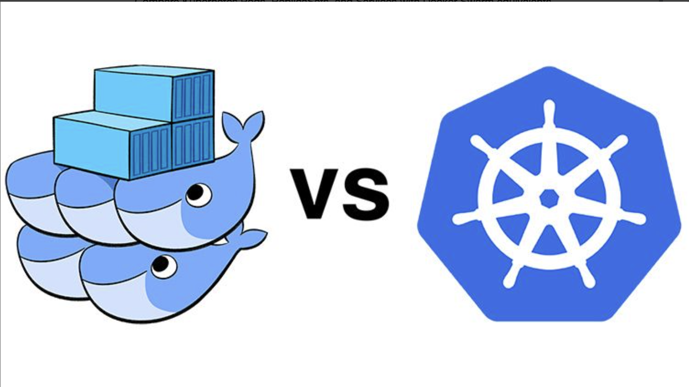
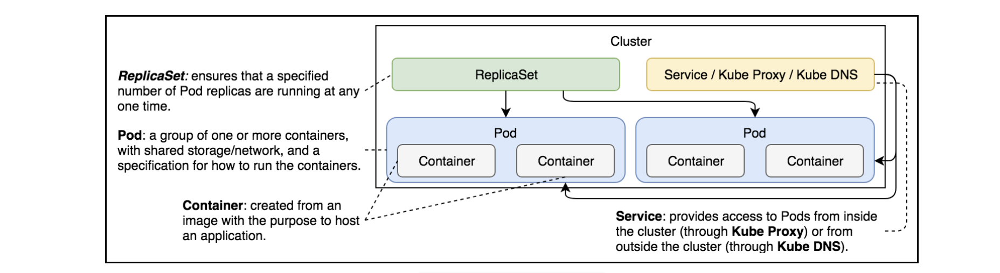

# Comparison with Docker Swarm

Compare Kubernetes Pods, ReplicaSets, and Services with Docker Swarm equivalents.

## Comparing Pods, ReplicaSets, and Services#

- Starting from this lesson, we’ll compare each Kubernetes feature with Docker Swarm equivalents. That way, Swarm users can have a smoother transition to Kubernetes or, depending on their goals, they can choose to stick with Swarm.
- Please keep in mind that the comparisons will be made only for a specific set of features. You will not (yet) be able to conclude whether Kubernetes is better or worse than Docker Swarm. You’ll need to grasp both products in their entirety to make an educated decision. The comparisons are useful only as a base for more detailed examinations of the two products.
  
  Docker swarm vs Kubernetes
- For now, we’ll limit the comparison scope to Pods, ReplicaSets, and Services on the one hand, and Docker Service stacks, on the other.

## Looking into Kubernetes definition

Let’s start with the Kubernetes file go-demo-2.yml (the same one we used before).
The definition is as follows:

```yaml
apiVersion: apps/v1
kind: ReplicaSet
metadata:
  name: go-demo-2-db
spec:
  selector:
    matchLabels:
      type: db
      service: go-demo-2
  template:
    metadata:
      labels:
        type: db
        service: go-demo-2
    spec:
      containers:
        - name: db
          image: mongo:3.3
          ports:
            - containerPort: 28017

---
apiVersion: v1
kind: Service
metadata:
  name: go-demo-2-db
spec:
  ports:
    - port: 27017
  selector:
    type: db
    service: go-demo-2

---
apiVersion: apps/v1beta2
kind: ReplicaSet
metadata:
  name: go-demo-2-api
spec:
  replicas: 3
  selector:
    matchLabels:
      type: api
      service: go-demo-2
  template:
    metadata:
      labels:
        type: api
        service: go-demo-2
    spec:
      containers:
        - name: api
          image: vfarcic/go-demo-2
          env:
            - name: DB
              value: go-demo-2-db
          readinessProbe:
            httpGet:
              path: /demo/hello
              port: 8080
            periodSeconds: 1
          livenessProbe:
            httpGet:
              path: /demo/hello
              port: 8080

---
apiVersion: v1
kind: Service
metadata:
  name: go-demo-2-api
spec:
  type: NodePort
  ports:
    - port: 8080
  selector:
    type: api
    service: go-demo-2
```

Defintion of go-demo-2

## Looking into Docker Swarm definition#

Now, let’s look at the Docker stack defined in `go-demo-2-swarm.yml`.
The specification is as follows:

```yaml
version: "3"
services:
  api:
    image: vfarcic/go-demo-2
    environment:
      - DB=db
    ports:
      - 8080
    deploy:
      replicas: 3
  db:
    image: mongo
```

### Pods#

Both definitions accomplish the same result. There is no important difference from the functional point of view, except in Pods. Docker does not have the option to create something similar. When Swarm services are created, they are spread across the cluster, and there is no easy way to specify that multiple containers should run on the same node. Whether multi-container Pods are useful or not is something we’ll explore later. For now, we’ll ignore that feature.

### ReplicaSets#

If we execute something like `docker stack deploy -c go-demo-2-swarm.yml` `go-demo-2`, the result would be equivalent to what we get when we run `kubectl create -f go-demo-2.yml`. In both cases, we get three replicas of `vfarcic/go-demo-2`, and one replica of `mongo`. Respective schedulers are making sure that the desired state (almost) always matches the actual state. Networking communication through internal DNS is also established with both solutions. Each node in a cluster would expose a randomly defined port that forwards requests to the `api`. All in all, there are no functional differences between the two solutions.

### Services

- When it comes to the way services are defined, there is a considerable difference. Docker’s stack definition is much more compact and straightforward. We have defined in twelve lines what took around eighty lines in the Kubernetes format.

- We might argue that the Kubernetes YAML file could have been smaller. Maybe it could. Still, it’ll be bigger and more complex no matter how much we simplify it. We might also say that Docker’s stack is missing `readinessProbe` and `livenessProbe`. That is because we have decided not to put it there because the `vfarcic/go-demo-2` image already has the `HEALTHCHECK` definition that Docker uses for similar purposes. In most cases, Dockerfile is a better place to define health checks than a stack definition. That does not mean that it cannot be set or overwritten in a YAML file. It can, when needed. But that is not the case in this example.

### Conclusion#

- To conclude, if we limit ourselves only to Kubernetes Pods, ReplicaSets, and Services and their equivalents in Docker Swarm, the latter win due to a much simpler and more straightforward way to define specs. From the functional perspective, both are very similar.

- Should we conclude that Swarm is a better option than Kubernetes? Not at all. At least, not until we compare other features. Swarm may have won this round, but the competition has just begun. As we progress through the course, we’ll see that there’s much more to Kubernetes. We have only scratched the surface.

---

# Quiz Yourself on Services

`Technical Quiz`

## 1. (True or False) A Pod that replaces a terminated or failed Pod will have the same IP.

> Ans: False

## 2. (Fill in the blank.) The port exposed by the ClusterIP type Service is **\_\_\_\_**.

> Ans: `accessible only from the inside of the cluster`

## 3. (True or False) When NodePort is used for creating a Service, ClusterIP will be created automatically.

> Ans: `True`

## 4. Which command can be used to expose a resource as a new Kubernetes Service?

> Ans: `kubectl expose`

## 5. (Fill in the blank.) If the number of Pods doesn’t change, the number of requests forwarded to each Pod will be **\_\_\_\_**.

> Ans: `equal`

---

# What's Next?

Review what we’ve learned so far and what we’ll learn next.

## Summary#

- We went through the most important aspects of Services. There are a few other cases we did not explore, but the current knowledge should be more than enough to get you going.
- Services are indispensable objects without which communication between Pods would be difficult and volatile. They provide static addresses through which we can access them not only from other Pods but also from outside the cluster. This ability to have fixed entry points is crucial because it provides stability to otherwise dynamic elements of the cluster. Pods come and go, but Services stay.
- We are one crucial topic away from having a fully functional, yet still simple, strategy for the deployment and management of our applications. We are yet to explore how to deploy and update our services without downtime.
  > Note: To learn more about Services, please explore Service [`v1 core API`](https://kubernetes.io/docs/reference/generated/kubernetes-api/v1.24/#service-v1-core) documentation.
  > 
  > Components explored so far

The above illustration shows and defines the Kubernetes components we have studied so far.
