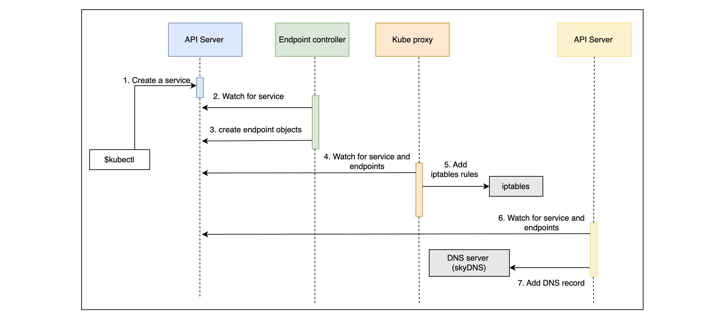
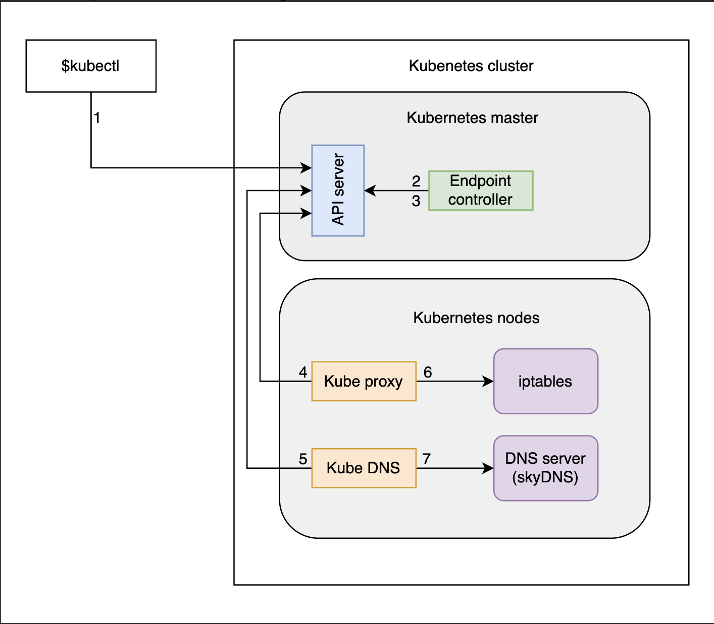
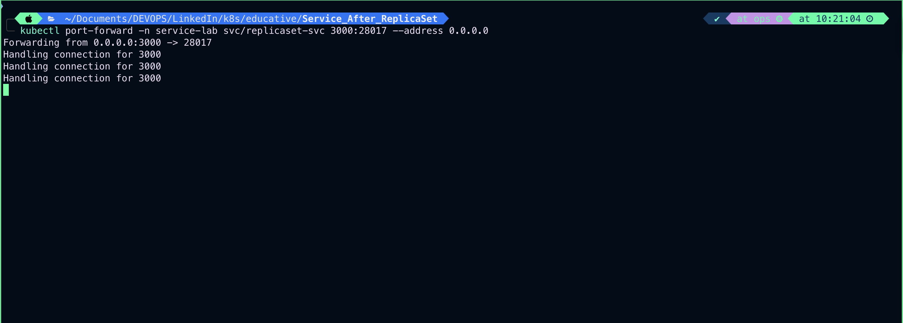
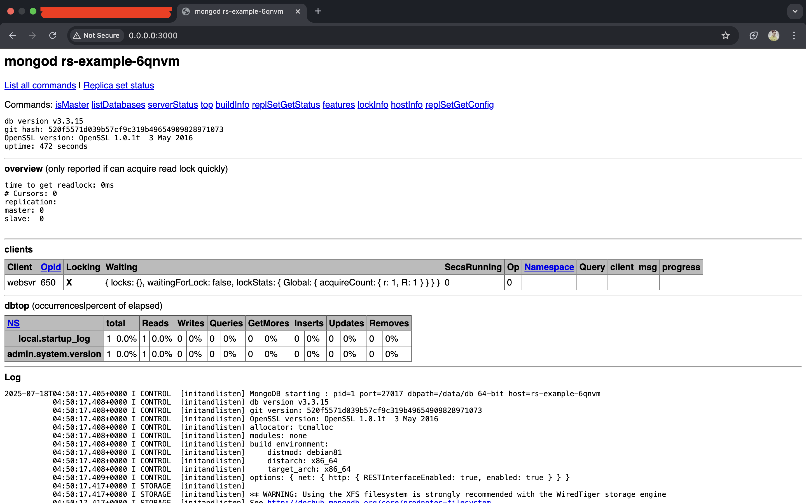
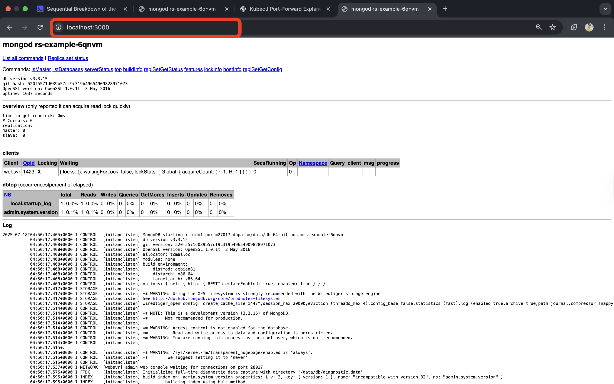
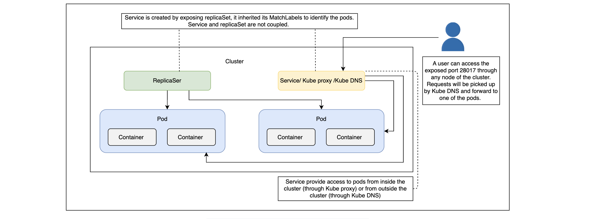
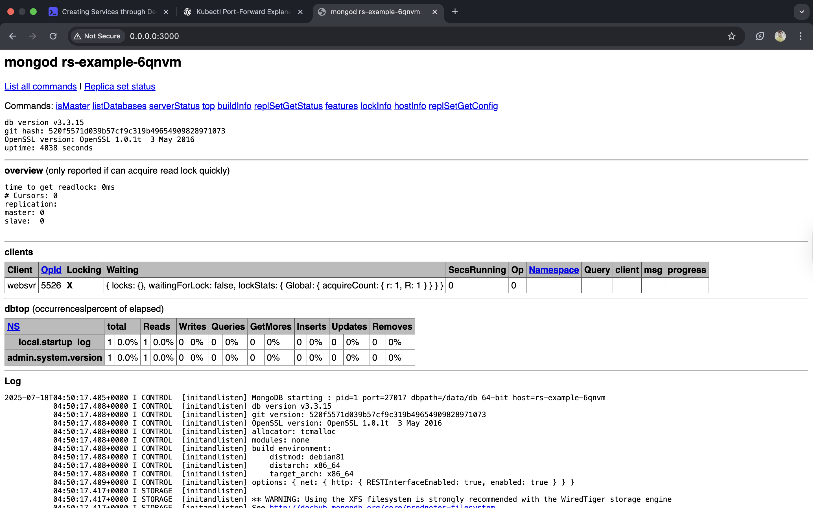
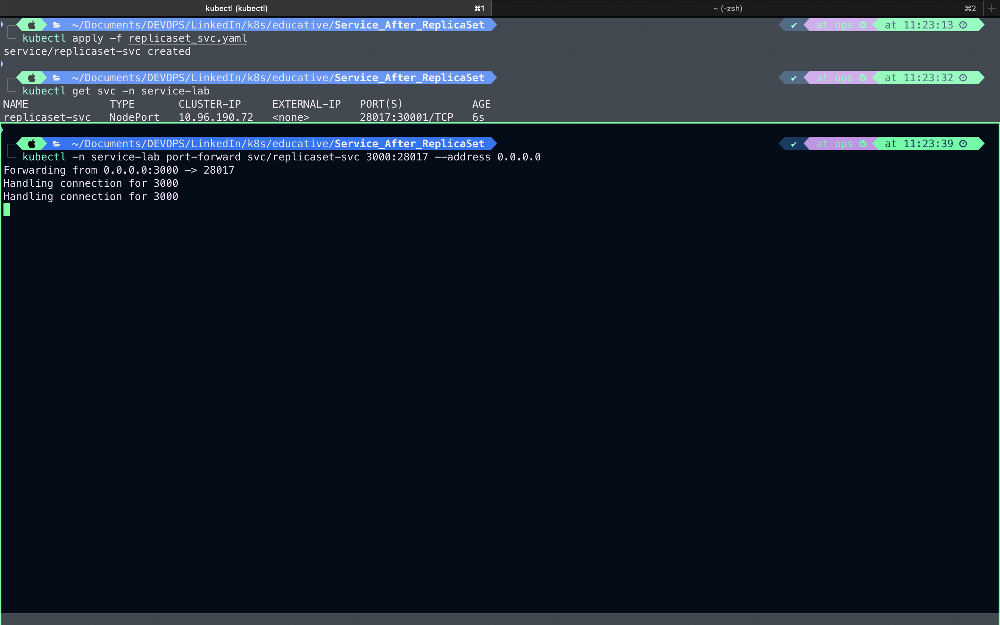

# Getting Started with Communication

## The problem#

- Pods are the smallest unit in Kubernetes and have a relatively short life span. They are born, and destroyed. They are never healed. The system heals itself by creating new Pods (cells) and by terminating those that are unhealthy or those that are surplus. The system can last long while Pods cannot.
- Controllers, together with other components like the scheduler, ensure that the Pods are doing the right thing. They control the scheduler. We have used only one of them so far.
- ReplicaSet are supposed to ensure that the desired number of Pods are always running. If there are too few Pods, ReplicaSet will create new ones. If there are too many of them, some will be destroyed. Pods that become unhealthy are terminated as well. All that, and a bit more, is controlled by `ReplicaSet`.
- The problem with our current setup is that there are no communication paths. Our Pods cannot communicate with each other. So far, only containers inside a Pod can talk with each other through `localhost`. This necessitates both the API and the database needed to be inside the same Pod. This was a less than appropriate solution for quite a few reasons.
- The main problem is that we cannot scale one without the other. We can not design the setup in a way that there are, for example, three replicas of the API and one replica of the database. The primary obstacle, again, is communication.
- Truth be told, each Pod does get its own address. We could also split the API and the database into different Pods and configure the API Pods to communicate with the database through the address of the Pod it lives in.
- However, because Pods are unreliable, short-lived, and volatile, we cannot assume that the database would always be accessible through the IP of a Pod. When that Pod gets destroyed (or fails), the ReplicaSet would create a new one and assign it a new address.
- We need a stable, never-to-be-changed address that will forward requests to whichever Pod is currently running.

## The solution#

- Kubernetes Services provide addresses through which associated Pods can be accessed.

## Creating Services by Exposing Ports

Learn how to create Kubernetes Services by exposing ports.

## Creating ReplicaSets#

- Before we dive into Services, we should create a ReplicaSet similar to the one we used in the previous chapter. It’ll provide the Pods that we can use to demonstrate how Services work.
- Let’s look at the ReplicaSet definition ReplicaSets.yaml. The only significant difference is the db container definition and namespace from replicaset to service-lab:

```bash
...
- name: db
  image: mongo:3.3
  command: ["mongod"]
  args: ["--rest", "--httpinterface"]
  ports:
  - containerPort: 28017
    protocol: TCP
...
```

We customize the command and the arguments so that MongoDB exposes the REST interface. We also define the `containerPort`. Those additions are needed so that we can test that the database is accessible through the Service.

- Let’s create the ReplicaSet:

```bash
kubectl apply -f ReplicaSets.yaml
namespace/replicaset unchanged
replicaset.apps/rs-example created
```

# Exposing a resource#

- We can use the `kubectl expose` command to expose a resource as a new Kubernetes Service. That resource can be a `Deployment`, another `Service`, a `ReplicaSet`, a `ReplicationController`, or a `Pod`. We’ll expose the ReplicaSet because it’s already running in the cluster.

```bash
kubectl expose rs rs-example \
    --name=replicaset-svc \
    --target-port=28017 \
    --type=NodePort
```

Exposing resource imperatively

- `Line 1`: We specify that we want to expose a `ReplicaSet` (rs).
- `Line 2`: The name of the new Service should be `eplicaset-svc`.
- `Line 3`: The port that should be exposed is `28017` (the port MongoDB interface is listening to).
- `Line 4`: We specify that the type of the Service should be `NodePort`.

```bash
kubectl -n service-lab expose rs rs-example --name=replicaset-svc --target-port 28017 --type=NodePort
service/replicaset-svc exposed
```

- As a result, the target port will be exposed on every node of the cluster to the outside world and be routed to one of the Pods controlled by the ReplicaSet.
- List service in service-lab namespace

```bash
kubectl get svc -n service-lab
NAME             TYPE       CLUSTER-IP     EXTERNAL-IP   PORT(S)           AGE
replicaset-svc   NodePort   10.96.13.141   <none>        28017:31003/TCP   4m4s
```

- 🚪 NodePort Port Range in Kubernetes:

```bash
30000 to 32767
```

# Other types of Services#

There are other Service types we could have used to establish communication:

## `ClusterIP#`

`ClusterIP` (the default type) exposes the port only inside the cluster. Such a port would not be accessible from anywhere outside. `ClusterIP` is useful when we want to enable communication between Pods and still prevent any external access.

> `Note`: If `NodePort` is used, `ClusterIP` will be created automatically.

## `LoadBalancer`#

The `LoadBalancer` type is only useful when combined with the cloud provider’s load balancer.

## `ExternalName`#

`ExternalName` maps a Service to an external address (e.g., kubernetes.io).

- In this chapter, we’ll focus on `NodePort` and `ClusterIP`. `LoadBalancer` will have to wait until we move our cluster to one of the cloud providers. `ExternalName` has a very limited usage, so we’re looking into that.

# Try it yourself#

All the commands used in this lesson are given below:

```bash
kubectl create -f go-demo-2-rs.yml

kubectl get -f go-demo-2-rs.yml

kubectl expose rs go-demo-2 \
    --name=go-demo-2-svc \
    --target-port=28017 \
    --type=NodePort
```

# Sequential Breakdown of the Process

Learn the sequential processes kicked off by a Service creation.

## 1. Kubernetes client (`kubectl`) sent a request to the API server requesting the creation of the `Service` based on Pods created through the rs-example `ReplicaSet`.

## 2. The `endpoint controller` is watching the API server for new `Service` events. It detects that there is a new `Service` object.

## 3. The endpoint controller creates endpoint objects with the same name as the Service, and it uses the Service selector to identify endpoints (in this case, the IP and the port of `rs-example` Pods).

## 4. The kube-proxy is watching for Service and endpoint objects. It detects that there is a new Service and a new endpoint object.

## 5. The kube-proxy adds iptables rules which capture traffic to the Service port and redirect it to endpoints. For each endpoint object, it adds an iptables rule, which selects a Pod.

## 6. The kube-dns add-on is watching for a Service object. It detects that there is a new Service.

## 7. The kube-dns added db's record to the server (skydns).


The sequence of events followed by request to create a Service

- The sequence we described is useful when we want to understand everything that happens in the cluster from the moment we request the creation of a new Service. However, it might be too confusing, so we’ll try to explain the same process through a diagram that more closely represents the cluster.
  
  The Kubernetes components view when requesting the creation of a Service

## Let’s look at our new Service:

```bash
kubectl -n service-lab describe svc/replicaset-svc
```

```bash
# Output
Name:                     replicaset-svc
Namespace:                service-lab
Labels:                   <none>
Annotations:              <none>
Selector:                 db=mongoLabs,type=backend
Type:                     NodePort
IP Family Policy:         SingleStack
IP Families:              IPv4
IP:                       10.96.13.141
IPs:                      10.96.13.141
Port:                     <unset>  28017/TCP
TargetPort:               28017/TCP
NodePort:                 <unset>  31003/TCP
Endpoints:                10.244.1.4:28017,10.244.2.3:28017
Session Affinity:         None
External Traffic Policy:  Cluster
Internal Traffic Policy:  Cluster
Events:                   <none>
```

### 1. `Lines 1–2`: We can see the name and the namespace.

### 2. `Line 6`: The selector matches the one from the ReplicaSet. The Service is not directly associated with the ReplicaSet (or any other controller) but with Pods through matching labels.

### 3. `Lines 9–13`: Next is the NodePort type which exposes ports to all the nodes. Since NodePort automatically creates ClusterIP type as well, all the Pods in the cluster can access the TargetPort. The Port is set to 28017. That is the port that the Pods can use to access the Service. Since we do not specify it explicitly when we execute the command, its value is the same as the value of the TargetPort, which is the port of the associated Pod that will receive all the requests. NodePort is generated automatically since we do not set it explicitly. It is the port that we can use to access the Service and, therefore, the Pods from outside the cluster. In most cases, it should be randomly generated. That way, we avoid any clashes.

## Let’s see whether the Service actually works:

```bash
kubectl port-forward -n service-lab svc/replicaset-svc 3000:28017 --address 0.0.0.0
```

> Let me break it down and explain each part, including what "Handling connection for 3000" means.

### 🔍 Command Breakdown

| Part                 | Description                                                                                                                                  |
| -------------------- | -------------------------------------------------------------------------------------------------------------------------------------------- |
| `kubectl`            | The Kubernetes CLI tool.                                                                                                                     |
| `port-forward`       | A command used to forward one or more local ports to a pod or service in your Kubernetes cluster.                                            |
| `-n service-lab`     | Specifies the namespace `service-lab` where your service (`replicaset-svc`) resides.                                                         |
| `svc/replicaset-svc` | Targets the Kubernetes **Service** named `replicaset-svc`.                                                                                   |
| `3000:28017`         | Forwards **local port 3000** to the **target port 28017** on the service.                                                                    |
| `--address 0.0.0.0`  | Binds to all network interfaces (not just `localhost`). This allows external machines (on the same network) to access it via your host's IP. |

## 💡 What's Happening?

- You're exposing the internal port `28017` of the Kubernetes Service replicaset-svc on your local machine's port `3000`.
- Anyone accessing `http://<your-host-ip>:3000` will get forwarded to the service’s internal port 28017.

`Output`:




> `🚨 Important Note` Using `--address 0.0.0.0` opens it to **_anyone on the network_**, not just your machine. Be careful in public or shared environments — use firewall rules or IP whitelisting if needed.

## ✅ Test It

```bash
curl http://localhost:3000
# OR from another machine
curl http://<your-host-IP>:3000

```

## 

## As already mentioned in the previous chapters, creating Kubernetes objects using imperative commands is not a good idea unless we’re trying some quick hack.

## The same applies to Services. Even though `kubectl expose` did the work, we should try to use a documented approach through YAML files. In that spirit, we’ll destroy the Service we created and start over.

```bash
kubectl delete -n service-lab svc/replicaset-svc
```

```bash
# Output:
service "replicaset-svc" deleted
```

---

# Creating Services through Declarative Syntax

Learn to create Services through declarative syntax.

## Looking into the syntax#

- We can accomplish a similar result as the one using kubectl expose through the replicaset-svc.yml specification shown below:

```bash
apiVersion: v1
kind: Service
metadata:
  name: replicaset-svc
spec:
  type: NodePort
  ports:
  - port: 28017
    nodePort: 30001
    protocol: TCP
  selector:
    type: backend
    db: mongoLabs

```

### 1. `Lines 1–4`: Since we have already discussed the meaning of apiVersion, kind, and metadata, we’ll jump straight into the spec section.

### 2. `Line 5`: Since we have already explored some of the options through the kubectl expose command, the spec should be relatively easy to grasp.

### 3. `Line 6`: The `type` of the Service is set to NodePort, meaning that the ports will be available both within the cluster as well as from outside by sending requests to any of the nodes.

### 4. `Lines 7–10`: The `ports` section specifies that the requests should be forwarded to the Pods on port `28017`. The `nodePort` is new. Instead of letting the Service expose a random port, we set it to the explicit value of 30001. Even though this is not a good practice, let’s demonstrate that option as well. The protocol is set to `TCP`. The only other alternative would be to use `UDP`. We could have skipped the protocol altogether since `TCP` is the default value but, sometimes, it is a good idea to leave things as a reminder of an option.

### 5.` Lines 11–13`: The `selector` is used by the `Service` to know which Pods should receive requests. It works in the same way as `ReplicaSet` selectors. In this case, we define that the `Service` should forward requests to `Pods` with `labels` `type` set to `backend` and `db` set to mongoLabs. Those two labels are set in the Pods spec of the `ReplicaSet`.

## Creating the Service#

Now that we know in the definition, we can proceed and create the Service.

```bash
kubectl apply -f replicaset_svc.yaml
#Output:
service/replicaset-svc created

kubectl get svc -n service-lab
# Output:
NAME             TYPE       CLUSTER-IP     EXTERNAL-IP   PORT(S)           AGE
replicaset-svc   NodePort   10.96.190.72   <none>        28017:30001/TCP   6s

```

## Now that the Service is running (again), we can double-check that it is working as expected by trying to access MongoDB UI.

```bash
 kubectl -n service-lab port-forward svc/replicaset-svc 3000:28017 --address 0.0.0.0


```




---

## Let’s look at the endpoint. It holds the list of Pods that should receive requests:

```bash
kubectl get ep -o yaml -n service-lab
# Output:
Warning: v1 Endpoints is deprecated in v1.33+; use discovery.k8s.io/v1 EndpointSlice
apiVersion: v1
items:
- apiVersion: v1
  kind: Endpoints
  metadata:
    annotations:
      endpoints.kubernetes.io/last-change-trigger-time: "2025-07-18T05:53:32Z"
    creationTimestamp: "2025-07-18T05:53:32Z"
    labels:
      endpoints.kubernetes.io/managed-by: endpoint-controller
    name: replicaset-svc
    namespace: service-lab
    resourceVersion: "798110"
    uid: f64bb6ad-2efd-4944-ad8e-313fabcab6e4
  subsets:
  - addresses:
    - ip: 10.244.1.4
      nodeName: ops-cluster-worker2
      targetRef:
        kind: Pod
        name: rs-example-6qnvm
        namespace: service-lab
        uid: c1c2c89b-96fd-4239-9b13-7a840061f799
    - ip: 10.244.2.3
      nodeName: ops-cluster-worker3
      targetRef:
        kind: Pod
        name: rs-example-br9gz
        namespace: service-lab
        uid: 1d710185-ec99-4c51-b8bb-cbce95b43f5b
    ports:
    - port: 28017
      protocol: TCP
kind: List
metadata:
  resourceVersion: ""

```

## Verify Pods IP

```bash
kubectl get pods -n service-lab -o wide

#Output:
NAME               READY   STATUS    RESTARTS   AGE   IP           NODE                  NOMINATED NODE   READINESS GATES
rs-example-6qnvm   2/2     Running   0          73m   10.244.1.4   ops-cluster-worker2   <none>           <none>
rs-example-br9gz   2/2     Running   0          73m   10.244.2.3   ops-cluster-worker3   <none>           <none>
```

# Request forwarding#

- Each Pod has a unique IP that is included in the algorithm used when forwarding requests. Actually, it’s not much of an algorithm. Requests will be sent to those Pods randomly. That randomness results in something similar to round-robin load balancing. If the number of Pods does not change, each will receive an approximately equal number of requests.
- Random requests forwarding should be enough for most use cases. If it’s not, we’d need to resort to a third-party solution. However, soon, when the newer Kubernetes versions are released, we’ll have an alternative to the iptables solution. We’ll be able to apply different types of load balancing algorithms like last connection, destination hashing, newer queue, and so on. Still, the current solution is based on iptables, and we’ll use it for now.

---

# Splitting the Pod and Establishing Communication through Services

✅ Goal

- Expose your API (go-demo-2) via kubectl port-forward or NodePort.

- Enable internal communication from API → MongoDB (db) using Kubernetes DNS (replicaset-svc).

Learn how to split Pods, create a separate DB Pod, and a Service to communicate with it.

## Looking into the definition#

`vim db_pod_rs.yaml`

```yaml
apiVersion: apps/v1
kind: ReplicaSet
metadata:
  namespace: service-lab
  name: db-pod-rs
spec:
  selector:
    matchLabels:
      type: backend-db
      app: db
      env: test
  template:
    metadata:
      labels:
        type: backend-db
        app: db
        env: test
    spec:
      containers:
        - name: db
          image: mongo:3.3
          ports:
            - containerPort: 28017
```

here containers now contain only mongo. We’ll define the API in a separate ReplicaSet.

## Creating the mongodb Service

The next one is the Service mongodb_svc.yml for the Pod we just created through the ReplicaSet.

```yaml
apiVersion: v1
kind: Service
metadata:
  namespace: service-lab
  name: replicaset-svc
spec:
  type: ClusterIP # Default and ideal for internal communication
  ports:
    - port: 28017
      targetPort: 28017
      protocol: TCP
  selector:
    type: backend-db
    app: db
    env: test
```

## Creating api ReplicaSet

```bash
vim api_rs.yaml
```

```yaml
apiVersion: apps/v1
kind: ReplicaSet
metadata:
  namespace: service-lab
  name: api-rs
spec:
  replicas: 3
  selector:
    matchLabels:
      type: backend-api
      app: api
      env: test
  template:
    metadata:
      labels:
        type: backend-api
        app: api
        env: test
    spec:
      containers:
        - name: api
          image: vfarcic/go-demo-2
          env:
            - name: DB
              value: replicaset-svc
          readinessProbe:
            httpGet:
              path: /demo/hello
              port: 8080
            periodSeconds: 1
          livenessProbe:
            httpGet:
              path: /demo/hello
              port: 8080
```

## ✅ Result

| Purpose                       | Config                           | Status      |
| ----------------------------- | -------------------------------- | ----------- |
| Internal DNS for MongoDB      | `replicaset-svc:28017`           | ✅ Works    |
| API → DB Communication        | `value: replicaset-svc`          | ✅ Works    |
| Exposing API for External Use | Add `NodePort` or `port-forward` | ✅ Optional |

## 🌐 To Expose the API

Use:

```bash
kubectl port-forward -n service-lab rs/api-rs 8080:8080

```

Or create a service:

```bash
vim api-service.yaml
```

```yaml
apiVersion: v1
kind: Service
metadata:
  name: api-service
  namespace: service-lab
spec:
  type: NodePort
  ports:
    - port: 8080
      nodePort: 30002
      targetPort: 8080
  selector:
    type: backend-api
    app: api
    env: test
```

Then access your API with:

```bash
curl http://<NodeIP>:30002/demo/hello

```

---

# Accessing the API

Before we proceed, it might be worth mentioning that the code behind the `vfarcic/go-demo-2` image is designed to fail if it cannot connect to the database. The fact that the three replicas of the `api-rs` Pod are running means that the communication is established. The only verification left is to check whether we can access the API from outside the cluster.

- Let’s try that out:

```bash
nohup kubectl port-forward service/api-service --address 0.0.0.0  3000:8080 > /dev/null 2>&1 &

# Please wait a few seconds before executing the following command
curl -i "http://localhost:3000/demo/hello"
```

The output of the last command is as follows. You can also open the link beside “Run” button to see the page:

```bash
HTTP/1.1 200 OK
Date: Tue, 12 Dec 2017 21:27:51 GMT
Content-Length: 14
Content-Type: text/plain; charset=utf-8

hello, world!
```

We get the response “200” and a friendly “hello, world!” message indicating that the API is indeed accessible from outside the cluster.

---

# Troubleshooting tips for minikube#

You won’t always need to bind the ports using the port-forward command to interact with the services. If you are using minikube, you can use the following commands to interact with the service:

```bash
PORT=$(kubectl get svc go-demo-2-svc \
    -o jsonpath="{.spec.ports[0].nodePort}")

IP=$(minikube ip)

curl -i "http://$IP:$PORT/demo/hello"

```
