# Getting startes with Volumes

Learn about Kubernetes volumes and how to create a cluster with them.

# State preservation#

> `Note`: Having a system without a state is impossible. Even though there is a tendency to develop stateless applications, we still need to deal with the state. There are databases and other stateful third-party applications. No matter what we do, we need to make sure that the state is preserved regardless of what happens to containers, Pods, or even whole nodes.

- Most of the time, stateful applications store their state on disk. This leaves us with a problem. If a container crashes, `kubelet` will restart it. The problem is that it will create a new container based on the same image. All data accumulated inside a container that crashed will be lost.

# Volumes

- `Kubernetes volumes` solve the need to preserve the state across container crashes. In essence, volumes are references to files and directories that are accessible to containers that form a Pod. The significant difference between different types of Kubernetes volumes is in the way these files and directories are created.
- While the primary use case for volumes is the preservation of the state, there are quite a few others. For example, we might use volumes to access Docker’s socket running on a host. Or we might use them to access configuration residing in a file on the host file system.
  > `Note`: We can describe volumes as a way to access a file system that might be running on the same host or somewhere else. No matter where that file system is, it is external to the containers that mount volumes. There can be many reasons why someone might mount a volume, with state preservation being only one of them.
- There are over 25 volume types supported by Kubernetes. It would take us too much time to go through all of them. Besides, even if we’d like to do that, many volume types are specific to a hosting vendor. For example, `awsElasticBlockStore` works only with AWS, `azureDisk` and `azureFile` work only with Azure, and so on.
  `
- We’ll limit our exploration to volume types that can be used within k3d. You should be able to extrapolate that knowledge to volume types applicable to your hosting vendor of choice.
- The following command will create a cluster. It will copy the `prometheus.yml` from `usercode/volume` from the user directory to `/files` in the cluster.

```bash
k3d cluster create mycluster --volume "/usercode/volume/prometheus-conf.yml:/files/prometheus-conf.yml"
```

✅ Equivalent in Kind: Use extraMounts in the config file
You can’t directly pass --volume on the CLI like k3d, but Kind allows volume mounting using a kind-config.yaml file.

### ✅ Example: Mount prometheus-conf.yml into the Kind node

Suppose you have:

```bash
# /path/to/prometheus-conf.yml

/Users/rajeevsingh/Documents/DEVOPS/LinkedIn/k8s/educative/Volumes_After_Ingress/prometheus-conf.yml
```

## Step 1: Create kind-config.yml

```yml
# kind-config.yaml
kind: Cluster
apiVersion: kind.x-k8s.io/v1alpha4
name: mycluster
nodes:
  # Control-plane node
  - role: control-plane
    extraPortMappings:
      - containerPort: 80
        hostPort: 80
        protocol: TCP
      - containerPort: 443
        hostPort: 443
        protocol: TCP
    extraMounts:
      - hostPath: /var/run/docker.sock
        containerPath: /var/run/docker.sock
      - hostPath: /Users/rajeevsingh/Documents/DEVOPS/LinkedIn/k8s/educative/Volumes_After_Ingress/prometheus-conf.yml
        containerPath: /files/prometheus-conf.yml

  # Worker node 1
  #- role: worker

  # Worker node 2
  #- role: worker
```

## Step 2: Create Kind cluster with config

```bash
kind create cluster --name mycluster --config kind-config.yml

```

The output is as follows:

```bash
Creating cluster "mycluster" ...
 ✓ Ensuring node image (kindest/node:v1.33.1) 🖼
 ✓ Preparing nodes 📦
 ✓ Writing configuration 📜
 ✓ Starting control-plane 🕹️
 ✓ Installing CNI 🔌
 ✓ Installing StorageClass 💾
Set kubectl context to "kind-mycluster"
You can now use your cluster with:

kubectl cluster-info --context kind-mycluster

Have a question, bug, or feature request? Let us know! https://kind.sigs.k8s.io/#community 🙂
```

## ✅ Verify inside the Kind node

```bash
docker exec -it mycluster-control-plane ls /files
# You should see: prometheus-conf.yml

```

The output is as follows:

```bash
prometheus-conf.yml

What's next:
    Try Docker Debug for seamless, persistent debugging tools in any container or image → docker debug mycluster-control-plane
    Learn more at https://docs.docker.com/go/debug-cli/
```

---

# Accessing a Host’s Resources through hostPath Volumes

Learn about the hostPath volume type and how to access the host's resources through it.

## Building docker images#

- Sooner or later, we’ll have to build our images. A simple solution would be to execute the docker image build command directly from a server. However, that might cause problems. Building images on a single host means that there is uneven resource utilization and that there is a single point of failure. Wouldn’t it be better if we could build images anywhere inside a Kubernetes cluster?
- Instead of executing the `docker image build` command, we could create a Pod based on the `docker` image. Kubernetes will make sure that the Pod is scheduled somewhere inside the cluster and so distribute resource usage much better.

## Creating a pod with a Docker image#

Let’s start with an elementary example. If we can list the images, we’ll prove that running docker commands inside containers works. Since, from Kubernetes’ point of view, Pods are the smallest entity, that’s what we’ll run.

```bash
kubectl run docker --image=docker:17.11 --restart=Never \
> docker image ls

kubectl get pods
```

We create a Pod named `docker` and based it on the official `docker` image. Since we want to execute a one-shot command, we specify that it should `Never` restart. Finally, the container command is `docker image ls`. The second command lists all the Pods in the cluster (including failed ones).

The output of the latter command is as follows:

```bash
NAME     READY   STATUS              RESTARTS   AGE
docker   0/1     ContainerCreating   0          0s

NAME     READY   STATUS   RESTARTS   AGE
docker   0/1     Error    0          26s
```

The output should show that the status is `Error`, therefore indicating that there is a problem with the container we’re running. If the status is not yet `Error` in your case, Kubernetes is probably still pulling the image. In that case, please wait a few moments and re-execute the `kubectl get pods` command.

- Let’s look at the logs of the container:

```bash
kubectl logs -f pods/docker
```

The output is as follows:

```bash
Cannot connect to the Docker daemon at unix:///var/run/docker.sock. Is the docker daemon running?
```

- Docker consists of two main parts: client and server. When we execute `docker image ls`, we invoke the client, which tries to communicate with the server through its API. The problem is that the Docker server is not running in that container. We should tell the client (inside a container) to use the Docker server that is already running on the host.
- By default, the client sends instructions to the server through the socket located in “/var/run/docker.sock”. We can accomplish our goal if we mount that file from the host into a container.
- Before we try to enable communication between a Docker client in a container and a Docker server on a host, we’ll delete the Pod we created a few moments ago.

```bash
kubectl delete pod docker
```

# Creating a Pod with hostPath#

Let’s mount the file `/var/run/docker.sock` from the host in our Pod.

## Looking into the definition#

Let’s look at the Pod definition stored in `docker.yml`.

```yml
apiVersion: v1
kind: Pod
metadata:
  name: docker
spec:
  containers:
    - name: docker
      image: docker:17.11
      command: ["sleep"]
      args: ["100000"]
      volumeMounts:
        - mountPath: /var/run/docker.sock
          name: docker-socket
  volumes:
    - name: docker-socket
      hostPath:
        path: /var/run/docker.sock
        type: Socket
```

Part of the definition closely mimics the `kubectl run` command we executed earlier. The only significant difference is in the `volumeMounts` and `volumes` sections.
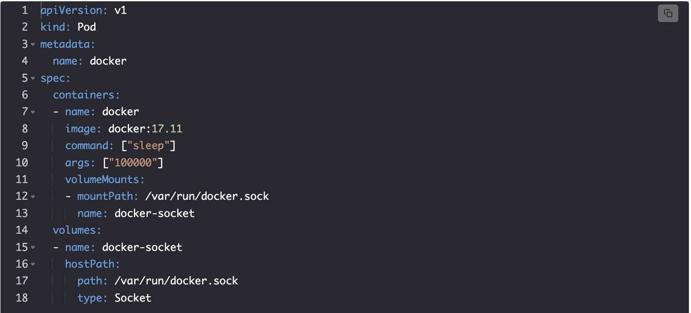

- `Lines 9–10`: We changed the command and the arguments to `sleep 100000`. This will give us more freedom since we’ll be able to create the Pod, enter inside its only container, and experiment with different commands.
- `Line 11`: The `volumeMounts` field is relatively straightforward, and it is the same no matter which type of Volume we’re using. In this section, we specify the `mountPath` and the `name` of the volume. The former is the path we expect to mount inside this container. You’ll notice that we are not specifying the type of the volume nor any other specifics inside the `VolumeMounts` section. Instead, we simply have a reference to a volume called `docker-socket`.
- `Line 14`: The volume configuration specific to each type is defined in the `volumes` section. In this case, we use the `hostPath` volume type.

# The hostPath volume#

- The `hostPath` volume allows us to mount a file or a directory from a host to Pods and, through them, to containers. Before we discuss the usefulness of this type, we’ll have a short discussion about use cases when this is not a good choice.
  > `Note`: Do not use `hostPath` to store a state of an application. Since it mounts a file or a directory from a host into a Pod, it is not fault-tolerant. If the server fails, Kubernetes will schedule the Pod to a healthy node, and the state will be lost.
- For our use case, `hostPath` works just fine. We do not use it to preserve the state, but to gain access to the Docker server running on the same host as the Pod.
- `Lines 15–18`: The hostPath type has only two fields. The `path` represents the file or a directory we want to mount from the host. Since we want to mount a socket, we set the `type` accordingly. We can also use other types.

## Types of mounts in hostPath#

The types of mounts supported by the hostpath are as follows:

- The `Directory` type will mount a directory from the host. It must exist on the given path. If it doesn’t, we might switch to `DirectoryOrCreate` type, which serves the same purpose. The difference is that `DirectoryOrCreate` will create the directory if it does not exist on the host.

- The `File` and `FileOrCreate` types are similar to their Directory equivalents. The only difference is that this time we’d mount a file, instead of a directory.

- The other supported types are `Socket`, `CharDevice`, and `BlockDevice`. They should be self-explanatory. If you don’t know what character or block devices are, you probably don’t need those types.

## Try it yourself#

```bash
kubectl run docker  --image=docker:17.11  --restart=Never  docker image ls

kubectl get pods

kubectl logs -f docker

kubectl delete pod docker
```

# Running the Pod after mounting hostPath

Learn to create the Pod by mounting a Docker socket and playing around in it.

## Creating and testing the Pod#

Let’s create the Pod and check whether, this time, we can execute Docker commands from inside the container it’ll create.

```bash
vim docker.yml
```

```yml
apiVersion: v1
kind: Pod
metadata:
  name: docker
spec:
  containers:
    - name: docker
      image: docker:17.11
      command: ["sleep"]
      args: ["100000"]
      volumeMounts:
        - mountPath: /var/run/docker.sock
          name: docker-socket
  volumes:
    - name: docker-socket
      hostPath:
        path: /var/run/docker.sock
        type: Socket
```

```bash
kubectl create -f docker.yml
```

```bash
kubectl describe pod/docker
```

The output is as follows:

```bash
Mounts:
      /var/run/docker.sock from docker-socket (rw)
      /var/run/secrets/kubernetes.io/serviceaccount from kube-api-access-7mjrg (ro)
Conditions:
  Type                        Status
  PodReadyToStartContainers   True
  Initialized                 True
  Ready                       True
  ContainersReady             True
  PodScheduled                True
Volumes:
  docker-socket:
    Type:          HostPath (bare host directory volume)
    Path:          /var/run/docker.sock
    HostPathType:  Socket
  kube-api-access-7mjrg:
    Type:                    Projected (a volume that contains injected data from multiple sources)
    TokenExpirationSeconds:  3607
    ConfigMapName:           kube-root-ca.crt
    Optional:                false
    DownwardAPI:             true
QoS Class:                   BestEffort
Node-Selectors:              <none>
Tolerations:                 node.kubernetes.io/not-ready:NoExecute op=Exists for 300s
                             node.kubernetes.io/unreachable:NoExecute op=Exists for 300s
Events:
  Type    Reason     Age   From               Message
  ----    ------     ----  ----               -------
  Normal  Scheduled  39s   default-scheduler  Successfully assigned default/docker to mycluster-control-plane
  Normal  Pulling    38s   kubelet            Pulling image "docker:17.11"
  Normal  Pulled     29s   kubelet            Successfully pulled image "docker:17.11" in 9.709s (9.709s including waiting). Image size: 41704208 bytes.
  Normal  Created    29s   kubelet            Created container: docker
  Normal  Started    29s   kubelet            Started container docker
```

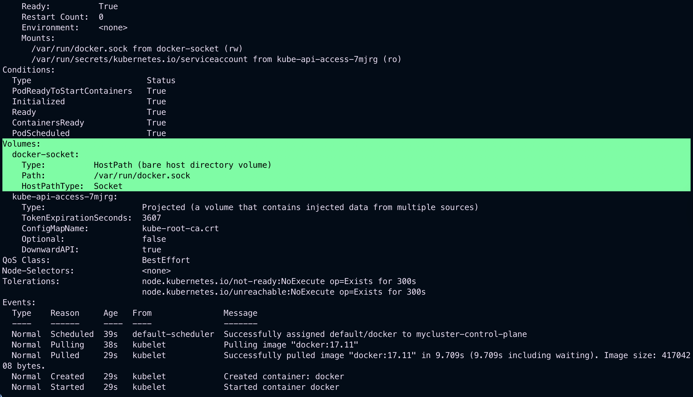
Since the image is already pulled, starting the Pod should be almost instant.
Let’s see whether we can retrieve the list of Docker images.

```bash
kubectl exec -it docker -- docker image ls --format "{{.Repository}}"
```

The output is as follows:

```bash
my-jenkins
<none>
docker
rajeevkumarsingh05/python-app1
rajeevkumarsingh05/python-app1
rajeevkumarsingh05/python-app1
rajeevkumarsingh05/python-app1
rajeevkumarsingh05/python-app
rajeevkumarsingh05/python-app
rajeevkumarsingh05/python-app
kindest/node
rajeevkumarsingh05/getting-started-todo-app
getting-started-todo-app-client
getting-started-todo-app-backend
traefik
node
node
phpmyadmin
mysql
todoapp-docker
rajeevkumarsingh05/todoapp-docker-multistage
kindest/node
grafana/grafana
kindest/node
gcr.io/k8s-minikube/kicbase
kindest/haproxy
weaveworks/weave-npc
weaveworks/weave-kube
registry.k8s.io/busybox
# images from the host
```

- Even though we executed the `docker` command inside a container, the output clearly shows the images from the host. We proved that mounting the Docker socket (`/var/run/docker.sock`) as a volume allows communication between Docker client inside the container, and Docker server running on the host.
  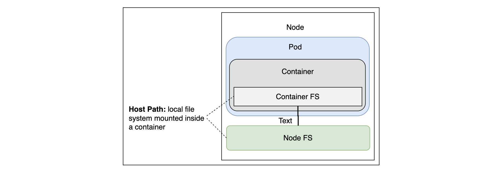
  hostPath mounted inside a container

# Playing around with Docker#

Let’s enter the container and see whether we can build a Docker image.

```bash
kubectl exec docker -it -- sh
# Enter the running container
```

- To build an image, we need a Dockerfile as well as an application’s source code. We’ll continue using go-demo-2 as the example, so our first action will be to clone the repository.

```bash
apk add -U git
git clone \
    https://github.com/Faizan-Zia/go-demo-2
cd go-demo-2
```

We used `apk add` to install `git`.On the other hand, `docker` and many other images use `alpine` as the base. If you’re not familiar with `alpine`, it is a very slim and efficient base image, and we strongly recommend that you use it when building your own.

> `Note`: Images like `debian`, `centos`, `ubuntu`, `redhat`, and similar base images are often a terrible choice made because of a misunderstanding of how containers work.

- `alpine` uses `apk` package management, so we invoked it to install `git`. Next, we cloned the `vfarcic/go-demo-2` repository, and, finally, we entered into the `go-demo-2` directory.
- List all the files of `go-demo-2`:

```bash
ls -ltr
```

The output is as follows:

```bash
total 68
drwxr-xr-x    4 root     root          4096 Jul 25 07:12 vendor
-rw-r--r--    1 root     root           527 Jul 25 07:12 stack.yml
-rw-r--r--    1 root     root           673 Jul 25 07:12 stack-test.yml
-rwxr-xr-x    1 root     root            56 Jul 25 07:12 run-functional.sh
-rw-r--r--    1 root     root          1552 Jul 25 07:12 production_test.go
drwxr-xr-x    2 root     root          4096 Jul 25 07:12 old
-rw-r--r--    1 root     root          4748 Jul 25 07:12 main_test.go
-rw-r--r--    1 root     root          3596 Jul 25 07:12 main.go
drwxr-xr-x    2 root     root          4096 Jul 25 07:12 k8s
-rw-r--r--    1 root     root          3058 Jul 25 07:12 go.sum
-rw-r--r--    1 root     root           657 Jul 25 07:12 go.mod
-rw-r--r--    1 root     root           963 Jul 25 07:12 functional_test.go
-rw-r--r--    1 root     root           725 Jul 25 07:12 docker-compose.yml
-rw-r--r--    1 root     root          1197 Jul 25 07:12 Jenkinsfile
-rw-r--r--    1 root     root           189 Jul 25 07:12 Dockerfile.test
-rw-r--r--    1 root     root           559 Jul 25 07:12 Dockerfile
```

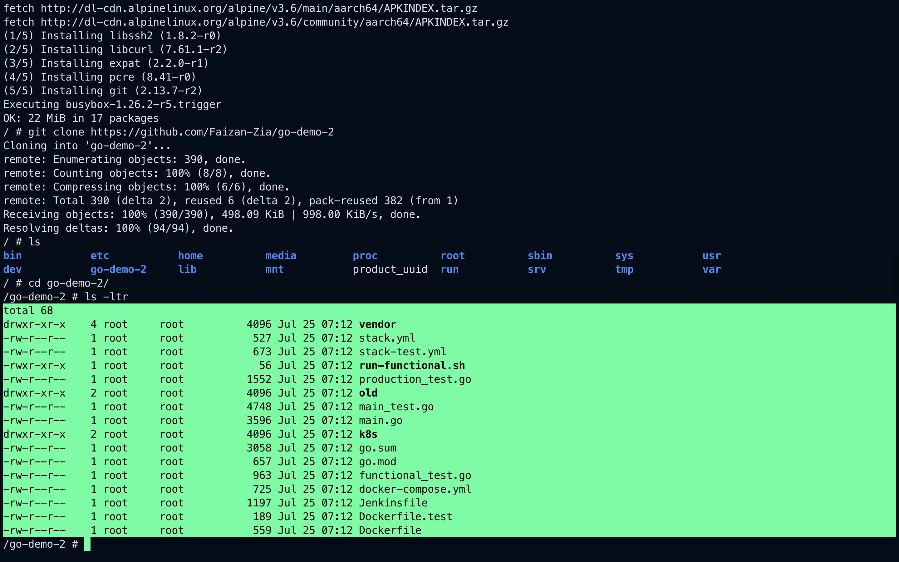
Let’s take a quick look at the Dockerfile.

```Dockerfile
FROM golang:1.12.6 AS build
ADD . /src
WORKDIR /src
RUN apt update && apt install ca-certificates libgnutls30
RUN go get -d -v
RUN go test --cover -v ./... --run UnitTest
RUN go build -v -o go-demo


FROM alpine:3.4
MAINTAINER      Viktor Farcic <viktor@farcic.com>

RUN mkdir /lib64 && ln -s /lib/libc.musl-x86_64.so.1 /lib64/ld-linux-x86-64.so.2

EXPOSE 8080
ENV DB db
CMD ["go-demo"]
HEALTHCHECK --interval=10s CMD wget -qO- localhost:8080/demo/hello

COPY --from=build /src/go-demo /usr/local/bin/go-demo
RUN chmod +x /usr/local/bin/go-demo
```

Content of Docker file 'go-demo-2' in the git repository

- The first stage downloads the dependencies, it runs unit tests, and it builds the binary. The second stage starts over. It builds a fresh image with the go-demo binary copied from the previous stage.
  > `Note`: We hope you’re proficient with Docker and there’s no need to explain image building further.
- Let’s test whether building an image indeed works.

```bash
docker image build \
    -t vfarcic/go-demo-2:beta .
docker image ls \
    --format "{{.Repository}}"
```

We executed the `docker image build` command, followed by `docker image ls`. The output of the latter command is as follows. As mentioned earlier it may vary from system to system.

```bash
<none>
my-jenkins
golang
<none>
docker
rajeevkumarsingh05/python-app1
rajeevkumarsingh05/python-app1
rajeevkumarsingh05/python-app1
rajeevkumarsingh05/python-app1
rajeevkumarsingh05/python-app
rajeevkumarsingh05/python-app
rajeevkumarsingh05/python-app
kindest/node
rajeevkumarsingh05/getting-started-todo-app
getting-started-todo-app-client
getting-started-todo-app-backend
traefik
node
node
phpmyadmin
mysql
todoapp-docker
rajeevkumarsingh05/todoapp-docker-multistage
kindest/node
grafana/grafana
kindest/node
gcr.io/k8s-minikube/kicbase
kindest/haproxy
weaveworks/weave-npc
weaveworks/weave-kube
registry.k8s.io/busybox
```

- If we compare this with the previous docker image ls output, we’ll notice that, this time, a few new images are listed. The “`golang`” and “`alpine`” images are used as a basis for each of the build stages. The “vfarcic/go-demo-2” is the result of our build. Finally, “” is only a left-over of the process and it can be safely removed.

```bash
docker system prune -f

docker image ls \
    --format "{{.Repository}}"
```

The `docker system prune` command removes all unused resources. At least, all those created and unused by Docker. We confirmed that by executing docker image ls again. This time, we can see the <none> image is gone.

## Destroying the Pod#

We’ll destroy the `docker` Pod and explore other usages of the `hostPath` volume type.

```bash
exit

kubectl delete \
    -f docker.yml
```

`hostPath` is a great solution for accessing host resources like `/var/run/docker.sock`, `/dev/cgroups`, and others. That is, as long as the resource we’re trying to reach is on the same node as the Pod.

# Try it yourself#

For your convenience, a list of all the commands used in the lesson is given below:

```bash
kubectl create -f docker.yml

kubectl exec -it docker \
    -- docker image ls \
    --format "{{.Repository}}"

kubectl exec docker -it -- sh

apk add -U git
git clone \
    https://github.com/Faizan-Zia/go-demo-2
cd go-demo-2

docker image build \
    -t vfarcic/go-demo-2:beta .
docker image ls \
    --format "{{.Repository}}"

docker system prune -f

docker image ls \
    --format "{{.Repository}}"

exit

kubectl delete \
    -f docker.yml
```

---

# Using hostPath Volume Type to Inject Configuration Files

Explore Prometheus and configure it with hostPath volume.

## Using Prometheus#

- We are about to deploy [`Prometheus`](https://prometheus.io/) for the first time. We won’t go into details about the application except that it’s best for your monitoring and alerting needs. We’ll use it only to demonstrate a few Kubernetes concepts. We won’t try to learn how to operate it here.

## Looking into the definition#

Let’s look at the application’s definition:

```yml
apiVersion: networking.k8s.io/v1
kind: Ingress
metadata:
  name: prometheus
  annotations:
    kubernetes.io/ingress.class: "nginx"
    ingress.kubernetes.io/ssl-redirect: "false"
    nginx.ingress.kubernetes.io/ssl-redirect: "false"
spec:
  rules:
    - http:
        paths:
          - path: /prometheus
            pathType: ImplementationSpecific
            backend:
              service:
                name: prometheus
                port:
                  number: 9090
---
apiVersion: apps/v1
kind: Deployment
metadata:
  name: prometheus
spec:
  selector:
    matchLabels:
      type: monitor
      service: prometheus
  strategy:
    type: Recreate
  template:
    metadata:
      labels:
        type: monitor
        service: prometheus
    spec:
      containers:
        - name: prometheus
          image: prom/prometheus:v2.0.0
          command:
            - /bin/prometheus
          args:
            - "--config.file=/etc/prometheus/prometheus.yml"
            - "--storage.tsdb.path=/prometheus"
            - "--web.console.libraries=/usr/share"
            - "--web.external-url=http://192.168.99.100/prometheus"
---
apiVersion: v1
kind: Service
metadata:
  name: prometheus
spec:
  ports:
    - port: 9090
  selector:
    type: monitor
    service: prometheus
```

Definition of Prometheus.yml

- There’s nothing genuinely new in that YAML file. It defines an Ingress, a Deployment, and a Service. There is, however, one thing we might need to change.

## Configuring the IP#

Prometheus needs a full external URL if we want to change the base path. For practicing on our platform, the URL is set to Educative at `line 49` in the following definition of `prometheus.yml.

```yml
apiVersion: networking.k8s.io/v1
kind: Ingress
metadata:
  name: prometheus
  annotations:
    kubernetes.io/ingress.class: "nginx"
    ingress.kubernetes.io/ssl-redirect: "false"
    nginx.ingress.kubernetes.io/ssl-redirect: "false"
spec:
  rules:
    - http:
        paths:
          - path: /prometheus
            pathType: ImplementationSpecific
            backend:
              service:
                name: prometheus
                port:
                  number: 9090

---
apiVersion: apps/v1
kind: Deployment
metadata:
  name: prometheus
spec:
  selector:
    matchLabels:
      type: monitor
      service: prometheus
  strategy:
    type: Recreate
  template:
    metadata:
      labels:
        type: monitor
        service: prometheus
    spec:
      containers:
        - name: prometheus
          image: prom/prometheus:v2.0.0
          command:
            - /bin/prometheus
          args:
            - "--config.file=/etc/prometheus/prometheus.yml"
            - "--storage.tsdb.path=/prometheus"
            - "--web.console.libraries=/usr/share"
            - "--web.external-url=https://ed-4941182869045248_dc.educative.run/prometheus"

---
apiVersion: v1
kind: Service
metadata:
  name: prometheus
spec:
  ports:
    - port: 9090
  selector:
    type: monitor
    service: prometheus
```

Definition of Prometheus.yml with updated external †URL

- Now that the URL is updated, let's create deployments:

```bash
kubectl create -f prometheus.yml
kubectl rollout status deploy prometheus
```

Once we created the application, we used the `kubectl rollout status` command to confirm that the deployment finished.

## Testing Prometheus#

Now, we can open Prometheus in a browser.

```bash
kubectl port-forward service/prometheus --address 0.0.0.0  3000:9090
#open the link besides the run button
```

Establish connection to application

- At first glance, the application seems to be running correctly. However, since the targets are a crucial part of the application, we should also check them. For those who are not familiar with Prometheus, it pulls data from targets (external data sources) and, by default, comes with only one target preconfigured: Prometheus itself. Prometheus will always pull data from this target unless we configure it otherwise.
- Let’s look at its targets. While `port-forward` is still running, open the following in the browser or click the link beside the “Run” button in the playground and add `/targets` at the end.

```bash
# open the link besides run button and add /targets at the end
# make sure port-forward is running
```

`Call prometheus/targets`

There’s something wrong. The default target is not reachable. Before wet panic, we should take a closer look at its configuration:

```bash
# open the link besides run button and add /config at the end
# make sure port-forward is running
```

`Calling Prometheus/config`

The problem is with the `metrics_pat`h field. By default, it is set to `/metrics`. However, since we changed the base path to `/prometheus`, the field should have changed `/prometheus/metrics` as the value.

# Changing Prometheus configuration#

Long story short, we must change the Prometheus configuration.

- For example, we could enter the container, update the configuration file, and send the reload request to Prometheus. That would be a terrible solution since it would last only until the next time we update the application or until the container fails and Kubernetes decides to reschedule it.
- Let’s explore alternative solutions. For example, we could also use `hostPath` volume for this. If we can guarantee that the correct configuration file is inside the cluster, the Pod could attach it to the `prometheus` container. Let’s try it out. The output of the `prometheus-hostpath` with relevant segments is shown below:

```yml
apiVersion: apps/v1
kind: Deployment
metadata:
  name: prometheus
spec:
  selector:
    ...
    spec:
      containers:
        ...
        volumeMounts:
        - mountPath: /etc/prometheus/prometheus.yml
          name: prom-conf
      volumes:
      - name: prom-conf
        hostPath:
          path: /files/prometheus-conf.yml
          type: File
...
```

Definition of Prometheus-hostpath

- The only significant difference, when compared with the previous definition, is in the added `volumeMounts` and `volumes` fields. We’re using the same schema as before, except that, this time, the `type` is set to `File`. Once we `apply` this Deployment, the file `/files/prometheus-conf.yml` on the host will be available as `/etc/prometheus/prometheus.yml` inside the container.

# Try it yourself#

For your convenience, a list of all the commands used in the lesson is given below:

```bash
kubectl create -f prometheus.yml
kubectl rollout status deploy prometheus

kubectl port-forward service/prometheus --address 0.0.0.0  3000:9090
# click the link beside run button

# open the link beside the run button and add /targets at the end

# open the link beside the run button and add /config at the end
```

The output is as follows:


- At first glance, the application seems to be running correctly. However, since the targets are a crucial part of the application, we should also check them. For those who are not familiar with Prometheus, it pulls data from targets (external data sources) and, by default, comes with only one target preconfigured: Prometheus itself. Prometheus will always pull data from this target unless we configure it otherwise.
- Let’s look at its targets. While `port-forward` is still running, open the following in the browser or click the link beside the “Run” button in the playground and add `/targets` at the end.

# Changing Prometheus configuration

- For example, we could enter the container, update the configuration file, and send the reload request to Prometheus. That would be a terrible solution since it would last only until the next time we update the application or until the container fails and Kubernetes decides to reschedule it.
- Let’s explore alternative solutions. For example, we could also use hostPath volume for this. If we can guarantee that the correct configuration file is inside the cluster, the Pod could attach it to the prometheus container. Let’s try it out. The output of the prometheus-hostpath with relevant segments is shown below:

```yml
apiVersion: apps/v1
kind: Deployment
metadata:
  name: prometheus
spec:
  selector:
    ...
    spec:
      containers:
        ...
        volumeMounts:
        - mountPath: /etc/prometheus/prometheus.yml
          name: prom-conf
      volumes:
      - name: prom-conf
        hostPath:
          path: /files/prometheus-conf.yml
          type: File
...
```

The only significant difference, when compared with the previous definition, is in the added `volumeMounts` and `volumes` fields. We’re using the same schema as before, except that, this time, the `type` is set to `File`. Once we `apply` this Deployment, the file `/files/prometheus-conf.yml` on the host will be available as `/etc/prometheus/prometheus.yml` inside the container.

## Configuration file after change

```yml
apiVersion: networking.k8s.io/v1
kind: Ingress
metadata:
  name: prometheus
  annotations:
    kubernetes.io/ingress.class: "nginx"
    ingress.kubernetes.io/ssl-redirect: "false"
    nginx.ingress.kubernetes.io/ssl-redirect: "false"
spec:
  rules:
    - http:
        paths:
          - path: /prometheus
            pathType: ImplementationSpecific
            backend:
              service:
                name: prometheus
                port:
                  number: 9090
---
apiVersion: apps/v1
kind: Deployment
metadata:
  name: prometheus
spec:
  selector:
    matchLabels:
      type: monitor
      service: prometheus
  strategy:
    type: Recreate
  template:
    metadata:
      labels:
        type: monitor
        service: prometheus
    spec:
      containers:
        - name: prometheus
          image: prom/prometheus:v2.51.2
          command:
            - /bin/prometheus
          args:
            - "--config.file=/etc/prometheus/prometheus.yml"
            - "--storage.tsdb.path=/prometheus"
            - "--web.console.libraries=/usr/share"
            - "--web.external-url=https://ed-4941182869045248_dc.educative.run/prometheus"
          volumeMounts:
            - mountPath: /etc/prometheus/prometheus.yml
              name: prom-conf
              #subPath: prometheus-conf.yml
      volumes:
        - name: prom-conf
          hostPath:
            path: /files/prometheus-conf.yml
            type: File
      nodeSelector:
        kubernetes.io/hostname: mycluster-control-plane
      tolerations:
        - key: "node-role.kubernetes.io/control-plane"
          operator: "Exists"
          effect: "NoSchedule"
---
apiVersion: v1
kind: Service
metadata:
  name: prometheus
spec:
  ports:
    - port: 9090
  selector:
    type: monitor
    service: prometheus
```

```bash
kubectl apply -f prometheus.yml
kubectl rollout restart deployment prometheus
kubectl get pods -w
```

The output is as follows:

```bash
ingress.networking.k8s.io/prometheus unchanged
deployment.apps/prometheus configured
service/prometheus unchanged
deployment.apps/prometheus restarted
NAME                          READY   STATUS        RESTARTS   AGE
prometheus-5f567789f7-mlgps   0/1     Terminating   0          11m
prometheus-5f567789f7-mlgps   0/1     Terminating   0          11m
prometheus-5f567789f7-mlgps   0/1     ContainerStatusUnknown   0          11m
prometheus-5f567789f7-mlgps   0/1     ContainerStatusUnknown   0          11m
prometheus-5f567789f7-mlgps   0/1     ContainerStatusUnknown   0          11m
prometheus-6f88474b77-khx2j   0/1     Pending                  0          0s
prometheus-6f88474b77-khx2j   0/1     Pending                  0          0s
prometheus-6f88474b77-khx2j   0/1     ContainerCreating        0          0s
prometheus-6f88474b77-khx2j   1/1     Running                  0          1s
```

### Now verify /etc/prometheus/prometheus.yml exist or not

```bash
kubectl get pods
```

The output is as follows:

```bash
NAME                          READY   STATUS    RESTARTS   AGE
prometheus-6f88474b77-khx2j   1/1     Running   0          10s
```

```bash
kubectl exec -it pod/prometheus-6f88474b77-khx2j -- ls /etc/prometheus/
```

The output is as follows:

```bash
console_libraries  consoles           prometheus.yml
```

# Try it yourself#

For your convenience, a list of all the commands used in the lesson is given below:

```bash
kubectl create -f prometheus.yml
kubectl rollout status deploy prometheus

kubectl port-forward service/prometheus --address 0.0.0.0  3000:9090
# click the link beside run button

# open the link beside the run button and add /targets at the end

# open the link beside the run button and add /config at the end

kubectl exec -it pod/prometheus-6f88474b77-khx2j -- ls /etc/prometheus/

kubectl apply -f prometheus.yml
kubectl rollout restart deployment prometheus
kubectl get pods -w

```

# Working with the New Prometheus Configuration

Explore the modified configuration of Prometheus and look into the dos and don'ts of hostPath.

## Testing the new configuration#

Let’s see whether Prometheus with the new configuration works as expected. As described earlier, the external URL is also changed for `prometheus-host-path.yml`just like `prometheus`. You can confirm it in the playground at the end of this lesson at line 49 in the `prometheus-host-path.yml` file.

```bash
kubectl apply -f volume/prometheus-host-path.yml

kubectl rollout status deploy prometheus

kubectl port-forward service/prometheus --address 0.0.0.0  3000:9090

"http://0.0.0.0:3000/prometheus/targets"
```

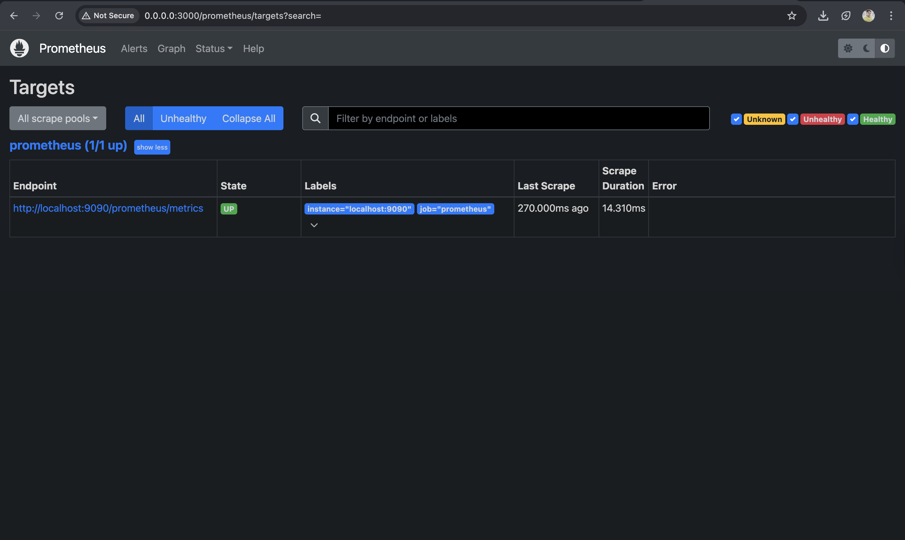

# Where to use `hostPath`#

The next logical step would be to configure Prometheus with additional targets. Specifically, we may want to configure it to fetch metrics that are already made available through the Kubernetes API. The second and more important reason is that using the `hostPath` volume type to provide configuration is not a good idea.

> A `hostPath` volume maps a directory from a host to where the Pod is running. Using it to “inject” configuration files into containers would mean that we’d have to make sure that the file is present on every node of the cluster.

- Working with a single-node cluster can be potentially misleading. The fact that we’re running a single-node cluster means that every Pod we run will be scheduled on one node. Copying a configuration file to that single node, as we did in our example, ensures that it can be mounted in any Pod. However, the moment we add more nodes to the cluster, we’d experience side effects. We’d need to make sure that each node in our cluster has the same file we wish to mount, as we would not be able to predict where individual Pods would be scheduled. This would introduce far too much unnecessary work and added complexity.

# Exploring the solutions#

- An alternative solution would be to mount an `NFS` drive to all the nodes and store the file there. This would guarantee that the file will be available on all the nodes, as long as we do not forget to mount `NFS` on each.

- Another solution could be to create a custom Prometheus image. It could be based on the official image, with a single `COPY` instruction to add the configuration. The advantage of that solution is that the image would be entirely immutable. Its state would not be polluted with unnecessary volume mounts. Anyone could run that image and expect the same result. That is the preferred solution. However, in some cases, you might want to deploy the same application with a slightly different configuration. In those cases, should we fall back to mounting an NFS drive on each node and continue using `hostPath`?
- Even though mounting an NFS drive would solve some problems, it is still not a great solution. To mount a file from NFS, we need to use the `nfs` volume type instead of `hostPath`. Even then, it would be a suboptimal solution. A much better approach is to use `configMap`. We’ll explore it in the next chapter.
- Note: Use hostPath to mount host resources like /`var/run/docker.sock` and `/dev/cgroups`. Do not use it to inject configuration files or store the state of an application.

# Destroying the Pod#

Let’s move to another volume type now. But, before that, let’s also remove the Pod we’re currently running.

```bash
kubectl delete \
    -f volume/prometheus-host-path.yml
```

# Try it yourself#

For your convenience, a list of all the commands used in the lesson is given below:

```bash
kubectl apply -f volume/prometheus-host-path.yml

kubectl rollout status deploy prometheus

kubectl port-forward service/prometheus --address 0.0.0.0  3000:9090

kubectl delete \
    -f volume/prometheus-host-path.yml
```

---

# Non-persisting State

Learn how to deploy Jenkins and analyze its state.

## Deploying Jenkins#

This time we’ll deploy Jenkins and see what challenges we will face.

# Looking into the definition#

```yml
apiVersion: networking.k8s.io/v1
kind: Ingress
metadata:
  name: jenkins
  annotations:
    kubernetes.io/ingress.class: "nginx"
    ingress.kubernetes.io/ssl-redirect: "false"
    nginx.ingress.kubernetes.io/ssl-redirect: "false"
spec:
  rules:
    - http:
        paths:
          - path: /jenkins
            pathType: ImplementationSpecific
            backend:
              service:
                name: jenkins
                port:
                  number: 8080

---
apiVersion: apps/v1
kind: Deployment
metadata:
  name: jenkins
spec:
  selector:
    matchLabels:
      type: master
      service: jenkins
  strategy:
    type: Recreate
  template:
    metadata:
      labels:
        type: master
        service: jenkins
    spec:
      containers:
        - name: jenkins
          image: vfarcic/jenkins
          env:
            - name: JENKINS_OPTS
              value: --prefix=/jenkins

---
apiVersion: v1
kind: Service
metadata:
  name: jenkins
spec:
  ports:
    - port: 8080
  selector:
    type: master
    service: jenkins
```

There’s nothing special in that YAML file. It defines an Ingress with /jenkins path, a Deployment, and a Service. We won’t waste time with it. Instead, we’ll move on and create the objects.

## Creating the objects#

It’s time to create the deployments:

```bash
kubectl create -f jenkins.yml --record --save-config
```

The output is as follows:
Flag --record has been deprecated, --record will be removed in the future
Warning: annotation "kubernetes.io/ingress.class" is deprecated, please use 'spec.ingressClassName' instead
ingress.networking.k8s.io/jenkins created
deployment.apps/jenkins created
service/jenkins created

```bash
kubectl rollout status deploy jenkins
```

The output is as follows:

```bash
deployment "jenkins" successfully rolled out
```

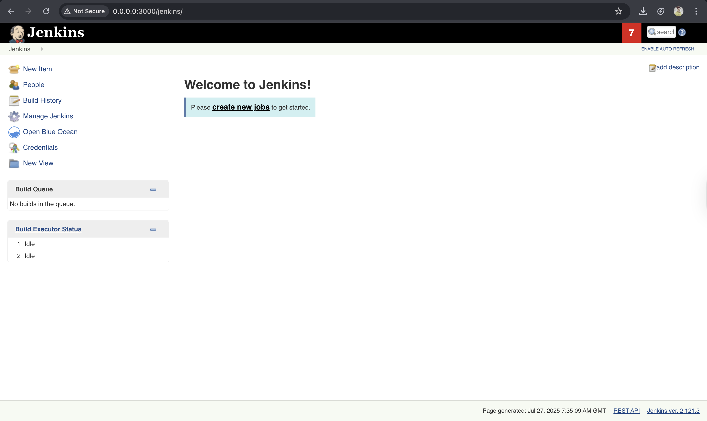
Jenkins UI opens and confirmsthat the application is deployed correctly. Jenkins’ primary function is to execute jobs, so it’s only fair to create one.

> `Note`: Please type “test” in the “item name” field, select “Pipeline” as the type, and click the “OK” button.
> 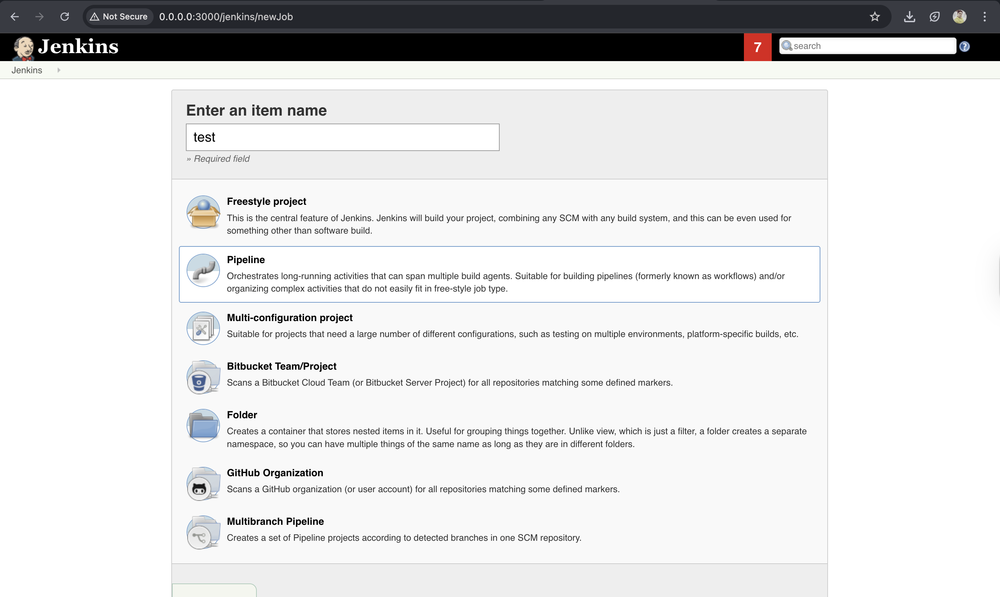
> There’s no need to make the Pipeline do any specific set of tasks. For now, we should just save the job.
> 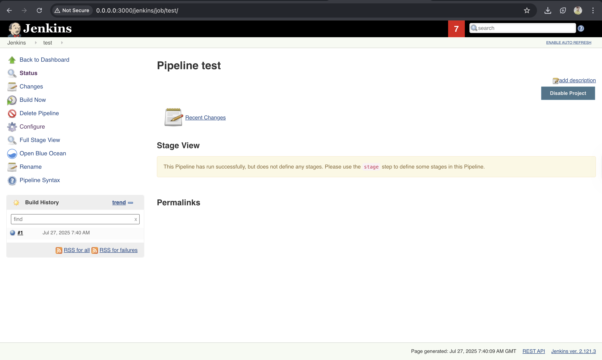

# Terminating the Pod and analyzing the state#

Let’s explore what happens if the main process inside the Jenkins container is terminated.

```bash
POD_NAME=$(kubectl get pods \
    -l service=jenkins,type=master \
    -o jsonpath="{.items[*].metadata.name}")

kubectl exec $POD_NAME -it -- kill 1
```

Terminating main process inside Jenkins

- We retrieve the name of the Pod, and use it to execute `kill 1` inside its only container. The result is a simulation of a failure. Soon afterward, Kubernetes detects the failure and recreates the container. Let’s double-check all that:

```bash
kubectl get pods
```

The output is as follows:

```bash
NAME                     READY STATUS  RESTARTS AGE
jenkins-76d59945d8-zcz8m 1/1   Running 1        12m
```

- We can see that a container is running. Since we have terminated the main process and the first container, the number of restarts has increased to one.
- Let’s go back to Jenkins UI and check what happened to the job.

```bash
kubectl port-forward service/jenkins 3000:8080 --address 0.0.0.0
```

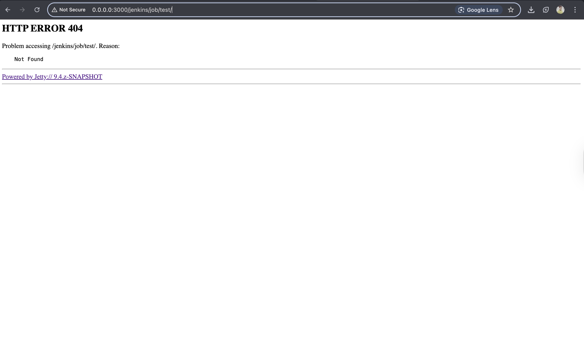

As expected, the job we created is gone. When Kubernetes recreates the failed container, it creates a new one from the same image. Everything we generated inside the running container is no more. We reset to the initial state.

# Try it yourself#

For your convenience, a list of all the commands used in this lesson is given below:

```bash
kubectl create \
    -f jenkins.yml \
    --record --save-config

kubectl rollout status deploy jenkins

kubectl port-forward service/jenkins 3000:8080 --address 0.0.0.0
# click the link besides run button

kubectl port-forward service/jenkins 3000:8080 --address 0.0.0.0
#click link besides run button and add /newJob at the end

POD_NAME=$(kubectl get pods \
    -l service=jenkins,type=master \
    -o jsonpath="{.items[*].metadata.name}")

kubectl exec $POD_NAME -it -- kill 1

kubectl get pods

kubectl port-forward service/jenkins 3000:8080 --address 0.0.0.0
#click the link besides run button
```

---

# Persisting State through the emptyDir Volume Type

Analyze the state of an updated Jenkins Deployment and discuss emptyDir volume type.

## Updating the Jenkins deployment definition#

Let’s look at a slightly updated YAML definition of jenkins-empty-dir.yml.

```yml
apiVersion: networking.k8s.io/v1
kind: Ingress
metadata:
  name: jenkins
  annotations:
    kubernetes.io/ingress.class: "nginx"
    ingress.kubernetes.io/ssl-redirect: "false"
    nginx.ingress.kubernetes.io/ssl-redirect: "false"
spec:
  rules:
    - http:
        paths:
          - path: /jenkins
            pathType: ImplementationSpecific
            backend:
              service:
                name: jenkins
                port:
                  number: 8080

---
apiVersion: apps/v1
kind: Deployment
metadata:
  name: jenkins
spec:
  selector:
    matchLabels:
      type: master
      service: jenkins
  strategy:
    type: Recreate
  template:
    metadata:
      labels:
        type: master
        service: jenkins
    spec:
      containers:
        - name: jenkins
          image: vfarcic/jenkins
          env:
            - name: JENKINS_OPTS
              value: --prefix=/jenkins
          volumeMounts:
            - mountPath: /var/jenkins_home
              name: jenkins-home
      volumes:
        - emptyDir: {}
          name: jenkins-home

---
apiVersion: v1
kind: Service
metadata:
  name: jenkins
spec:
  ports:
    - port: 8080
  selector:
    type: master
    service: jenkins
```

- We add a mount that references the `jenkins-home` volume. This time, the volume type `emptyDir`. We’ll discuss the new volume type soon. But before we dive into explanations, we’ll try to experience its effects.

```bash
kubectl apply -f jenkins-empty-dir.yml
```

The output is as follows:

```bash
ingress.networking.k8s.io/jenkins unchanged
deployment.apps/jenkins configured
service/jenkins unchanged
```

We have applied the new definition and waited until the rollout finished.

```bash
kubectl rollout status deploy jenkins
```

The output is as follows:

```bash
deployment "jenkins" successfully rolled out
```

- Now we can open the “New Job” Jenkins screen and repeat the same process we followed before.

```bash
kubectl port-forward service/jenkins 3000:8080 --address 0.0.0.0
#Open the link beside run button
```

- Please type test in the “item name” field, select “Pipeline” as the type, click the “OK” button, and finish by clicking the “Save” button.

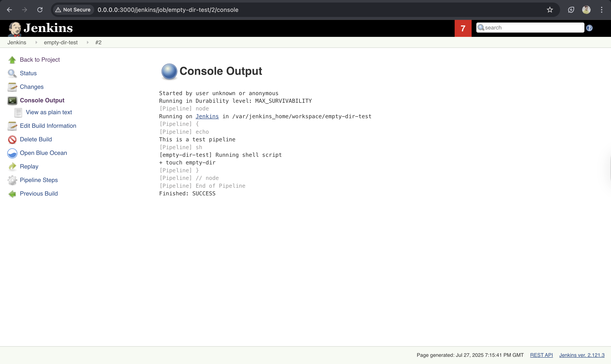

- Now we’ll terminate the container and see what happens:

```bash
POD_NAME=$(kubectl get pods \
    -l service=jenkins,type=master \
    -o jsonpath="{.items[*].metadata.name}")

kubectl exec -it $POD_NAME kill 1

kubectl get pods
```

- The output should show that there is a container running or, in other words, that Kubernetes detects the failure and creates a new container.
  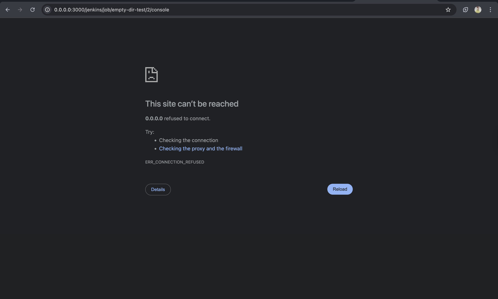

## Persisting state#

Finally, let’s open the Jenkins’ Home screen again.

```bash
kubectl port-forward service/jenkins 3000:8080 --address 0.0.0.0
```

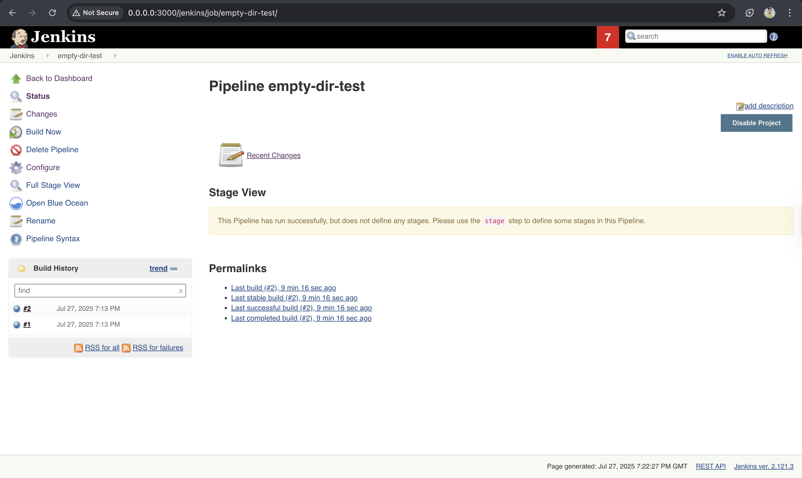
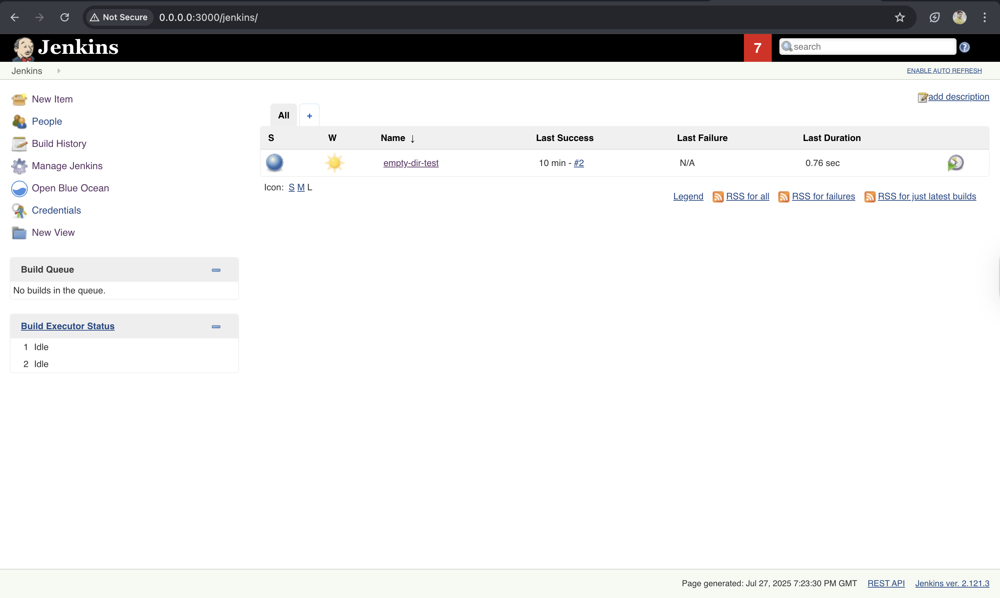


# The emptyDir Volume#

Now let’s talk about the `emptyDir` volume. It is considerably different from those we explored thus far.

> `Note`: An `emptyDir` volume is created when a Pod is assigned to a node. It will exist for as long as the Pod continues running on that server.

- What that means is that `emptyDir` can survive container failures. When a container crashes, a Pod is not removed from the node. Instead, Kubernetes will recreate the failed container inside the same Pod and, therefore, preserve the `emptyDir` volume. All in all, this volume type is only partially fault-tolerant.
- If `emptyDir` is not entirely fault-tolerant, you might wonder why we are discussing it in the first place.
- As you start deploying third-party applications, you’ll discover that many of them come with the recommended YAML definition. If you pay closer attention, you’ll notice that many are using the `emptyDir` volume type. It’s not that `emptyDir` is the best choice, but it all depends on your needs, hosting provider,infrastructure, and quite a few other things.
- There is no one-size-fits-all type of persistent and fault-tolerant volume type. On the other hand, `emptyDir` always works. Since it has no external dependencies, it is safe to put it as an example, with the assumption that people will change to whichever type fits them better.

  > `Note`: There is an unwritten assumption that `emptyDir` is used for testing purposes and will be changed to something else before it reaches production.

- As long as we’re using "Minikube" or "k3d" or "kind" to create a Kubernetes cluster, we’ll use `emptyDir` as a solution for persistent volumes… Later on, once we move into an advanced cluster setup, we’ll explore better options for persisting state.

# Destroying everything#

```bash
k3d cluster delete mycluster --all

kind delete cluster --name mycluster
```

# Try it yourself#

For your convenience, a list of all the commands used in the lesson is given below:

```bash
kubectl apply \
    -f jenkins-empty-dir.yml

kubectl rollout status deploy jenkins

kubectl port-forward service/jenkins 3000:8080 --address 0.0.0.0
#Open the link beside run button
#add a new job

POD_NAME=$(kubectl get pods \
    -l service=jenkins,type=master \
    -o jsonpath="{.items[*].metadata.name}")

kubectl exec $POD_NAME -- kill 1

kubectl get pods

kubectl port-forward service/jenkins 3000:8080 --address 0.0.0.0
#Open the link beside run button and remove /newJob at the end

k3d cluster delete mycluster --all
kind delete cluster --name mycluster
```

---

# Quiz Yourself on Volumes

## 1. Which problem may arise when stateful applications store their state on disk?

> Ans: The container can crash, resulting in complete data loss.

## 2. Which Kubernetes components solve the need to preserve the state across container crashes?

> Ans: Volumes

## 3. (True or False) Volumes are references to files and directories that are accessible to containers that form a Pod.

> Ans: True

## 4. What can we mount using the hostPath volume type from a host to Pods and, through them, to containers?

> Ans: Files and Directory

## 5. (Fill in the blank.) It is better not to use hostPath volume for **\_\_\_\_**.

> Ans:
> saving the state of an application and injecting configuration files

## 6. Which volume type helps us move git commands into the YAML definition?

> Ans: gitRepo

## 7. When is an emptyDir volume created?

> Ans: When a Pod is assigned to a node

## 8. Which volume type can we use to get closest to fault-tolerant volumes without using a network drive?

> Ans: emptyDir

---

# What's Next?

Review what we’ve learned so far and what we’ll learn next.

## Summary#

- With the exception of `emptyDir`, our choice of volume type demonstrated in this chapter was not simply based on the ability to use them in a Minikube cluster. Each of these three volume types will be an essential piece in the chapters that follow.

  - We’ll use hostPath to access the Docker server from inside containers.
  - The `gitRepo` volume type will be very significant once we start designing a continuous deployment pipeline.
  - The `emptyDir` type will be required as long as we use Minikube. Until we have a better solution for creating a Kubernetes cluster, `emptyDir` will continue to be used in our Minikube examples.

- We have only scratched the surface with volumes. There are at least two more types that we should explore inside Minikube, and one when we change to a different solution for creating a cluster.

  > `Note`: If you’d like to know more about volumes, please explore the Volume [`v1 core API documentation`](https://kubernetes.io/docs/reference/generated/kubernetes-api/v1.24/#volume-v1-core).

  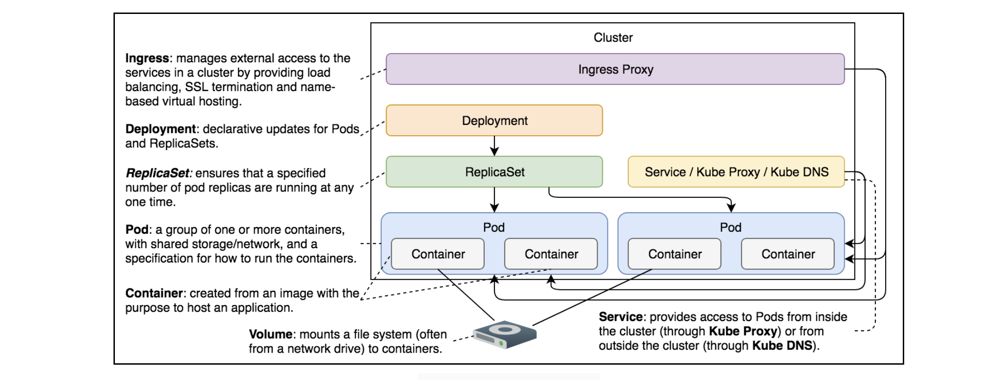
