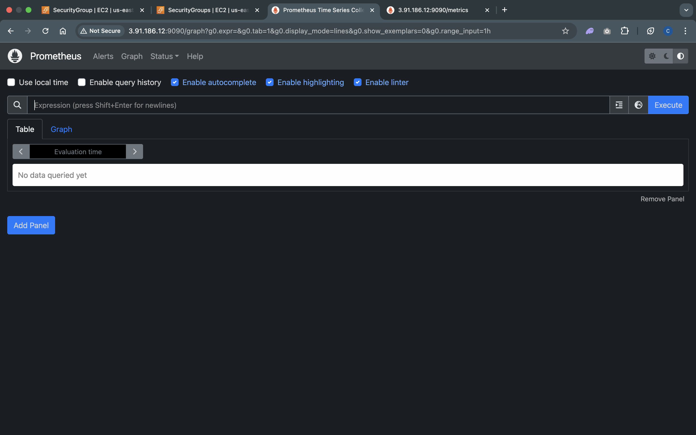
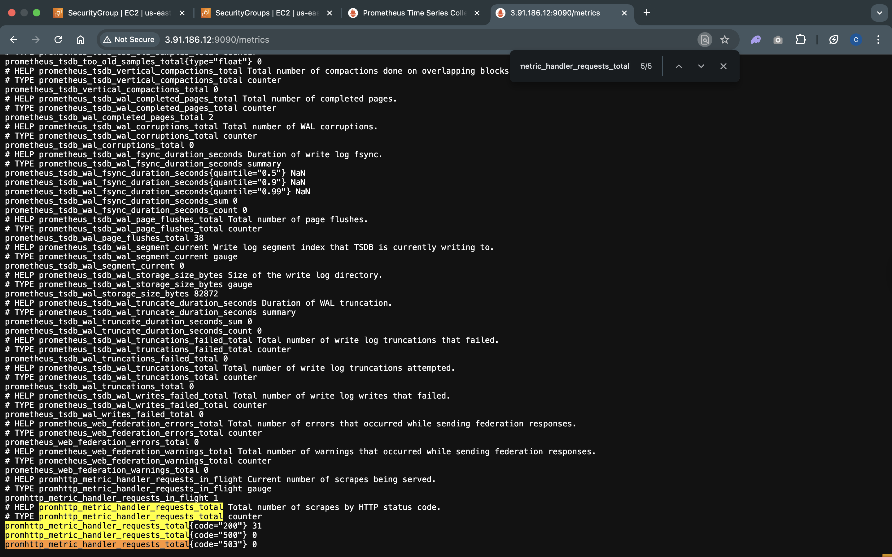

# First steps with Prometheus

- Welcome to Prometheus! Prometheus is a monitoring platform that collects metrics from monitored targets by scraping metrics HTTP endpoints on these targets. This guide will show you how to install, configure and monitor our first resource with Prometheus. You'll download, install and run Prometheus. You'll also download and install an exporter, tools that expose time series data on hosts and services. Our first exporter will be Prometheus itself, which provides a wide variety of host-level metrics about memory usage, garbage collection, and more.

# Downloading Prometheus

[`Download the latest release`](https://prometheus.io/download/) of Prometheus for your platform, then extract it:

```bash
tar xvfz prometheus-*.tar.gz
cd prometheus-*
```

# Configuring Prometheus

Prometheus configuration is [`YAML`](https://yaml.org/). The Prometheus download comes with a sample configuration in a file called prometheus.yml that is a good place to get started.

- We've stripped out most of the comments in the example file to make it more succinct (comments are the lines prefixed with a #).

```yml
global:
  scrape_interval: 15s
  evaluation_interval: 15s

rule_files:
  # - "first.rules"
  # - "second.rules"

scrape_configs:
  - job_name: prometheus
    static_configs:
      - targets: ["localhost:9090"]
```

- There are three blocks of configuration in the example configuration file: `global`, `rule_files`, and `scrape_configs`.
  - The `global` block controls the Prometheus server's global configuration. We have two options present. The first, `scrape_interval`, controls how often Prometheus will scrape targets. You can override this for individual targets. In this case the global setting is to scrape every `15 seconds`. The `evaluation_interval` option controls how often Prometheus will evaluate `rules`. Prometheus uses rules to create new time series and to generate alerts.
- The `rule_files` block specifies the location of any rules we want the Prometheus server to load. For now we've got no rules.
- The last block, `scrape_configs`, controls what resources Prometheus monitors. Since Prometheus also exposes data about itself as an HTTP endpoint it can scrape and monitor its own health. In the default configuration there is a single job, called `prometheus`, which scrapes the time series data exposed by the Prometheus server. The job contains a single, statically configured, target, the `localhost` on port `9090`. Prometheus expects metrics to be available on targets on a path of `/metrics`. So this default job is scraping via the URL: [`http://localhost:9090/metrics`](http://localhost:9090/metrics)
- The time series data returned will detail the state and performance of the Prometheus server.
- For a complete specification of configuration options, see the [`configuration documentation`](https://prometheus.io/docs/operating/configuration/).

# Starting Prometheus

To start Prometheus with our newly created configuration file, change to the directory containing the Prometheus binary and run:

```bash
./prometheus --config.file=prometheus.yml
```

- Prometheus should start up. You should also be able to browse to a status page about itself at `http://localhost:9090`. Give it about 30 seconds to collect data about itself from its own HTTP metrics endpoint.
- You can also verify that Prometheus is serving metrics about itself by navigating to its own metrics endpoint: `http://localhost:9090/metrics`.
  

# Using the expression browser

- Let us try looking at some data that Prometheus has collected about itself. To use Prometheus's built-in expression browser, navigate to `http://localhost:9090/graph` and choose the "Table" view within the "Graph" tab.
- As you can gather from `http://localhost:9090/metrics`, one metric that Prometheus exports about itself is called `promhttp_metric_handler_requests_total` (the total number of `/metrics` requests the Prometheus server has served). Go ahead and enter this into the expression console:

```bash
promhttp_metric_handler_requests_total
```



- If we were only interested in requests that resulted in HTTP code `200`, we could use this query to retrieve that information:

```bash
promhttp_metric_handler_requests_total{code="200"}
```

- To count the number of returned time series, you could write:

```bash
count(promhttp_metric_handler_requests_total)
```

For more about the expression language, see the [`expression language documentation`](https://prometheus.io/docs/querying/basics/).

# Using the graphing interface

- To graph expressions, navigate to `http://localhost:9090/graph` and use the "Graph" tab.
- For example, enter the following expression to graph the per-second HTTP request rate returning status code `200` happening in the self-scraped Prometheus:

```bash
rate(promhttp_metric_handler_requests_total{code="200"}[1m])
```


You can experiment with the graph range parameters and other settings.

# Monitoring other targets

Collecting metrics from Prometheus alone isn't a great representation of Prometheus' capabilities. To get a better sense of what Prometheus can do, we recommend exploring documentation about other exporters. The [`Monitoring Linux or macOS host metrics using a node exporter`](https://prometheus.io/docs/guides/node-exporter/) guide is a good place to start.

# Summary

In this guide, you installed Prometheus, configured a Prometheus instance to monitor resources, and learned some basics of working with time series data in Prometheus' expression browser. To continue learning about Prometheus, check out the Overview for some ideas about what to explore next.
